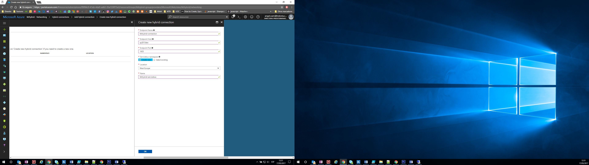

import ArticleHeader from '../../../components/article-header'

<ArticleHeader frontmatter={props.pageContext.frontmatter} />

Queremos migrar nuestro actual Project Server a Project Online, pero tenemos un problema. Los recursos que usa el Project Server están alojados en una tabla del SQL Server que se rellena cada noche a través de DTS. Para conseguir nuestro objetivo deberemos automatizar este proceso para que los datos estén disponibles en nuestro Project Online.

En este pequeño esquema vamos a ver todos los componentes que entraran en juego en nuestro objetivo.

**1.**       **Configurando la Hybrid Connection:**

Lo primero que vamos a necesitar es crear una Web App en nuestro Azure. Entramos en nuestra cuenta y clicamos en New &gt; Web + Mobile &gt; Web App.

Rellenamos los datos de configuración de nuestra Web App.

En la nueva versión de las Hybrid Connection ya no se permiten planes gratuitos ni compartidos, por lo que necesitaremos crear un plan que se adapte a nuestras necesidades. Pasados unos minutos ya podemos entrar en nuestra Web App y ver su configuración.

Con la Web App creada, pasamos a crear la Hybrid Connection. Nos movemos en el menú de la Web App hasta la sección de Networking y clicamos en las siguientes pantallas Configure your Hybrid Connection endpoints &gt; Add hybrid connection &gt; Create new hybrid connection.

Añadimos la siguiente información para configurar el Endpoint.

Una vez tenemos la Hybrid Connection creada, la seleccionamos y clicamos en Add selected hybrid connection.

Podemos ver en la siguiente pantalla que el estado de la conexión es Not connected.

En este punto tenemos la Hybrid Connection configurada en Azure. Para terminar la configuración en la parte OnPrem deberemos clicar en el link que pone Donwload connection manager. Esto nos va a bajar el HybridConnectionManager.msi y nos permitirá configurar la conexión con nuestro Azure.

Una vez se haya instalado el programa, navegamos a la siguiente ruta %ProgramFiles%\Microsoft\HybridConnectionManager 0.7\ y ejecutamos la aplicación HybridConnectionManagerUi.exe

Con la aplicación abierta, clicamos en Configure another Hybrid Connection. Nos va a pedir que nos validemos con nuestra cuenta de Azure.

Una vez validados deberemos seleccionar nuestra subscripción y automáticamente se cargan todas las conexiones disponibles.

Automáticamente y después de clicar en Save, vemos que el Azure Status ha cambiado a Connected.

Si vamos a la configuración de la Hybrid Connection en Azure, veremos que el estado también ha cambiado a Connected.

**Angel Cami**

SharePoint Consultant en Tokiota

