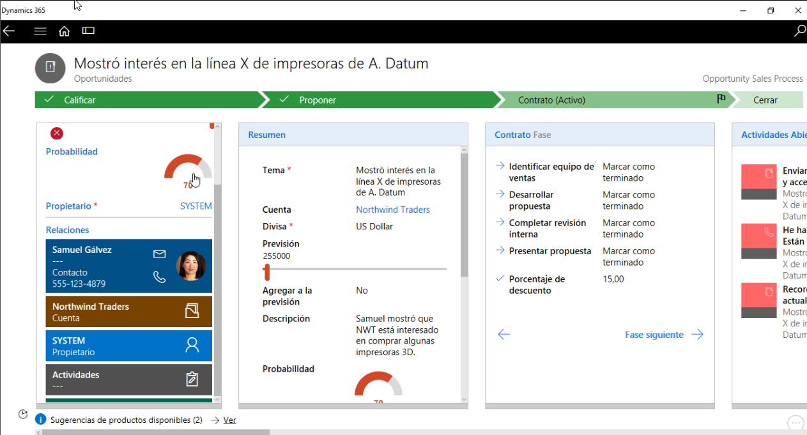

​La transformación digital es una realidad. Más temprano que tarde, los negocios necesitan incorporar tecnología para optimizar sus procesos, mejorar sus resultados y fundamentalmente, satisfacer cada día mejor a sus clientes.

Microsoft ha tomado muy enserio esta consigna y a pocos meses de presentado oficialmente la suite Microsoft Dynamics 365, los ecos se han hecho sentir.

Y claro, no es para menos, ¡si es que lo tiene todo! CRM, lo tiene. ERP, lo tiene (AX 7). Integración con toda la suite Office 365, ¡por supuesto! Inteligencia Artificial, lista para que trabaje para nosotros, redes sociales, movilidad, atención en campo, gestión de proyectos, portales web (¡a la carta!), BI embebido con Power BI, …y la lista es larga.

En este artículo resumiré para ti de qué hablamos cuando nos referimos a Microsoft Dynamics 365, cómo te ayuda a ti o a tus clientes a transitar hacia la transformación digital, cuales son algunas de sus más destacadas novedades y por donde comenzar a aprender.

**Primero lo primero, ¿qué es Microsoft Dynamics 365?**

Microsoft Dynamics 365 es la nueva suite en la nube que te ofrece Microsoft para administrar tu empresa (o la de tus clientes si eres un partner) de punta a punta.

**Imagen****1****- De Prospecto a Cash (Dinero) es uno de los ejemplos de escenarios de punta a punta que podemos resolver ahora con Dynamics 365.**

Bajo el paradigma de ´Apps´ que rige el mundo moderno de hoy, Dynamics 365 se compone de estas 'core' Apps:

·       **Dynamics 365 para Ventas**(ex "módulo de Ventas" en Dynamics CRM).
·       **Dynamics 365 para Servicio** (ex "módulo de Servicio" en Dynamics CRM).
·       **Dynamics 365 para Servicio en Campo** (ex "FieldOne" para Dynamics CRM).
·       **Dynamics 365 para Proyectos** (nuevo miembro de la familia).
·       **Dynamics 365 para Operaciones** (el ERP, "AX 7").
·       **Dynamics 365 para Finanzas** (lo que se conocía como 'Project Madeira').

**Imagen****2****.- Las 'core Apps' de Microsoft Dynamics 365.**

****

**Imagen****3****.- Dynamics 365 para Ventas. (fuente: Microsoft Dynamics 365 Blog).**

**Imagen****4****.- Dynamics 365 para Operaciones. (fuente: Microsoft Dynamics 365 Blog)**

Alrededor de estas Apps, encontrarás complementos de altísimo valor agregado como los nuevos portales web listos para usar (Dynamics 365 Portals), Microsoft Social Engagement para monitoreo de las redes sociales, Escritorio Unificado, Encuestas (Voice of the Customer), Power BI como visualizador enriquecido de inteligencia de negocios, PowerApps, un modelo común de datos donde convergir las distintas aplicaciones (Common Data Service), flujos que cruzan distintas aplicaciones y plataformas (Microsoft Flow), aprendizaje de máquina e inteligencia artificial con Azure Machine Learning, y nuevamente, la lista sigue.

**¡Todo esto! ¿y cuánto me costará?**

Por supuesto, todo dependerá de qué plan de licenciamiento elijas tu o tenga tu cliente que oh, si, por cierto, también cambió bastante. Te sugiero, si te gusta más lo técnico como a mí, probablemente lo encuentres muy aburrido, pero vas a precisar que una de tus primeras paradas en este viaje sea consultar la guía de licenciamiento oficial (busca en tu buscador favorito 'dynamics 365 licensing guide').

Tienes para empezar edición Enterprise y edición Business (disponible pronto en algunos lugares como Latinoamérica). Ej, un usuario 'full' Enterprise para una App (ej, ventas), su precio de lista es $ 95 por mes, en su edición Business, $ 40. Pero mucho más conveniente es el Plan 1 (solo $ 115) por todas las apps por usuario por mes o el Plan 2 ($ 210) incluyendo la app de Operaciones (el ERP).

**Imagen****5****.- Dynamics 365 Enterprise Plan 1 de licenciamiento, incluye todas las Apps salvo Operaciones (el ERP), que es incluida en el Plan 2.**

Luego tenemos las nuevas licencias de "Team Member" pensadas para el usuario "ligero" que tan solo precisa cargar datos y realizar operaciones muy básicas, que van desde $ 8 (Enterprise) a $ 5 (Business) por usuario por mes y va disminuyendo aún más según volumen, algo que Microsoft dio a conocer como 'Tiered pricing'

**¿y Marketing?**

Tan solo un poquito más de paciencia, ya está por venir, para Enterprise, de la mano de un acuerdo entre Microsoft y Adobe para desplegar todo el poder de la nube de Microsoft y Dynamics 365 integrado con Adobe Marketing Cloud. Y también ya se empieza a vislumbrar una nueva solución de automatización de marketing, provista por el propio Microsoft que se espera sea incluida en la edición Business.

**¿y si quiero on-premises?**

También, Dynamics 365 lo puedes instalar dentro de tu empresa, en tus propios servidores. Claro está, no todos los servicios estarán disponibles, pero aún continúas teniendo tú la decisión del tipo de despliegue que prefieres y te voy a dar una muy buena noticia: la licencia de Dynamics 365 viene con lo que se denomina 'Dual Use Rights' lo que básicamente significa que la misma licencia que adquieres en la nube la puedes usar on-premises sin costo adicional.

**La nueva experiencia de usuario integrada**

Ahora al acceder a Dynamics 365 desde el portal de Office 365 te encontrarás con una página de bienvenida que te permitirá seleccionar la App según estén disponibles para tu rol y eso te dará acceso a las áreas y opciones específicas de esa app (ej, la de ventas).

Y verás una App llamada "Custom" que básicamente te da acceso a todo el sistema si eres administrador.

**Imagen****7****.- Nueva página de inicio te permitirá elegir la App con la que trabajar.**

Y una vez dentro, podrás cambiar de App muy fácilmente sin necesidad de tener que volver a la pagina anterior, sino simplemente desde la navegación.

**Imagen****8****.- Cambiar de App desde dentro de la aplicación.**

**Diseña tus propias Apps y procesos con los nuevos diseñadores**

Ahora también no solamente tienes las Apps "fuera de caja" sino que también se introduce el concepto de Apps específicas para tu negocio y más aún, si así lo quisieras para una determinada área de tu negocio. Esto quiere decir que por ejemplo un usuario de tu área comercial tendrá acceso a su "app comercial" con las opciones de menú solo relacionadas a su área y otro usuario llamémosle de call center solo verá la "app call center" que le dará acceso exclusivamente a lo que necesita para realizar su tarea, ni más ni menos, haciéndolo más productivo porque independientemente de los permisos que tú le des, esa es la navegación que tu diseñaste en tu app.

**Imagen****9****. Diseña tu app en Microsoft Dynamics 365.**

**Imagen****10****.- Mi "App Comercial" con las opciones de navegación específicas para ese rol.**

Y lo que es mejor aún, ahora tu podrás diseñar tus propios procesos de negocio que incluirán tus apps de una forma muy visual y sencilla.  El diseñador no solo ha sido altamente mejorado sino que incorpora algunas cosas que los que implementamos Dynamics pedíamos (ya lo sabes, "pide y se os concederá") que es la posibilidad de ejecutar flujos de trabajos automatizados al entrar o salir en cada fase del proceso. Así por ejemplo podrás automatizar fácilmente que, al entrar en una fase de aprobación, salga una notificación automática, al salir de la fase vuelva a notificar y crear tareas para otras áreas, etc.

**Ilustración****11****.- Diseña tus propios procesos. En el ejemplo, un proceso de captación para universidades.**

**Imagen****12****.- Tu proceso en acción, guiándote a ti y todos los usuarios que intervienen, automatizando tareas.**

**Nueva App para Outlook**

Si has utilizado Dynamics CRM anteriormente sabrás que la aplicación para Outlook era (y continúa siendo) uno de los diferenciadores por todo el poder que te brinda como usuario allí al alcance de tu Outlook, sin necesidad de salir de allí. Pero… también esto no era gratis, y no hablo de licenciamiento sino de que penalizaba performance, resultaba un poco pesada si no tenías un muy buen equipo y otros problemas.

Ahora con la nueva App para Outlook (una nueva aplicación, diferente del "viejo cliente CRM para Outlook") podrás realizar casi todo lo que podías hacer antes de una forma mucho más ligera, rápida, con una experiencia absolutamente modernizada, y funciona tanto en tu Outlook de escritorio como en el web.

**Imagen****13****.- La nueva App para Outlook. Automáticamente trae la información de los contactos del correo con su información relevante y próximas actividades y te permite relacionarlo rápidamente a un registro (ej, a un caso o una oportunidad) en tu Dynamics.**

**Nuevas Apps móviles**

Cada vez más como usuarios operamos desde nuestros móviles, ya sea teléfonos celulares o tabletas. También aquí encontrarás una experiencia remodelada que va más allá de lo estético (¡que vaya si luce bien!) sino que piensa en ti como usuario en facilitarte las tareas que tienes que realizar (ejemplo, lo que debes capturar y recordar dar seguimiento luego de una cita con tu cliente) y se aparta del modelo original de trabajo donde deberías ir a la actividad de cita, cargar las notas, cerrarla, ir a la oportunidad, actualizarla, etc.

Así pasamos de un modelo orientado a entidades a un modelo orientado en tus tareas / tus procesos más comunes.

**Imagen****14****.- Nueva app móvil. Nueva experiencia y look and feel.**

**Imagen****15****.- Nueva App para móviles, remodelada, incorporando el paradigma de mis tareas / mis procesos. En el ejemplo, las que ya vienen fuera de caja, listas, Actualizar contacto | Después de la reunión | Seguimiento de oportunidad.**

Vale la pena mencionar la insuperable integración que tienes con las demás Apps de Office en tu móvil y la oportunidad ahora de tomar notas, fotos, integrado con tu cámara.

**Imagen****16****- Toma notas y fotos, relaciónalos con tus registros en Dynamics 365.**

**Tu nuevo asistente de relaciones con tus clientes trabajando 24 x 7 para ti**

Si eres de los que piensas que un CRM consume de tu tiempo en registrar información para obtener retorno del sistema, amén que Microsoft ya venía haciendo un gran trabajo, en esta nueva era 365 verdaderamente vemos al sistema trabajando para ti. ¡Si! Y si tú eres un comercial de esos que no les gusta llenar información en el CRM o conoces alguno en tu empresa que se quejaba por ello qué pasaría si te digo que ahora el propio sistema te sugiere relacionar correos a tus registros, te da la bienvenida mostrándote lo que tú tienes para hoy, te alerta de tus vencimientos, te avisa si hace x tiempo que una oportunidad de negocio que tenías no se ha movido o que hace tiempo no has tenido actividad con un cliente y sería un buen momento para hacerlo, o te avise si tu cliente está abriendo o no tus correos, si su respuesta podría implicar un nuevo pedido o aumento en las ventas o si acaso menciona un competidor y debes tomar nota de ello o recordarte que no has recibido respuesta de la propuesta que le enviaste… ¿ciencia ficción? ¿Star Trek?

En absoluto, esto ya no es ciencia ficción, esto es realidad, lo tienes disponible hoy mismo con Dynamics 365, fuera de caja y configurable con muy pocos clics.

Inteligencia artificial al alcance de todos. Ya no necesitas ser un científico de datos para aprovechar toda esta inteligencia. Microsoft la ha puesto para ti a tu alcance.

**Imagen****17****.- El nuevo asistente para relaciones trabajando para ti. Aquí le indicas las situaciones que quieres que esté atento y te alerte.**

**Ilustración****18****.- El nuevo asistente para relaciones en tu móvil notificándote que tienes para hoy, los nuevos acontecimientos (ej, que tu cliente acaba de abrir tu correo) y dándote acceso rápido a tus registros más recientes.**

**Ilustración****19****.- El nuevo asistente para relaciones nos alerta que esta oportunidad de negocio cerrará pronto. Quizás sea momento de llamar a tu cliente.**

**Oye, tú, cliente: Gran Hermano te está mirando**

Microsoft Dynamics 365 es el nuevo 'Gran Hermano' a tu servicio, las 24 horas. Tan simple como activar un par de opciones y a partir de ahora podrás saber si tu cliente abre o no tus correos, tus archivos adjuntos, cuantas veces, desde qué dispositivo y tener alertas de ello. También optimizar la entrega de tus correos en base a cuál será el mejor momento para que tu cliente los abra. De esta manera, sabrás si es el mejor momento para llamar a tu cliente y cerrar tu venta porque según su comportamiento sabrás objetivamente si está más ´hot´, si su score es más cercano o no a aceptar tu propuesta.

¿Esto te resulta demasiado? Quizás sí, quizás no si has utilizado herramientas de automatización de marketing donde estas tecnologías se están transformado en moneda común últimamente pero no lo habíamos visto antes operando en estos nuevos contextos.

**Imagen****20****.- El nuevo 'Gran Hermano' en Dynamics 365 te permite saber cuántas veces tu cliente abrió tu correo, tus adjuntos, si presionó o no en algún link de tu correo y cuantas respuestas.**

**Inteligencia de negocios embebida con Power BI**

Power BI, seguramente te resulte muy familiar ya, se está convirtiendo en el visualizador de inteligencia de negocios por defecto, al menos seguro para todos aquellos que trabajamos con tecnología Microsoft. Es rápido, simple de comenzar, la experiencia de usuario es increíble, luce bellísimo, lo consumes desde el web y desde el móvil, lo conectas a cualquier fuente, combinas todos los datos, etc., etc., etc.

Microsoft desde ya hace un buen tiempo viene entregando plantillas de Power BI listas para conectar a tu Dynamics, lo que es muy bueno porque con muy pocos clics tú puedes montar un BI de primera clase.

Ahora, con Microsoft Dynamics 365, tienes la oportunidad de llevar toda la inteligencia de negocios y toda la experiencia de Power BI al siguiente nivel, siendo parte del día a día tuyo y de tus usuarios. ¿Cómo? Pues Microsoft ha habilitado que podamos incluir paneles completos (dashboards) y/o secciones específicas de éstos (los "tiles" – discúlpame, pero me niego a poner su traducción, "azulejos") mismo dentro de Dynamics en una experiencia tan nativa que si no eres muy observador o no eres técnico, ni te das cuenta que es información que reside fuera.

**Imagen****21****.- Power BI. Inteligencia de negocios integrada dentro de los paneles nativos de Dynamics 365 (fuente: Microsoft Dynamics 365 Team blog).**

**Y más inteligencia, Inteligencia Artificial.**

Si, ya no hablamos del futuro "Doc", ya es el presente. Microsoft está incorporando una batería de características de inteligencia artificial en Dynamics 365 "listas para usar", sin necesidad de ser científicos de datos. Desde recomendaciones de productos, análisis sentimental de clientes a servicios predictivos. El poder de la Nube + Aprendizaje de Máquina + Cortana + Analítica de datos, creo ningún otro proveedor puede ofrecerlo todo junto.

Cada una de estas funcionalidades está diseñada para que tú puedas tomar mejores decisiones y conducirte a mejores resultados en tu negocio.

Te voy a dejar algunos nombres aquí por si te atrae este tema, tengas lectura / videos para tu fin de semana:

·       Relationship Insights (tu asistente de relaciones, lo vimos en este artículo).
·       Lead Scoring.
·       Cross-Sell/Up-Sell.
·       Knowledge Base Insights.
·       Demand Forecasting.
·       Cash Flow Forecast. 
·       Product Recommendations.
·       Preemptive Service.
·       Resource Optimization.
·       Predictive Sales and Inventory Forecast.
·       Intent Analysis.
·       Sentiment Analysis.

**Salgamos de compras**

Y bueno si algo no te ha conformado y quieres más o buscas algo muy específico para tu industria, puedes irte de compras al nuevo Marketplace para Dynamics (el "AppSource" - appsource.microsoft.com o también accesible desde el mismo Dynamics 365). Allí encontrarás apps que podrán hacer de tu experiencia más productiva (ej, cosas como integración con DocusSign para firma digital de documentos) y lo que me parece muy interesante, personalizaciones listas para tu industria (ej, encuentras soluciones para la banca y finanzas, salud, servicios profesionales, retail, etc.)

**Ilustración****22****- Saliendo de compras en el nuevo Marketplace para Dynamics 365, el "AppSource".**

**En resumen**

Microsoft Dynamics 365 es:

1.       **Especifico**. Puedes comenzar con la "App" que más te hace sentido en este momento para tu negocio o el de tus clientes y son bien específicas para cada área.
2.       **Productivo**. La productividad a donde tú vayas, desde el dispositivo que prefieras, integrado con tu Office 365.
3.       **Inteligente**. Ya la inteligencia viene incorporada, más fácil de consumir que nunca y accionable para tu negocio o el de tus clientes.
4.       **Adaptable**.  Cualquiera sea tu negocio, las capacidades nativas de la plataforma te permitirán modelar tus procesos, automatizar tareas y hasta construir aplicaciones sin código si hablamos de utilizar Power Apps o Flow que también forman parte de la familia.

En este artículo (perdón si me extendí un poco, pero quería tuvieras un pantallazo general) tú has visto la nueva oferta que nos trae a la mesa Microsoft en cuanto a aplicaciones de negocios, listas para desplegar, integradas con tu Office 365.

Has visto el nuevo modelo de Apps, la nueva experiencia integrada entre múltiples aplicaciones, la insuperable integración con Outlook, la nueva propuesta móvil, los nuevos diseñadores visuales que te permitirán crear tus propias apps y procesos, cómo Dynamics 365 se transforma en tu nuevo asistente personal y en tu gran hermano trabajando para ti las 24 horas, la inteligencia de negocios y artificial incorporada, el Marketplace y alguna cosilla más que espero te haya gustado y despertado el querer aprender más.

Es que realmente pienso que hoy es el mejor momento para que te subas a esta ola, que te embarques y empieces a probar todo esto. Ya seas un cliente o un partner, te recomiendo que no te lo pierdas.

**¿Cómo puedes aprender más?**

Tienes varias opciones, todo depende lo que busques. Si eres partner, entiendes inglés y buscas algo estructurado, alineado a la certificación, el Dynamics Learning Portal (mbspartner.microsoft.com) puede ser un muy buen lugar para ti. Algo más desestructurado y en inglés también puedes encontrar en el canal de YouTube de Microsoft Dynamics 365.

Si buscas entrenarte en español, te puedo recomendar los entrenamientos que tenemos en Comunidad365, el Grupo de Usuarios de Microsoft Dynamics CRM / 365 en español. Encontrarás de todo un poco por MVPs y grandes expertos.

Si vas a [http://www.comunidad365.com/cursos](http&#58;//www.comunidad365.com/cursos) vas a encontrar +100 cursos en video, muy digeribles con foco en distintos temas.

Si ya eres miembro vas a poder acceder a todos ellos y si aún no lo eres, no te preocupes, utiliza este cupón: **COMPARTIMOSS** antes del 30 de Junio / 2017 que te dará acceso por **30 días GRATIS como Miembro Profesional**.

Un curso introductorio que te recomiendo si quieres ver muchas de las cosas que te cuento en este artículo es este que he preparado:

**Introducción a Microsoft Dynamics 365 - El comienzo de una nueva -**[http://www.comunidad365.com/course/introduccion-a-microsoft-dynamics365/](http&#58;//www.comunidad365.com/course/introduccion-a-microsoft-dynamics365/)

Y luego los entrenamientos **#MASTER365** que son únicos porque no solo son instruidos en español en vivo, sino que además te ayudan con mentoría para que puedas implementar tus procesos y evacuar tus dudas. Desde aquí podrás acceder y también registrarte a otros cursos gratis:

[http://www.comunidad365.com/proximos-cursos-en-vivo/](http&#58;//www.comunidad365.com/proximos-cursos-en-vivo/)

**Pablo Peralta**

Microsoft MVP | Business Solutions

Especialista, Mentor & Entrenador en Dynamics CRM / 365

Director de Programas para Comunidad365​

