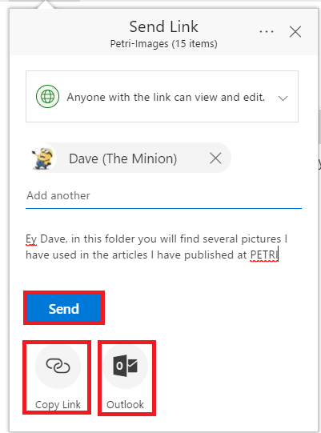

Microsoft está cambiando (otra vez) la experiencia de usuario al compartir archivos y carpetas en OneDrive for Business (ODFB) y SharePoint Online. Con este nuevo cambio, disponible actualmente en tenants de Office 365 con First Release habilitad, Microsoft abandona el clásico PopUp para compartir archivos y carpetas y lo reemplaza por una experiencia tipo "Callout" como veremos en este artículo".

**Nueva experiencia de usuario al compartir información en Office 365**

Antes de mostrar la nueva experiencia de usuario al compartir información en ODFB y SPO, he de decir que este cambio me ha pillado de sorpresa, ya que (si no recuerdo mal) es la tercera vez que Microsoft introduce cambios en la forma de compartir archivos y carpetas a lo largo de Office 365

Para probar la nueva experiencia, únicamente tenemos que navegar a nuestro ODFB o bien a una biblioteca moderna de SPO, seleccionar un archivo o carpeta y hacer clic en la acción "Compartir" ("Share") en la barra de acciones.

Como se observa en la captura de pantalla (Imagen 1), la nueva experiencia de usuario para compartir permite configurar como el usuario va a compartir el archivo o carpeta:

o   Seleccionando la forma en la que se va a compartir el archivo (mediante un enlace anónimo, mediante un enlace habilitado para usuarios corporativos del tenant de Office 365 actual, …). En mi caso, la opción de compartir por defecto es “Cualquier persona que tenga el vínculo puede ver y editar” (“Anyone with the link can view and edit”), es decir, se va a generar un enlace que permite compartir de forma anónima el contenido. Como se puede deducir, las opciones disponibles para compartir el archivo o carpeta están basadas en las configuraciones globales para compartir que un Administrador Global o un Administrador de SPO haya habilitad en el Centro de Administración de SPO o en el Centro de Administración de ODFB.

o   El nombre o e-mail (nombres o e-mails) de las personas con las que se quiere compartir los archivos o carpetas.

o   Un mensaje opcional en el que se puede añadir información adicional sobre los archivos o carpetas que se están compartiendo.

·       A través de las opciones disponibles en el desplegable de compartir, podemos especificar la forma en la que queremos compartir el archivo o carpeta seleccionada. Además, también podremos configurar si el enlace que se genera permite editar o sólo visualizar el contenido. Finalmente, también podemos definir una fecha de expiración.

·       Una vez que todo está configurado para compartir el archivo o carpeta, podemos elegir entre las siguientes tres posibilidades:

o   Botón “Enviar” que simplemente permite compartir el archive o carpeta enviando un e-mail al usuario o usuarios con los que se desea compartir la información.

o   Acción “Copiar Enlace” que genera un enlace para compartir el archivo o carpeta. Este enlace se puede pegar en un e-mail personalizado que se desee enviar a las personas con las que se quiere compartir la información. Esta acción es la misma que la acción “Copiar enlace” de la barra de acciones de ODFB / Bibliotecas y Listas modernas.

o   Finalmente, la acción “Outlook” abre una ventana del navegador con el editor de correo de Outlook en el que está configurado el campo asunto y en el que se incluye en el cuerpo del correo el vínculo de compartir generado.

·       Si hacemos uso del botón “Enviar” para compartir el archivo o carpeta, los usuarios destinatarios recibirán el correspondiente correo de compartir en el que Microsoft también ha añadido un nuevo Look & Feel.

**Conclusiones**

Microsoft ha liberado en tenants de First Relase de Office 365 una nueva experiencia de usuario para compartir archivos desde ODFB y SPO que reemplaza a la experiencia actual. Esta nueva experiencia supone el tercer intento realizado por Microsoft para mejorar como los usuarios pueden compartir información en Office 365 y en mi opinión es posible que esta sea la versión definitiva por su sencillez y uso intuitivo.

**Juan Carlos Gonzalez**

Office Servers & Services MVP

@jcgm1978

[https://jcgonzalezmartin.wordpress.com/](https&#58;//jcgonzalezmartin.wordpress.com/)

