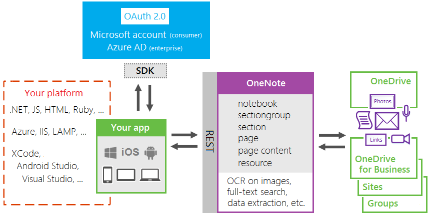

import ArticleHeader from '../../../components/article-header'

<ArticleHeader frontmatter={props.pageContext.frontmatter} />

OneNote es una herramienta muy útil para el uso diario a nivel profesional esto ha provocado su creciente impulso. Como desarrolladores tenemos una multitud de escenarios en la que podemos sacarle todo el partido a esta herramienta de productividad, pero para ello debemos de tener claro cómo empezar a utilizarla. La siguiente imagen aclara dicho escenario:

Autenticación
 
A la hora de empezar a consumir la API de OneNote el primer aspecto que debemos de tener en cuenta es el tema de la autenticación y autorización. Para empezar a utilizar la API de OneNote (independientemente de donde SharePoint, OneDrive for Businnes, OneDrive personal, o OneNote Online) tenemos que crear una aplicación en el directorio activo de Azure y darle permisos para poder utilizar la API de OneNote.
 
Para crear la aplicación seguiremos los siguientes pasos:
 
- Autenticarnos en el portal de Azure.
- Pulsamos sobre el icono del Active Directory.
- Registro de aplicaciones- &gt; Nuevo registro de Aplicaciones.
- En la ventana introduciremos el nombre de nuestra aplicación, el tipo de aplicación que vamos a implementar (Web o Nativa) y la url en la que se va a autenticar. Pulsamos Crear
- Consultamos las propiedades de la APP y nos guardamos el Application ID, ya que nos hará falta para la autenticación de la APP.
- A continuación, vamos a Permisos Necesarios-&gt; Agregar-&gt; Seleccionamos la API de OneNote-&gt; Establecemos los permisos que va a necesitar nuestra aplicación que estamos desarrollando.
- Una vez establecidos los permisos (dentro del portal nuevo de Azure) hay que apretar el botón Conceder Permisos. El funcionamiento de este botón lo que hace es dar permisos a todos los usuarios de la organización, en caso de saltarnos este paso, nuestra aplicación no podrá acceder a OneNote.
- Por último, en caso de que nuestra aplicación necesite una Key Pass (algo muy recomendable) vamos a Claves y agregamos una nueva, seleccionamos su periodo de vigencia y nos apuntamos este valor de la misma forma que el Applicattion ID del tercer paso.

 
Una vez ya tenemos nuestra aplicación registrada, vamos a autenticar la aplicación que va a hacer uso de la API de OneNote, para la autenticación ahora mismo vamos a utilizar la librería ADAL de la cual ya hemos hablado en anteriores artículos.
 
El proceso de autenticación, seria en primer lugar obtener el token de autenticación para ellos bastaría con utilizar esta librería e introducir el siguiente código en C#:
public async Task&lt;string&gt; GetTokenAppOnly()

 {

 var authContext = new AuthenticationContext(authority);

 var clientCredential = new ClientCredential(clientId, appKey);

 var result = await authContext.AcquireTokenAsync(apiResourceId, clientCredential);

 return result.AccessToken;

 
Donde:
 
- **Authority** es [https://login.microsoftonline.com/](https&#58;//login.microsoftonline.com/)  + el TenantID.
- **ClientId y appKey**son los valores que hemos guardado en el registro de la Aplicación.
- **apiResourceId** es la url sobre el recurso del que vamos a solicitar el token, en nuestro caso sería [https://onenote.com](https&#58;//onenote.com/) .

 
Una vez tenemos el token ya podemos empezar a realizar las peticiones REST, para ello lo que tenemos que hacer es poner el token dentro de las cabeceras de la petición de la siguiente forma:

using (var client= new HttpClient())

 {

 client.BaseAddress= new Uri("https://www.onenote.com");

 client.DefaultRequestHeaders.Add("Authorization", $"Bearer {this.Token}"); 

 var result = client.GetAsync($"/api/… ").Result;

 if (result.IsSuccessStatusCode)

 {

 resultContent = result.Content.ReadAsAsync&lt;RequestOneNote&gt;().Result;
 
}

 } }

Peticiones REST Disponibles
 
Como hemos visto en la imagen sobre el escenario de utilización, dependiendo del lugar donde está alojado el OneNote sobre el que queremos trabajar el endpoint de la API es uno u otro. Tenemos disponibles los siguientes:

- **OneDrive for Bussiness/OneDrive Personal:** [https://www.onenote.com/api/v1.0/me/](https&#58;//www.onenote.com/api/v1.0/me/)
  - **SharePoint :** [https://www.onenote.com/api/v1.0/myOrganization/siteCollections/{id}/sites/{id}/](https&#58;//www.onenote.com/api/v1.0/myOrganization/siteCollections/%7bid%7d/sites/%7bid%7d/)
- **Groups:** [https://www.onenote.com/api/v1.0/myOrganization/groups/{id}/](https&#58;//www.onenote.com/api/v1.0/myOrganization/groups/%7bid%7d/)

 
Como se puede observar en el caso de que usemos la Api de OneNote con elementos que alojados en SharePoint o en Groups deberemos conocer unos ID’s para poder empezar a realizar peticiones sobre esta API. En el caso de SharePoint disponemos de una petición que nos indica estos ID’s, la cual es esta:
  
GET https: //www.onenote.com/api/v1.0/myOrganization/siteCollections/FromUrl(url='{full-path-to-SharePoint-site}')
 
Authorization: Bearer {token}
 
Accept: application/json
 
La cual nos devolvería la siguiente respuesta:

{
 
"@odata.context": "https://www.onenote.com/api/v1.0/$metadata#Microsoft.OneNote.Api.SiteMetadata" ,
 
"siteCollectionId": "09d1a587-a84b-4264-3d15-669429be8cc5" ,
 
"siteId": "d9e4d5c8-683f-4363-89ae-18c4e3da91e9"
 
}
 
Dentro de SharePoint tiene unas limitaciones, el path url de SharePoint que estamos introduciendo solamente soporta OneNote que están en la biblioteca Documentos del sitio, si se indica una biblioteca de documentos diferente la petición NO funciona. Por último, también hay que tener en cuenta que esta petición para que muestre los datos, el contenido ha debido ser indexado previamente.
 
**Nota:**Si alguien se plantea utilizar los ID obtenidos por CSOM, estos no son los mismos que los que devuelve esta petición por lo que la petición tampoco funciona.
 
En el caso de que nuestro OneNote este en un Groups, para obtener el Identificador tendremos que consultar a la API de Grap para obtener este valor.
 **Operaciones con un OneNote :**
 - **GET /Notebooks à**Devuelve todos los OneNotes.
- **GET /Notebooks/{id} à**Devuelve el OneNote indicado en el identificador.
- **POST/ Notebooks/ à**Crea un NoteBooks.

 **Operaciones con Páginas dentro del OneNote:**
 - **GET /Pages à**Devuelve todas las páginas que hay en la url introducida.
- **GET /Pages/{id} à**Devuelve la página indicada.
- **POST /Pages à**Crea una página.
- **DELETE /Pages/{id} à**Elimina la página indicada.
- **GET /Section/{id}/Pages à**Devuelve las páginas de la sección indicada.
- **GET /Section/{id}/Pages/Preview à**Devuelve una previsualización de la página indicada.
- **POST /Section/{id}/Pages à**Crea una página en la sección indicada.

 **Operaciones con Secciones del OneNote:**
 - **GET /Sections à**Devuelve las secciones que hay en la url indicada.
- **GET /notebooks/{id}/sections à**Devuelve todas las secciones de un Notebooks.
- **POST /notebooks/{id}/sections à**Crea una sección dentro de un NoteBooks especificado.

La API tiene algunas llamadas más, pero quiero centrarme en algunas que no son triviales y que además no están lo bien documentadas que se debería. Estas peticiones son relacionadas con el tema de permisos y compartir enlaces.
 **Permisos**
Una de las cosas más potentes que nos trae la API es el tema de los permisos, pudiendo hacer algunas operaciones que desde la propia interfaz del producto no se pueden hacer. En este caso si nosotros queremos dar permisos sobre una sección a unos determinados usuarios y basta con hacer la petición REST sobre esa sección /Section/{id}/Permisions. En según qué circunstancias debemos de saber en qué plataforma está alojado OneNote para saber cómo funcionan estos permisos. Un ejemplo: Tengo un OneNote alojado en una biblioteca de documentos de SharePoint Online, este tiene dos secciones: Desarrolladores y Diseñadores. Mediante la API damos permisos que solo los desarrolladores tengan acceso a esta sección y lo mismo para Diseñadores. Ahora bien, si nos piden que Todo el mundo de la organización pueda ver esta sección, ¿Qué hacemos? Lo lógico es que hagamos la misma petición quitando los permisos al grupo de desarrolladores. Pues si hacemos esto lo que ocurrirá es que nadie visualizará esta sección ya que nadie tiene permisos para acceder. En este caso tenemos dos opciones, bien darles permisos a Todos mediante la API o bien utilizar CSOM y restaurar los permisos de este ítem.
 
**NOTA:** Si hacéis una consulta CAML sobre una biblioteca de documentos donde haya un OneNote, podéis observar que hay un ítem por cada una de las secciones/páginas que tenga este documento.
 **Compartir OneNote con otros usuarios**
Aunque por lo que hemos visto la API no tiene ningún fallo llamativo, no es oro todo lo que reluce y hay algunos aspectos que todavía no están implementados. El tema de compartir un OneNote entero con otros usuarios todavía no es posible. Dentro de compartir solamente tiene la posibilidad de compartir secciones de un determinado OneNote con lo que tendremos que buscar una alternativa para hacerlo.

Para compartir el documento, bien podemos utilizar CSOM (siempre que estemos en SharePoint) o bien apoyarnos en la API Graph para que nos genere este enlace. Un ejemplo de los pasos que tendríamos que hacer para compartir un OneNote de SharePoint utilizando API Graph sería lo siguiente:

1. Obtenemos el Token de Autenticación, de la misma forma que solicitamos el token para trabajar con la API de OneNote, pero en este caso el resourceID tendría que será la url de Graph (https://graph.microsoft.com )
2. Al estar dentro de SharePoint el siguiente paso que debemos de hacer es solicitar los ID de Site Collection y Site para con los elementos que hay en Graph para consultar sitios de SharePoint podemos hacerlos: /v1.0/sharepoint:{id} donde el id es la url relativa de nuestra Colección de sitios
3. Una vez tenemos los ID, nos apoyamos en la parte de búsqueda que hay en la API para obtener el DriveID y el ID del documento. Para ello que nos proporciona OneDrive para obtener el Drive donde está almacenado para ello hacemos la siguiente petición REST: v1.0/sharepoint/sites/{siteCollectionId},{siteId}/drive/search(q='{nameFile}') NOTA: para que esta petición el fichero que estamos buscando debe de estar indexado.

Por último, ya solo nos quedaría hacer una petición POST los datos obtenidos anteriormente para poder obtener el enlace. Esta petición seria la siguiente: @"/v1.0/sharepoint/sites/{siteCollection},{siteSiteId}/drives/{driveId}/items/{itemId}/CreateLink" En el cuerpo de esta llamada deberemos de incluir el tipo de enlace que vamos si va a tener permisos para editar el documento o solo verlo, y el ámbito bien usuario anonymo o bien introducir el/los usuario/s con los que se quiere compartir este documento. Un ejemplo de body para generar un enlace anónimo sería el siguiente:

{
 
"type": "view",
 
"spcope": "anonymous"
 
}

Esperemos que con los cambios anunciados en el Build y la integración de esta API dentro de Graph se supla esta carencia y se muestre una API más completa.
 **Resumen**
Microsoft por fin está ofreciendo Servicios REST 100% que funcionan según los estándares, este cambio es un gran avance para los desarrolladores ya que estandariza la forma en la que se consume dichos servicios. Además, que estos cambios estén en productos nuevos y los cuales su utilización está creciendo abre muchos escenarios de su utilización.

Esta API de OneNote, está pasando a formar parte de la API Graph siguiendo el objetivo que se propuso Microsoft de tener una API en la que se puedan consumir todos los servicios que se ofrecen en Office 365. Aunque esta integración en algunas ocasiones no va tan rápida como nos gustaría.

Por último, al estar en un sistema integrado con otros servicios podemos aprovecharnos de la funcionalidad que hay en estas plataformas para poder cubrir las limitaciones que tiene la API (como hemos podido ver en el ejemplo de compartir un documento).

 **Adrián Diaz Cervera -- Architect Software Lead at Encamina**
MVP Office Development
 
[http://blogs.encamina.com/desarrollandosobresharepoint](http&#58;//blogs.encamina.com/desarrollandosobresharepoint)
  
[http://geeks.ms/blogs/adiazcervera](http&#58;//geeks.ms/blogs/adiazcervera)
 
adiaz@encamina.com @AdrianDiaz81

