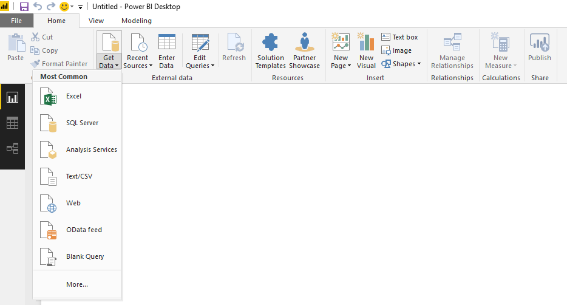
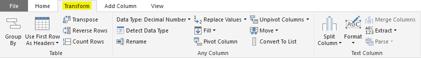
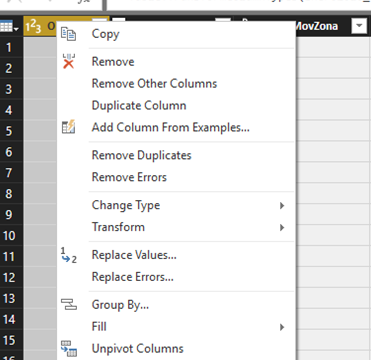
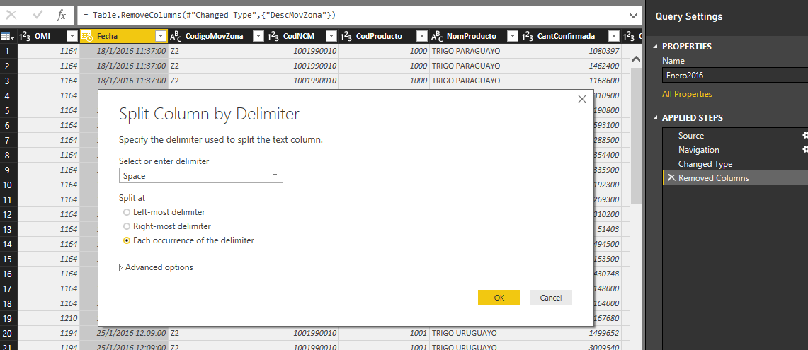
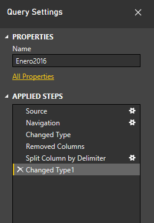
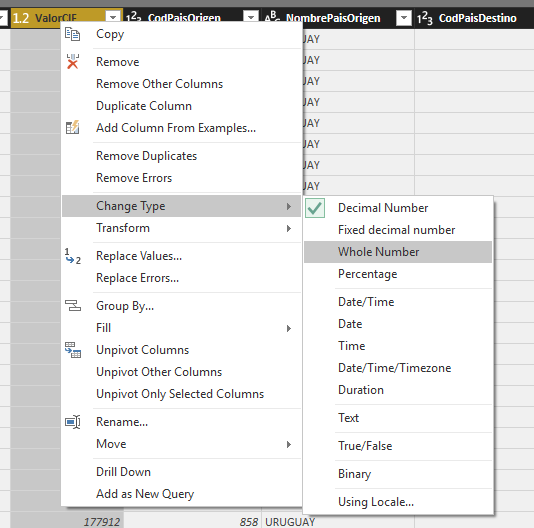
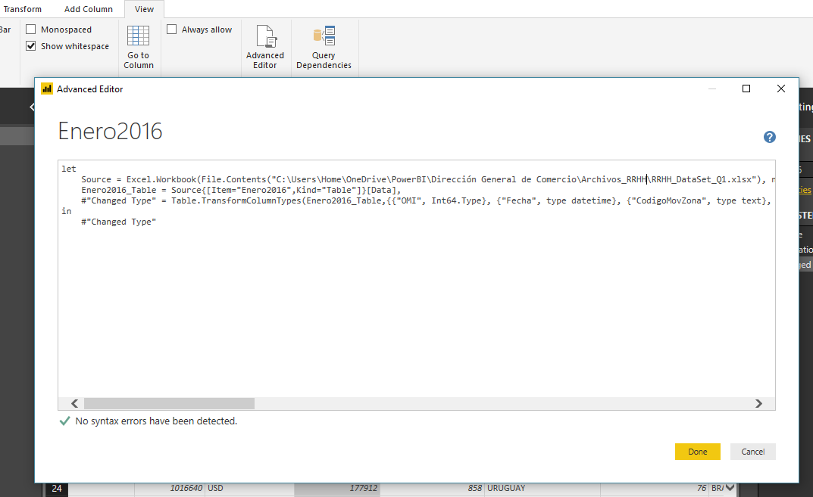
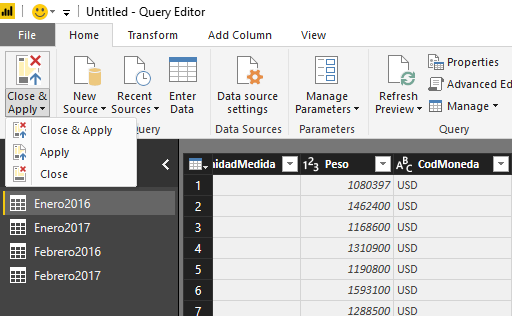
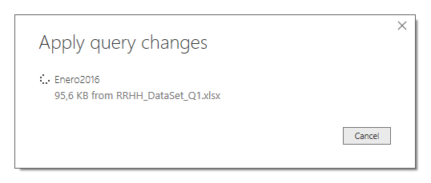
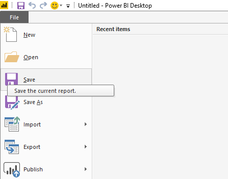

Power BI Desktop permite conectarse a muchos tipos diferentes de orígenes de datos y después darles forma a los datos para logar los informes deseados.

Cuando mencionamos darles forma a los datos, esto implica transformar los datos, ya sea cambiando el nombre de columnas o tablas, convirtiendo tipos de datos, eliminando filas y/o columnas, etc. Cabe mencionar que es importante darle una correcta forma a los datos para que una vez generada la tabla con la cual crearemos los informes, nos resulte útil.

Tal es el caso de un archivo Excel que contiene datos numéricos, que si bien están almacenados en el formato correcto y al importarlos en Power BI la herramienta intentará convertir el tipo de datos de la columna de origen en un tipo de datos que admita una correcta visualización, aun así hay casos en los que se generará una diferencia en el resultado final debido a diferentes separadores de miles y decimales.

Este artículo muestra cómo formar una consulta mediante Power BI Desktop y resaltar algunas de las tareas más comunes. Es útil saber que el editor de consultas en Power BI Desktop hace un extenso uso de los menús contextuales, así como de la cinta de opciones. La mayor parte de lo que se puede seleccionar en la cinta Transformar también está disponible en el menú que aparece al hacer click derecho en un elemento.

**Dar forma a datos**

Al dar forma a los datos en el Editor de consultas, se brindan instrucciones detalladas para ajustar los datos a medida que el Editor de consultas los carga y los muestra. El origen de datos original no se ve afectado; únicamente la vista de los datos se ajusta. Los pasos desarrollados (cambiar el nombre de una tabla, eliminar columnas, transformar tipos de datos) se irán registrando en el Editor de consultas y, cada vez que se conecta al origen de datos, dichos pasos se vuelven a aplicar para que los datos siempre muestren el formato elegido. Este proceso se produce siempre que se use la característica del editor de consultas de Power BI Desktop, o cuando alguien más utilice su consulta compartida, como en el servicio Power BI. Dichos pasos se capturan, de forma secuencial, en la sección Applied Steps del panel Query Settings.

La siguiente imagen muestra el panel Query Settings de una consulta en la cual se ha eliminado una columna, y se ha utilizado la funcionalidad Split Column para separar la fecha de la hora, considerando el delimitador existente (Espacio):

Con respecto a la transformación de los datos, es importante mencionar que los resultados de una columna no se transforman automáticamente, si bien el proceso es muy sencillo. A modo de ejemplo, para convertir una columna de texto a números, una vez que el editor de consultas cargó la tabla, simplemente se debe hacer clic con el botón derecho en el encabezado de columna y seleccionar Change Type &gt; Whole Number para cambiarlos. Si se desea elegir más de una columna, primero seleccionar una columna, mantener presionada la tecla MAYÚS, seleccionar columnas adyacentes adicionales y hacer click con el botón secundario en un encabezado de columna para cambiar todas las columnas seleccionadas. También se pueden seleccionar columnas no adyacentes, siguiendo el mismo procedimiento pero utilizando la tecla CTRL.

**El Editor avanzado**

Si desea ver el código que el Editor de consultas está creando con cada paso realizado, o si desea crear o editar su propio código, puede usar el Advanced Editor. Para iniciar el editor avanzado, seleccione View desde la cinta de opciones y después seleccione Advanced Editor. Aparecerá una ventana que muestra el código de la consulta actual:

Puede modificar directamente el código en la ventana **Advanced Editor** . Para cerrar la ventana, seleccione el botón **Done** o el botón **Cancel**. Es importante tomar en cuenta para los que deseen avanzar en este sentido que el lenguaje de este Editor Avanzado es denominado Lenguaje M, y podemos ahondar mucho más en la generación de queries utilizando dicha programación.

**Guardar la consulta y aplicar los cambios**

Cuando la consulta se encuentre pronta, puede hacer que el Query Editor aplique los cambios en el modelo de datos en Power BI Desktop y cerrar el editor. Para ello, seleccionar Close and Apply en el menú File del Query Editor.

Power BI Desktop proporciona un cuadro de diálogo para mostrar su estado.

Una vez que la consulta está pronta y los datos modelados, Power BI Desktop puede guardar el trabajo en formato de archivo .pbix. Para guardar el trabajo, seleccione **File &gt; Save**, como se muestra en la siguiente imagen:

**Conclusión**

Siguiendo los pasos mencionados anteriormente, se llega a una sola consulta (Tabla) que combina orígenes de datos, a los cuales se dio forma para ajustarse a las necesidades de cada empresa. Esta consulta puede servir como base para una gran cantidad de informes interesantes, como ser: análisis de ventas, estadísticas de costos, proyección de ventas, datos demográficos, entre otros; que pueden tener una sola visualización o páginas enteras de visualizaciones. En todos los casos, es importante entender la correcta importación de los datos en Power BI Desktop.

Siempre que actualice los datos en un conjunto de datos, ya sea a través de la opción Refresh o mediante la configuración de una programación de actualización, Power BI utiliza información del conjunto de datos para conectarse a los orígenes de datos definidos para el mismo, consulta para obtener datos actualizados y después carga los datos actualizados en el conjunto de datos. Las visualizaciones en los informes o paneles basados en los datos se actualizan automáticamente.

**Margarita Curbelo**

Arkano Software​

