import ArticleHeader from '../../../components/article-header'

<ArticleHeader frontmatter={props.pageContext.frontmatter} />

Hace pocos días Microsoft lanzó una versión diferente de licenciamiento para Power BI. No voy a avanzar mayormente sobre este tema, pero si me parecía una introducción interesante ya que se agrega a la suite un componente que muchos han estado esperando: la capacidad de realizar despliegue de reportes de Power BI en forma On Premises. Dado que es un componente nuevo, me lance a investigar acerca de sus prestaciones, y requerimientos.

Para esto, me armé un laboratorio que consistió en crear una máquina virtual en la que instalé Windows Server 2016 (tenía pendiente también probar esta nueva versión OS Server de Microsoft). Una vez instalado el OS Server me lance en la instalación de SQL. Para ello también me propuse instalar lo último, y fui por SQL vNEXT CTP2.1 recién salido (¿será SQL 2017?). La instalación es bien amigable, y no reviste mayores complicaciones.

Un punto a tomar en cuenta en la instalación de SQL Server es que es conveniente instalar el paquete completo, me refiero a agregar componentes tales como SSAS, SSRS, SQL Data Tools. Varios puntos a señalar referente al párrafo anterior: SQL Server Analysis Services será necesario ya que recordemos que por ahora Power BI Report Server solo permite como fuente de datos Live Queries contra modelos multidimensionales de SSAS.

En el caso de SQL Reporting Services es quien nos proveerá de una plataforma (Portal) donde alojaremos nuestros reportes de Power BI.

*Instalación de Power BI Report Server*

Ahora sí, una vez cumplimos con estos pre requisitos pasamos a los detalles de instalación:

1.       Descargar el archivo PowerBIReportServer.exe y ejecutar el instalador. Página de descarga:

[https://www.microsoft.com/en-us/download/details.aspx?id=55253](https&#58;//www.microsoft.com/en-us/download/details.aspx?id=55253)

2.       Seleccionar la opción de Instalar Power BI Report Server.

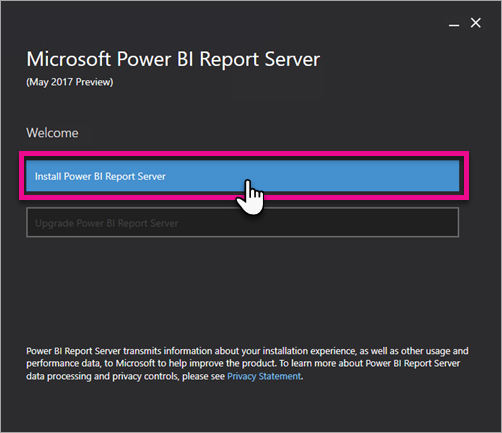

3.       Seleccionar la edición que se instalará:​

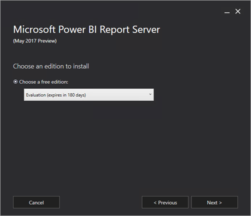

4.       Leer los términos y condiciones y seguir adelante con la opción Next.

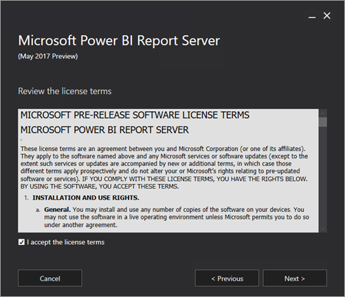

5.       Tomar nota que en este siguiente paso se nos advierte que será necesaria una instancia del motor de SQL Server para alojar BD para nuestro Report Server.

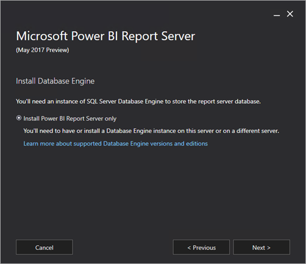

6.       Especificaremos a continuación la localización de nuestra instalación.

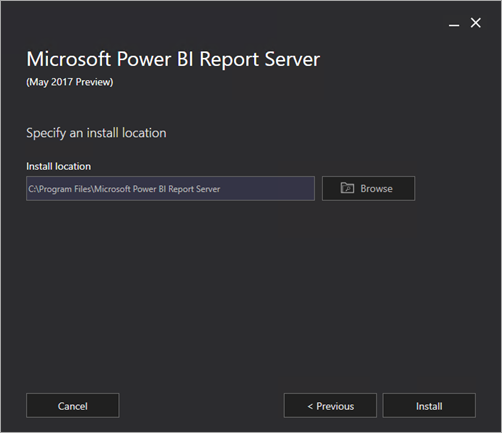

7.       Una vez que finalizamos con la instalación, seleccionaremos la opción de Configuración de Report Server.

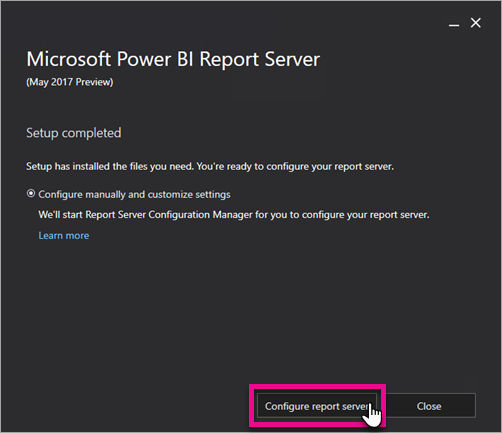

8.       Nuestra pantalla de Configuración de Report Server será la siguiente:

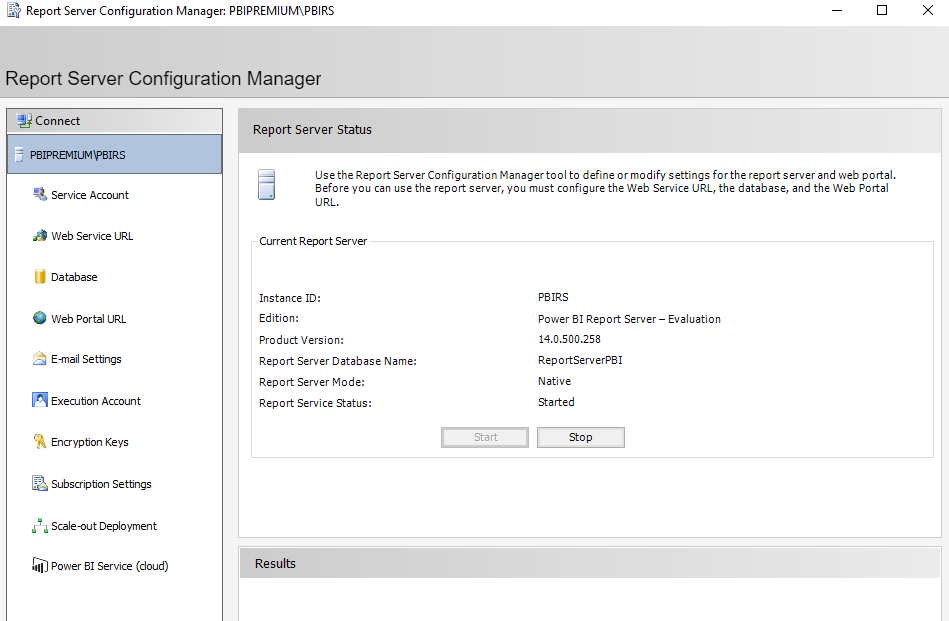

9.       A destacar en dicha pantalla de configuración, generar el Service Account (recomendable la utilización de Network Service), y la configuración del WebService URL, y luego del WebPortal URL. Recordar en cada punto ir haciendo el Apply de cada paso.

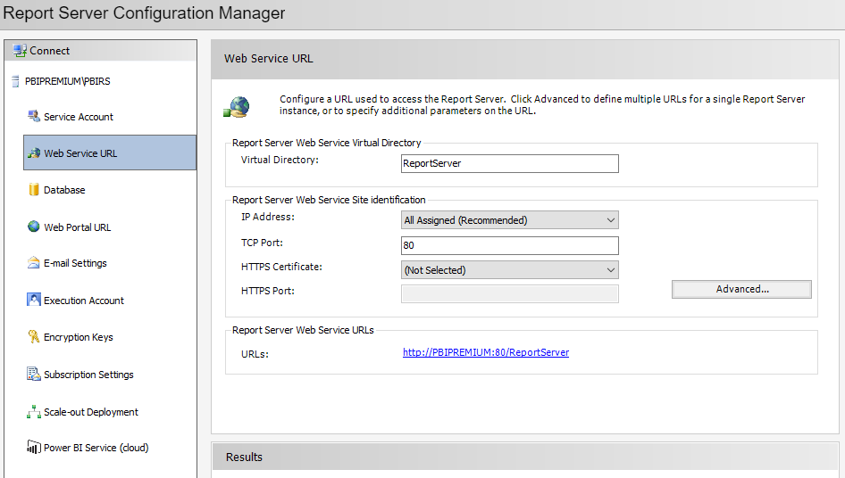

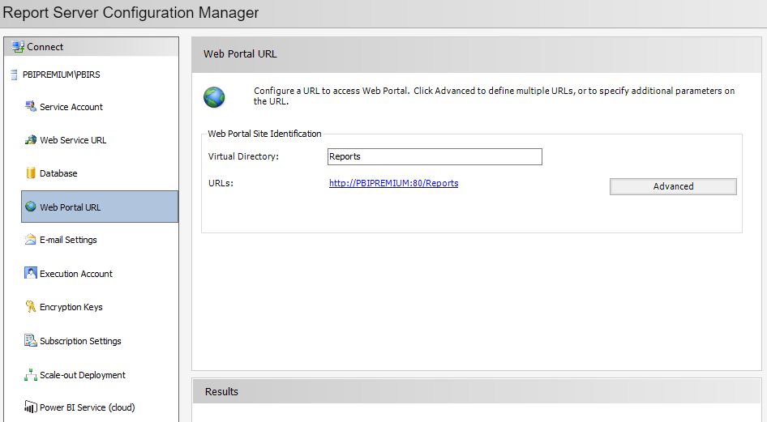

**Power BI Desktop Report Server Edition**

Una vez realizados estos pasos, estaremos en condiciones de montar nuestro primer reporte y publicarlo finalmente en nuestro propio Power BI Report Server. Recordemos que para esto es fundamental descargarnos una versión de Power BI Desktop definida especialmente para trabajar con Report Server. Dicha versión se conoce como Power BI Desktop (Report Server)

Descarga: [https://www.microsoft.com/en-us/download/details.aspx?id=55256](https&#58;//www.microsoft.com/en-us/download/details.aspx?id=55256)

Una vez instalada nuestra versión Power BI Desktop Report Server procedemos a iniciar dicho aplicativo, y como en otros reportes de Power BI comenzamos con la opción de Get Data (Obtener Datos). Volvemos a hacer mención en este punto que para publicar en PBI Report Server solo podemos trabajar hoy en día con fuentes de SSAS, por lo que debemos tener un Cubo en nuestro server o en SSAS Azure Service.

Una vez generado nuestro reporte podemos publicar en Report Server. Para esto veremos en Power BI Desktop una opción de Publicar en Power BI Report Server:

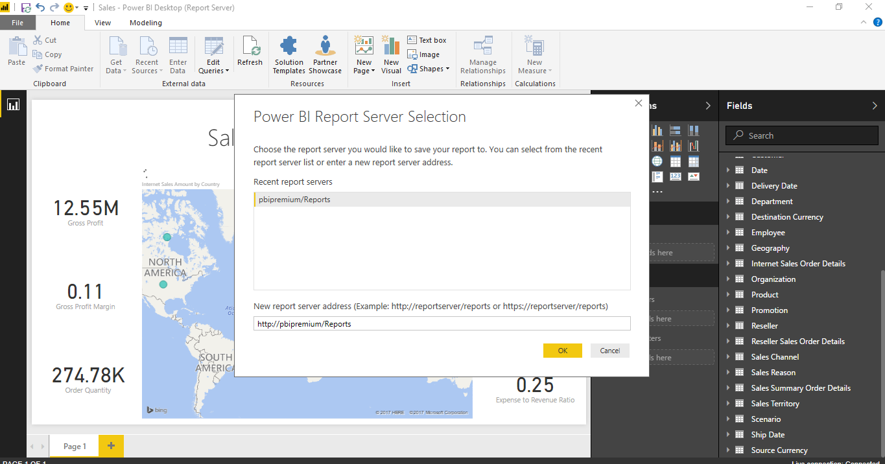

Por último, y tomando en cuenta que nuestro Power BI Report Server se encuentra alojado en nuestro propio servidor, simplemente navegaremos con Edge o Internet Explorer a la página Home de nuestro Portal Report Server. En mi caso será: [http://pbipremium/Reports](http&#58;//pbipremium/Reports)​

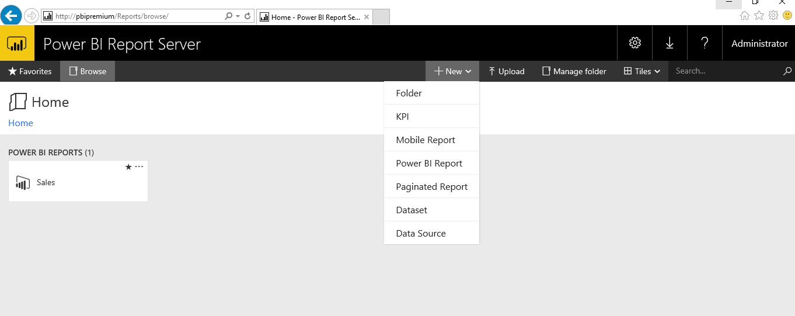

Para visualizar el reporte simplemente damos click sobre el mismo, y esto nos permitirá ver en pantalla completa en el navegador dicho reporte:

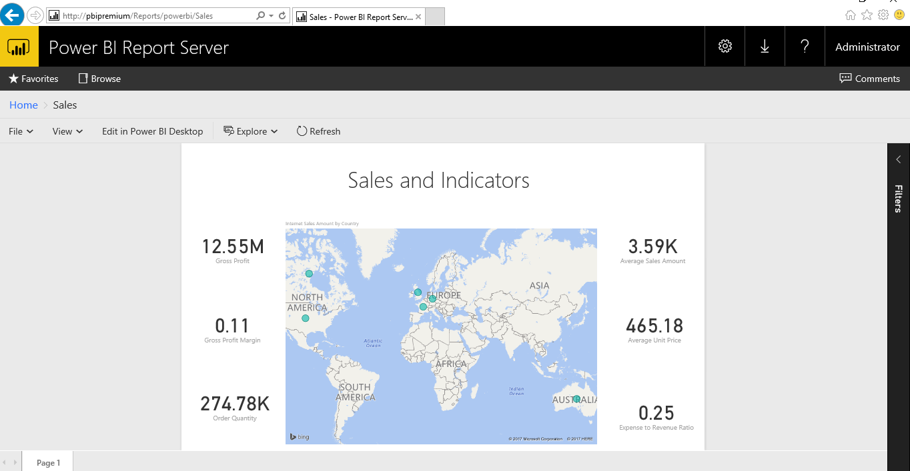

**Conclusión**

Este nuevo componente de la suite Power BI nos abre un abanico importante de opciones al momento de publicar reportes en nuestro propio server, y subir a la nube a medida que analicemos los casos en que la organización este afín con dicha publicación.

Otro será el tema de licenciamiento, y que se viene discutiendo en gran medida en la comunidad y en el que seguramente Microsoft siga trabajando para darnos opciones al momento de realizar este tipo de instalaciones.

De estos temas seguramente hablemos en una próxima edición.

**Gastón Cruz**

Business Intelligence Technical Manager | Arkano Software

