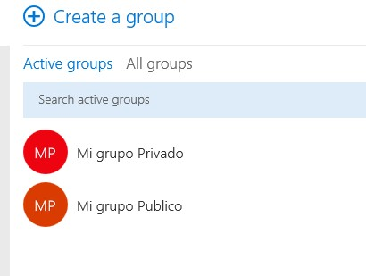

import ArticleHeader from '../../../components/article-header'

<ArticleHeader frontmatter={props.pageContext.frontmatter} />

Heráclito: "Lo único constante, es el cambio". Los últimos años han traído un torrente de cambios en la forma en que diseñamos, implementamos y administramos nuestros ambientes de Exchange Server. Muchas de las funcionalidades y características de esta tecnología, no han sido la excepción a la frase del filósofo griego. Vivimos pues en un mundo cambiante.  Hasta hace poco la forma en que ciertas características de Exchange trabajaban era de forma muy independiente unas de otras, Características tales como Public Folders, Distribution Groups, Shared Mailbox etc. Hace un par de años Microsoft presentó Office 365 Groups como una alternativa a esta segregación y teniendo como finalidad ofrecer un espacio de colaboración centralizado para los usuarios. Sin embargo esta adopción ha tenido un inicio lento. Office 365 Groups apunta a volverse un estándar que con la llegada de Microsoft Teams, podría catapultar su usabilidad. Sin embargo, esta no es la primera vez que Microsoft Apuesta a una plataforma de colaboración, ha habido intentos "de aprendizaje" tales como Public Folders, Site Mailboxes, etc.

**¿Qué es Office 365 Groups?**

Una combinación de un buzón, calendario y librerías, presentadas en una experiencia al tipo conversación social, proveen una mejor colaboración y comunicación en Office 365 a la cual los mismos usuarios de Outlook se pueden suscribir para recibir/acceder a las conversaciones. Cabe mencionar que este articulo solo está enfocado a la parte de Exchange, pero realmente Office 365 groups es un servicio de colaboración (No un producto) que otorga a sus miembros acceso a área de colaboración con:  Buzón, Calendario, Librería de documentos, team site, onenote, planner de manera predeterminada,  mas integraciones que pueden realizarse posteriormente

**¿Por qué debería importarnos Office 365 Groups a los ingenieros de Exchange Server?**

Office 365 Groups está basado fuertemente en características existentes de Exchange Server tales como Public Folders, Site Mailbox, shared Mailbox, Distribution Groups y apunta a volverse una alternativa a estas características de forma más robusta y centralizada, que aunado a la reciente llegada de Microsoft Teams, podría volverse en un fuerte aliado para las organizaciones y quienes las administran. Dada la integración del modelo de chat y debido a las nuevas características de auditoria, gobernación, reporteo y seguridad. Pero Microsoft Teams será un tema que tocaremos en otro articulo

**¿Por qué necesitamos Office 365 Groups?**

Características tales como Public Folders, Site Mailbox, Shared Mailbox, Distribution Groups ya existen en nuestro ambiente y cada una provee ciertas funcionalidades propias. Por ejemplo, un Shared Mailbox nos permite compartir un buzón, un Distributrion Group nos permite enviar correos a un grupo de personas, un Public Folder nos permite archivar contactos o calendarios y un Site Mailbox nos permite trabajar documentos desde Outlook y compartir proyectos. Sin embargo, algunas de estas cuentan con limitantes tales como el soporte a dispositivos móviles, en documentos o calendario o bien el que tenemos que interactuar con diferentes aplicaciones. Pensemos un momento sobre la estrategia actual de Microsoft: "Cloud-First, Mobile-First"**.** Bien, pues Office Groups nace en la nube y nos permite integrar todas estas funcionalidades, agrega una característica de conversación social, cuenta con soporte en dispositivos móviles y es accesible a través de Outlook siempre y cuando un usuario se suscriba al grupo.

Originalmente solo se podía deshabilitar Office 365 Groups desde una OWA mailbox policy, recientemente también es posible controlar el acceso a Groups desde Azure A. De manera todos los usuarios de 365 pueden crear 365 Groups, ya sean privados o públicos de forma predeterminada. Esta configuración puede ser cambiada después de la creación del buzón.

**Datos de interés respecto a los límites de Office 365 Groups:**

·       Cada grupo puede tener hasta 10 administradores.

·       Un usuario puede crear hasta 250 grupos.

·       Un administrador puede crear hasta 500,000 (el máximo número de grupos por tenant)

·       Cada grupo puede tener más de 1,000 miembros (a partir de esta cantidad es esperado un desfase debido a la cantidad de contenido y conversaciones).

·       Los grupos tienen un límite de 1TB de almacenamiento + 500MB por cada miembro suscrito (Aunque esto respeta el storage del Pool, así que la cuota que se indique para SharePoint sites se aplicara a Groups)

·       Todos los miembros de un grupo tienen el mismo nivel de permisos (no hay granularidad respecto a los permisos de un grupo)
·       Pueden ser privados o públicos
·       Pueden ser ocultados de la GAL
·       Control de invitados
·       Agregar clasificación
·       Agregar guía de usuario
·       Opciones de reporteo
·       Opciones de auditoria
·       Búsquedas a través de eDiscovery
·       Opción de retención soft-delete (30 días después de ser eliminado)
·       Políticas de nombrado (naming policies)
·       Configuración de expiración (Para prevenir clutter de Groups inactivos)

·       Filtrado de palabras (profanidad)

·       Integration con Power BI, Dymanics CRM, Planner, conectores, Skype for Business, etc

·       Muchas más características actualmente en fase de pruebas

**Comandos de Exchange Online:**

·       Add-UnifiedGroupLinks
·       Get-UnifiedAuditSetting
·       Get-UnifiedGroup
·       Get-UnifiedGroupLinks
·       New-UnifiedGroup
·       Remove-UnifiedGroup
·       Remove-UnifiedGroupLinks
·       Search-UnifiedAuditLog
·       Set-UnifiedAuditSetting
·       Set-UnifiedGroup

Solamente Mailboxes y Mail Users pueden ser miembros de un grupo (objetos tales como contactos, DLs, DL dinámicas, etc. No están soportados).

De igual forma es posible convertir un Distribution Group (cloud-based) a un Office 365 Group y migrar onprem DLs a Office 365 (mediante Hummingbird)

Los usuarios solo pueden crear Office 365 groups desde OWA (O a través de las diferentes aplicaciones de la suite de Office 365 de las cuales groups está relacionado: SharePoint, Power BI, planner, etc) mientras que un administrador lo puede hacer desde el portal de admin center en 365 y a través de remote Powershell

Por ejemplo, aquí podemos apreciar que desde el usuario Geovany Acevedo se crearon dos grupos:

- Mi grupo privado
- Mi grupo publico

Cualquier usuario en la organización, podrá a través de un Discover, encontrar ambos grupos, usemos por ejemplo el buzón de BackupAdmin. Como podemos ver, es capaz de localizar ambos grupos: ​

Como administrador de igual forma podemos ver ambos grupos desde Remote PowerShell.

Si BackupAdmin abre el grupo público, podrá ver el contenido, seleccionar join y listo, es miembro del grupo de forma automática.

Sin embargo, si abre el grupo privado, no podrá ver el contenido y al momento de seleccionar join, no será miembro automáticamente.

Esta acción hará que el administrador del grupo reciba una notificación de que BackupAdmin está requiriendo acceso al grupo y debe ser aprobada

**¿Cómo se controla la creación de grupos?**

Office 365 groups está ligado a OWA, la forma de deshabilitarlo es mediante una política de OWA Mailbox Policy. Con la llegada de Microsoft Teams esto puede ahora igual ser controlado a nivel de Azure AD. Para este escenario solo queremos deshabilitar Groups para un usuario de Exchange.

1. Crear la directiva de OWA:

2. Editar la directiva:

**Set-OWAMailboxPolicy**  **-Name "Grupos deshabilitados" -GroupCreationEnabled $false**

****

3. Asignamos la directiva a un buzón, por ejemplo, a BackupAdmin

**Set-CasMailbox BackupAdmin -OWAMailboxPolicy "Grupos deshabilitados"​**

En ambientes híbridos, como comentamos 365 Groups es nativo a la nube,  pero pueden llegar a el ambiente On-Premises a través de la característica de Write-Back de AD Connect (De esta forma sincronizando hacia la GAL como una DL). Aunque para esto se deben cumplir algunos requerimientos de versión (Exchange 2013 CU11 o mayor u Exchange 2016 CU1 o mayor)

·         [https://technet.microsoft.com/en-us/library/mt668829(v=exchg.150).aspx](https&#58;//technet.microsoft.com/en-us/library/mt668829%28v=exchg.150%29.aspx)

Si bien este artículo no se adentra en los detalles propios de Office 365 Groups y cada una de sus características, debería ser un buen inicio para conocer un poco más sobre Office 365 Groups, que como podemos ver es un espacio de colaboración para equipos de trabajo y vale la pena que se considere como alternativa a algunas de las actuales soluciones de colaboración en su empresa

Para más detalles sobre Office 365 Groups pueden visitar los siguientes vínculos de Microsoft:

·         [https://support.office.com/en-us/article/Learn-about-Office-365-groups-b565caa1-5c40-40ef-9915-60fdb2d97fa2](https&#58;//support.office.com/en-us/article/Learn-about-Office-365-groups-b565caa1-5c40-40ef-9915-60fdb2d97fa2)

·         [https://support.office.com/en-us/article/Get-more-with-Office-365-Groups-in-Outlook-93132800-5b11-49de-8cc2-605b6075b2b9](https&#58;//support.office.com/en-us/article/Get-more-with-Office-365-Groups-in-Outlook-93132800-5b11-49de-8cc2-605b6075b2b9)

**Geovany Acevedo**
 Architect IT Operations | Messaging

Office Server and Services MVP
 @imvo2 | [http://blogs.itpro.es/imvoacevedo/](http&#58;//blogs.itpro.es/imvoacevedo/)

