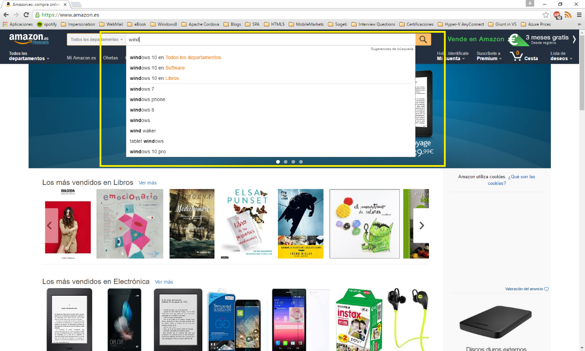

import ArticleHeader from '../../../components/article-header'

<ArticleHeader frontmatter={props.pageContext.frontmatter} />


¿A quién no le gustaría o no le han pedido tener una búsqueda en su aplicación estilo Google?

Azure nos proporciona un servicio para poder realizar este tipo de búsquedas, concretamente con el servicio Azure Search. El objetivo de este artículo es dar una visión completa de este servicio como complemento al artículo ya publicado en el número 27 de esta revista: [http://www.compartimoss.com/revistas/numero-27/usando-azure-search-en-soluciones-de-busqueda-para-office-365](/revistas/numero-27/usando-azure-search-en-soluciones-de-busqueda-para-office-365)

**¿Qué es Azure Search?**

Azure Search es un *cloud search-as-a-service* (un servicio de búsqueda) que nos ayuda a integrar fácilmente búsquedas en nuestras aplicaciones (web, mobile, desktop…). Una de las características más importantes que tiene es que está basado en *Lucene.* [*Lucene*](https&#58;//lucene.apache.org/core/) es una librería que permite realizar búsquedas de texto implementando un motor de búsqueda de alto rendimiento.

Azure Search nos permite realizar:

·        Búsquedas *full-text search* à realiza la búsqueda en todos los documentos existentes a partir de una palabra.
·        Suggestions à Sugerencias para implementar autocomplete.
·        Filters à Permite refinar nuestras búsquedas.
·        *Facetes* –&gt; Permite el refinamiento de la búsqueda mediante la selección de campos concretos.
·        Highlighting à Nos permite resaltar campos específicos de nuestra búsqueda definiendo el patrón que queremos que se muestren en los campos.
·        Geosearch à A partir de tu búsqueda permite mostrar las localizaciones más cercanas a tu posición que coincidan con tu búsqueda, como, por ejemplo: restaurantes, tiendas, …
·        Scoring à Permite ponderar los valores de forma que según la puntuación dada salgan en orden de relevancia.
·        También nos permite paginación y ordenación de los resultados.
·        Azure Search detecta entre 56 lenguajes el texto introducido en la búsqueda permitiendo inferir tiempos verbales, sintaxis, …
·        Permite realizar consultas inteligentes con operadores lógicos, de sufijo o de precedencia. También y gracias *Lucene* nos permite realizar consultas con expresiones regulares, por términos o por proximidad.


Los dos pilares es los que se basa el servicio son índices y documentos.
 
**Índices**

Los índices son donde se guardará la información que añadiremos. Sería como una tabla de base de datos del *search*. La definición de los campos del índice contendrá la parametrización de estos indiciando su tipo y que role juegan dentro del servicio para poder realizar búsquedas, inserciones y eliminaciones de documentos.

Los tipos de un índice pueden ser:


| **Edm.String** | Estándar string |
| --- | --- |
| **Collection(Edm.String)** | Lista de string. El tamaño máximo de la colección es de 16 MB. |
| **Edm.Boolean** | Valores: True/False |
| **Edm.Int32** | Entero de 32-bits |
| **Edm.Int64** | Entero de 64-bits |
| **Edm.Double** | Número con precisión doble. En .Net sería el tipo Double. |
| **Edm.DateTimeOffset** | Fecha representada en formato OData V4: yyyy-MM-ddTHH:mm:ss.fffZ or yyyy-MM-ddTHH:mm:ss.fff[+|-]HH:mm |
| **Edm.GeographyPoint** | Representa un punto en el mapa mundial. |


Es necesario añadir atributos a los campos. Añadiendo estamos definiendo su comportamiento dentro del servicio de forma que este pueda interactuar con ellos de la forma correcta al realizar las queries.

Estos atributos son:

·        Key à El campo será clave primaria.
·        Retrievable à El campo será respuesta a la consulta lanzada.
·        Filterable à  Se podrán aplicar filtros sobre el campo.
·        Sortable à Se podrá aplicar ordenación.
·        Facetable à Nos devolverá el campo como facete (ver imagen 1).
·        Searchable à El campo se incluye en la búsqueda *full tex*t. Solo los campos de tipo EDM.String deberían ser de este tipo.


Ahora ya tenemos preparado nuestro índice y en este momento ya podríamos añadir documentos en él.

**Documentos**

Ahora ya tenemos preparado nuestro índice y en este momento ya podríamos añadir documentos en él. Podemos añadir documentos mediante dos métodos:

**1-**    **Vinculando una fuente de datos**

Azure Search nos da la opción de vincularnos a cinco fuentes de datos:

·       SQL Azure - Vinculamos una tabla concreta a un índice. Nos crea los campos del índice con las columnas de la tabla. Una vez tenemos el índice creado debemos popular este, podemos hacerlo de tres formas: una sola vez, cada vez que haya algún cambio en la tabla/view seleccionada mediante un planificador o bajo demanda cuando se desee.
·       SQL Server una Máquina virtual en Azure **à** Idéntico al punto anterior, con la diferencia que los datos para conectarse a la fuente son diferentes.
·       DocumentDB à  En el caso de DocumentDB en vez de vincular una tabla de BBDD, se vincula una *collection* de un *database* de DocumentDB. Como en el caso de SQLAzure se deben sincronizar los datos y las opciones son las mismas que para SQLAzure. Actualmente ya no existe el servicio de DocumentDB como tal, sino que ahora está englobado dentro del servido CosmosDB. Ya se puede trabajar con CosmosDB per solo a través de REST Api y no desde el portal.
·       Blob Storage **-** Igual que los anteriores, al vincularlo te crea los campos del índice y tienes las mismas opciones para añadir los documentos a este y mantenerlos actualizados.  Los tipos de ficheros que actualmente azure search pude extraer texto son: pdf, documentos office, html, xml, zip, eml, *plaint text files*, JSON y CSV.

Table Storage **-** Creará los campos del índice a partir de los datos de la table sotrage e igual que los demás se deberá sincronizar el contenido.


**2****-**    **Mediante código**

También puedes crear los campos de tus índices de la forma que más se adecue a tus necesidades. Para realizarlo se deberá hacer a través de la REST API o el SDK de .Net.

Para finalizar este articulo vamos a ver un poco más en detalle dos de las características más interesantes desde mi punto de vista:  Suggestion y Scoring

**Suggestions**

Cuando un usuario quiere buscar algo en un *web site* o una *app mobile* lo primero que hacen es ir al buscador de la aplicación. Por esta razón el buscador debe ser efectivo y ayudar al usuario a encontrar lo que busca y una forma de ayudar al usuario es mediante sugerencias o auto-complete.



**¿COMO CONFIGURAMOS LAS SUGGESTIONS EN AZURE SEARCH?**

Cuando definimos el índice debemos informar el campo Suggesters:

```
//Define SuggesterList
```

```
List<Suggester> suggesterList = new List<Suggester>();
```

```
suggesterList.Add(new Suggester() { Name = "suggester", SearchMode = SuggesterSearchMode.AnalyzingInfixMatching, SourceFields = new List<string>() { "Titulo", "Autores" } });
```

```
//Create Index Model
```

```
Index indexModel = new Index()
```

```
{
```

```
  Name = indexName,
```

```
  Fields = new[]
```

```
   {
```

```
     new Field("ISBN", DataType.String) { IsKey = true, IsRetrievable = true, IsFacetable = false },
```

```
     new Field("Titulo", DataType.String) {IsRetrievable = true, IsSearchable = true, IsFacetable = false },
```

```
     new Field("Autores", DataType.Collection(DataType.String)) {IsSearchable = true, IsRetrievable = true, IsFilterable = true, IsFacetable = false },
```

```
     new Field("FechaPublicacion", DataType.DateTimeOffset) { IsFilterable = true, IsRetrievable = false, IsSortable = true, IsFacetable = false },
```

```
     new Field("Categoria", DataType.String) { IsFacetable = true, IsFilterable= true, IsRetrievable = true }
```

```
    },
```

```
 //Add Suggesters
```

```
 Suggesters = suggesterList
```

```
}
```

Como podéis observar Suggesters es una lista de tipo Suggester. Un Suggester se define de la siguiente forma:

·       Name: Nombre del Suggester. Identifica el Suggester que queremos definir.

·       SearchMode: que es del tipo SuggesterSearchMode que es un enum con una sola opción AnalyzingInfixMatching. AnalyzingInfixMatching realiza el "*matching*" de frases al principio o en medio de las sentencias.

·       SourceFields: Que es una lista de strings donde se indican los campos del índice sobre los cuales queremos obtener sugerencias. Deben ser de los tipos Edm.String o Collection(Edm.String)​

Si vamos al portal podemos ver como se ha configurado las suggestions.


###### **¿COMO UTILIZARLO?**

######  

###### Cuando vas a realizar la búsqueda de documentos, lo que se debe hacer es llamar al método Suggest, que consta de cuatro parámetros, dos obligatorios y dos opcionales:

·       searchText: Campo obligatorio. El texto a partir del cual queremos crear las sugerencias.

·       suggesterName: Campo obligatorio. El *suggester* que queremos utilizar. Campo Name de la clase Suggester que se crea al crear el índice.

·       suggestParameters: Campo opcional. De tipo SuggestParameters. Este parámetro nos permite configurar como queremos que funcione la búsqueda de las *suggestions*.  Propiedades de SuggestParameters:

o Filter: Filtro a aplicar para acotar los documentos donde realizar la búsqueda de sugerencias.

o HighlightPreTag: *String* que se pondrá delante de las coincidencias.

o HighlightPostTag:  *String* que se anexa a las coincidencias:

o MinimumCoverage: Campo con valor entre 0 y 100 que indica el porcentaje de índices que debe ser abarcada por la *query* de sugerencias para que su resultado sea satisfactorio.

o OrderBy: Orden en el cual deben ser devueltos los resultados.

o SearchFields: Dentro del Suggester se define sobre que índices operará la búsqueda de sugerencias, con este campo podemos seleccionar solo alguno de esos índices. Por defecto si no se informa busca en todos los índices parametrizados en el Suggester. Por defecto su valor es 80.

o   Select: Solo devolver algunos de los campos. Hay que indicar que cuando se realiza una búsqueda de sugerencias, además de devolver las sugerencias, también devuelve todos aquellos documentos que coincides con estas sugerencias, por ello se permite realizar las operaciones de OrderBy, Filter, y Select.
o   Top: El número de sugerencias a devolver.
o   UseFuzzyMatching: Por defecto su valor es false. Si le asignamos el valor true se encontrarán sugerencias, aunque no coincidan todas las palabras, es decir, realizar aproximaciones en la búsqueda.

·        searchRequestOptions: Campo opcional. De tipo SearchRequestOptions. Este campo nos ayuda a la hora de realizar debugging, permitiendo seguir las trazas a partir del GUID generado.

**Scoring**

En algunos casos, necesitamos que algunos resultados salgan antes que otros. Por ejemplo, imaginemos una tienda on-line que quiere promocionar un nuevo producto, para ello le interesa que salga en las primeras posiciones cuando los usuarios realicen búsquedas, pues Azure Search nos da esta opción mediante el scoring.

Scoring profiles nos permite personalizar el cálculo de scoring en las búsquedas.
Al realizar una búsqueda uno de los campos que nos devuelve Azure Search es el campo llamado Score. 
Si añadimos un Scoring Profile lo que estamos haciendo es darle peso a este campo, de forma que primero muestra los que más peso tienen.

**¿COMO CONFIGURAMOS SCORING PROFILES EN AZURE SEARCH?**

Igual que en el caso de los Suggesters, el Scoring Profile se configura cuando definimos el índice.

```
//Define ScoringList
```

```
List<ScoringProfile> scoringsList = new List<ScoringProfile>();
```

```
Dictionary<string, double> textWieghtsDictionary = new Dictionary<string, double>();
```

```
textWieghtsDictionary.Add("Autores", 1.5);
```

```
scoringsList.Add(new ScoringProfile()
```

```
{
```

```
    Name = "ScoringTest",
```

```
    TextWeights = new TextWeights(textWieghtsDictionary)
```

```
});
```

```
//Create Index Model
```

```
Index indexModel = new Index()
```

```
{
```

```
  Name = indexName,
```

```
  Fields = new[]
```

```
   {
```

```
     new Field("ISBN", DataType.String) { IsKey = true, IsRetrievable = true, IsFacetable = false },
```

```
     new Field("Titulo", DataType.String) {IsRetrievable = true, IsSearchable = true, IsFacetable = false },
```

```
     new Field("Autores", DataType.Collection(DataType.String)) {IsSearchable = true, IsRetrievable = true, IsFilterable = true, IsFacetable = false },
```

```
     new Field("FechaPublicacion", DataType.DateTimeOffset) { IsFilterable = true, IsRetrievable = false, IsSortable = true, IsFacetable = false },
```

```
     new Field("Categoria", DataType.String) { IsFacetable = true, IsFilterable= true, IsRetrievable = true }
```

```
    },
```

```
   //Add Scorings
```

```
   ScoringProfiles = scoringsList
```

```
 };​
```

Como se puede observar ScoringProfiles es una lista de tipo ScoringProfile que se define de la siguiente forma:

·       Name: Campo obligatorio.

·       Functions: Campo opcional. Lista de ScoringFunctions. Las *functions* nos permiten definir como queremos que aumente la puntuación, es decir parametrizamos como queremos que este aumento funcione: podemos definir el peso, durante cuánto tiempo está activo…

Un ejemplo de cómo definir una ScoringFunction**:**

```
ScoringFunction sp = new FreshnessScoringFunction()
```

```
{
```

```
   Boost = 10,
```

```
   FieldName = "Autores",
```

```
   Interpolation = ScoringFunctionInterpolation.Linear,
```

```
   Parameters = new FreshnessScoringParameters()
```

```
   {
```

```
        BoostingDuration = DateTime.Now.Add(20).TimeOfDay;
```

```
   }
```

```
}​
```

Lo que estamos haciendo es añadir una función que cuando se hagan búsquedas sobre el índice Autores le añadirá un peso de 10 de forma linear durante 20 días solo.

·       FunctionAggregation: Campo opcional. Valor que indica como los resultados de las funciones definidas deben combinarse. Sus posibles valores son 'sum', 'average', 'minimum', 'maximum', 'firstMatching'. Su valor por defecto se 'sum' y solo se aplica si hay alguna *function* definida.
·       TextWeights: Campo opcional. Cuando existen coincidencias de texto, a la puntuación obtenida se le suma el valor asignado en este campo.

###### **¿COMO UTILIZARLO?**

######  

Si queremos aplicar un scoring profile en nuestra búsqueda lo que debemos hacer es indicar que *profile* queremos utilizar:​

```
var sp = new SearchParameters();
```

```
sp.ScoringProfile = scoringName;
```

```
DocumentSearchResult<BookModel> response = indexClient.Documents.SearchAsync<BookModel>(searchText, sp).Result;
```


**Conclusiones**

Azure Serch es uno de mis servicios favoritos y uno de los más poderos dadas las opciones que da y la facilidad de uso.  Crearte una búsqueda avanzada no es muy complicada y la puedes crear en no más de una hora gracias a este servicio, y como habéis podido ver tiene muchísimas opciones. En este articulo solo hemos hecho un overview de algunas de las opciones que tiene el servicio, pero tiene muchas más y os ánimo a que entréis en la documentación y las veáis todas. El código completo de los ejemplos los podéis ver en: [https://github.com/bermejoblasco/AzureSearch](https&#58;//github.com/bermejoblasco/AzureSearch)

Referencias:

[https://docs.microsoft.com/en-US/azure/search/](https&#58;//docs.microsoft.com/en-US/azure/search/)


**Robert Bermejo**
 Arquitecto .Net & Azure lead en Sogeti España, SLU

roberto.bermejo@sogeti.com
 @robertbemejo
 www.robertbermejo.com​

