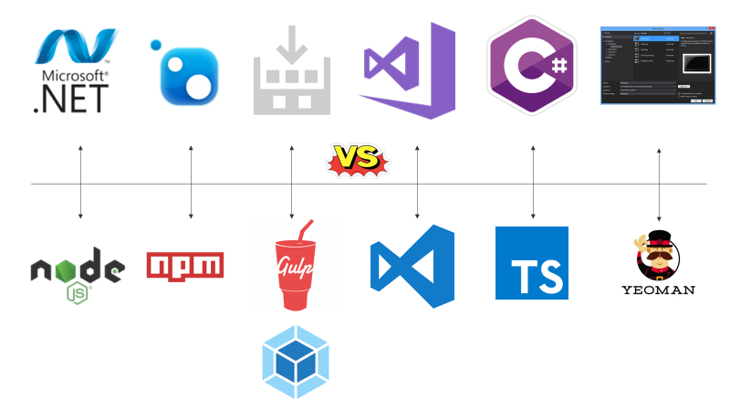
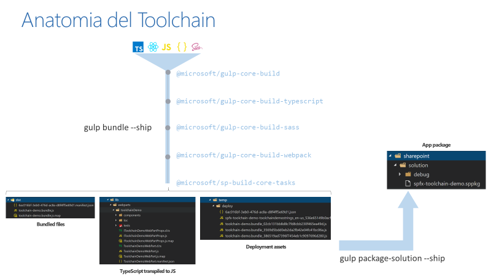
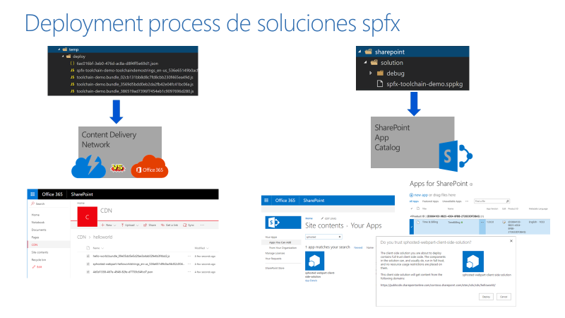
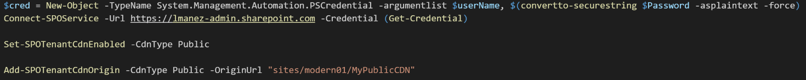

En el siguiente artículo hablaremos de la toolchain del nuevo SharePoint Framework, probablemente uno de los cambios más importantes que trae este nuevo modelo de desarrollo en SharePoint, sobre todo para aquellos desarrolladores “clásicos” sin experiencia en desarrollo “front-end”.

**Introducción a la Toolchain**

Pero ¿Qué es la toolchain? Podemos decir que la toolchain es el conjunto de paquetes, librerías y utilidades que nos permiten compilar nuestro código para el SPFx, y generar los archivos necesarios para desplegar la solución en SharePoint Online. Sin embargo, cuando hablamos de compilar y empaquetar, probablemente nos venga a la cabeza cosas como archivos binarios, dlls, paquetes WSP, Nuget, Visual Studio, etc. Pero esto forma parte de un modelo “antiguo”, y que no es utilizado por la toolchain. Cuando hablamos de compilar y empaquetar soluciones spfx, hablamos de tecnologías completamente diferentes:

·         **NodeJS**: seria la parte de código de servidor, e incluso un equivalente al IIS.

·         **Npm**: equivalente a nuget. Es un gestor de paquetes basado en NodeJS

·         **Gulp / Webpack**: sería el equivalente al MSBuild, y “compila” (transpila el código Typescript a JavaScript, minimiza el código en un único archivo, además de otras tareas)

·         **Typescript**: es el nuevo lenguaje de programación para el SPFx. Es una especia de JavaScript tipado.

·         **Visual Studio Code**: herramienta para escribir código. Ahora mismo tiene mejor soporte Typescript que el propio Visual Studio.

·         **Yeoman**: es una herramienta de “scafolding”. Existe una plantilla para el SPFx basada en Yeoman que crea toda la estructura necesaria para desarrollar una solución SPFx, incluyendo la configuración inicial de la toolchain.

**Anatomía del Toolchain**

La siguiente imagen describe la anatomía interna de la toolchain, así como el proceso que sucede cuando se compila una solución SPFx:

***gulp bundle --ship***

1.       Partimos de una serie de ficheros Typescript, JavaScript, JSON, Sass, etc, que definen funcionalidad y UI de nuestra solución.
2.       Dichos ficheros atraviesan una "pipeline" de proceso, donde son procesados por diferentes librerías del propio SPFx, que realizan determinadas tareas, por ejemplo, hacen el "transpile" del código Typescript a Javascript puro.
3.       Se crea una carpeta "lib" que contiene los ficheros "intermedios" de la solución: básicamente el JavaScript, archivos de mapping, definición de tipos, etc.
4.       Se crea una carpeta "dist", donde los archivos intermedios creados en "lib", se minimizan y se unifican en un "bundle". Esta carpeta es utilizada por el "workbench" local para servir los ficheros, y si la compilación se hace para desarrollo, los ficheros no se unifican, facilitando asi el proceso de debug en local.
5.       Se crea una carpeta "temp/deploy", que básicamente contiene lo mismo que el directorio "dist" cuando se compila para producción. La diferencia es que aquí se crea un bundle único por cada versión de WebPart, es decir, que, si hacemos cambios de código, y volvemos a compilar, obtenemos un bundle JS diferente, nombrado con un Guid nuevo.

Una vez compilado, si ejecutamos la tarea:

***gulp package-solution --ship***

1.       Se crea una carpeta "sharepoint/solution", donde en una sub-carpeta "debug", se generan todos los archivos necesarios para empaquetar la solución: manifiestos, definición de la "feature", etc.
2.       Se comprime el contenido de la carpeta "debug", creando así el paquete de la solución para desplegar en SharePoint (más adelante veremos el proceso de despliegue con más detalle).
 **Nota**: el paquete de la solución (.sppkg), no incluye los ficheros JavaScript compilados en el proceso anterior, solamente los referencia. Como veremos en breve, los ficheros .js compilados, se despliegan en un CDN.

**Proceso de despliegue de soluciones SPFx**

Una vez realizada la compilación, "bundle" y empaquetado de nuestra solución, estamos listos para desplegar en un SharePoint online. La siguiente imagen describe el proceso de despliegue:​

Primero, debemos desplegar los ficheros resultantes de la compilación y bundle, en un *Content Delivery Network* (CDN). Podemos utilizar cualquier proveedor de CDN, entre ellos, podemos usar el servicio CDN de Azure, y en este caso, además, la solución SPFx viene con una tarea de gulp pre-configurada para desplegar los archivos a un CDN de Azure.

Sin embargo, probablemente sea mejor opción configurar una biblioteca de documentos del propio SharePoint para que funcione como un CDN (esta característica está disponible desde hace un par de meses). Por un lado, estamos ahorrándonos el coste del servicio CDN de Azure, ya que un CDN de SharePoint Online es "gratuito" (incluido en el coste del tenant), y además, el CDN de SharePoint Online puede configurarse como privado, y admitir así solo las peticiones que vienen de nuestro SharePoint Online (evitando que cualquiera pueda descargar nuestro código).

Para configurar una biblioteca de documentos (o incluso una carpeta dentro de la biblioteca) como CDN, tenemos disponibles varios comandos PowerShell incluidos en el [SharePoint Online Management Shell](https://www.microsoft.com/es-es/download/details.aspx?id=35588). El siguiente snippet configuraría como CDN una biblioteca de SharePoint en la URL "*/sites/modern01/MyPublicCDN*". En este caso, estamos configurando el CDN como público, pero podría hacerse como privado, cambiando el valor al parámetro "*CdnType*".

Una vez configurado el CDN, simplemente tenemos que copiar los ficheros JS y manifest en la biblioteca de documentos.

Lo siguiente que tenemos que hacer es desplegar el paquete de nuestra solución (el archivo .sppkg). Este proceso es muy similar al despliegue de los Add-ins de SharePoint. Para ello, primero copiamos el archivo a la bilbioteca del "App Catalog" de nuestra tenant. Seguidamente, debemos hacer el Deploy de la App, aceptando el mensaje. Finalmente, incluimos la App en nuestro sitio de SharePoint donde queremos usar el WebPart desarrollado.

**Resumen**

El modelo de desarrollo basado en el nuevo SharePoint Framework (SPFx), es completamente distinto al modelo clásico. Este modelo está totalmente basado en cliente, así que tenemos que utilizar las herramientas que vienen usándose en el mundo "front-end" en los últimos tiempos. Parte de esas nuevas herramientas/frameworks es la Toolchain del SPFx, por lo que debemos conocer cómo funciona y como sacarle partido con tareas adicionales (algo que veremos en próximos números de la revista).

**Luis Mañez**

SharePoint / Cloud Solutions Architect en ClearPeople LTD
 @luismanez
 [http://geeks.ms/lmanez/](http://geeks.ms/lmanez/)

 
 
import LayoutNumber from '../../../components/layout-article'
export default LayoutNumber
