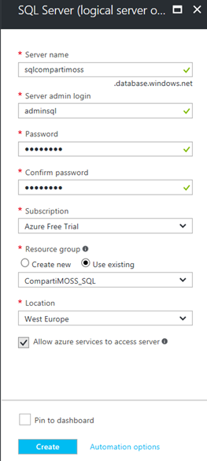
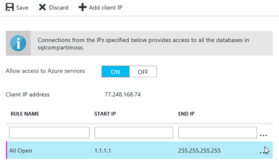
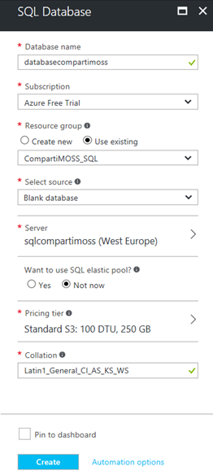
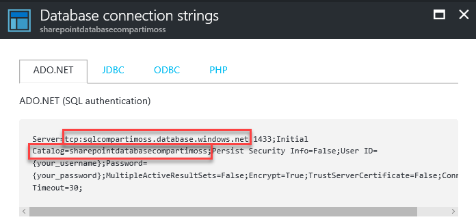
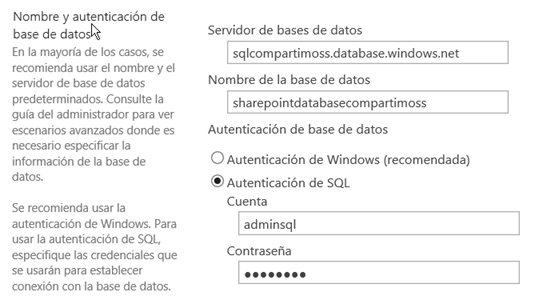
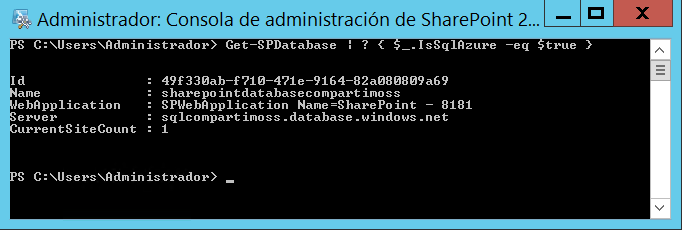

**Que es y cómo funciona SQL Azure**

Microsoft SQL Azure es una Base de Datos para desarrollo de aplicaciones manejadas en la nube, que se puede acceder como un servicio. Microsoft se encarga de mantener la escalabilidad, backup, parcheo, recuperación de desastres, protección de los datos y alta disponibilidad de la Base de Datos sin necesidad de que el usuario tome parte en el proceso. SQL Azure se instala como un micro-servicio en la infraestructura de Azure, lo que significa que las Bases de Datos no son exactamente iguales (aunque funcionalmente muy parecidas) a las que se instalan On-Premises, pero dentro de poco tiempo se podrá utilizar también un nuevo servicio de Azure llamado "Azure Managed Instances" que es mucho más compatible con SQL On-Premises.

**SQL Azure y SharePoint**

SharePoint On-Premises requiere la utilización de Microsoft SQL Server como su Base de Datos, ya sea que SharePoint esté instalado en una granja de servidores propia o en servidores virtualizados en Azure o cualquier otro sistema de máquinas virtuales en la nube.

El mantenimiento de un clúster de servidores de SQL Server es uno de los aspectos más costosos en lo que se refiere a la de operación de un sistema de SharePoint: no solo es necesario tener las licencias respectivas, sino también tener todo un esquema de parcheo, creación y mantenimiento de copias de respaldo y una estrategia de recuperación de desastres (normalmente mantener un segundo clúster en paralelo sincronizado con el de producción).

Si las Bases de Datos se pueden mantener en Azure, todos los costos no solo se reducen considerablemente, sino que se vuelven predecibles, es decir, es posible calcular cuánto va a costar la Base de Datos mensualmente, y no es necesario reservar presupuesto para resolver situaciones imprevistas.

Tener las Bases de Datos de SharePoint en SQL Azure es técnicamente posible, aunque Microsoft NO soporta su utilización por el momento. También es necesario tener en cuenta un par de puntos importantes:

·         Si la granja de SharePoint utiliza servidores virtualizados en máquinas virtuales de Azure, asegúrese que se está utilizando el mismo centro de datos tanto para la virtualización como para SQL Azure.

·         Si la granja de SharePoint esta On-Premises en sus propios servidores, asegúrese de utilizar el centro de datos de Azure geográficamente más cercano. En cualquier caso, en esta situación no es recomendable utilizar SQL Azure porque el tráfico entre SharePoint y SQL va a ser muy lento (por este motivo Microsoft no soporta esta configuración).

**Configuración de Azure y SharePoint**

1 - Cree un Grupo de Recursos de Azure:

·         Lóguese en el centro de Administración de Azure (http://portal.azure.com). Si no dispone de una cuenta, es posible crear una de prueba de 30 días desde el mismo sitio.

·         Desde la lista de Servicios en el menú del lado izquierdo seleccione Grupos de Recursos (Resource Groups).

·         Cree un Grupo de Recursos nuevo, especial para contener los recursos siguientes.

2 - Cree un Servidor de SQL

·         Después de que el Grupo de Recursos ha sido creado y aparece en la lista de los Grupos, haga clic sobre su nombre, lo que abre una segunda ventana al lado derecho de la interface del centro de Administración.

·         Utilice el botón de "+ Add" y en la casilla de búsqueda escriba "sql server" y seleccione "SQL server (logical server)".

·         Haga clic sobre el vínculo "SQL server (logical server)" que aparece en la lista.

·         En la nueva ventana utilice el botón de "Create".

·         Las casillas que aparecen con una estrella "\*" necesitan información obligatoria: configure un nombre para el servidor, uno para el administrador y su clave de acceso. Seleccione la Suscripción de Azure a utilizar, el Grupo de Recursos creado en el primer punto y la localización del servidor. Utilice el botón de "Create".

3 - Configuración del Firewall del Servidor de SQL:

·         Una vez creado el Servidor de SQL, refresque la ventana con la lista de recursos del Grupo de Recursos.

·         Haga clic sobre el nuevo Servidor creado y en la ventana de configuración del Servidor seleccione "Firewall".

·         En la ventana que aparece, cree una nueva regla indicando el nombre, el inicio de la dirección IP ("1.1.1.1") y el final de la dirección IP ("255.255.255.255"). Esto crea una regla que abre totalmente el servidor y permite acceso a sus Bases de Datos desde cualquier servidor en el mundo. En una situación de producción, se deben crear solamente reglas para las direcciones de IP de la granja de SharePoint, nunca una regla que permita un ataque indiscriminado desde el mundo exterior.

·         Guarde ("Save") los cambios realizados.

4 - Cree una Base de Datos:

·         Utilice de nuevo el botón de "+Add" y busque y seleccione esta vez por "sql database", haga clic sobre el vínculo respectivo y utilice el botón de "Create".

·         Entre los datos requeridos para el nombre de la Base de Datos, la suscripción a utilizar y el Grupo de Recursos. Seleccione "Blank database" en la casilla de "Select source" y el servidor creado en el punto 2 en la casilla de "Server". Cambie el "Pricing tier" al más apropiado teniendo en cuenta el tamaño y carga de la Base de Datos y en "Collation" utilice "Latin1\_General\_CI\_AS\_KS\_WS". Utilice el botón de "Create".

5 - Cadena de conexión de la Base de Datos:

·         Una vez creada la Base de Datos, haga clic sobre su vínculo en la lista de recursos del Grupo de Recursos.

·         En la ventana de propiedades de la Base de Datos haga clic sobre "Properties" y luego sobre "Show database connection strings".

·         Seleccione la pestaña de "ADO.NET" y copie las propiedades bajo "tcp" y "Catalog", es decir, el URL del Servidor de SQL y el nombre de la Base de Datos.

6 - Uso de la Base de Datos en SharePoint:

·         En el siguiente ejemplo se va a utilizar una granja de SharePoint 2016 On-Premises, pero las instrucciones se pueden utilizar para SharePoint 2010 y 2013, On-Premises o virtualizada, sin ningún cambio.

·         Abra la Administración Central de SharePoint y vaya a "Administración de aplicaciones" - "Administrar aplicaciones web" - "Nueva".

·         En la sección de "Nombre y autenticación de base de datos" utilice el URL del Servidor de SQL Azure, el nombre de la Base de Datos y la cuenta y clave del Servidor tal como se creó en el primer punto.

·         Cree la Aplicación Web.

·         Por medio de PowerShell para SharePoint se puede comprobar que se está usando una (o más de una) Base de Datos de Azure SQL. Utilice el comando:

Get-SPDatabase | ? \{ \$\_.IsSqlAzure -eq \$true \}

**Conclusión**

Crear las Bases de Datos de contenido de SharePoint Server en Azure SQL Database tiene sentido en cuanto a costos y facilidad de operación. Las mayores ventajas se obtienen si la granja de SharePoint Server esta virtualizada en máquinas virtuales de Azure mismo, funcionando en el mismo centro de datos que SQL Azure. Si la granja se encuentra On-Premises, y no existe un centro de datos de Azure relativamente cerca geográficamente, la latencia puede hacer que la comunicación entre SharePoint y sus Bases de Datos sea muy lenta. De todas formas, se puede pensar en utilizar a SQL Azure para hacer Aplicaciones Web (o Colecciones de Sitios) de archivo, que no necesitan gran rapidez de acceso, creando, de hecho, un sistema hibrido.

Hay que tener muy en cuenta que esta no es una opción de despliegue de SharePoint soportada oficialmente por Microsoft.

**Gustavo Velez**
 MVP Office Servers and Services
 gustavo@gavd.net

http://www.gavd.net

 
 
import LayoutNumber from '../../../components/layout-article'
export default LayoutNumber
