import ArticleHeader from '../../../components/article-header'

<ArticleHeader frontmatter={props.pageContext.frontmatter} />

Cuando Microsoft se planteó mejorar su servicio de Rights Management en la nube (Azure RMS o ARMS) con características de etiquetado, clasificación y monitorización, se dió cuenta que había una empresa israelí que ya lo había hecho: Secure Islands. Y además muy bien. Así que Microsoft decidió adquirir Secure Islands y de ahí nació AIP. Sin embargo, aunque AIP lleva tiempo en el mercado, sus características siguen evolucionando casi a diario.

Una de esas evoluciones tiene que ver con cómo se configura la protección. Hasta Abril de 2017 la protección y el etiquetado se configuraban por separado. En el portal clásico se definían las plantillas de RMS, y en el portal nuevo se creaban las etiquetas asociándolas a aquellas plantillas. Ahora podemos hacerlo todo en el portal nuevo, y ya Azure se encarga de crear las plantillas RMS que hagan falta.

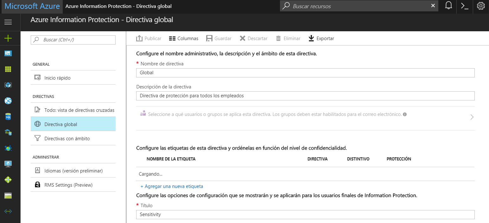

La integración total de ARMS en la consola de AIP es claramente un objetivo de Microsoft (de hecho, desde Julio 2017 se puede activar/desactivar el servicio RMS y gestionar plantillas en la consola de AIP), pero de momento funcionan por separado y las protecciones aplicadas a etiquetas en el nuevo portal están generando plantillas RMS en el portal clásico. Así que no es mala idea pasarse de vez en cuando por el portal clásico para poner un poco de orden y hacer limpieza o archivar directivas en desuso, sobre todo si queremos integrar AIP con IRM (ver apartado Integración con IRM on-premises y online).

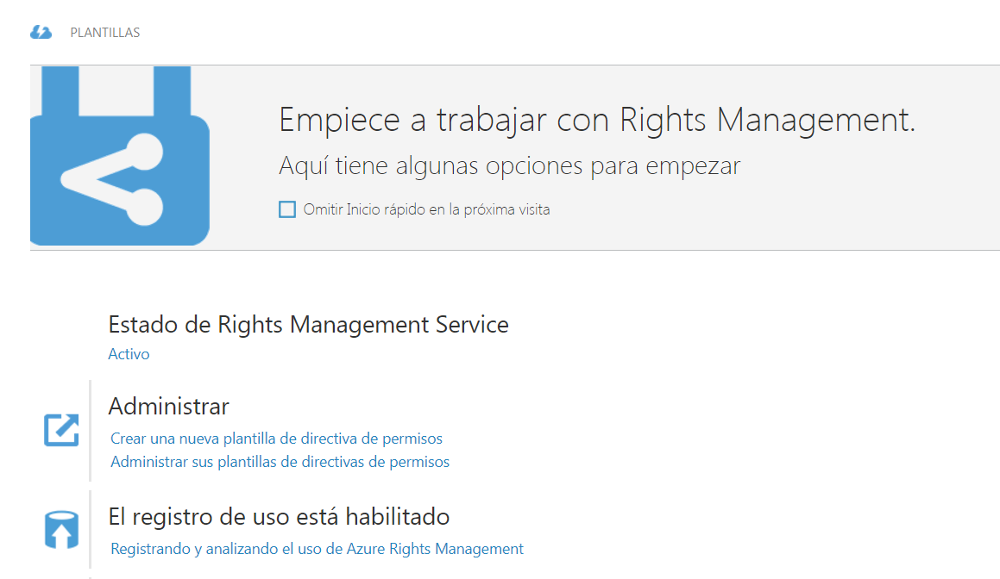

**Diferencias con Azure RMS**

La respuesta rápida es que ARMS es la capa de protección basada en Azure, y AIP agrega etiquetado y clasificación. Simple, ¿verdad? Pues no tanto…

Hay numerosos escenarios que pueden llevar a confusión. Por ejemplo, las etiquetas de AIP no funcionan en las app móviles de correo, pero sí las plantillas de ARMS si se las exporta por Powershell; en Office de escritorio se puede usar tanto AIP como las plantillas de ARMS; el módulo Powershell de administración utiliza comandos de RMS, pero el módulo de la app cliente es específico de AIP y desinstala el módulo anterior de cliente RMS; etc etc.

Donde hay que tener especial cuidado es en el licenciamiento. Si hacemos una búsqueda del precio del servicio, probablemente acabemos en esta página que distingue 3 planes:

[https://www.microsoft.com/es-es/cloud-platform/azure-information-protection-features](https&#58;//www.microsoft.com/es-es/cloud-platform/azure-information-protection-features)

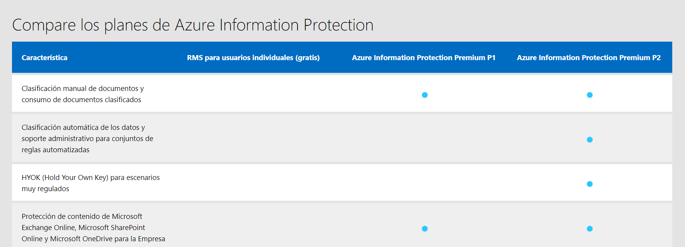

Aunque en una nota al pie aclara que “algunas suscripciones de Office 365 incluyen también protección de datos con Microsoft Azure RMS”.

Más acertada es la página en inglés, que incluye RMS for Office 365:

[https://www.microsoft.com/en-us/cloud-platform/azure-information-protection-features](https&#58;//www.microsoft.com/en-us/cloud-platform/azure-information-protection-features)

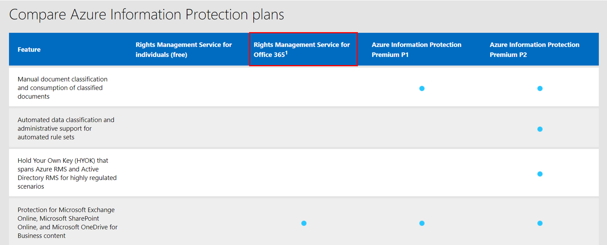

La realidad es que AIP sólo está disponible con licencia individual o como parte de EM+S. Con Office 365 sólo disponemos de la protección de ARMS, sin etiquetado ni clasificación.

En algunos tenants de Office 365 está habilitado AIP, pero el equipo de Microsoft está forzando el licenciamiento, de manera que sólo puedan usar la protección de ARMS.

Recordar, AIP está evolucionando día a día. Para no perder el norte, lo mejor es estar atento a las últimas novedades:

[https://blogs.technet.microsoft.com/enterprisemobility/?product=azure-information-protection](https&#58;//blogs.technet.microsoft.com/enterprisemobility/?product=azure-information-protection)

**Configuración**

**Activar el servicio**: el primer paso es activar la protección de Azure RMS, ya sea en la sección RMS settings de la consola AIP, en la sección Rights Management bajo Active Directory en el portal clásico, o en el siguiente enlace:

[https://docs.microsoft.com/es-es/information-protection/deploy-use/activate-service](https&#58;//docs.microsoft.com/es-es/information-protection/deploy-use/activate-service)

También tenemos la opción de hacerlo por Powershell que, como de costumbre, ofrece más alternativas. Por ejemplo, si estamos realizando una prueba o piloto, el cmdlet Set-AadrmOnboardingControlPolicy permite activar el servicio sólo para un grupo concreto del Directorio Activo.

**Configurar y publicar directivas**: la configuración en el portal de Azure es bastante intuitiva. La primera vez que accedemos se "crea" el servicio y nos lleva al Inicio rápido, con tutoriales y ayuda.

Cada directiva agrupa una serie de etiquetas dirigidas a grupos o usuarios concretos. La directiva Global viene configurada por defecto para todos los usuarios e incluye algunas etiquetas como Público, Confidencial, etc. Estas etiquetas por defecto vienen sin configurar, por lo cual podremos editarlas, asignarles protección RMS, agregarles subetiquetas, o directamente borrarlas. La directiva global será la base de todas las demás directivas, y por lo tanto visible para todos los usuarios que tengan activado el servicio.

Además, con las últimas actualizaciones del servicio, en la directiva Global tenemos la opción de convertir una plantilla de ARMS en etiqueta AIP, ¡con un solo clic!

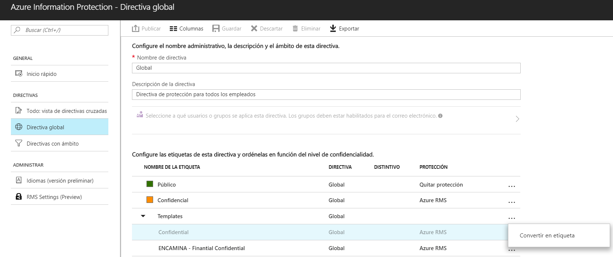

Las nuevas directivas se agregan sobre la base de la directiva Global. Por ello es conveniente editar las etiquetas de la directiva Global para que puedan aplicar a todos, y sobre esa base creamos las directivas con ámbito o departamentales.

En las nuevas directivas, a diferencia de la Global, podremos seleccionar a qué usuarios o grupos aplica. Las etiquetas que se agregan con la nueva directiva sólo serán visibles por esos usuarios o grupos.

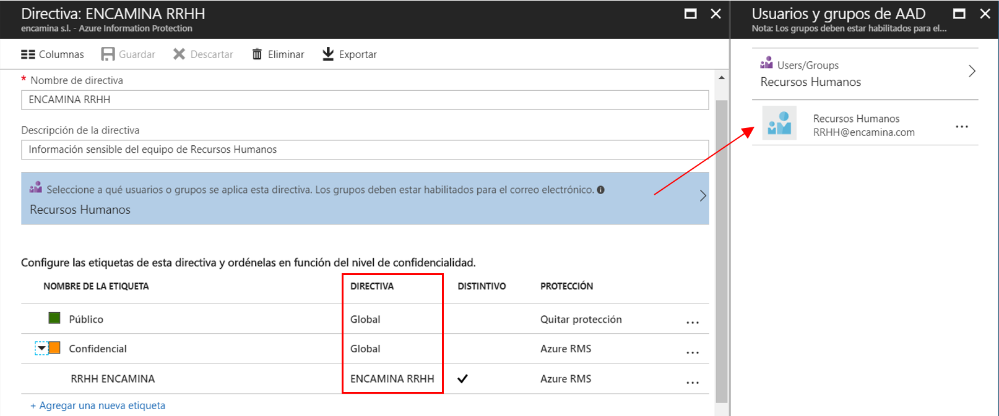

Para cada etiqueta se pueden configurar distintivos visuales como marcas de agua, encabezado, o pie de página.

Si disponemos del plan P2 de AIP (incluido también en EM+S E5) podremos configurar las condiciones para aplicar la etiqueta automáticamente. Por ejemplo, aplicar automáticamente la etiqueta Confidencial cuando se detecte un número de tarjeta de crédito.

Además de Guardar cambios, cada directiva debe publicarse para propagar los cambios a los usuarios.

**Protección**: en el apartado de permisos tenemos 3 opciones. "Sin configurar" se aplica para cancelar la protección de una etiqueta dada; para "Quitar protección" el usuario que seleccione la etiqueta debe tener los permisos necesarios en el servicio; "Proteger" utiliza ARMS para aplicar protección.

Para configurar la protección hay dos opciones: utilizar ARMS o HYOK.

HYOK (Hold Your Own Key), disponible para licencias P2 de AIP, significa que en lugar de usar el RMS y AD de Azure, se va a utilizar RMS local, Directorio Activo local, y las claves de RMS no se guardarán en Azure. Es importante subrayar que el servicio RMS no soporta hibridación, es decir que o bien utilizas ADRMS (local) o ARMS (nube), pero no los dos a la vez.

Lo normal, salvo casos especiales, es utilizar la protección de ARMS, que a su vez nos da 3 opciones:

·       No reenviar, para correos electrónicos.
·       Seleccionar una plantilla de Azure RMS (portal clásico).

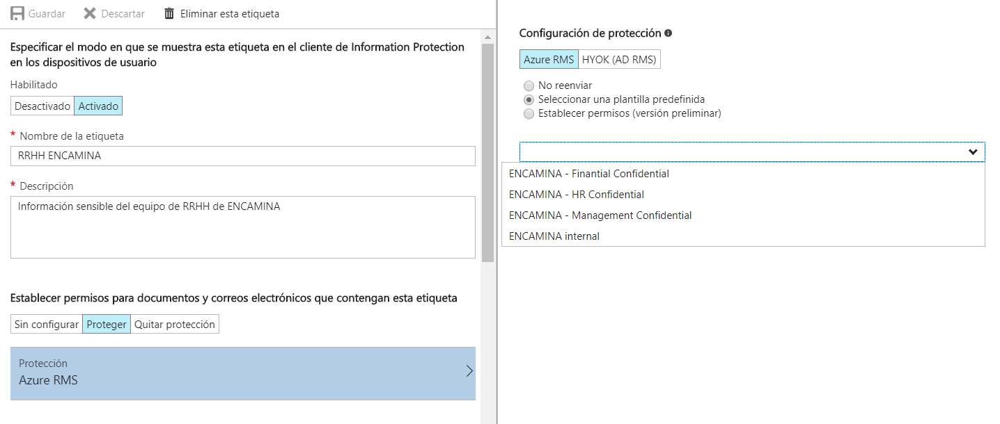

·     Establecer permisos directamente, que nos deja seleccionar usuarios o grupos de Azure AD, o también emails o dominios externos, y aplicarles el nivel de permisos deseado.

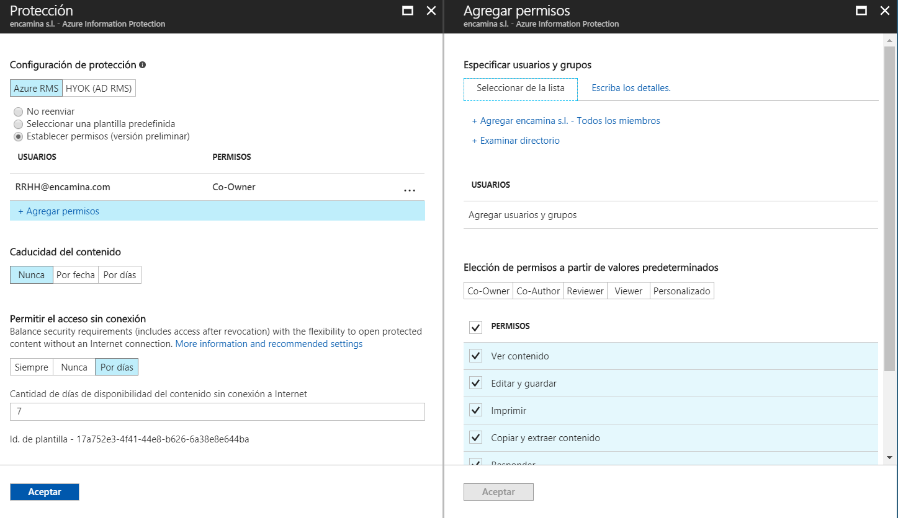

**Cuidado**: hay que diferenciar entre el ámbito de la directiva (quién puede aplicar las etiquetas) y los permisos configurados en la protección (quién podrá ver el contenido protegido). Se podría dar el caso que después de proteger, el usuario ya no tenga acceso al contenido.

**Guía del usuario**

**Instalación**: Para poder utilizar el etiquetado y la protección de Azure Information Protection, es necesario instalar una aplicación cliente en cada dispositivo donde queramos utilizar AIP:

[https://portal.azurerms.com/#/download](https&#58;//portal.azurerms.com/#/download)

**Clasificación y protección**: La protección de AIP se puede aplicar en Office (Word, Excel, PowerPoint, Outlook), correos electrónicos, o directamente sobre ficheros o carpetas en el explorador de archivos.

En el caso de Android o iOS, la aplicación sólo permite visualizar documentos protegidos, pero no proteger.

**Office**: Una vez instalado el cliente de AIP, se debe reiniciar Office para acceder a las etiquetas.

Veremos una barra con las etiquetas disponibles y un nuevo botón en el Ribbon.
  
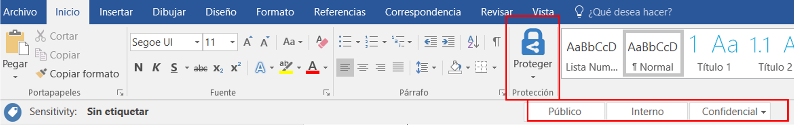

Al aplicar una etiqueta la sensibilidad del documento cambia. Si tenemos permisos para ello, podremos cambiar o eliminar la etiqueta aplicada.

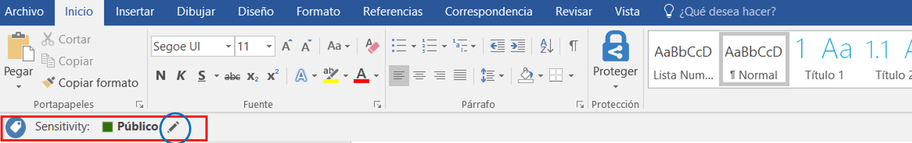

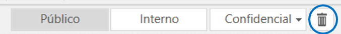

El botón del Ribbon contiene un desplegable con cuatro opciones.

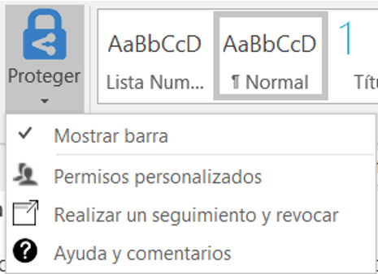

La primera opción oculta la barra de etiquetas; la última permite obtener ayuda. Las otras dos ofrecen la siguiente funcionalidad:

·       **Permisos personalizados**: para aplicar nuestros propios permisos al documento; podemos seleccionar el tipo de permisos, incluir las direcciones de correo de usuarios o grupos a los que voy a dar permisos, y opcionalmente una fecha de expiración de los permisos. Si damos permisos a usuarios externos o que aún no han instalado el cliente AIP, al intentar abrir los redirigirá a una [web para activar AIP](https&#58;//aka.ms/rms-signup).

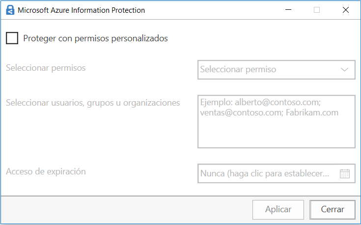

·       **Realizar seguimiento y revocar**: abre una web de seguimiento del documento, donde podemos ver cuántas veces ha sido abierto, cuántas se ha denegado el acceso, desde dónde se ha accedido, …

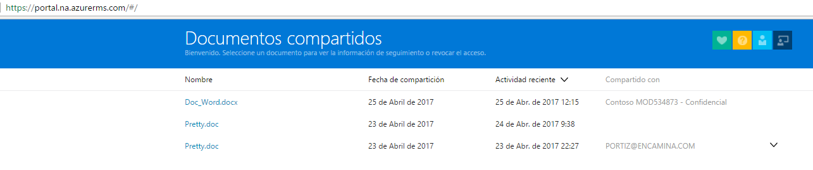

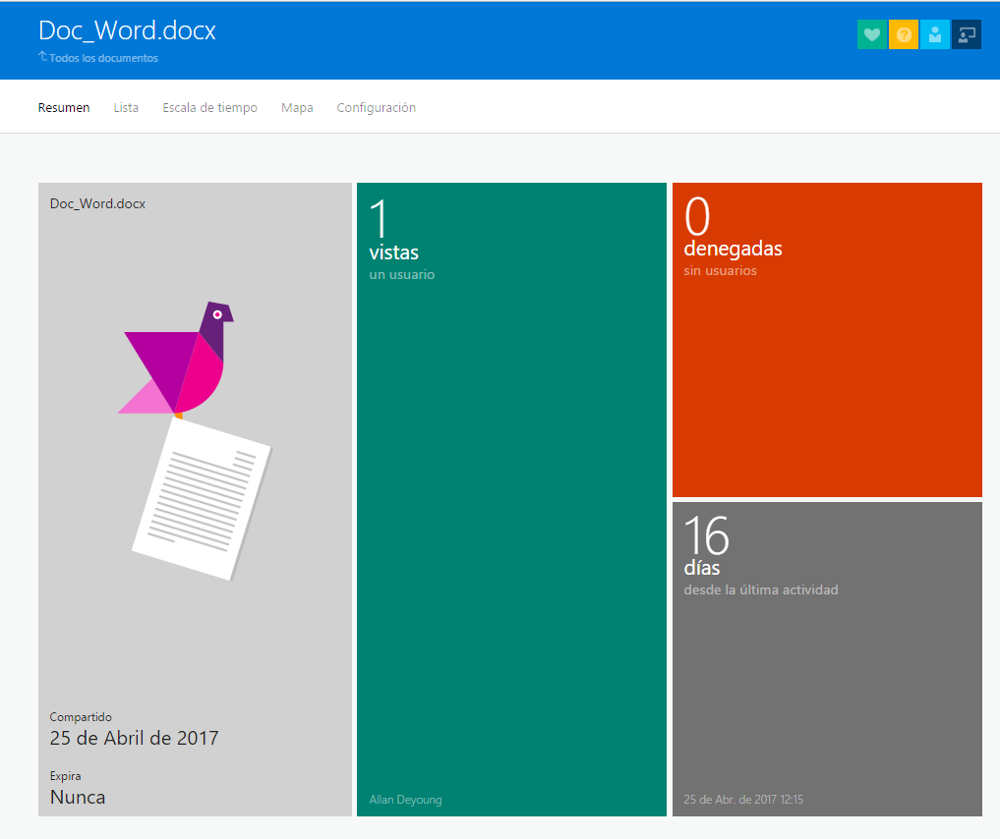

… quién lo ha visto…

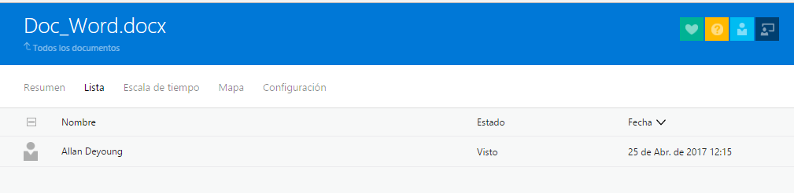

… cuándo y desde dónde:

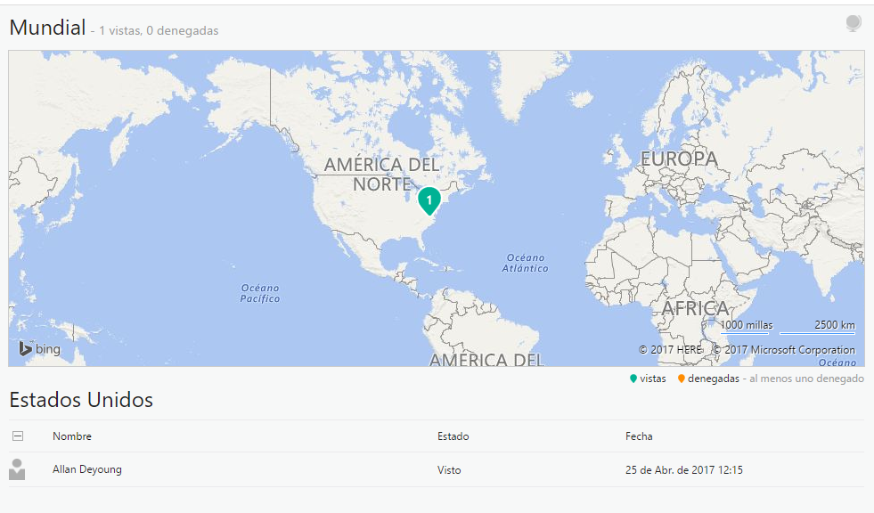

**Correo electrónico**: Podemos etiquetar un correo electrónico de la misma manera que lo hacemos con un documento. Además, podemos impedir que el correo electrónico sea reenviado:

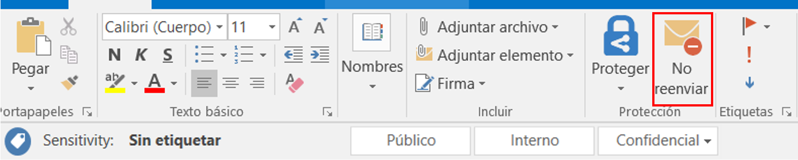

**Cuidado**: a pesar de haber instalado el cliente de AIP, en cualquier aplicación de Office seguiremos teniendo la opción de protección en el menú Archivo. Pero no es lo mismo. Lo que veremos en el menú Archivo, además de cifrar y restringir edición, son las plantillas de protección de ARMS, es decir protección sin etiquetado.

Si usamos AIP y no hay un motivo que lo justifique, evitaremos la opción de protección en el menú Archivo.

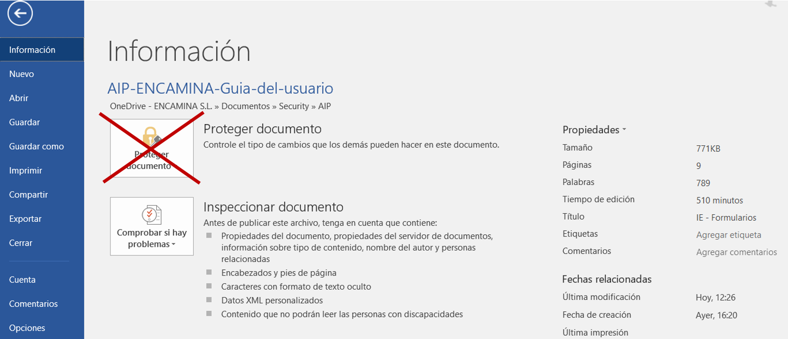

**Explorador de archivos**: Con el explorador de archivos podemos proteger rápidamente uno o varios documentos y carpetas. Seleccionamos todos los archivos y carpetas a proteger -&gt; botón derecho -&gt; Clasificar y proteger

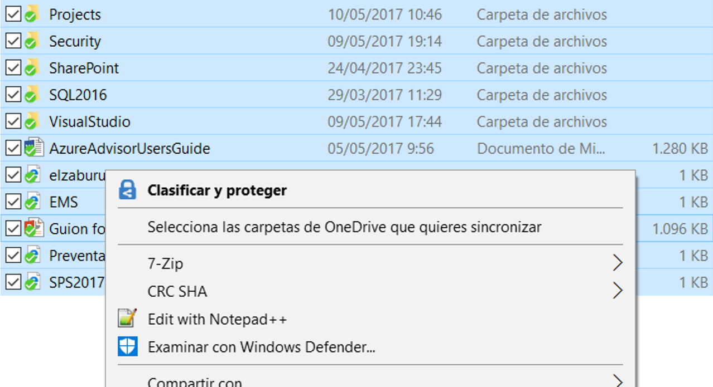

Las opciones son las mismas que hemos visto para Office, pero aplicadas a toda la selección:

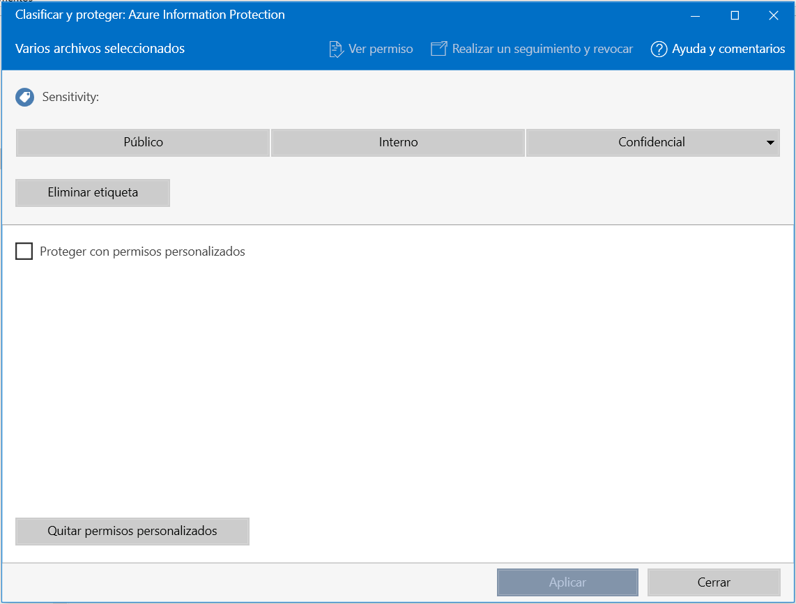

Además, podemos hacerlo sobre carpetas o archivos sincronizados de OneDrive o SharePoint.

**Cuidado**: las bibliotecas de SharePoint con IRM habilitado se llevan mal con los documentos protegidos con AIP. Dichas bibliotecas aplican protección RMS sobre los archivos descargados, pero no están preparadas para leer la protección AIP, de ahí el conflicto.

Los archivos no-Office cambian su extensión al ser protegidos:

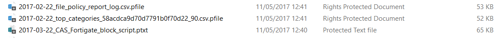

**Visualización**: Para visualizar archivos no-Office protegidos con AIP se utiliza la aplicación "Visor de AIP"

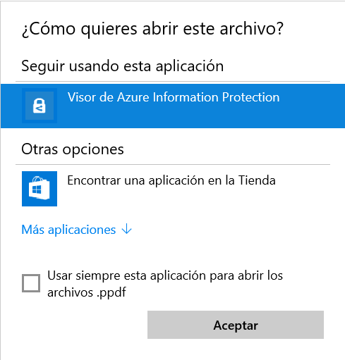

Por ejemplo, al hacer doble clic en un pdf protegido, lo abre directamente en el visor.

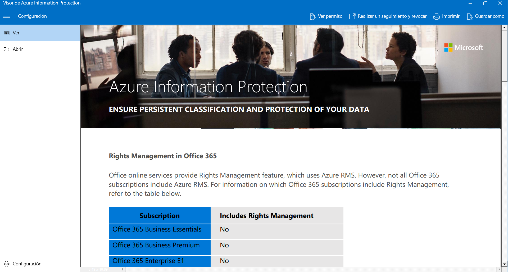

**Diferencia con etiquetas de retención**

Como hemos visto, las etiquetas de AIP se utilizan para aplicar una clasificación de sensibilidad a los documentos y correos electrónicos, y de esta manera protegerlos mediante Azure RMS. Esa clasificación se almacena en el propio documento como una propiedad de texto plano, y se define en el servicio de Azure RMS junto con los permisos y el alcance de la protección.

Las etiquetas de AIP se pueden aplicar de forma manual, automática, o también pueden ser recomendadas a los usuarios, basándose en el contenido del documento o correo.

La etiqueta, que está en texto plano, puede ser leída por otros servicios para realizar acciones basadas en la sensibilidad. Por ejemplo, podemos configurar directivas DLP en AIP para evitar que se compartan fuera de la organización documentos etiquetados como "Interno". O encriptar los correos electrónicos marcados como "Confidencial". O monitorizar documentos con etiquetas AIP en Cloud App Security. Cualquier servicio que pueda leer las etiquetas, puede actuar en consecuencia.

Las etiquetas de retención se definen en el Centro de Seguridad y Cumplimiento de Office 365 y se utilizan para aplicar políticas de retención a correos de Exchange y documentos de SharePoint y OneDrive. Se puede definir el tiempo que el correo o el documento debe retenerse, o el tiempo después del cual debe borrarse. Además, las retenciones se pueden aplicar a partir de la fecha de creación, de última modificación, o a partir de la fecha de aplicación de la etiqueta.

También se puede declarar un documento como "Registro" para impedir que sea editado o borrado.

Las etiquetas pueden aplicarse automáticamente según las condiciones establecidas en el Centro de Seguridad y Cumplimiento, y los usuarios también pueden aplicar estas etiquetas directamente en las aplicaciones Office, así como en SharePoint o OneDrive.

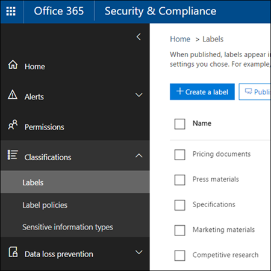

**En síntesis:**

Las etiquetas de AIP tienen que ver con la protección, y se aplican a cualquier correo o documento.

Las etiquetas de retención tienen que ver con el cumplimiento, y se aplican a correos o documentos en una ubicación determinada.

Veamos un ejemplo. El departamento comercial cuenta con tres tipos de documentos: Presupuestos, Contratos, y Hojas de producto

Utilizando AIP podríamos crear una etiqueta "Confidencial" que impida editar y compartir externamente.

Desde el punto de vista del cumplimiento, los tres tipos de documentos pueden requerir una retención diferente, a pesar de tener la misma sensibilidad:

·       Presupuestos: retención de 5 años después de la fecha límite del presupuesto.
·       Contratos: retención de 10 años después de la fecha de finalización del contrato.
·       Hojas de producto: declarado como registro (no borrar).

Las etiquetas de retención se crearían en el Centro de Seguridad y Cumplimiento, y se publicarían a la ubicación de cada tipo de documento en SharePoint o OneDrive.

**Administración avanzada con Powershell**

Para arrancar el servicio y crear algunas etiquetas no necesitamos Powershell. Pero si queremos aventurarnos más allá, la línea de comandos esconde algunos tesoros.

Lo primero será instalar el módulo de Azure Rights Management para Powershell (AADRM):

[https://docs.microsoft.com/es-es/information-protection/deploy-use/install-powershell](https&#58;//docs.microsoft.com/es-es/information-protection/deploy-use/install-powershell)

Con un simple  Get-Command -Module AADRM  veremos todos los comandos disponibles. Entre los más interesantes encontramos:

Set-AadrmDoNotTrackUserGroup  define usuarios a los cuales excluir del tracking, por ejemplo por razones de privacidad. El parámetro que necesita es un email de grupo de AD. Otros verbos que soporta son Get, que devuelve el grupo establecido, y Clear, que deshace la configuración. Si volvemos a ejecutar Set-AadrmDoNotTrackUserGroup  los valores se sobreescriben. Es decir, se puede definir un solo grupo. Lo bueno es que ese grupo puede contener grupos anidados.

Disable-AadrmDocumentTrackingFeature  deshabilita el seguimiento para todos los usuarios de la organización. No se puede deshabilitar sólo para algunos. El verbo Enable lo vuelve a activar, que es como está por defecto.

Con  Add-AadrmRoleBasedAdministrator  podemos delegar las tareas administrativas en usuarios o grupos.

Add-AadrmSuperUser  agrega un "super user" o, lo que es lo mismo, asigna a un usuario permisos de "owner" sobre todo el contenido protegido por ARMS de la organización. Es decir que este usuario podrá editar o quitar la protección a cualquier contenido protegido. Esto es especialmente útil para temas legales o de auditoría, para desproteger archivos cuyo propietario ha dejado la organización, etc. Se debe activar la característica antes de poder utilizarla, con  Enable-AadrmSuperUser , pues por defecto no hay ningún super user, ni siquiera el administrador global. Entre los comandos que puede utilizar el "super user" encontramos  Protect-RMSFile  y  Unprotect-RMSFile  para proteger y desproteger archivos, y  Set-AIPFileLabel  para cambiar la etiqueta actual.

[https://docs.microsoft.com/es-es/information-protection/deploy-use/configure-super-users](https&#58;//docs.microsoft.com/es-es/information-protection/deploy-use/configure-super-users)

**Integración con IRM**

Como comentábamos al comienzo de este artículo, es importante mantener el orden de las plantillas de Azure RMS que se van generando con el uso de AIP. Ahora veremos por qué.

**On-premises**: es posible utilizar Azure RMS para la protección IRM en servidores locales (Exchange, SharePoint, File Server), en lugar de utilizar un servidor de AD RMS. Para ello debemos sincronizar el Directorio Activo local con Azure AD a través de AD Connect e instalar un conector RMS en un servidor Windows local.

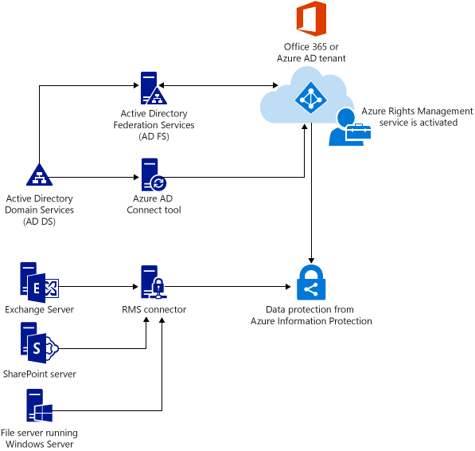

Para más información sobre el despliegue del conector:

[https://docs.microsoft.com/es-es/information-protection/deploy-use/deploy-rms-connector](https&#58;//docs.microsoft.com/es-es/information-protection/deploy-use/deploy-rms-connector)

**Exchange Online**: en el caso de Exchange online tendremos que exportar las plantillas de ARMS e importarlas a Exchange online para poder utilizarlas con IRM. Con unas cuantas líneas de Powershell estará hecho:

$UserCredential = Get-Credential
$Session = New-PSSession -ConfigurationName Microsoft.Exchange -ConnectionUri https://outlook.office365.com/powershell-liveid/ -Credential $UserCredential -Authentication Basic -AllowRedirection
Import-PSSession $Session
$domain = (Get-RMSTrustedPublishingDomain).Name
Import-RMSTrustedPublishingDomain -Name $domain -RefreshTemplates -RMSOnline

Para verificar que se han importado correctamente:

Get-RMSTemplate -TrustedPublishingDomain $domain -Type All | fl -Property name, description, type 
[https://docs.microsoft.com/es-es/information-protection/deploy-use/refresh-templates#exchange-online-only-how-to-configure-exchange-to-download-changed-custom-templates](https&#58;//docs.microsoft.com/es-es/information-protection/deploy-use/refresh-templates#exchange-online-only-how-to-configure-exchange-to-download-changed-custom-templates)

**OWA y aplicaciones móviles de correo**: como hemos visto, de momento las etiquetas de AIP quedan al margen de la integración entre ARMS e IRM. En consecuencia, las aplicaciones móviles y Outlook online no cuentan con las etiquetas de AIP, pero sí podemos aplicar la protección de las plantillas ARMS, si las hemos importado correctamente.

Por todo ello es importante mantener el orden de las plantillas ARMS. Si tengo una etiqueta AIP que utiliza protección por plantilla ARMS y decido cambiar y asignar los permisos directamente en la consola AIP, la plantilla no se borra sino que se genera una nueva. Tendremos que ir al portal clásico y hacer orden.

**Azure Information Protection y la GDPR**

El 25 de mayo de 2018 entrará en vigor una ley europea de privacidad y protección de datos que requerirá grandes cambios, y posiblemente grandes inversiones por parte de organizaciones de todo el mundo.

[http://eur-lex.europa.eu/legal-content/ES/TXT/PDF/?uri=CELEX:32016R0679&from=ES](http&#58;//eur-lex.europa.eu/legal-content/ES/TXT/PDF/?uri=CELEX&#58;32016R0679&amp;from=ES)

Esta ley, conocida como [Reglamento General de Protección de Datos (GDPR por sus siglas en inglés)](http&#58;//ec.europa.eu/justice/data-protection/reform/index_en.htm), impone nuevas condiciones a empresas, organismos gubernamentales, y organizaciones de todo tipo que ofrezcan bienes y servicios en la Unión Europea (UE), o que recojan y traten datos vinculados a residentes de la UE, con independencia de su ubicación.

La ley prevé cuatro áreas que las empresas deberán cubrir en relación a los datos personales:

·       Detección.
·       Administración.
·       Protección.
·       Informes.

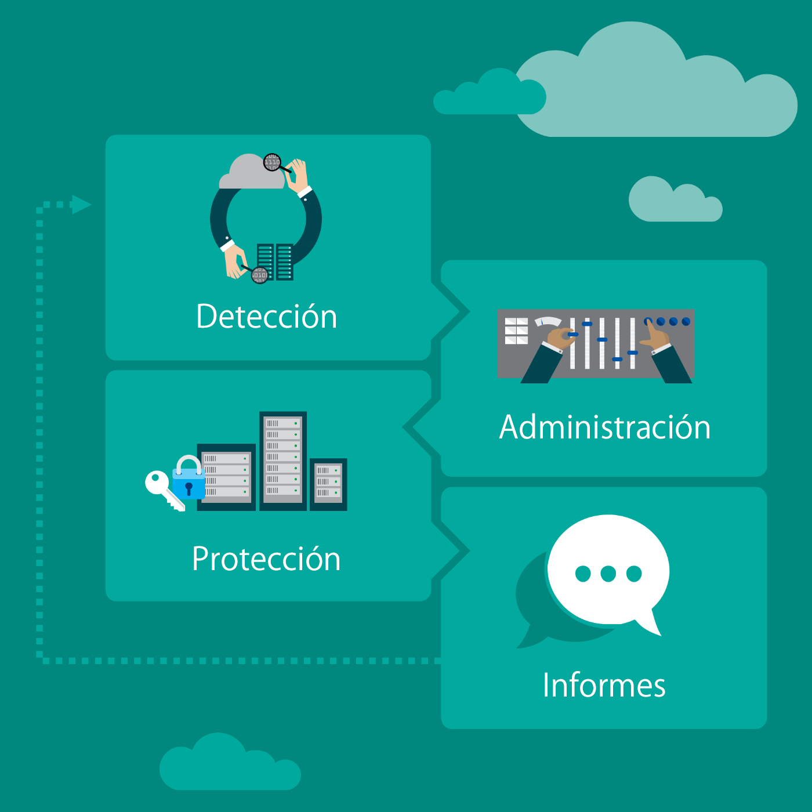

Las características de AIP ayudan al cumplimiento, no sólo en cuanto a protección se refiere. La aplicación automática de etiquetas según el contenido garantiza la detección. Y las características de tracking y monitorización pueden ayudar a generar los informes necesarios. Por mencionar algunas ventajas.

Además, la integración de AIP en otras herramientas de seguridad aumenta el nivel de protección y previene la pérdida de datos. Por ejemplo, Cloud App Security, la solución de seguridad cloud que monitoriza la actividad online de usuarios y datos empresariales, integra las etiquetas de AIP y puede enviar alertas de actividades sospechosas, o incluso cerrar la sesión de un usuario automáticamente si se registran actividades no autorizadas sobre datos protegidos.

Para cumplir con la normativa hace falta mucho más que una herramienta, pero AIP puede jugar un papel fundamental en ese cumplimiento.

**Bonus: etiquetas en Sharepoint**

**Bibliotecas**: En SharePoint, para poder ver la etiqueta de un documento tendríamos que descargarlo. ¿Y si pudiéramos ver todos los documentos de una Biblioteca junto con su etiqueta? Y poder filtrar. Y crear vistas basadas en el valor de la etiqueta. Y ordenar…

Con las últimas actualizaciones de AIP, la integración de las etiquetas con las columnas de SharePoint es realmente fácil. Esta integración no es oficial (Microsoft está trabajando en una solución definitiva) pero de momento podemos seguir unos cuantos pasos para mostrar nuestras etiquetas de AIP en las bibliotecas de SharePoint.

Paso 1

En el portal de Azure, vamos a la directiva Global de AIP, y tomamos nota del Título. El valor por defecto es "Sensitivity".

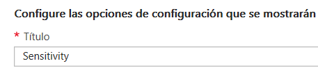

Además, este es el nombre de la propiedad del documento que almacena la clasificación. Y lo más importante, es el mismo nombre que debemos usar para la columna de SharePoint. Si quieres usar un nombre diferente, este es el momento de cambiarlo, en el Título de la directiva Global.

En cuanto cerramos un documento protegido, las propiedades se actualizan con una nueva pestaña, Personalizado, donde se pueden ver las propiedades de AIP.

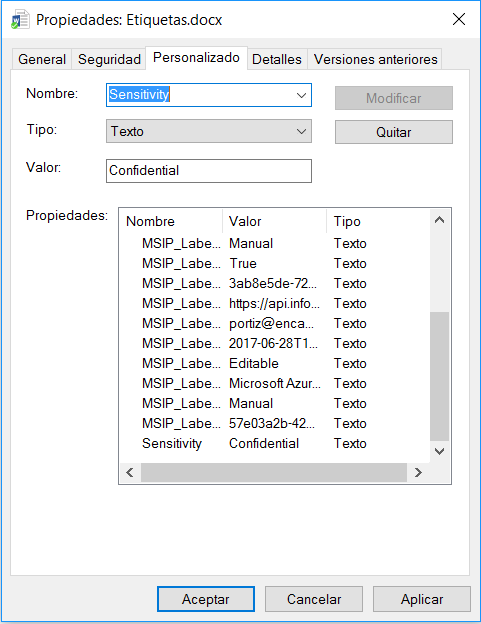

Paso 2

En la directiva Global hacemos clic en los tres puntos y seleccionamos “Configuración avanzada”.

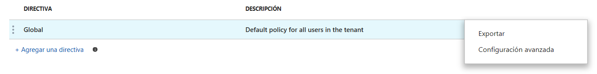

Ingresamos la siguiente propiedad:

·         Nombre: SyncPropertyName.

·         Valor: Sensitivity.

Aquí el valor debe ser el mismo que el Título del Paso 1, y de la columna SharePoint que vamos a crear.

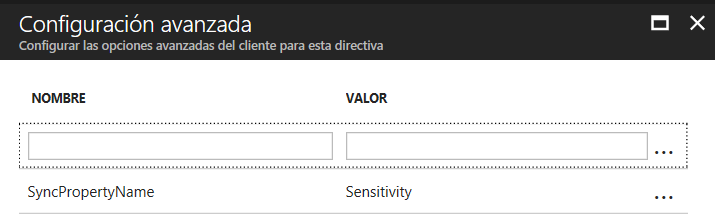

Paso 3

En la Biblioteca de SharePoint, creamos una columna de texto (una línea de texto) y le ponemos el mismo nombre del Título de la directiva Global. En nuestro caso, Sensitivity.

Ahora cada vez que se suba un documento con etiqueta AIP, veremos su valor en la columna Sensitivity.

Si queremos evitar la edición de esta columna, al momento de crearla quitamos el check de actualizar tipos de contenido y también el de agregar a vista. Luego creamos una columna calculada que muestre el valor de Sensitivity.

**Cuidado:**la integración sólo funciona al cargar documentos. Si guardamos en la Biblioteca desde Word (o cualquier aplicación Office) directamente, no funciona. O sea, aplicamos etiqueta, guardamos en local y cerramos documento (importante cerrar para que se actualice la etiqueta), y subimos a SharePoint.

**Búsqueda**: en cuanto subimos a una biblioteca de SharePoint el primer archivo protegido por AIP, ya tenemos una nueva propiedad rastreada en el esquema de búsqueda: Sensitivity.

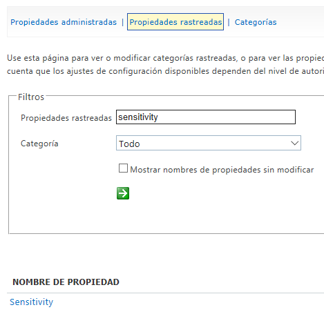

Si mapeamos esa propiedad rastreada a una propiedad administrada, podemos integrar las etiquetas de AIP en las búsquedas de SharePoint. Por ejemplo, si mapeamos a uno de los RefinableString, luego podemos editar o crear un nuevo WebPart de refinadores para filtrar los resultados de búsqueda por etiqueta de AIP.

**Conclusión**

Microsoft está apostando fuerte por la seguridad, con inversiones anuales de 1000 millones de dólares. En esa apuesta, AIP juega un papel fundamental, más allá de la protección de documentos. El servicio de Azure RMS junto al etiquetado y la categorización conforman una solución integral para securizar los datos empresariales estén donde estén. Si a eso le agregamos la facilidad de integración con otras soluciones y herramientas, queda claro el gran poder que conllevan estas etiquetas.

**Pablo Ortiz Baiardo**
 Cloud Solutions Specialist
 ortiz.pablo@gmail.com
 @portiz2017

http://blogs.encamina.com/por-una-nube-sostenible/ 
https://www.linkedin.com/in/cloudadvisor

