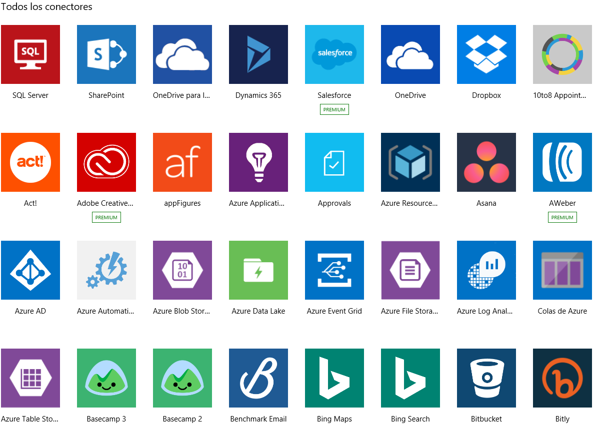
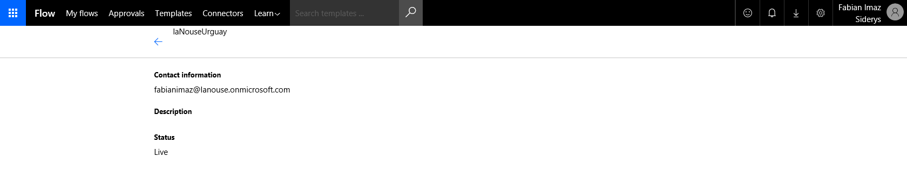
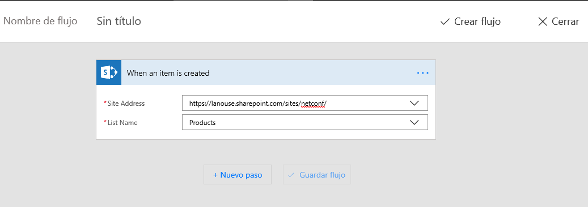
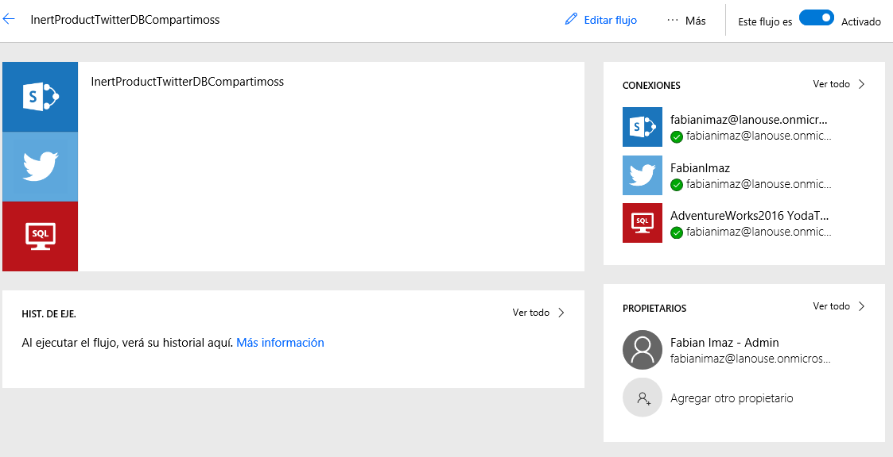
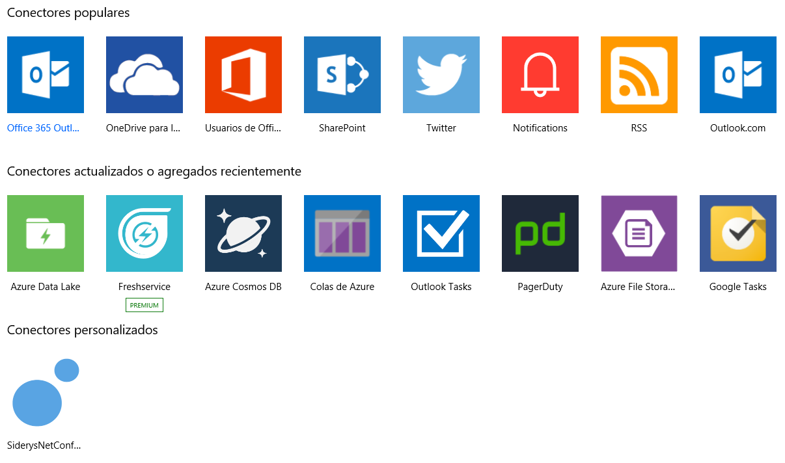
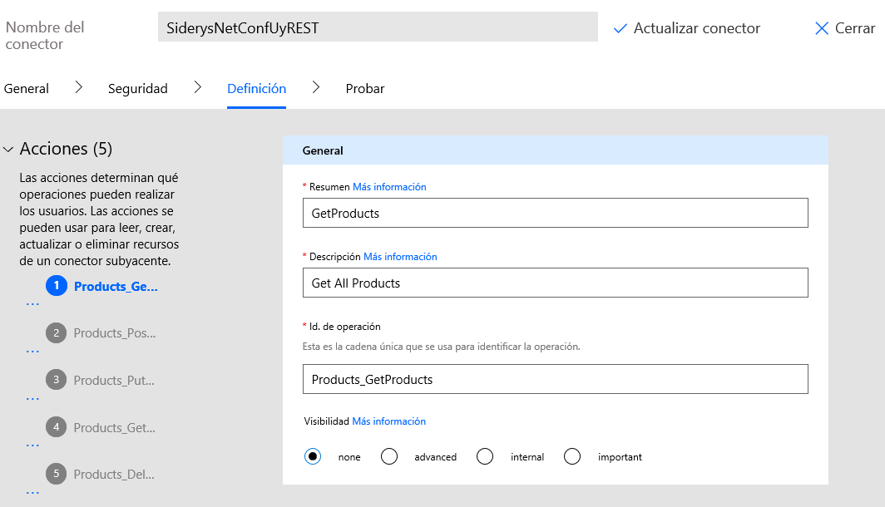
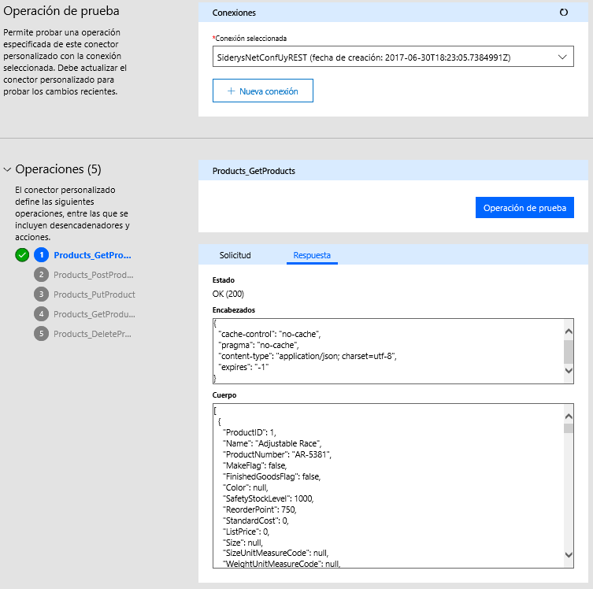
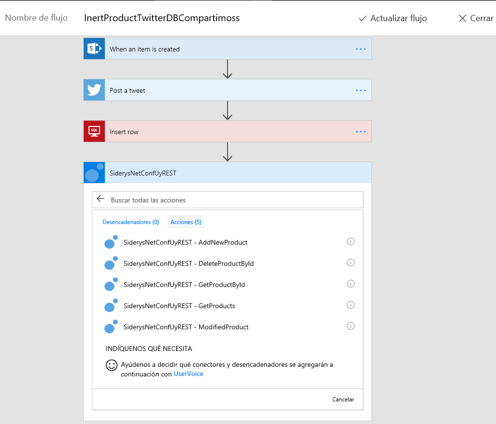

import ArticleHeader from '../../../components/article-header'

<ArticleHeader frontmatter={props.pageContext.frontmatter} />

Las nuevas funcionalidades y características que Microsoft a liberado en Office 365 en los últimos tiempos ha sido constante. A mediados del año pasado se empezó a probar las primeras versiones de Microsoft Flow y PowerApps, dos características que le permiten a un usuario de negocio poder crear soluciones inteligentes para captar datos y asociarles procesos de negocio a cada aplicación.

Estas dos características han crecido rápidamente y en cuestión de meses se vio como se le fueron agregando características a cada un a ellas. En este artículo se verá cómo se puede conectar Microsoft Flow, [https://flow.microsoft.com/](https&#58;//flow.microsoft.com/) con datos almacenados en la tierra, la idea es describir la capacidad que se tienen en esta herramienta en la nube para consumir datos y servicios que se encuentran almacenados en centros de datos corporativos, esto a través de los conectores y el servicio de pasarela de Office 365.
  Desde sus primeras versiones la herramienta permitía utilizar conectores, un conectar es un puente entre el servicio de Microsoft Flow y un conjunto de operaciones REST alojados en cualquier servidor web. 

La segunda opción disponible es el uso de una pasarela, la cual conlleva a la instalación de un cliente dentro del centro de datos corporativo, en un servidor con salida a internet y que a su vez pueda comunicarse con los servidores que se quieren exponer a en la nube. Esta pasarela actúa como un servicio que mantiene la comunicación activa y permite que los datos sean extraídos para ser utilizados por nuestros flujos. ​

Cualesquiera de estas dos características se pueden utilizar directamente en cualquier flujo que se diseñe. En tal sentido lo que se debe hacer es crear un nuevo flujo, como se describe a continuación y utilizar un conector o la pasarela:

1)        Acceda la sección “Mis Flujos” que se encuentra en el menú superior.

2)        Seleccione la opción “Crear un flujo a partir de un documento en blanco”.

3)        La primera actividad de cualquier flujo debe ser un “desencadenador”, es decir un evento que llame al flujo, en este ejemplo vamos a usar un el desencadenador de para SharePoint “Cuando se cree un elemento en una lista”. Introduzca la URL al sitio donde está la lista y por último el nombre de la lista que se desea escuchar para disparar el flujo.

1)        Seleccione la opción “Nuevo Paso” y después seleccione la opción “Agregar una acción”.

2)        En el cuadro te texto de búsqueda escriba Twitter, seleccione el conector correspondiente a la red social y por último seleccione la opción “Post a tweet”. La idea es que cada vez que se dé de alta un elemento en la lista, se publique una entrada en Twitter.

3)        Configure el cuerpo del mensaje, seleccionando lo campos del elemento de la lista que se creó.

4)        Seleccione la opción “Nuevo Paso” y después seleccione la opción “Agregar una acción”

5)        En cuadro de texto de búsqueda escriba “SQL” y por último la opción “Insert Row”. La idea es que se inserte un registro en la base de datos, después de creado el elemento en la lista y publicado en Twitter. En este punto se debe contar con una pasarela configurada y activa, dado que la base de datos se encuentra en un data center ubicado en Uruguay en este caso.

6)        Configure cada campo de la tabla seleccionada con los datos del elemento creado o de forma manual para que el registro en la base de datos se ejecute correctamente.

7)        En la parte superior del diseñador, en el campo título introduzca un nombre para el flujo y después seleccione la opción “Crear Flujo” para guardar el mismo.

Al terminar el proceso el flujo queda correctamente guardado y funcionando. La herramienta provee un panel de ejecución que muestra el estado del proceso y los componentes que estamos usando en el mismo, en este caso un conector con Twitter y una pasarle para consumir una instancia de SQL Server en un data center en Uruguay.

La versatilidad de la herramienta todavía brinda una opción más que permite registrar un conector personalizado y utilizarlo en cualquier flujo. La idea es que podamos exponer una serie de servicios o reglas de negocios corporativas a través de REST y que estas sean consumidas desde Office 365.

Como se puede ver en la imagen anterior, este entorno de Microsoft Flow cuenta con un conector personalizo el cual expone una serie de operaciones a través de un servicio REST hospedado en un servidor web expuesto a Internet. Para registrar un conector personalizado se necesita con una descripción completa del mismo, este debe ser generado con el formato OpentApi 2.0, o mejor conocido como Swagger. En este artículo no se describirá como generar el servicio REST y el archivo descriptivo, esto será cubierto en los próximos artículos. Con el archivo generado, se debe acceder a la opción de “Configuración” a través del icono del engranaje en el menú superior y después se debe seleccionar la opción “Conectores personalizados”.

1)        En la parte superior seleccione “Crear conector personalizado”.

2)        En la primera sección cargue el archivo correspondiente o introduzca la URL de donde se encuentra el mismo.

3)        En la sección “Información General” se describa el servicio, validé los datos cargaos automáticamente y cuando termine seleccione el botón “Continuar”.

4)        En el siguiente paso, correspondiente a la sección de seguridad, configure la misma según la especificación que el servicio que está cargando utilice, puede ser un servicio público y no requerir autenticación alguna. Seleccione la opción “Continuar” cuando termine.

5)        En la sección “Acciones” se debe describir cada operación que está definida en el archivo cargado y por último seleccione la opción “Crear Conector” que se encuentra en la parte superior.

Antes de usar el conector en un flujo, el mismo se puede someter a una prueba. Básicamente Microsoft Flow nos provee una interfaz para invocar cada operación que tiene defina el conector y ver el resultado que nos devuelva el servidor. Para ejecutar la prueba, acceda a la sección “Probar” de la parte superior y cree una conexión para utilizar el conector si no existe una. En la parte inferior seleccione una de las operaciones que desea probar y presione el botón “Operación de Prueba”. Una vez finalizada la misma, se puede ver el resultado obtenido desde el servidor como se muestra en la siguiente imagen.

El próximo paso es usar el conector en un flujo. Para esto edite el flujo creado anteriormente y añada un nuevo paso al final del mismo y en agregue una nueva acción. Introduzca el nombre del conector personalizado creado anteriormente, seleccione la operación que desea utilizar en el flujo, configúrela y guarde los cambios. Ahora cuando el flujo se dispare, el último paso será invocar a la operación definida en el conector, que como se describió, puede ser un simple método web o una regla de negocio compleja dentro de los procesos de la organización.

En este artículo se vio como se pueden consumir datos que están en una data center corporativo desde la nube en Office 365 a través de flujos de Microsoft Flow. También se configuró un conector personalizado que expone una serie de operaciones o proceso de negocio a través de REST utilizando el estándar OpenAPI (Swagger) el cual no solo permite extraer datos, sino también operaciones complejas para procesar información que es recabada desde un formulario en PowerApps o un flujo en Microsoft Flow y es procesada en nuestro centro de datos corporativos.

**Fabián Imaz** 
MVP Office Servers and Services
 CEO siderys.com 
CTO qualitaslearning.com 
@fabianimaz

