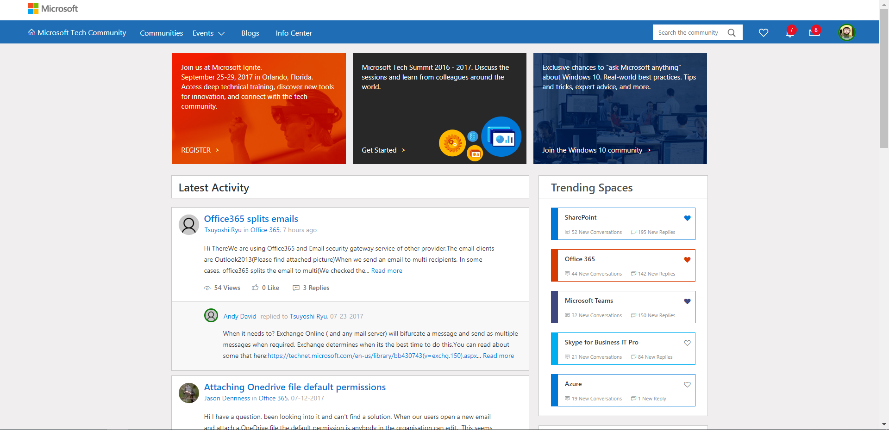

Office 365 es una plataforma que se caracteriza por su constante evolución de manera que de forma continua tenemos nuevas características y capacidades lo que dificulta poder estar al día con los cambios que Microsoft va liberando prácticamente cada día. Si bien es cierto que tenemos una serie de herramientas proporcionadas por Microsoft para poder seguir las novedades de Office 365, la realidad es que no disponemos de una ubicación única o utilidad que nos permita estar mejor preparados para las novedades que se avecinan en la plataforma. En la práctica, poder estar al día de los cambios en Office 365 nos llevará a usar una combinación de herramientas y recursos que nos permitan estar lo más actualizados posible y poder seguir los cambios en la plataforma. En este artículo veremos un resumen de las herramientas y recursos que os recomiendo para estar al día con los cambios en Office 365.

**Juego de herramientas de gestión del cambio de Microsoft**

Mi primera recomendación es que en la medida de lo posible utilicéis las herramientas y recursos que Microsoft proporciona para facilitar estar al día con los cambios en Office 365. La razón de esta recomendación: se trata de las herramientas que Microsoft recomienda para facilitar el seguimiento de todo lo que está sucediendo en torno a la plataforma.

Como se puede apreciar en la Figura 1, el juego de herramientas de gestión del cambio de Microsoft se compone de:

·       **El Centro de Mensajes de Office 365**, que podemos definir como la fuente más importante y precisa de los cambios que se avecinan en nuestro tenant de Office 365. El Centro de Mensajes de Office 365, que está orientado a audiencias técnicas (Administradores de Office 365, Equipos de Helpdesk, Equipos de Comunicaciones y en general cualquier persona / equipo que tenga que ser consciente de los cambios que se avecinan), muestra comunicaciones específicas para nuestro tenant de Office 365 de cambios que van a suceder en el corto plazo.

El acceso al Centro de Mensajes se puede realizar de forma directa desde la página principal del Centro de Administración de Office 365 en la que se muestran los últimos mensajes comunicados y se puede visualizar el detalle de los mismos sin tener que navegar primero al Centro de Mensajes:

Para acceder al listado completo de mensajes del Centro de Menajes podemos o bien hacer clic en la tarjeta del Centro de Mensajes o bien seleccionando la misma opción disponible bajo “Mantenimiento” (Health si se utiliza el idioma inglés) en el menú vertical de navegación del Portal de Office 365.

Una vez que accedemos al Centro de Mensajes, se muestra el listado de todas las comunicaciones relativas a nuestro tenant. Cada mensaje que se muestra pertenece a una de las siguientes categorías: Mantenerse informado, Planear el cambio, Prevenir o corregir problemas (Stay informed, Plan for change, Prevent or Fix issues). Para más información sobre las categorías de los mensajes, os recomiendo el siguiente artículo de soporte:

[https://support.office.com/en-us/article/Message-center-in-Office-365-38fb3333-bfcc-4340-a37b-deda509c2093#ID0EBABAAA=Messages](https://support.office.com/en-us/article/Message-center-in-Office-365-38fb3333-bfcc-4340-a37b-deda509c2093#ID0EBABAAA=Messages)

Estas categorías se pueden usar para filtrar los mensajes que se muestran en el Centro de Mensajes como muestra la Imagen 4.

Al seleccionar un mensaje de la lista, se muestra un panel con los detalles del mismo, las acciones a realizar para estar preparado para el cambio e información adicional del mismo.

El Centro de Menajes permite que se pueda cambiar los mensajes a mostrar a través de la posibilidad de editar las Preferencias del Centro de Mensajes de forma que se pueda elegir para que productos y servicios se van a mostrar comunicaciones (**Nota**: La configuración por defecto es que se muestren mensajes de todos los productos y servicios de la plataforma). Adicionalmente, y para tenants First Release, se puede configurar el envío de un resumen semanal de los cambios a la cuenta de correo del Administrador global de la plataforma, la cuenta de e-email de contacto alternativo del administrador y a un correo electrónico personalizado (**Nota:** En el momento de redacción de este artículo, esta es la única de las tres direcciones de e-mail que se puede personalizar para recibir el resumen semanal de cambios. Microsoft ha prometido que va a permitir que se puedan personalizar los 3 campos de e-mail disponibles). Precisamente esta última opción habilita que este resumen semanal de cambios se puede enviar a una audiencia más amplia añadiendo por ejemplo la dirección de correo electrónico de un canal de Microsoft Teams que se haya creado en la organización para conversar sobre cambios en Office 365. Por supuesto, los administradores de Office 365 que reciben el resumen también tienen la opción de re-enviarlo a quien consideren oportuno.

La siguiente figura muestra cómo se visualiza el resumen seminal de cambios en un canal de Microsoft Teams:

Finalmente, al igual que sucede con todo Office 365, el Centro de Mensajes también está en continua evolución de manera que se incorpora nueva funcionalidad a partir del Feedback proporcionado por Microsoft y también como parte del proceso de mejora continua de la plataforma. Como ejemplos de esta evolución en el Centro de Menajes tenemos: el resumen semanal de cambios comentado, la posibilidad de traducir los mensajes del Centro de Mensajes al idioma local o la posibilidad de que el resumen semanal de cambios se envíe a todos los administradores de un tenant (esta característica estará disponible desde agosto de 2017).

·       **La comunidad** **Microsoft Tech Community**. Se trata de una comunidad disponible en [https://techcommunity.microsoft.com/](https://techcommunity.microsoft.com/) que tiene como objetivo proporciona soporte, ayuda y ejemplos del mundo real en torno al uso y adopción de tecnologías y plataformas de Microsoft entre las que se incluyen Office 365, SharePoint, OneDrive y otras plataformas conocidas del gigante de Redmond. Si todavía no formas parte de la comunidad, te animo desde ya que te unas tan pronto como sea posible ya que es un lugar excelente no sol para obtener ayuda sobre problemas y errores en productos de Microsoft, sino también un entorno ideal para aprender de los equipos de productos de Microsoft y de expertos reconocidos e independientes en tecnologías de Microsoft (por citar algunos: Tony Redmond, Vasil Michev, Dan Holme). Dentro de la comunidad hay un espacio dedicado a notificar cambios en Office 365 que te recomiendo visites. Este espacio se llama Change alerts y está disponible en la siguiente Url:

[https://techcommunity.microsoft.com/t5/Office-365/ct-p/Office365](https://techcommunity.microsoft.com/t5/Office-365/ct-p/Office365)

·       **Roadmap de Office 365**, se trata de un sitio público habilitado por Microsoft y disponible en la Url:

[https://products.office.com/en-us/business/office-365-roadmap](https://products.office.com/en-us/business/office-365-roadmap)

El Roadmap sirve como un mecanismo adecuado para conocer aquellas características / funcionalidades que Microsoft está liberando o todavía desarrollando, así como revisar funcionalidad ya liberada o características canceladas. Los elementos en el Roadmap se agrupan de acuerdo a una serie de categorías que facilitan localizar los elementos de interés y además, es posible aplicar filtros para facilitar la localización de los elementos del Roadmap que se quieran consultar.

Sin embargo, uno de los problemas del Roadmap de Office 365 es que no proporciona información sobre en qué momento las características que Microsoft está desplegando van a llegar a nuestros tenants o durante cuánto tiempo una funcionalidad etiquetada como "En desarrollo" va a permanecer en ese estado. Finalmente, el Roadmap de Office 365 también evoluciona, se actualiza e incorpora nuevas funcionalidades como por ejemplo la reciente posibilidad de exportar a Excel el Roadmap.

·       **Blogs de Office**, aunque en mi opinión se puede considerar que los Blogs de Office son una herramienta más para estar al día con los cambios de Office 365, en la práctica son más un mecanismo de Marketing (o propaganda como seguramente diría alguno) que una fuente confiable de cambios en la plataforma debido a dos motivos fundamentales:
o   Las características publicadas en los Blogs de Office podrían cambiar desde el momento en el que se anuncian al momento en el que finalmente se liberan de forma global en Office 365. Estas diferencias pueden deberse a ajustes o cambios detectados como necesarios durante el tiempo que dichas características han estado disponibles en First Release.
o   Los blogs no contienen normalmente información sobre cuando las características anunciadas van a llegar a nuestros tenants.

Otro aspecto a valorar cuando se utilizan los Blogs de Office como una herramienta de gestión de cambio es que no disponemos de forma alguna de filtrar por característica, funcionalidad o fecha lo que de nuevo los convierten en una herramienta con utilidad limitada.

**Otras herramientas de Microsoft / Comunidad para la gestión del cambio**

Además de las herramientas "oficiales" descritas hasta ahora, hay otras herramientas de Microsoft / Comunidad que pueden ayudar a que podamos estar al día con los cambios en Office 365. Por citar algunas:

·       **Videos de Office 365 Updates Series**, se trata de un canal dedicado de Channel 9 en el que se publica de forma mensual un resumen de las novedades liberadas en Office 365 por Microsoft en el último mes. Cada resumen de novedades tiene una duración de 10 minutos y puede ser accedido en el siguiente enlace:

[https://channel9.msdn.com/Shows/o365update](https://channel9.msdn.com/Shows/o365update)

·       **Blog Office 365 Weekly de Thomas C. Finney**, se trata de una fuente de información detallada de cambios en Office 365 no solo en cuanto a novedades, sino también de cambios en los servicios. Podéis acceder al blog de Thomas en el siguiente enlace:

[https://blogs.technet.microsoft.com/skywriter/](https://blogs.technet.microsoft.com/skywriter/)

·       **Artículo de Cian Allner en la wiki de TechNet** dónde podréis encontrar una guía de supervivencia más que recomendad sobre cómo gestionar los cambios de Office 365:

[https://social.technet.microsoft.com/wiki/contents/articles/37821.office-365-change-management-survival-guide.aspx](https://social.technet.microsoft.com/wiki/contents/articles/37821.office-365-change-management-survival-guide.aspx)

·       **Office 365 Update Series de Jim Naroski**, disponible en docs.com por lo que supongo que Jim moverá la información a slideshare dado que como sabéis, docs.com desaparecerá el próximo mes de diciembre. Podéis acceder a la serie en el siguiente enlace:

[https://docs.com/jim-naroski/6956/office-365-update-series](https://docs.com/jim-naroski/6956/office-365-update-series)

·       **E-Mail de Resumen de cambios de Office 365 creado por Paul Cunningham**, se trata de un e-mail que se genera a través de un script PowerShell que hace uso de la API de comunicaciones de Office 365 para extraer la información del centro de mensajes, formatear la misma de acuerdo a una plantilla HTML y enviarla por correo electrónico. Para más información sobre esta utilidad creada por Paul:

**Conclusiones**

Mantenerse al día de los cambios en Office 365 es una tarea compleja que puede ser facilitada por herramientas para facilitar la gestión del cambio proporcionadas por Microsoft y por la comunidad. Si me preguntáis que herramientas os recomiendo, claramente el Centro de Mensajes como fuente principal de información sobre cambios que vienen a Office 365 y luego la comunidad Microsoft Tech Community.

**Juan Carlos González Martín**
 Office Servers and Services MVP
 Cloud & Productivity Advisor 
jcgonzalezmartin1978@hotmail.com
 @jcgm1978 | [https://jcgonzalezmartin.wordpress.com/](https://jcgonzalezmartin.wordpress.com/)​

