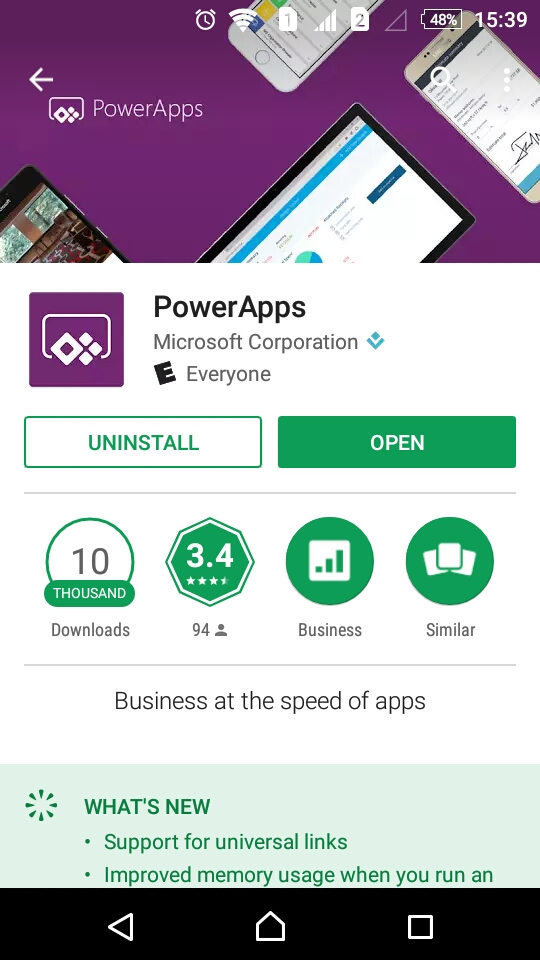
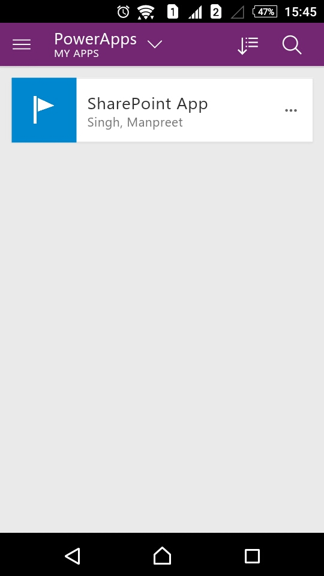
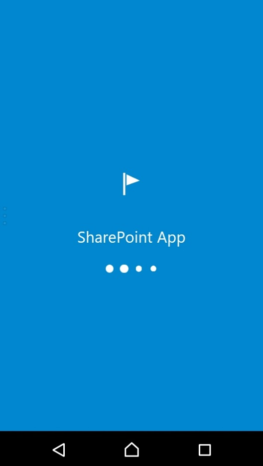
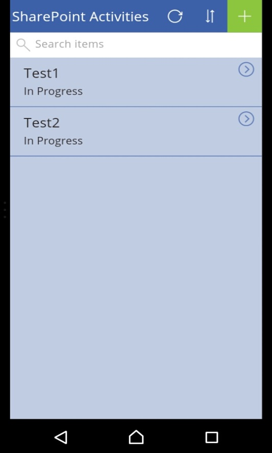
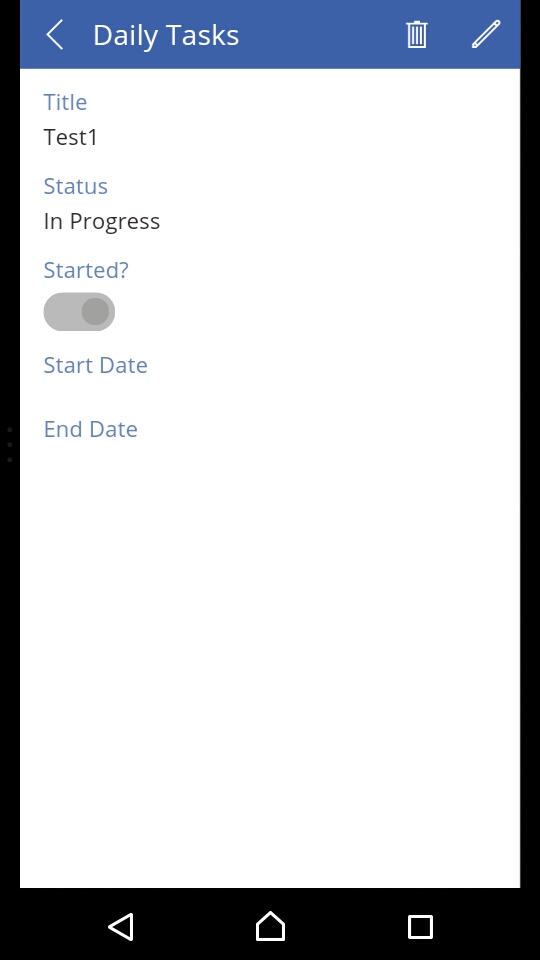
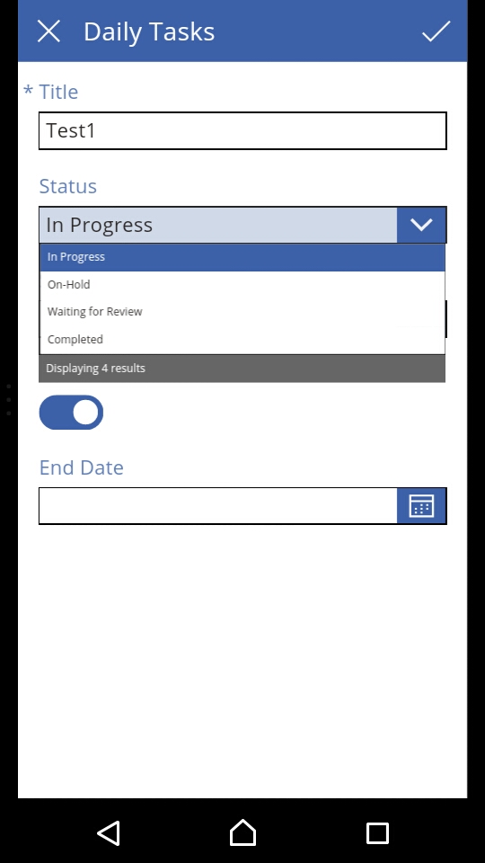
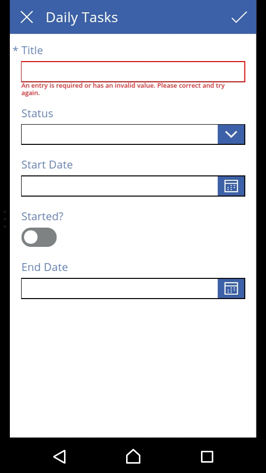
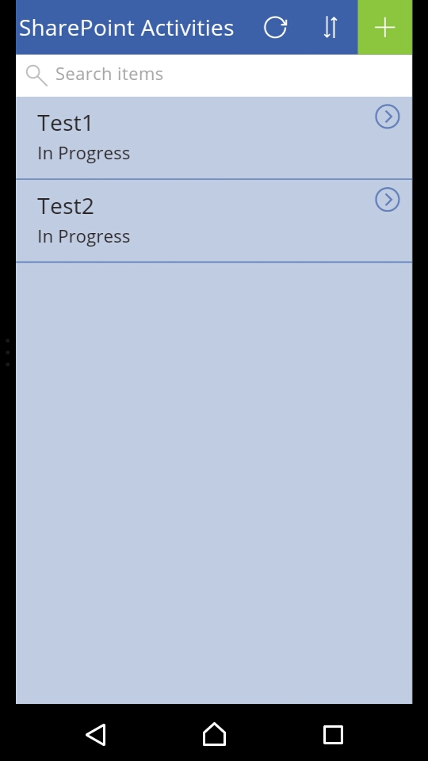

In my last article we learnt how to create an app using Microsoft PowerApps where we created an app to track our daily tasks and activities. As we are aware the app is performing well on our desktops on the PowerApps studio but as we call it as an app, it should be available in all our tablets and phone isn’t it.

Don’t worry, in this article we will see how to use the apps on your devices and use the best created apps by you and your organization on the PowerApps platform.

·         As for android users, open your play store, windows users open your market place and similarly iPhone users can open their iStore.

·         Search for PowerApps.

·         You will see the app as per the screen below, download and install it.

·         Once installed, click on Open.

·         You will be asked to put in your credentials and once you login, you will find the apps shared with you by the organization and if you are the owner, you will see your app.

·         Click on the SharePoint App we created on our last article.

·         The app will open up in the above way.

·         Remember that you can choose your text and symbol for to display on your app when it opens.

·         Once it opens, you will see your app on your device.

·         As we had created an app which shows the daily activities of a SharePoint team.

·         It shows two test tasks in progress.

·         If you want to go in and edit the status or other details, just click on the item.

·         You will see the task in view mode.

·         You can edit by clicking on the edit symbol above or click on delete to remove it and the update will happen in the database and all the devices of your colleagues who are using the app.

·        If you want to create a new entry of the activity, click on the + icon on the top of the form and the new form will be available for you o enter the data.  

·         This will make the team sync even without opening any external report and everyone will be updated by their app through their phones.

That’s the reason it is called a PowerApps.

There will be more articles on the PowerApps. Until then, keep reading and keep learning!

**Manpreet Singh**

SharePoint Consultant | Office Servers & Services MVP

​

 
 
import LayoutNumber from '../../../components/layout-article'
export default LayoutNumber
