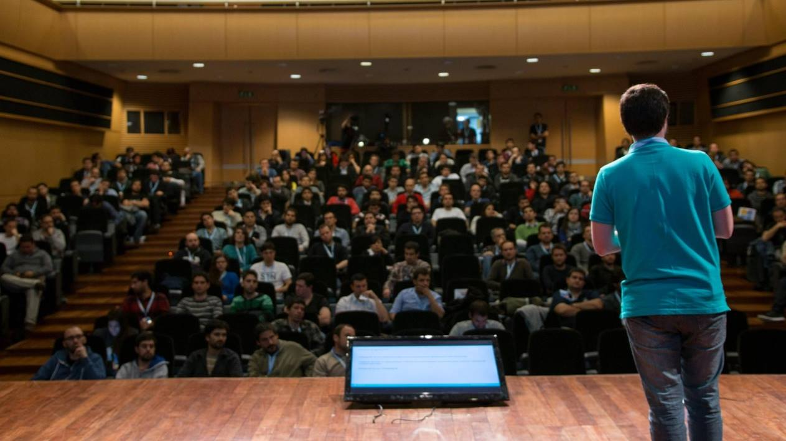

Del 23 al 27 de Octubre de 2017, se llevará a cabo el evento de tecnologías Microsoft .NET Conf UY v2017. El mismo reúne durante cinco días a oradores nacionales e internacionales junto a la comunidad de desarrolladores locales e instituciones participantes.

Este evento es declarado de interés nacional por el Ministerio de Educación y Cultura del gobierno uruguayo (MEC).

En esta edición, el evento se compone de:​

●          Dos días en formato de conferencia, con ponencias y charlas sobre temáticas relacionadas. Más de 35 charlas de speakers internacionales y locales.

●          Tres días de talleres de trabajo prácticos (workshops). 9 Workshops en 3 tracks simultáneos.

●          Una convivencia recreativa entre los asistentes y oradores del evento .

​ **Workshops**

El 23, 24 y 25 de Octubre de 2017 están planificados una serie de workshops dictados por oradores de la conferencia con el objetivo de ofrecer a los asistentes una oportunidad de compartir conocimiento.

Es una instancia donde los asistentes tendrán la oportunidad de poder compartir un espacio de actualización y camaradería junto con el resto de los participantes y junto a speakers referentes en la industria de IT.

**Conferencia**

El ciclo de conferencias se estará desarrollando en el Auditorio de las Telecomunicaciones de Antel.​

[.NET Conf UY v2017](http://netconf.uy/) es la conferencia más grande de Tecnologías Microsoft en Sudamérica organizada por la comunidad. Aparte de contar con más de 500 asistentes, todas las charlas se suben a Channel9 (el principal canal de Microsoft sobre desarrollo). Más de 35 oradores nacionales, regionales e internacionales van a estar dictando más de 25 charlas.

En la edición del 2016, participaron más de 400 asistentes y 20 oradores de Uruguay, Argentina, Estados Unidos y Canadá. También contamos con el apoyo de 39 instituciones locales e internacionales.

Eduardo Mangarelli, Director de Tecnologías de Microsoft para Latinoamérica opinó: “.NET Conf UY es el evento organizado por la comunidad más importante de Latinoamérica, por la calidad de las presentaciones, de los presentadores y la organización, esto es particularmente relevante en un momento en el cual la innovación tecnológica es el principal impulsor del desarrollo de las empresas y los negocios. Temas como inteligencia artificial, la nube, bots inteligentes serán parte de una super interesante y completa agenda.”.

Hubo muy buena devolución por parte de los sponsors locales. “En Infocorp nutrimos nuestro día a día con la pasión que sentimos por nuestro trabajo. Esta filosofía la compartimos con los organizadores de la .NET Conf, desde el primer momento en que empezamos a pensar juntos en estos tres días cargados de novedades, tendencias y tecnologías para la comunidad .NET", comentó Elena Rubin, Chief People Officer de Infocorp

Puede encontrar mayor información en [http://netconf.uy/](http://netconf.uy/) . También puede ver los detalles de la edición 2016 en [http://netconf.uy/es/2016/](http://netconf.uy/es/2016/) .

​

