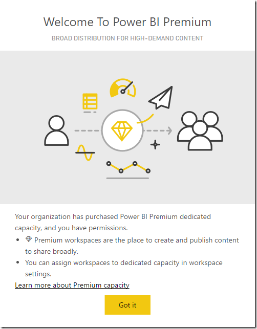
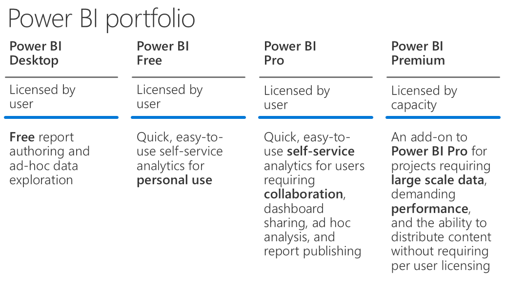
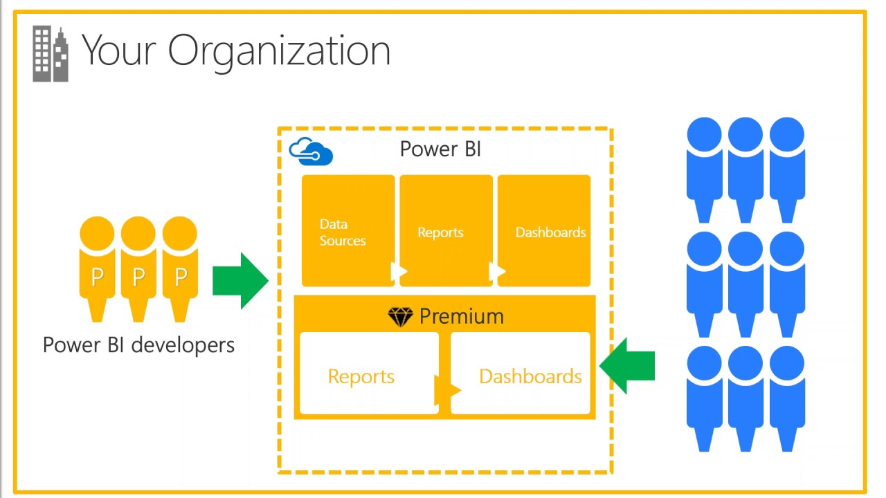
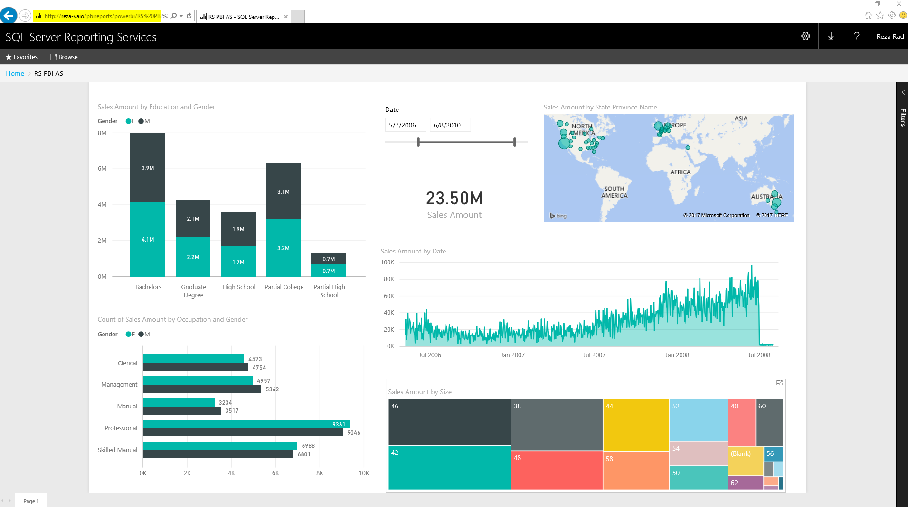
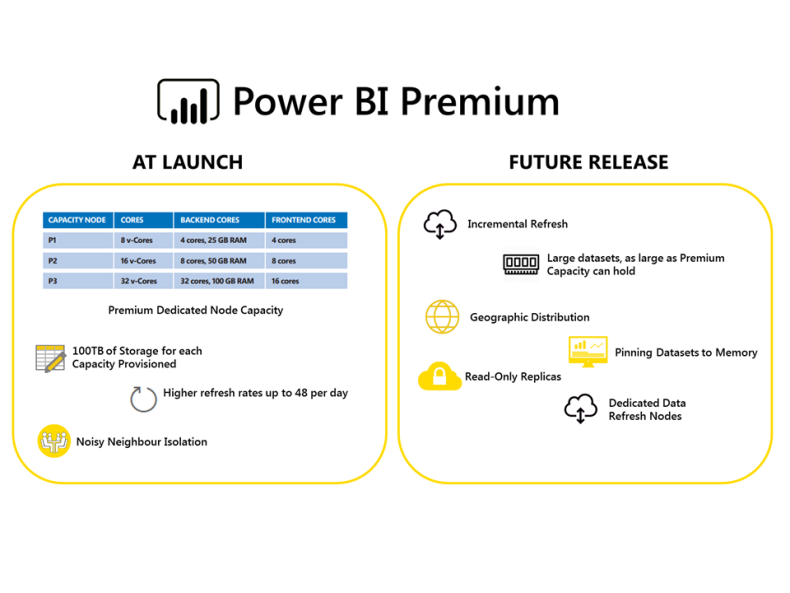
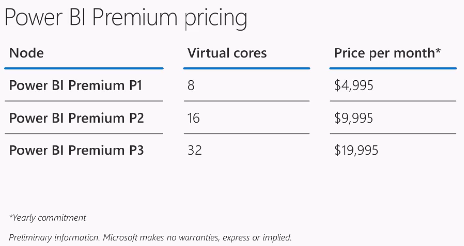

import ArticleHeader from '../../../components/article-header'

<ArticleHeader frontmatter={props.pageContext.frontmatter} />

Hace poco tiempo atrás hubo varios anuncios en referencia a Power BI. En aquel momento uno de los anuncios fue la nueva versión On Premises denominada Power BI Report Server. Otro de los anuncios fue el lanzamiento de Power BI Premium. Muchas personas ya saben que se trata de una nueva forma de licenciamiento. ¿Pero cómo opera realmente? En este artículo intentare responder a dichas inquietudes con explicaciones en mayor detalle acerca de Power BI Premium.

**Licenciamiento de Power BI antes de Premium**

Para darle una mirada al nuevo plan de licenciamiento, es fundamental conocer como operaba anteriormente el licenciamiento. Antes del cambio, el sistema de licenciamiento que nos otorgaba Microsoft era simple. Solo existían dos planes: Free, y Power BI PRO. Free era gratis de cualquier tipo de cargo obviamente. Todo lo que un usuario necesitaba era un correo corporativo para tener una cuenta de Power BI. En el caso de PRO, existían funcionalidades adicionales con un costo de USD 9.99 por usuario por mes.

La diferencia entre los dos planes no involucraba el tipo de desarrollo realizado. Se puede lograr prácticamente todo utilizando Power BI Free para el desarrollo de reportes. Pero cuando tocamos el tema de contribuir, compartir con el equipo, brindar seguridad, y utilizar Power BI en un entorno de Producción, la mayor parte de funcionalidades requieren de una cuenta Power BI PRO. A continuación, una tabla de características entre ambas versiones:

| Funcionalidad | Power BI Free | Power BI PRO |
| --- | --- | --- |
| Espacio de alojamiento | 1 Gb | 10 Gb |
| Power BI Desktop | Si | Si |
| Funcionalidades de Desarrollo | Si | Si |
| DirectQuery – LiveQuery | No | Si |
| Frecuencia de Actualización | Una vez por día | Hasta 8 veces por día |
| Gateways – Fuentes On Premises | No | Si |
| Seguridad a nivel Filas | No | Si |
| Paquetes de Contenido | No | Si |
| App WorkSpaces | No | Si |
| Streaming en Vivo | Hasta 10.000 Filas por Hora | Ilimitado |

Como se puede ver todo lo relacionado a Desarrollo de una solución de Power BI está disponible en forma gratuita. De todas maneras, si se planifica salir a un entorno Productivo, se requiere una licencia Power BI PRO. Algunos detalles para ejemplificar:

·       Si se desea utilizar un mecanismo para compartir contenido de Power BI con otros, en la mayoría de casos se requiere utilizar funcionalidades como App Workspaces o Paquetes de Contenido, ambas funcionalidades comprendidas en Power BI PRO.
·       Si queremos implementar seguridad a nivel filas (RLS), que significa dar acceso a usuarios basado en parte de un conjunto de datos y no todo, se requiere Power BI PRO.
·       Si utilizamos Gateways (no importando si es el Personal Gateway o Enterprise Gateway) para conectar a fuente de datos On Premises, entonces se requiere Power BI PRO.
·       Para realizar conexiones del tipo LiveQuery – DirectQuery a fuentes de datos se requiere Power BI PRO. LiveQuery o DirectQuery son opciones que se suelen utilizar a menudo cuando el tamaño de los datos es alto, que Power BI Free (1 Gb) no puede hostear.

Como podemos ver, en un entorno productivo, el uso de Power BI, va a requerir que nos encontremos con ciertas limitaciones en la versión Power BI Free, y se necesite Power BI PRO. Es muy importante tomar esto en cuenta.

*Power BI PRO no es solo para el desarrollador, también para el consumidor de Reportería. Si el contenido de Power BI es PRO, todo aquel que use y consuma dicho contenido necesitará contar con una cuenta de tipo Power BI PRO*

Si, hasta este momento, has leído correctamente. Cualquier contenido, que tenga una de las funcionalidades anteriormente citadas es considerado contenido PRO, y todo aquel que consuma dicho contenido, debe contar con una cuenta Power BI PRO.

·       Datos con una conexión DirectQuery y conjunto de datos, como SQL Server Analysis Services en formato tabular, Azure SQL Database, Azure SQL Data Warehouse, o Apache Spark para HDInsight.
·       Datos desde un dataset que refresque más de una vez al día.
·       Datos que conecten con fuentes On Premises que el Power BI Gateway tenga agendado para refrescar más de una vez al día.
·       Datos desde una conexión en vivo con Azure Analysis Services.
·       Datos (incluyendo reportes, paneles y tiles) desde un conjunto de datos que utilice Seguridad a Nivel Filas (RLS).
·       Dashboards o reportes instalados desde una APP o un Paquete de Contenido Organizacional.
·       Dashboard, Reporte, o conjunto de datos que contiene APP Worspace
·       Dashboard que contiene datos con tasas de transferencia superior a 10.000 filas por hora.

**¿Por qué Premium?**

Tomando en cuenta la lista de limitaciones de Power BI Free y también de cuentas PRO, se torna casi obvio porque es necesario otro formato de licenciamiento (Premium). Elaboremos una lista corta de dichas funcionalidades:

·       ***Modelos con mayor Capacidad******.*** Una de las limitaciones de Contenido PRO mencionada anteriormente es la escalabilidad. Pensemos por ejemplo en una organización donde trabajen 10.000 usuarios, y por tanto al manejar Contenido PRO se deba pagar 10.000 \* USD 10 por mes. ¡Esto sería equivalente a USD 100.000 por mes! O sea, USD 1.2 millones al año. ¡Suena realmente desafiante!
·       ***Modelos de Power BI – Limitaciones****.*Como mencionamos antes, con cuentas PRO se accede a 10 Gb de espacio alojado en dicha cuenta de Power BI. Pero, por otro lado, cada Modelo de Power BI (digamos archivo), no podrá ser mayor a 1 Gb. Esto significa que se debe combinar Power BI con otras tecnologías como SQL Server Analysis Services para LiveQuery, o una base de datos premier como SQL Server, Oracle, Teradata, para realizar una conexión de tipo DirectQuery. Y esto significa pagar licencias para estos productos que mencionamos. Es normal que en entornos organizacionales el modelo que requiera Power BI escale a tamaños mayores a 1 Gb.
·       ***Lectores o Consumidores.*** *En la mayoría de las implementaciones de Power BI, la mayor parte de los usuarios son solo lectores o consumidores de reportes. Lectores o consumidores pueden interactuar con el reporte, pueden utilizar gráficos y visualizaciones en forma interactiva y analizar información, pero no crearán o actualizarán reportes. Generalmente también existirá un grupo menor de desarrolladores de Reportería. En este plan de licenciamiento, cada usuario que utiliza contenido PRO, independiente del rol que desempeñe (desarrollador, o consumidor) deberá tener una cuenta PRO. Esto suena a que deberían pagar mucho más de lo que realmente deberían.*

**¿Qué es Power BI Premium?**

Ahora que ya sabemos acerca del formato de licenciamiento que teníamos antes en Power BI, podemos comenzar a delinear Power Premium. ¿Qué es Premium? Power BI Premium es simplemente un plan de licenciamiento que cubre limitaciones que tenemos en una cuenta Power BI PRO. Es un plan de licenciamiento que ayuda a cumplir requerimientos que no podemos cubrir con Power BI PRO. El licenciamiento comienza en una base de USD 5000. Pero no tomemos solo esto en cuenta ya que seguramente tengamos novedades de bases móviles menores en un corto plazo.

***¿Ya no contaremos con Power BI y Free entonces?***

*¡No! Power BI Free y Pro seguirán estando aquí. Pero, seguramente se vendrán cambios en funcionalidades soportadas por cada tipo de cuenta. Se puede casi asegurar que las funcionalidades a las que accedemos con Power BI PRO, seguirán brindándose y no se empujara al usuario a hacer un upgrade a Premium si no se desea. Se han eliminado de Power BI Free solo funcionalidades de colaboración, como compartir. Por tanto, funcionalidades para compartir requiere hoy en día de cuentas Power BI PRO.*

***¿Estoy utilizando actualmente Power BI PRO, será Premium la única opción disponible de aquí en adelante?***

¡No! Se podrá continuar utilizando Power BI PRO. PRO le permite al usuario todo lo que actualmente ya tiene, no se perderá nada, y lo más importante, no estará obligado a pasarse a licenciamiento Premium. De todas formas, es importante destacar que Premium otorgará opciones y funcionalidades adicionales que hoy en día no tiene PRO.

***¿Cuáles son los beneficios que me da Power BI Premium?***

Power BI Premium es un plan adicional de licenciamiento. Adicional significa que se puede utilizar u optar, como no. Si utilizamos este plan, tendremos acceso a ciertos beneficios que nos pueden ayudar a reducir ciertos costos de soluciones BI en casos particulares. Pero, es importante saber cuáles son esas funcionalidades. Estas funcionalidades pueden ser muy destacadas y con alto valor agregado para ciertas compañías y poco esenciales para otras.

**Recursos de Power BI Dedicados**

Uno de los puntos más destacados en cuanto a funcionalidades de Premium es el acceso a recursos dedicados, como por ejemplo capacidad, cores, y unidades de procesamiento. Power BI Free o PRO son publicados en cuanto a su contenido en servidores COMPARTIDOS de Power BI. Estos servidores de alta performance con CORES adicionales y capacidad de Power BI Free y PRO no son dedicados.

Con Power BI Premium, se puede seleccionar el tipo de nodo necesario, y configurar a nuestra necesidad los nodos requeridos de Power BI. Por ejemplo:

| Capacidad Nodos | Cores | Backend Cores | Frontend Cores |
| --- | --- | --- | --- |
| P1 | 8 v-Cores | 4 cores, 25 Gb RAM | 4 cores |
| P2 | 16 v-Cores | 8 cores, 50 Gb RAM | 8 cores |
| P3 | 32 v-Cores | 16 cores, 100 Gb RAM | 16 cores |

***Conjuntos de Datos con mayor******capacidad*** ***soportados***

Como mencionamos antes en cuanto a limitaciones de Power BI PRO, no podemos sobrepasar en nuestro modelo 1 Gb de capacidad. Y nuestro espacio global es de 10 Gb. ¡Con Power BI Premium podemos contar con hasta 100 TB de espacio! El modelo podrá ser de 50 Gb o más. Esto significa que además no deberemos pagar por ejemplo por licencias adicionales de SQL Server u otra tecnología de base de datos para disponibilizar o desarrollar una solución de BI escalable.

***Frecuencia de Refresco de Datos***

Con cuentas Free de Power BI, el refresco estaba limitado en una vez diaria. Con Power BI Pro podemos refrescar hasta 8 veces por día. Con Power BI Premium podemos definir refrescos hasta 48 veces por día. La frecuencia mínima de refresco de datos además era de 30 minutos para Free y PRO. En Premium dicha frecuencia mínima de refresco ha sido definida en 1 minuto.

***Lectores o Consumidores***

*Power BI Premium es un plan de licenciamiento para lectores y consumidores. Lectores puede contar con el consumo de contenido de tipo PRO, pero con un formato de licencia de costo menor a una cuenta PRO. Por tanto, si la compañía tiene 10.000 usuarios, no se requiere pagar USD 100.000 por mes, se pagará menos que eso. Más adelante mencionamos los detalles.*

***Power BI Report Server***

Este punto requiere su propio artículo (Ver la edición 31 de CompartiMOSS). Es una de las grandes ventajas de contar con licenciamiento Power BI Premium. Esta funcionalidad disponible en Power BI Premium denominada Power BI Report Server. Cuando se accede por lo tanto a Premium podremos tener reportes de Power BI en un servidor On Premises.

***Roadmap de Funcionalidades para Power BI Premium***

Power BI Premium será la oferta más fuerte dentro de la suite. Se vienen muchísimas funcionalidades en el corto plazo. Las siguientes están ya planificadas:

***Refresco Incremental***

Cuando hablamos de modelos de más de 1 Gb, los refrescos incrementales son más que necesarios. No es un buen camino poblar todos los datos de nuestro modelo nuevamente en cada refresco. Con Premium podremos tener la actualización incremental de nuestro conjunto de datos.

***Vincular Conjunto de Datos a Memoria***

*Power BI por defecto aloja en memoria los modelos basado en el uso. Esta propiedad automática a veces puede causar que los usuarios deban esperar para que un reporte poco utilizado cargue. En un futuro cercano podremos decidir cuales conjuntos de datos son importantes y críticos para nuestra empresa y configurar para que sea cargado en memoria.*

***Actualización de Datos Dedicada por Nodo***

*A corto plazo podremos contar con la posibilidad de seleccionar nodos específicos para actualización de datos, mientras otros nodos proveerán respuestas para la generación de reportes. Esto ayudará mucho en cuanto a performance de carga de reportes mientras la información de conjuntos de datos está actualizándose en el mismo momento.*

***Geo-******Replicación******y Replicas Solo-******Lectura***

*Podremos contar con la capacidad de distribuir réplicas de modelos de Power BI en forma geográfica y mediante otras vías, de manera que los usuarios puedan contar con mejores performances.*

*¡Punto Destacado! ¡Costos de Premium!*

El tema de costos de Power BI Premium es de los más discutidos hoy en día. Cuando Premium fue anunciado por primera vez, vimos mucha gente asustada por los USD 5000 como costo base. Pero veamos en mayores detalles los costos y como operan.

Existe una calculadora que nos puede ayudar a entender mejor los costos basados en los requerimientos. Básicamente los costos toman en cuenta la cantidad de desarrolladores (PRO) de reportes (cuentas necesarias), cuantos usuarios frecuentes, y usuarios lectores. La razón por la cual se separan usuarios frecuentes, de lectores es simplemente para entender cuántos CORES se necesitarán en Power BI Premium.

Veamos en detalle con cierto ejemplo. Consideremos una empresa con 10.000 usuarios. Del total de usuarios, solo 300 son desarrolladores de reportes (crearan o actualizaran reportes), el resto solo consume reportes (digamos por ejemplo 4800 usuarios frecuentes, y 4800 ocasionales). Basados en la calculadora para dicho requerimiento, necesitaremos 300 cuentas PRO, y 6 Nodos P1 para cubrir lectores. Cada nodo P1 tendrá un costo de USD 5000 por mes.

Como resultado final tenemos un costo de USD 32.000 mensuales.

Evidentemente es un costo alto, pero si se compara con acceder a 10.000 cuentas Power BI PRO, y que sería de USD 100.000 mensuales, estaríamos hablando de 1/3 de dicho costo. Como mencionamos antes, no es necesario pagar Pro en el caso de lectores, y por eso el costo es menor.

Por otro lado, también destacar en el costo de la calculadora que se incluye Power BI Report Server. Por tanto, con dicho costo también tendremos la posibilidad de reportes On-Premises.

***¿El costo de Premium siempre es mejor en comparativa?***

¡No! Como muchas cosas, depende. Si nos encontramos trabajando para una compañía con miles de usuarios, y la mayoría son consumidores, como en el ejemplo anterior, será mucho más beneficioso Power Premium y su sistema de licenciamiento. Pero, por otro lado, si estamos hablando de compañías medianas o pequeñas con cientos de usuarios, o menos, entonces Power BI Pro es una mejor opción. Veamos un ejemplo:

Si tenemos por ejemplo 50 usuarios de Power BI, incluso si compramos Power BI PRO para cada uno de ellos, pagaremos USD 500 por mes. Mientras que si trasladamos costos a Premium deberemos pagar un mínimo de USD 5000 por mes. Por tanto, con este punto de base (USD 5000) no es efectivo pagar por Premium si tenemos una base de usuarios reducida.

Si se necesita hostear Power BI On Premises, en ese caso igual se requeriría considerar Premium, incluso en ese ejemplo con una base de usuarios reducida, porque Power BI Report Server está disponible dentro de Premium, o en un licenciamiento de SQL Server (EA + SA).

***¿Cuál sería el punto de equilibrio?***

Una de las preguntas más comunes en esta área es saber cuándo comenzar a usar Premium y cuando PRO. La respuesta a esta pregunta puede ser calculada de forma simple. No puede darse un número preciso, ya que pueden darse situaciones muy diferentes a considerar en detalle. Por ejemplo: Dos empresas que cuentan con 5000 usuarios, y una de ellas tiene 2000 desarrolladores de reportes, y otra tiene solo 200 desarrolladores.  Una de ellas puede tener todos los usuarios como frecuentes, y la otra un 80% de usuarios ocasionales. Depende de dichos requerimientos los nodos a definir en Power BI Premium.

El consejo en ese sentido, es utilizar la calculadora provista. Agregar el número de usuarios totales, usuarios frecuentes, y usuarios ocasionales, entonces chequear si el precio total con dichos requerimientos es menor que comprar Power BI Pro para todos los usuarios. En ese ejercicio sabremos si pasamos ese punto de equilibrio. En caso de no ser así, simplemente utilizar Power BI PRO.

Pongamos otro ejemplo adicional:

·       Empresa con 10.000 usuarios, donde solo 300 son desarrolladores, y el resto son 50% frecuentes, y otro 50% usuarios ocasionales. Seran necesarios 6 nodos P1 de Power BI y entonces el costo general será calculado de la siguiente forma: 300 \* USD 10 (cuentas PRO) + 6 \* USD 4995 (costo por Nodo) = USD 32.967 (por mes). Esto costo es mucho menor que haber comprado 10.000 \* USD 10 (cuentas PRO) = USD 100.000
·       Pequeña empresa / Mediana empresa con 50 usuarios. Incluso si pagamos USD 10 por cuenta PRO, estaríamos pagando USD 500 por mes. En el caso de adquirir Premium el costo mínimo seria de USD 4995 por mes. Por tanto, en este caso recomendamos Power BI PRO.

**Resumen**

En resumen, Power BI Premium es una muy buena opción para varios casos. Tiene una curva de entrada interesante para empresas y compañías grandes, además de funcionalidades destacadas, servidores destacados, tamaño de datos de modelo de datos, alta frecuencia de actualizaciones de datos, Power BI On Premises y muchas otras opciones.

Pero en muchos otros casos, existen empresas que no requieren estas funcionalidades, y pueden utilizar Power BI Pro como han estado haciéndolo hasta ahora.

**Gastón Cruz**

Data Platform MVP | Business Intelligence Technical Manager​​

