En el número 31 de la revista (Marzo 2017), os introduje los Modern Sites y Pages de SharePoint, y vimos algo de su anatomía interna. La evolución del “modern” es imparable, y unos meses después ya tenemos disponibles algunas utilidades dentro del Framework del PnP con el que podemos desplegar páginas modernas, incluyendo WebParts en ellas, tanto los propios WebParts out of the box, como los WebParts del SharePoint Framework (SPFx) desarrollados por nosotros mismos.

**Nota**: Para provisionar un WebPart propio, primero debemos instalar el WebPart en el site donde residirá la página. Por suerte, desde hace unos días, tenemos una nueva opción de despliegues de WebParts SPFx, que nos permite desplegarlo a nivel de toda la Tenant. En muchos casos será suficiente con desplegar nuestra solución SPFx a nivel de Tenant, y así ya tendremos nuestros WebParts disponibles y listos para provisionar en cualquier página Modern de cualquier sitio del tenant. Tenéis el anuncio de MS en el siguiente enlace:

[https://dev.office.com/sharepoint/docs/spfx/tenant-scoped-deployment](https://dev.office.com/sharepoint/docs/spfx/tenant-scoped-deployment)

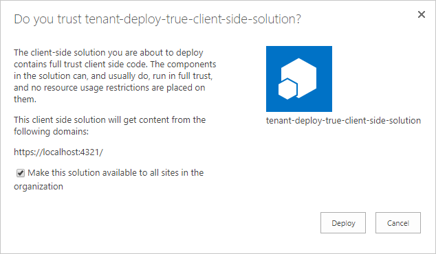

A pesar de la mejora, que no deja de ser grande, todavía es necesario una aprobación "manual" para el deploy a nivel de tenant, por lo que todavía no puede automatizarse el despliegue al 100%.

**Provisionando Páginas con Webparts desde código**

La librería core de PnP nos ofrece una serie de Extensions para poder provisionar páginas modernas con sus WebParts. Vamos a ver pequeños snippets de código de menor a mayor complejidad para realizar varias acciones, y así entenderemos mejor qué podemos hacer, y cómo.

***Creando una Modern Page***

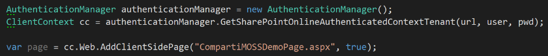

***Añadiendo algo de contenido a la página***

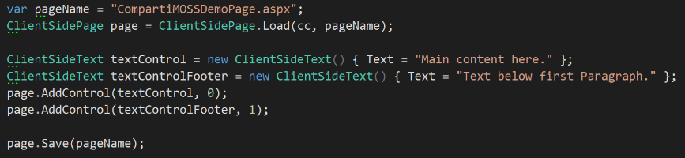

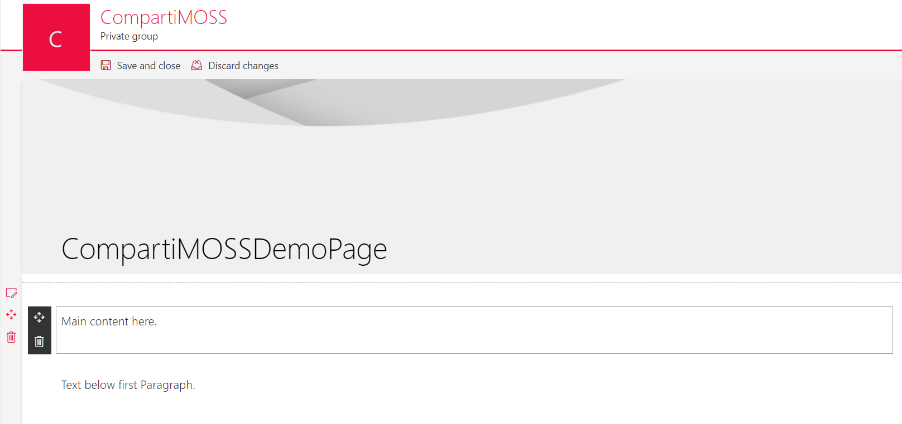

***Añadiendo un WebPart custom***

Asumiendo que tenemos desplegado un WebPart llamado "HelloWorld", el siguiente código lo añadiría a la página:

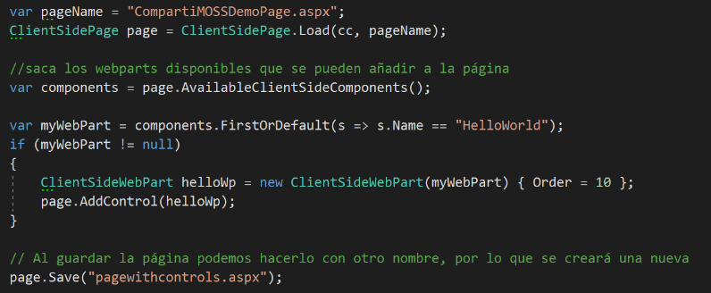

Añadiendo y configurando un WebPart OOB (List WebPart)

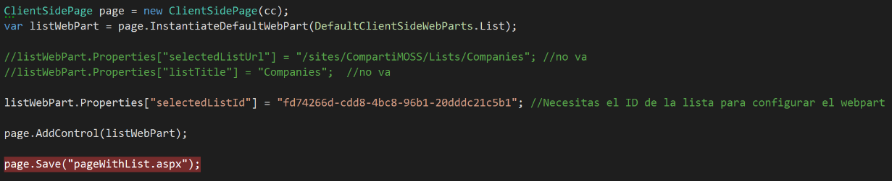

Fijaros como hacemos uso del array de Properties para configurar la WebPart. El problema aquí es que cada WebPart (custom y OOB), va a tener sus propias propiedades, y no va a ser sencillo obtener las que debemos configurar.

En algunos casos podemos inspeccionar las propiedades que vienen nada más instanciamos el WebPart:

var listWebPart = page.InstantiateDefaultWebPart(DefaultClientSideWebParts.List);

pero esto no va a funcionar con todos las WebParts, por ejemplo, no vale para la WebPart de Lista que os muestro en el ejemplo.

**Truco para obtener las propiedades a configurar**: Os recomiendo que añadáis la WebPart a mano en una página de prueba, y luego, con CSOM, o usando la herramienta SharePoint Online Client Browser, inspeccionéis la página creada, en concreto el campo “AuthoringCanvasContent” que contendrá un string con algo parecido a código HTML:

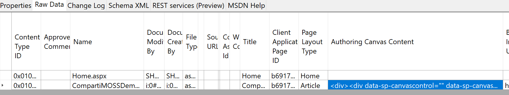

Ahí debéis buscar el DIV de la WebPart que os interesa, y fijaros en su tag “*data-sp-webpartdata*”, que contiene el JSON de configuración de la WebPart (tendréis que aplicar cierto decoding, pero sale fácil).

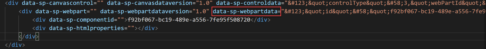

Una vez descodificado tendremos:

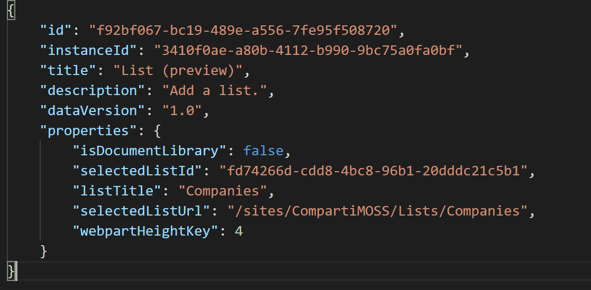

No todas las propiedades serán siempre requeridas, en este caso es suficiente con especificar el ID de la lista, pero fijaros en el código fuente, porque con sólo especificar la URL de la lista, o su Título, no funciona.

Para acabar, que sepáis que el equipo del PnP ha codificado en un Enum todos los WebParts OOB hasta la fecha y que tenéis en el enum *DefaultClientSideWebParts*

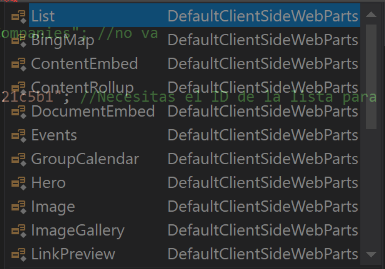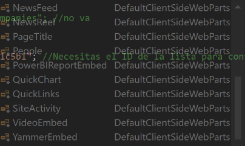

**Nota sobre el provisioning framework del PnP**

Por el momento, el Provisioning Framework del PnP todavía no tiene soporte para provisionar páginas y WebParts Modern desde XML a través del PnP Schema. Sin embargo, el soporte ya existe en la rama DEV del proyecto de GitHub, así que creemos que estará disponible muy pronto, y si no podéis esperar, pues podéis descargaros la rama de Dev y probarlo.

**Resu​​men**

Como decíamos en números anteriores, los "Modern sites" llegaron para quedarse, y cada vez se están añadiendo nuevas funcionales que los hacen más y más productivos, y no solo con las nuevas funcionalidades aportadas por Microsoft, sino también por las WebParts y extensiones que está aportando la comunidad a través de los diferentes proyectos de github, y que como siempre te invito a revisar si todavía no los conoces.

**Luis Mañez**

SharePoint Cloud Solutions Architect en ClearPeople LTD

@luismanez
 [http://geeks.ms/lmanez/](http://geeks.ms/lmanez/)​

