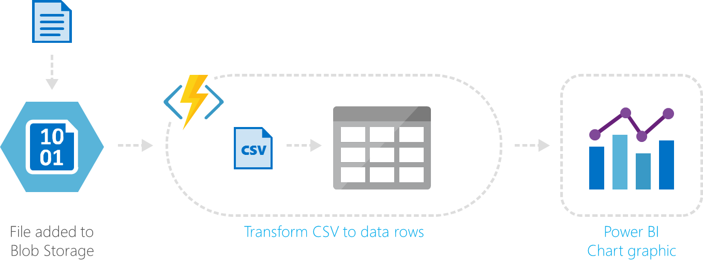
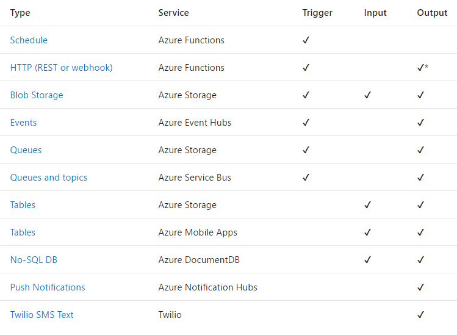

Hubo un momento en la antigüedad que SharePoint se ejecutaba en los servidores de nuestros Datacenters, los usuarios de negocio nos pedían personalizaciones y desarrollábamos soluciones que aportaban valor a las funcionalidades base de SharePoint. Ahora que todo se está moviendo hacia Office 365, hay cada vez menos personalizaciones que podamos hacer. Aun así, los usuarios siguen necesitando de esas personalizaciones y ese código tiene que ejecutarse en algún lugar. Nos encontramos con el problema de hospedar nuestro propio Timer Job, incluso de tener que encontrar un servidor donde ejecutar esa funcionalidad. ¿Tendremos que aprender Docker? Gracias a la evolución de la tecnología cloud, una nueva arquitectura llamada #Serverless nos puede aportar una solución a muchos de estos problemas y nos permite centrarnos en lo que hacemos mejor, la creación de soluciones, sin tener que preocuparnos de dónde o cómo se ejecuta nuestra solución.

En el número 31, Javier López González nos explicaba perfectamente esta nueva [arquitectura Serverless](/revistas/numero-31/azure-serverless) y en este artículo vamos a ver algunos escenarios comunes para Office 365 y/o SharePoint Online, además de elementos fundamentales para diseñar estas nuevas arquitecturas.

**Escenarios comunes**

Tanto como si hemos desarrollado para SharePoint o somos nuevos desarrolladores en Office 365, hay algunos escenarios habituales que se nos plantean cuando recibimos los requisitos de los usuarios y pensamos en esa solución que debe contemplar todas esas funcionalidades.

- Recibir un evento o notificación cuando se modifica un documento, se crea un elemento en una lista, etc. Lo que en SharePoint conocemos como Event Receiver.
- Carga programada de documentos o carga desatendida de documentos, algo que en SharePoint podíamos solucionar con un Timer Job.
- Los propios Timer Jobs para realizar tareas periódicas sobre los documentos o elementos de listas que teníamos en SharePoint. Por ejemplo, necesitamos leer todos los documentos aprobados y generar un fichero de texto que enviamos al ERP con esa información.
- Prov​isionado de sitios, el típico formulario que desarrollábamos que con código de servidor elevaba privilegios y creaba un sitio de colaboración con alguna plantilla y funcionalidad específica para el usuario.

Tened claro que todos estos escenarios se pueden resolver, casi sin ningún problema, con una máquina virtual, esté en OnPremises o en la nube, pero una de las ventajas que podemos aprovechar de elementos Serverless es el pago por consumo. Pensad en las veces que se ejecuta la creación de un sitio o cuántas veces al día ejecutamos la exportación de los datos a un fichero.

Con una máquina virtual, estaremos pagando por todo el tiempo que está encendida y que no está realizando ninguna tarea. Sin embargo, con Azure Function, por ejemplo, sólo vamos a pagar por el número de veces que se ejecuta y el tiempo que está en ejecución.

**Diseñando nuestra arquitectura Serverless**

Una arquitectura Serverless debería de partir de un diseño distribuido de componentes y/o funcionalidades, pensando en que estos componentes no deberían de tener estado (Serverless) y deberían de ser asíncronos para permitir el escalado.

Además, debemos de diseñar componentes lo más atómicos y simples posible, elementos que realizan pequeñas tareas y que entregan sus transformación o actividades a otros elementos que realizan las siguientes tareas. Eso nos sirve para tanto para reutilizar componentes como para mejorar la monitorización de los procesos de larga duración que se ejecutan.

**Triggers y Bindings**

Nos tenemos que preocupar de cuándo se debe de ejecutar nuestro componente y que conectores o Bindings vamos a poder usar para comunicarnos con otros elementos, ya sean nuestros o de terceros.

Sirva de ejemplo los siguientes triggers:

·       **Schedule o programado**, para que se ejecute el componente cada 2 horas o una vez al día
·       **HTTP (REST o Webhook)**, que permite hacer una petición HTTP o conectarlo, por ejemplo, a uno de los [Webhook que tenemos en SharePoint Online](/revistas/numero-32/eventos-sobre-sharepoint-online-con-webhooks). 
·       **Blob Storage** que se ejecutaría cada vez que se cree un documento en un blob storage de Azure.

Usando los Bindings conseguimos abstraernos del uso de ciertas APIs para ocuparnos de implementar la funcionalidad que necesitamos, estos conectores pueden ser de entrada y/o salida:

·       **Blob Storage** para poder escribir o leer documentos del storage de Azure. 
·       **Push Notification**porque necesitamos enviar una notificación Push usando el servidor de notificaciones de Azure. 
·       **Twilio SMS Text** para enviar SMS.
·       **Dynamics CRM**para leer entidades de negocio de un Dynamics CRM.

El listado de Triggers y Bindings soportados de Azure Functions lo tenemos en [https://docs.microsoft.com/en-us/azure/azure-functions/functions-triggers-bindings](https&#58;//docs.microsoft.com/en-us/azure/azure-functions/functions-triggers-bindings) y el de Logic Apps en [https://docs.microsoft.com/en-us/azure/connectors/apis-list](https&#58;//docs.microsoft.com/en-us/azure/connectors/apis-list), tened en cuenta que estas listas van creciendo conforme el equipo de producto va implementando nuevas funcionalidades.

Por ejemplo, en [Azure Function Runtime](https&#58;//docs.microsoft.com/en-us/azure/azure-functions/functions-runtime-overview), que es una versión instalable OnPremises de Azure Functions, tenemos un trigger para enlazar con SQL Server.

**Conclusiones**

Azure nos ofrece una plataforma con servicios para diseñar nuestras arquitecturas Serverless que, si las aprovechamos bien, pueden ser un elemento extensor de nuestros desarrollos en Office 365 y/o SharePoint Online. Pensando en estas nuevas arquitecturas, casi seguro que podemos hacer las mismas cosas que hacíamos en SharePoint OnPremises.

**Alberto Diaz Martin**
 MVP Azure
 adiazcan@hotmail.com 
 @adiazcan

[http://blogs.encamina.com/negocios-sharepoint/](http&#58;//blogs.encamina.com/negocios-sharepoint/)

