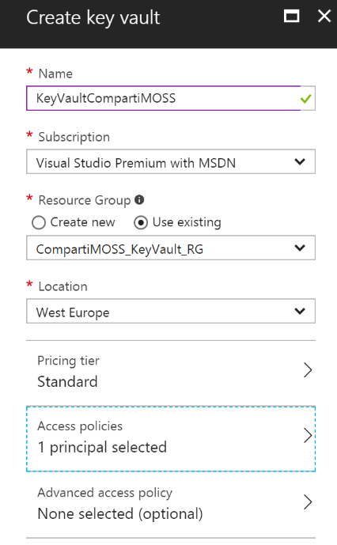
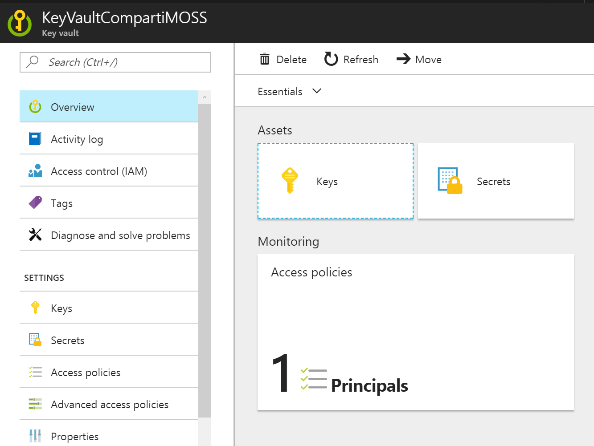
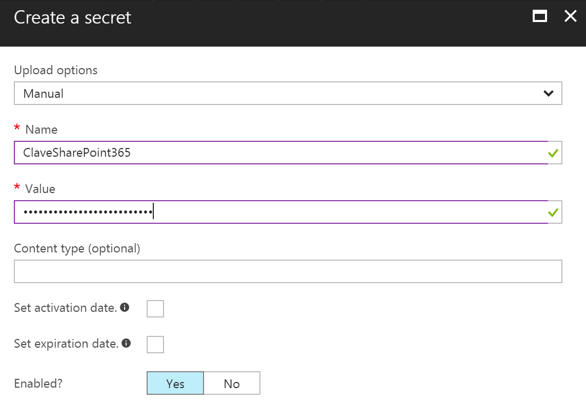
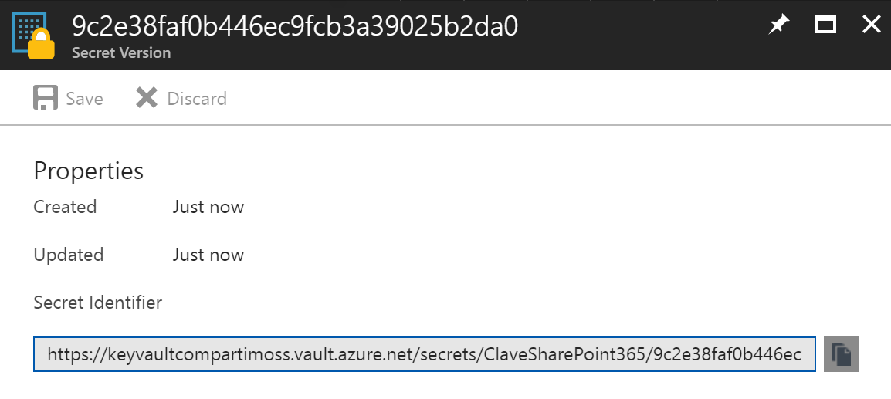
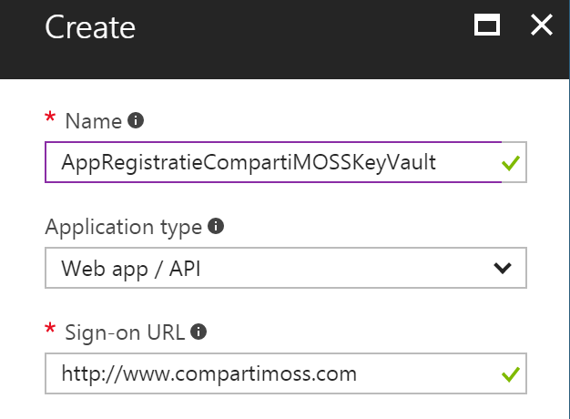
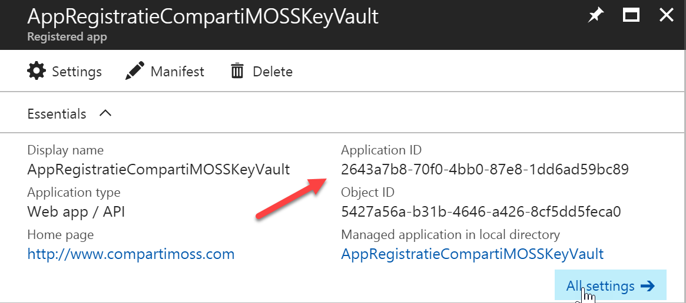
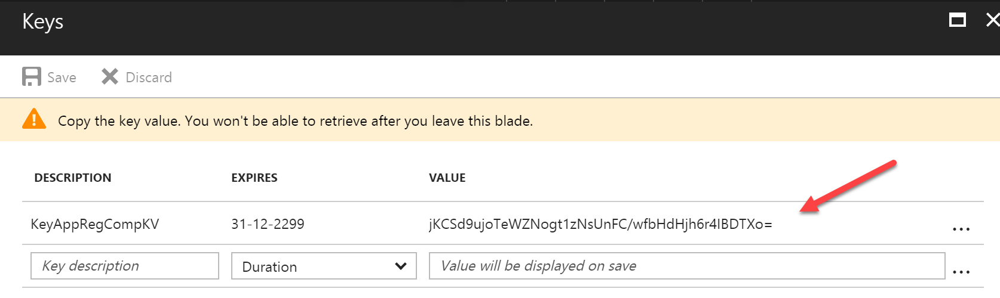
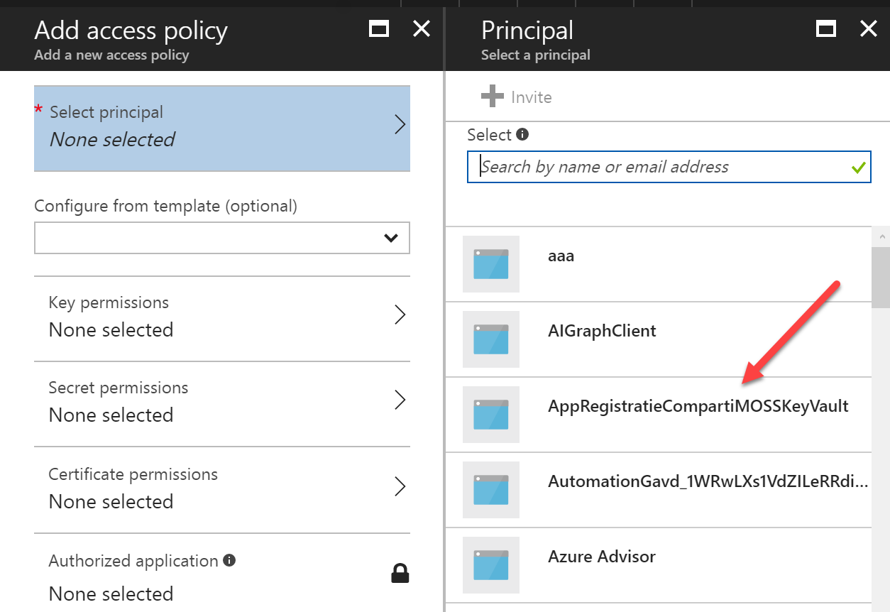
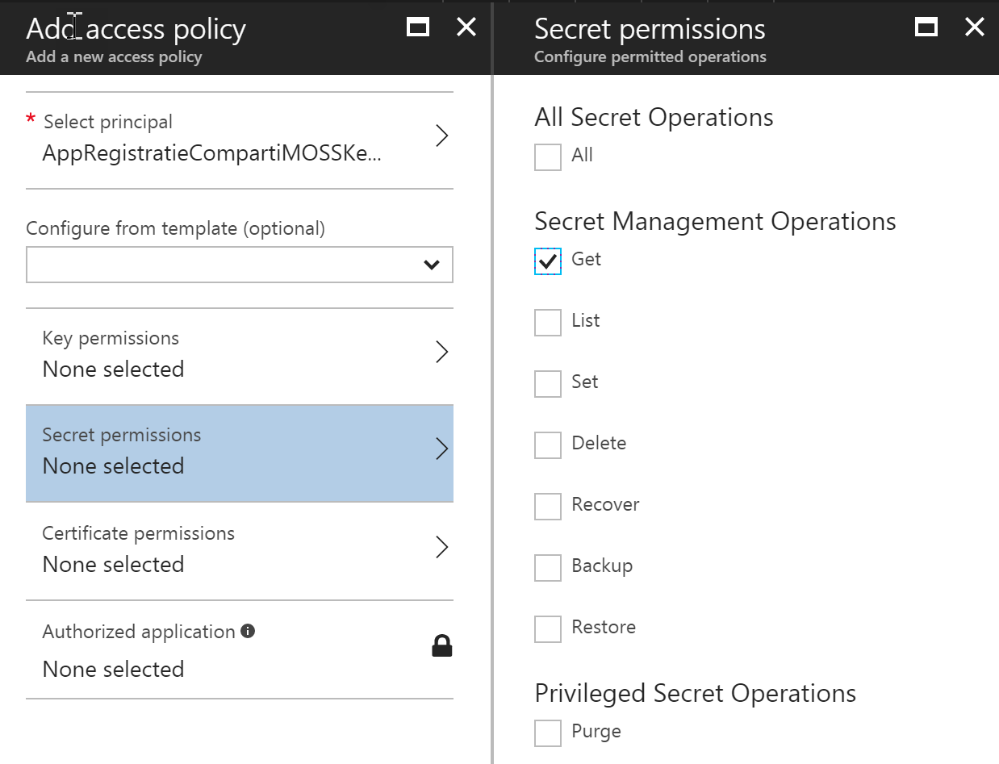

**Que es y cómo funciona el Azure Key Vault**

El Azure Key Vault es un depósito seguro para guardar claves ("secretos") y certificados en la nube. Azure utiliza hardware security modules (HSMs, módulos de hardware especializados para manejar claves digitales con gran seguridad) para encriptar y guardar físicamente las claves, y FIPS 140-2 Level 2 (Federal Information Processing Standard) para encriptar no solo las claves, sino todo el transporte de ellas desde y hacia los servidores. Microsoft mismo solo proporciona la infraestructura y mecanismos de transporte, pero no dispone de posibilidades técnicas para ver o extraer las claves de alguna forma. El Key Vault también contiene sistemas de logeo, monitoreo y manejo de eventos para poder mantener registros de quien y cuando ha accedido a alguna de las claves.

Un problema recurrente cuando se diseña integración entre diferentes sistemas es, por una parte, como mantener un mecanismo centralizado para claves de acceso de cada componente (aunque se utilice Single Sign On, SSO) y, por otra parte, como garantizar su seguridad de tal forma que la información nunca se vea comprometida, aun en el caso de acceso ilegal. El Azure Key Vault puede satisfacer ambos requisitos.

**El Azure Key Vault y SharePoint**

El Azure Key Vault puede contener dos tipos de información: certificados ("Keys", archivos del tipo .pfx) y pares nombre/valor ("Secretos"). Para recobrar la información es necesario que la aplicación sea conocida (y se pueda autorizar) con Azure AD, y disponer del URL de la clave o el secreto.

Las especificaciones del Key Vault indican que en cualquier periodo de 10 segundos es posible crear un máximo de 5 claves y realizar 2000 transacciones (lecturas), aunque si la carga de uso es mayor que estos parámetros, el sistema solamente reduce el ancho de banda (throttling), pero no deja de responder. El sistema también es redundante globalmente y de reducido precio (aproximadamente 2 céntimos de euro por cada 10.000 operaciones).

En el ejemplo en este artículo se va a tratar solamente como almacenar y recuperar programáticamente "secretos", es decir, pares nombre/valor. El ejemplo es una aplicación de consola que recupera una clave para logearse en SharePoint Online en Office 365, pero el ejemplo puede utilizarse para recuperar claves desde cualquier otro tipo de aplicación utilizando exactamente el mismo código.

**Configuración del Azure Key Vault**

1 - Crear un Grupo de Recursos de Azure:

-            Lóguese en el centro de Administración de Azure (http://portal.azure.com). Si no dispone de una cuenta, es posible crear una de prueba de 30 días desde el mismo sitio.

-            Desde la lista de Servicios en el menú del lado izquierdo seleccione Grupos de Recursos (Resource Groups).

-            Cree un Grupo de Recursos nuevo, especial para contener los recursos del ejemplo.

-            Es posible también reutilizar un Grupo de Recursos existente.

2 - Crear un Key Vault:

-            Una vez en el Grupo de Recursos, utilice el botón de "+Add" para crear un recurso, busque por "key Vault" en la casilla de búsqueda y seleccione "Key Vault" en los resultados

-            Asígnele un nombre al Key Vault y utilice los otros valores por defecto (que deben coincidir con los del Grupo de Recursos seleccionado). El "Pricing tier" "Standard" es el menos costoso



3 - Crear un Secreto:

-            El Key Vault no es más que un repositorio de "Keys" (certificados) y/o "Secrets" (pares nombre/valor). Una vez creado el Key Vault, haga clic sobre su nombre, lo que inicia la ventana de manejo del Vault



-            Haga clic sobre el botón de "Secrets".

-            Utilice el botón de "+Add".

-            Seleccione "Manual" en la casilla de "Upload options", defina un nombre para el secreto y en la casilla de "Value" escriba el valor a guardar (es decir, la clave de la cuenta de SharePoint que se va a utilizar para logearse desde la aplicación de consola). Si es necesario, es posible definir una fecha de inicio de uso del secreto y otra de expiración.



-            Una vez creado, refresque la ventana de los secretos, y haga clic sobre el secreto que acaba de crear. En la ventana que abre se puede ver que hay una sola versión del secreto en el momento (se pueden crear múltiples versiones si se requiere).

-            Haga clic sobre la versión mostrada y, en la ventana que abre anote el valor del "Secret identifier" que es el URL a utilizar desde la aplicación que va a requerir el valor de la clave.



4 - Registrar la aplicación

Toda aplicación que quiera hacer uso del Key Vault tiene que estar registrada en Azure AD para obtener acceso a la información

-            Desde el menú principal del Portal de Azure seleccione "Azure Active Directory".

-            En la ventana de manejo de AD haga clic sobre "App registrations".

-            Utilice el botón "+New application registration".

-            Defina un nombre para el registro, seleccione "Web app / API" y en "Sign-on URL" utilice un URL cualquiera (este valor no es utilizado, por lo que puede ser una cadena cualquiera en forma de URL).



-            Una vez creado el registro, haga clic sobre el nombre del registro creado y en la ventana de manejo del registro anote el valor de "Application ID" pues es necesario posteriormente.



-            En el menú de "Settings" haga clic sobre "Keys". Define un descriptor en la casilla de "Description", seleccione "Never expires" en "Expires" y utilice el botón de "Save". Guarde el valor mostrado en "Value" pues no es posible recobrarlo posteriormente.



5 - Conectar el Key Vault con el Registro de la aplicación:

-            Regrese al Grupo de Aplicaciones del Key Vault y haga clic sobre el nombre del Vault creado en el punto 2.

-            En la ventana de manejo del Vault (imagen 2) utilice el botón de "Principals".

-            En la ventana de "Access policies" utilice el botón de "+Add new".

-            En la ventana de "Add Access policy" haga clic sobre "Select principal". Una nueva ventana abre; espere un par de segundos hasta que los valores disponibles sean mostrados.

-            El nombre del Registro de la Aplicación creada en el punto 4 debe aparecer en la lista. Selecciónelo.



-            En la ventana de "Add Access policy" haga clic sobre "Secret permissions". En la ventana de "Secret permissions" seleccione "Get".



-            Guarde todas las modificaciones.

6 - Crear la aplicación:

-            Cree una nueva solución de Visual Studio del tipo "Aplicación de consola".

-            Instale los paquetes de NuGet llamados "Microsoft.IdentityModel.Clients.ActiveDirectory" y "Microsoft.Azure.KeyVault".

-            Agregue una referencia a "System.Configuration".

-            Agregue directivas a "using Microsoft.IdentityModel.Clients.ActiveDirectory;" y "using System.Configuration;".

-            Abra el archivo "App.config" y agregue la siguiente sección con los datos del "appSettings":

```
  <appSettings>
```

```
    <add key="ApplicationIDRegistration" value="2643a7b8-70f0-..." />
```

```
    <add key="ApplicationKeyValueRegistration" value="jKCSd9ujoTeWZNogt1..." />
```

```
    <add key="KeyVaultSecretURL" value="https://dominio.vault.azure.net/secrets/nombre/9c2e38..." />
```

```
  </appSettings>
```


El valor de "ApplicationIDRegistration" es el valor indicado en la Imagen 6. El valor de "ApplicationKeyValueRegistration" es el que se obtuvo según la Imagen 7. Finalmente, el valor de "KeyVaultSecretURL" es el mostrado en la Imagen 4.

-            Para obtener un Token de autorización de Azure AD, utilizando el Registro de la Aplicación, agregue el siguiente método en el código del archivo "Program.cs":​

```
public static async Task<string> GetToken(string authority, string resource, string scope)
```

```
{
```

```
    var authContext = new AuthenticationContext(authority);
```

```
    ClientCredential clientCred = new ClientCredential(ConfigurationManager.AppSettings["ApplicationIDRegistration"],
```

```
                ConfigurationManager.AppSettings["ApplicationKeyValueRegistration"]);
```

```
    AuthenticationResult result = await authContext.AcquireTokenAsync(resource, clientCred);
```

```
 
```

```
    if (result == null)
```

```
        throw new InvalidOperationException("No se pudo obtener el Token JWT");
```

```
 
```

```
    return result.AccessToken;
```

```
}
```

-            Finalmente, en el método "Main" de "Program.cs" incluya el siguiente código que primero obtiene el Token de AD, y luego recobra la clave del Key Vault utilizando el URL del Secreto:   ​

```
static void Main(string[] args)
```

```
{
```

```
    var kvToken = new KeyVaultClient(new KeyVaultClient.AuthenticationCallback(GetToken));
```

```
    var kvSecret = kvToken.GetSecretAsync(ConfigurationManager.AppSettings["KeyVaultSecretURL"]).Result;
```

```
    Console.WriteLine(kvSecret.Value);
```

```
}
```

-            Ejecute el programa y controle que en el objeto "kvSecret" se encuentra el valor de la clave guardada en el Key Vault

-            Con la clave se puede logear en SharePoint 365, SharePoint On-Prem, o cualquier otro tipo de sistema externo


**Conclusión**

El Azure Key Vault ofrece un depósito centralizado para guardar cualquier tipo de pares nombre/valor de forma encriptada y segura. Por medio de las clases de DotNet del Vault es posible recobrar los valores para utilizarlos en cualquier tipo de programa que los requiera, incluyendo a SharePoint en la nube y/o On-Premises. El Azure Key Vault es un sistema de alto rendimiento, distribuido globalmente y de bajo costo.


**Gustavo Velez**
 MVP Office Servers and Services
 gustavo@gavd.net

http://www.gavd.net

