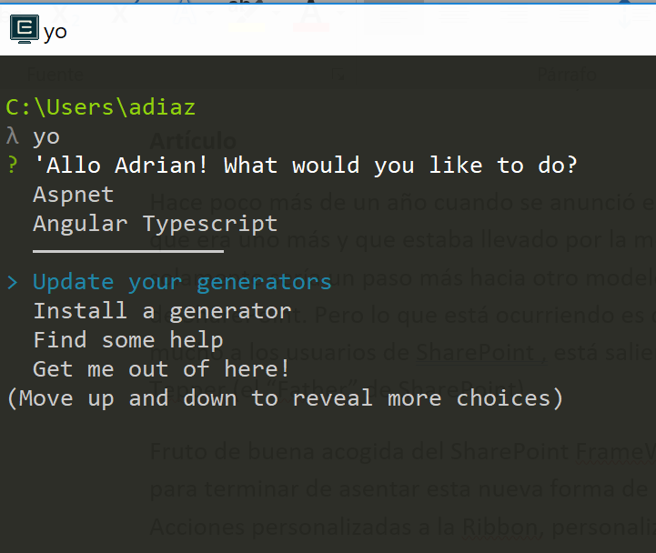
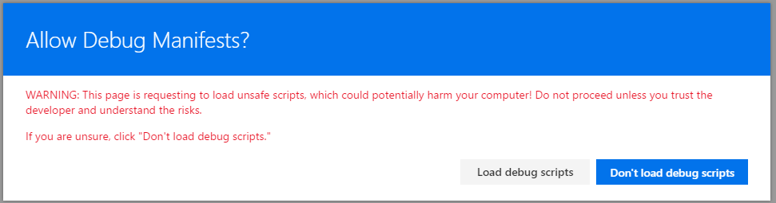

import ArticleHeader from '../../../components/article-header'

<ArticleHeader frontmatter={props.pageContext.frontmatter} />


Hace poco más de un año cuando se anunció el nuevo modelo de desarrollo para SharePoint. Mucha gente pensaba que era uno más y que estaba llevado por la moda de desarrollo en el lado del FrontEnd: Gulp, NodeJS, ReactJS, etc; y que solamente sería un paso más hacia otro modelo de desarrollo, el cuarto en las últimas tres versiones de SharePoint. Pero lo que está ocurriendo es que esta nueva forma de desarrollo está gustando mucho a los usuarios de SharePoint, está saliendo el sol otra vez en SharePoint como anuncio Jeff Tepper (el "Father" de SharePoint).

Fruto de buena acogida del SharePoint Framework, el equipo de producto era consciente de que para terminar de asentar esta nueva forma de desarrollo faltaban muchos artefactos: Añadir Acciones personalizadas a la Ribbon, personalización de campos de listas, inyectar de una forma "elegante" JavaScript y html y no estar sufriendo de una futura modificación del DOM, etc. Y por si fuera poco algo que la comunidad solicitaba es que no se inventaran algo diferente a como se hacen el resto de cosas. Un claro ejemplo de esto lo tenemos en las formas de personalizar las Vistas de las listas primero un XSLT (que recuerdos), posteriormente JSLink. Ahora con las SPFX Extensions el equipo de producto ha conseguido que todo lo relacionado con esta forma de desarrollo se hace con el mismo tooling de herramientas.

A lo largo de este articulo vamos a ver en qué consisten las SPFX Extensions, que tipos de extensiones podemos desarrollar y veremos cómo empezar a utilizarlas.

**NOTA:** Actualmente las SPFX Extensions solamente se pueden utilizar en entornos de desarrollo, no se pueden poner en ningún entorno de producción

**Manos a la obra**

Para empezar a utilizar los SPFX Extensions, tendremos que instalarnos la plantilla de Yeoman que ha implementado el equipo de producto.  En caso de que tengamos ya instalada la versión anterior habrá que actualizar la plantilla.

**Consejo:**En el caso de que tengamos una versión anterior de este template es recomendable actualizarlo mediante el propio Yeoman. Para ello desde la consola de NodeJS, escribíos Yo y seleccionamos la opción de actualizar la plantilla correspondiente.



Cuando la plantilla se actualiza, ejecutamos la siguiente instrucción:


| <br />```<br />>yo @microsoft/sharepoint<br />```<br /> |
| --- |


Una vez ejecutamos la instrucción, nos realizará una serie de preguntas: si queremos guardar la solución en la misma carpeta o en otra, si queremos activar que nuestra solución se despliegue en todos los sitios donde se instale. Cuando contestemos estas preguntas, el generador nos pedirá que seleccionemos si queremos implementar un WebPart o una Extensions (Preview). En este caso seleccionamos Extensions (Preview), y a continuación dentro de esta pantalla nos indicará que tipo de Extensión queremos implementar:

- **Application Customizer****à** Este tipo de Extensión permite inyectar ficheros JS de una forma elegante y sin tener que estar haciendo triquiñuelas no muy ortodoxas.  De la misma forma también podemos añadir Html en determinados PlaceHolders, ahora mismo el equipo de producto permite añadir en dos placeholder: en el header y en el footer. Ejemplos de cosas que podemos en estas Extensions: poner referencias a ficheros JavaScript (sin tener que incluirlos en la master), también poner elementos como Google Analytics o Application Insights, o inclusive montar una Línea de Migas (breadcrumps) o algún menú personalizados.
- **Field Customizer**à  Con este tipo de Extensión lo que nos va a permitir es poder modificar la forma en la que se comporta un campo de una Lista. Es el sustituto de JSLink el cual deberemos de dejar de utilizarlo una vez se habilite las Extensions en entornos productivos.
- **ListView Command Set**à Permite añadir nuevas acciones en las listas. Es decir, viene a reemplazar las tradicionales Custom Actions.


**¿Qué debemos saber de cada tipo para empezar a desarrollar?**

En primer lugar, para el desarrollo de las Extensions como hemos comentado se utiliza el mismo "Tooling" de herramientas que con los WebParts. Ahora bien, muchos os preguntareis que framework escoger, en este caso el equipo de producto ha montado todos los ejemplos utilizando ReactJS. Para el uso de los WebParts muchos equipos de desarrollo pueden pensar que es mucho mejor utilizar otro framework o librería, pero para las extensions el equipo de producto no ha propuesto otra alternativa. Particularmente creo que en esta ocasión me parece una buena opción dado que permitir añadir complejidad en pequeños trozos de código me parece que solamente provocaría errores y reingeniería. ¿Con esto se quiere decir que debo aprender ReactJS? Sí, ahora mismo ya no solo SPFX esta implementado en ReactJS sino que muchas de las aplicaciones que está desarrollando Microsoft utilizan esta librería de Facebook junto con Redux y consiguen resultados muy chulos. Pero que quede claro que para el tema de los WebParts cada equipo de desarrollo puede utilizar el que quiera o el que mejor se adapte a las cualidades de dicho equipo.

**Application Customizer-&gt;**En este tipo de extensión cuando la creamos en la plantilla se crea una carpeta con el nombre que hemos puesto en el generados que se encuentra dentro de la carpeta src-&gt; Extensión. Dentro de esta carpeta tenemos dos ficheros: uno el fichero TypeScript y otro el archivo manifest.json en el que tendremos el identificador y el versionado de la versión (estos datos se utilizarán más adelante para la depuración de la misma).

En el fichero de TypeScript hay una clase que extiende una clase BaseApplicationCustomizer. De esta clase tendremos dos métodos donde añadir nuestro código: OnRender y OnInit. Dentro del OnInit añadiremos las acciones que se harán antes de hacer cualquier acción: Ejemplo llamada a una Api para la carga de datos. Dentro del OnRender implementaremos las acciones a realizar en el momento de "pintar" esta Extensión en la página.

Ejemplo: Ahora vamos a ver cómo podemos añadir un HTML tanto en el Header como en el Footer de cualquier página "moderna" de SharePoint. Dentro de este tipo de Extensiones disponemos de dos "placeHolder" en lo que podemos añadir nuestra personalización para ello lo que tenemos que hacer es en el método "OnRender" añadir el siguiente código:


| <br />```<br />@override  public onRender(): void {      var _headerPlaceholder: Placeholder;     var _footerPlaceholder: Placeholder;    if (!_headerPlaceholder) {      _headerPlaceholder = this.context.placeholders.tryAttach(     'PageHeader',        {          onDispose: this._onDispose       });      if (_headerPlaceholder.domElement) {        _headerPlaceholder.domElement.innerHTML = `                <div >  <div class="ms-bgColor-themeDark ms-fontColor-white ">                    <i class="ms-Icon ms-Icon--Info" aria-hidden="true"></i>&nbsp; Header                  </div> </div>`;      }}        if (!_footerPlaceholder) {      _footerPlaceholder = this.context.placeholders.tryAttach(       'PageFooter',        {      onDispose: this._onDispose      });      if (!_footerPlaceholder) {        console.error('The expected placeholder (PageFooter) was not found.');        return;      }      if (_footerPlaceholder.domElement) {        _footerPlaceholder.domElement.innerHTML = `                <div > <div class="ms-bgColor-themeDark ms-fontColor-white ">                    <i class="ms-Icon ms-Icon--Info" aria-hidden="true"></i>&nbsp; Footer                  </div> </div>`;      }    }  }        private _onDispose(): void {    console.log('[CustomHeader._onDispose] Disposed custom header.');  }<br />```<br /> |
| --- |


De dicho código no hay mucha complejidad, solamente saber que para utilizar el tipo "PlaceHolder" deberemos de añadir el import de dicho PlaceHolder que se encuentra dentro '@microsoft/sp-application-base'.

**ListView Command Set-&gt;**Dentro de este tipo de extensiones, al igual que en la anterior extensión se crea una carpeta con el nombre que le hemos puesto. En dicha carpeta tenemos de la misma forma dos ficheros: el manifest y el fichero TypeScript. En el fichero TypeScript se crea una clase con el nombre de la Extension que extiende la clase base BaseListViewCommandSet. En esta clase dispondremos de tres métodos: OnInit, OnRefresh, OnExecute.

El método OnInit es el que se ejecuta cuando se inicializa este tipo de Extensions.

El método OnRefresh se ejecutará cada vez que se vuelva a lanzar esta extensión, es interesante controlar este método, porque es posible que hay algún tipo de acción que no dependiendo de algunos valores o por el tipo de permisos que tiene no nos interese que esta acción este activa. En el método OnExecute es la función que se ejecutará cuando el usuario pulse click sobre esta acción, dentro de una Extensión podemos disponer más de una acción, pero solamente tendremos un método, por ello en este método tendremos que ver cuál es la acción que nos ha invocado y posteriormente añadir el código que vamos a implementar.

Ahora bien, ¿cómo añadimos cuantas acciones están dentro de esta Extension? Para añadir las acciones que va a tener esta extensión, iremos al fichero de manifiesto (nombredelaextension.manifest.json) y hay un nodo que se llama "Commands" en cada uno de ellos debemos de poner el nombre de nuestra Acción como nodo principal con dos propiedads Title e Icon que vamos a poner quedaría de la siguiente forma:


| <br />```<br />  "commands": {        "Validar": {            "title": "Validate",            "iconImageUrl": "icons/request.png"        },        "Descartar": {            "title": "Descartar",            "iconImageUrl": "icons/cancel.png"        }<br />```<br /> |
| --- |


Del código de la clase lo más interesante seria como podemos acceder al elemento que nos está llamando, para ello en el método OnExecute tiene un parámetro que es event: IListViewCommandSetExecuteEventParameters dentro de esta clase dispondremos de diversas propiedades como puede ser "Rows" en la que estará la información de las columnas seleccionadas. También en el evento OnRefreshCommand dispondremos de una variable similar en la que disponemos de dicha información. Ejemplo: Queremos que se muestre la  Extensions cuando por lo menos hayamos seleccionado algún elemento de la tabla, para ello podemos utilizar el siguiente código, en el método OnRefresh:


| <br />```<br />    @override  public onRefreshCommand(event: IListViewCommandSetRefreshEventParameters): void {    // The command is only visible if multiple list items are selected    event.visible = event.selectedRows.length > 1;  }    }<br />```<br /> |
| --- |


**​Field Customizer -&gt;**La novedad que hay en la última actualización del generador de plantillas, es que pregunta si queremos utilizar React o si por el contrario no queremos utilizar ningún framework JavaScript. Como he comentado anteriormente no creo que para un fragmento de código pequeño tengamos que estar haciendo sobre ingeniería intentando meter otro framework. Además, el propio React ya está en el propio Framework con lo que para mí esta pregunta es un poco repetitiva y no aporta ningún valor.

De la misma forma que en las otras "extensions", se crea una carpeta con el nombre de la extensión con dos ficheros un fichero TypeSript y un fichero json con el manifiesto de la aplicación. En este caso en el manifiesto no tendremos que modificar nada e iremos al fichero TypeScript. En el mismo hay una clase que en esta ocasión extiende el funcionamiento de la clase BaseFieldCustomizer. En esta clase dispondremos de tres métodos OnInit, OnRenderCell, OnDisposeCell. En el OnInit es un método exactamente igual que en los otros tipos de Extensions. En el método OnRenderCell tendremos que añadir el código que queremos implementar para modificar el comportamiento de dicho "Field" para ello este método tiene un parámetro event: IFieldCustomizerCellEventParameters en el que se tendrá todos los valores de dicho campo. Por ejemplo, si sobre un campo queremos añadir unos paréntesis sobre el mismo podríamos utilizar el siguiente código:


| <br />```<br />  @override  public onRenderCell(event: IFieldCustomizerCellEventParameters): void {    const text: string = '[' + CellFormatter.renderAsText(this.context.column, event.cellValue) + ']';    const customizeField: React.ReactElement<{}> =      React.createElement(CustomizeField, { text } as ICustomizeFieldProps);    ReactDOM.render(customizeField, event.cellDiv);  }<br />```<br /> |
| --- |


**¿Como probamos/depuramos las Extensions?**

Esta es la parte que el equipo de producto ha dejado un poco más "floja" si con los WebParts disponíamos de un Workbench en local que lo levantábamos y podíamos probar el correcto funcionamiento del mismo, ahora mismo no disponemos de algo similar. Para probar su correcto funcionamiento, tendremos que tener un tenant en una subscripción de desarrollo y levantar nuestro servidor node local. En este caso levantaremos nuestro servidor local (NodeJS) sin ningún tipo navegador para ello ejecutamos la siguiente instrucción:

```
> gulp server​
```

A continuación, vamos a la lista de SharePoint donde queremos hacer las pruebas. Antes de continuar, comentar que dependiendo del tipo de Extensión que vayamos a depurar tendremos que añadir unos parámetros u otros en la url.

Para depurar una Application Customizer tendremos las siguientes propiedades:


| <br />```<br />?loadSPFX=true&debugManifestsFile=https://localhost:4321/temp/manifests.js&customActions={"d03ae0c2-bbbf-4cf5-9ff7-0986904553da":{"location":"ClientSideExtension.ApplicationCustomizer","properties":{"testMessage":"Hello as property!"}}}<br />```<br /> |
| --- |


Donde los parámetros de la Query String quieren decir lo siguiente:

- loadSPFX: fuerza a que las librerías que forman el SharePoint Framework estén cargadas en la página.
- debugManifestFile: indica la ubicación donde tenemos el manifiesto, esto apuntara a nuestro servidor local.
- CustomAction: Aquí indicaremos el identificador de la Extensión (el cual se encuentra dentro del fichero de manifiesto. A continuación, hay otra propiedad que indica que tipo de Extension es la que vamos a testear por ejemplo "ClientSideExtension.ApplicationCustomizer, y otra propiedad en la que añadiremos aspectos de configuración de nuestra extensión, en caso de que tenga.


Una vez carga la página, se mostrará un mensaje indicando si permitimos depurar "Manifest". Es decir que vamos a cargar scripts que no están alojados en SharePoint y que esto puede ser peligroso. Naturalmente aceptamos la carga de estos scripts, porque de caso contrario nuestro desarrollo no podríamos probarlos.



Para depurar un Field Customizer la url que tendremos que generar será del siguiente tipo:


| <br />```<br />?loadSPFX=true&debugManifestsFile=https://localhost:4321/temp/manifests.js&customActions={"d03ae0c2-bbbf-4cf5-9ff7-0986904553da":{"location":"ClientSideExtension.ApplicationCustomizer","properties":{"testMessage":"Hello as property!"}}}<br />```<br /> |
| --- |


Los dos primeros parámetros son exactamente iguales en todos los tipos de extensiones. Después tendremos que añadir una propiedad fieldCustomizer donde tendremos que indicar el nombre del campo sobre el que queremos aplicar nuestro campo personalizado (En el ejemplo un campo que se llama Percent) y sobre el mismo el identificador de dicha extensión.

Para depurar las Custom Actions la url es más semejante a las de tipo Applicattion Customizer, la Url es del siguiente estilo:


| <br />```<br />loadSpfx=true&debugManifestsFile=https://localhost:4321/temp/manifests.js&customActions={"81b6a3d7-e408-43a4-8ef1-180d0f2582cc":{"location":"ClientSideExtension.ListViewCommandSet.CommandBar"}}<br />```<br /> |
| --- |


La generación de estas url es un poco engorrosa y por este motivo la comunidad ha creado una tarea de Gulp que se encarga de simplificarte esta depuración. Consiste que cuando arrancas el servidor muestra por pantalla todas estas Url de todas las extensiones que tengas en esa solución. Para instalarte esta extensión basta con seguir las siguientes instrucciones: [https://github.com/SharePoint/sp-dev-build-extensions/tree/master/gulp-tasks/serve-info#setup](https&#58;//github.com/SharePoint/sp-dev-build-extensions/tree/master/gulp-tasks/serve-info)

**Resumen**

El SharePoint Framework ha venido para quedarse, si todavía piensas que es una moda pasajera ve cambiando la opinión y centra tus esfuerzos en "reciclarte" a los nuevos tiempos. React, TypeScript, WebPack, Yeoman, Gulp y Code son herramientas con las que debes familiarizarte.  Todas estas novedades que se están mostrando, lo que está provocando es que se pueda desarrollar sobre SharePoint Online y podamos hacer todo lo que hacíamos con código en el servidor. SharePoint por fin ha llegado al momento en el que la versión Online es superior a la OnPremises y sobre todo con un tooling de herramientas modernas y muy interesantes para el desarrollador. Por fin podemos decir que vuelve a salir el Sol para el desarrollador de SharePoint.


**Adrián Diaz Cervera -- Architect Software Lead at Encamina**

MVP Office Development

[http://blogs.encamina.com/desarrollandosobresharepoint](http&#58;//blogs.encamina.com/desarrollandosobresharepoint)

[http://geeks.ms/blogs/adiazcervera](http&#58;//geeks.ms/blogs/adiazcervera)

adiaz@encamina.com @AdrianDiaz81

