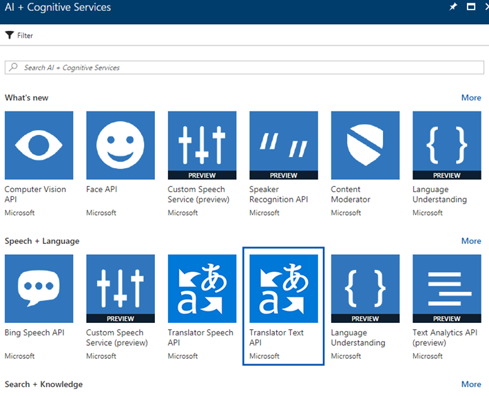
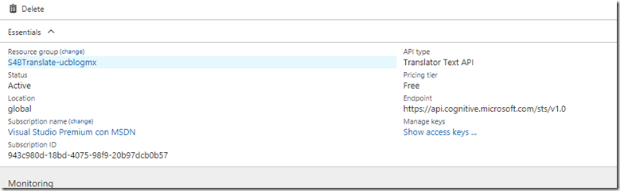
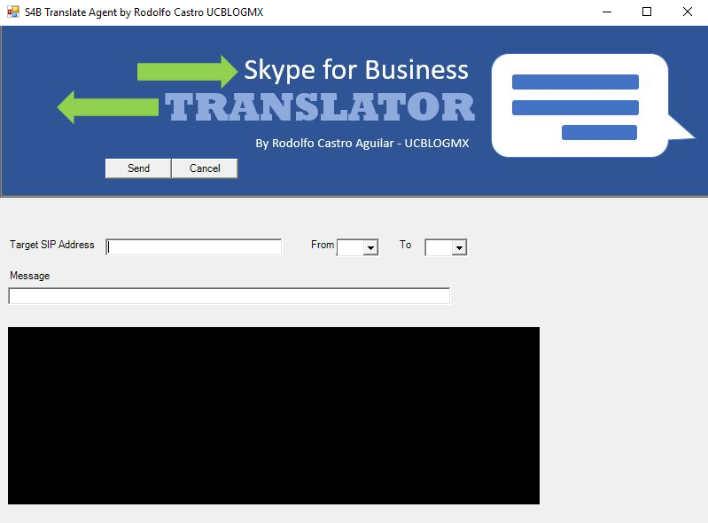
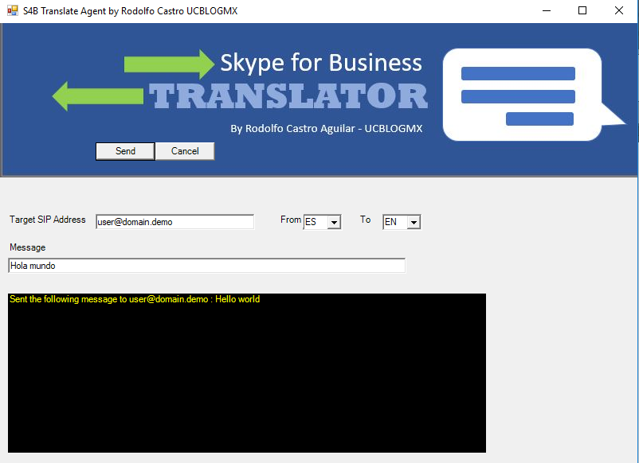

Mediante el uso de Powershell y la posibilidad de conectarse a los Azure Cognitive Services, es que fue posible la traducción con el cliente de Skype for Business. Y utilizando el Lync SDK el cual nos permite igualmente mediante Powershell tener control directamente desde el cliente, sin depender de algún servicio o conectarnos al UCWA, podemos enviar los mensajes al destino que elijamos.

En esta primera etapa, el proyecto solamente envía Mensajes Instantáneos ya traducidos, aun no puede traducir los mensajes que se envían.

Sin más, aquí la descripción de cómo es que fue configurado y cómo funciona nuestro traductor:

·       Primero, necesitas crear un servicio en tu portal de Azure, (sí, necesitas una suscripción de Azure).Abre tu Portal de Administracion de Azure, y ve o busca Cognitive Service, y selecciona Translator Text API.



·       Crea un nuevo servicio y selecciona la opción gratuita, te permitirá traducir hasta 2 Millones de caracteres sin ningún costo.



·       Una vez creado, copia las llaves de acceso, ya que las necesitaras más adelante en el script. Da clic en show Access keys y copia la Key 1.

·       Ahora vamos a crear y configurar nuestro script. La siguiente es la función de Translate, la principal del script. Aquí solo necesitas reemplazar el accountKey con el de tu servicio para que comience a funcionar.

```
function Translate {$target = $PrtTextBox.Text.toString() #obtiene el SIP Address destino del Textbox en la Interfaz Grafica$accountKey = "<Aquí ingresas el Key de tu Servicio>"$tokenServiceURL = "https://api.cognitive.microsoft.com/sts/v1.0/issueToken"$query = "?Subscription-Key=$accountKey"$uri = $tokenServiceUrl+$query#Crea el token y se autentica$token = Invoke-RestMethod -Uri $uri -Method Post$token$auth = "Bearer "+$token$header = @{Authorization = $auth}$header#Toma los valores de las listas en la interfaz grafica, para el idioma original y el idioma a traducir, asi como el mensaje$fromLang = $DropDownBox.SelectedItem.ToString()$toLang = $DropDownBox2.SelectedItem.ToString()$text = $PrtTextBox2.text.toString()$translationURL = "http://api.microsofttranslator.com/v2/Http.svc/Translate"$query = "?text=" + [System.Web.HttpUtility]::UrlEncode($text)$query += "&from=" + $fromLang$query += "&to=" + $toLang$query += "&contentType=text/plain"$uri = $translationUrl+$query$ret = Invoke-RestMethod -Uri $uri -Method Get -Headers $header$ret.OuterXml$message= $ret.string.'#text'#Valida que se tenga la DLL para Lyncif (-not (Get-Module -Name Microsoft.Lync.Model)){try{# Necesitas cambiar la ubicación de la DLL de acuerdo a como la tengas en tu ambienteImport-Module "C:\Program Files (x86)\Microsoft Office 2013\LyncSDK\Assemblies\Desktop\Microsoft.Lync.Model.dll" -ErrorAction Stop}catch{Write-Warning "Microsoft.Lync.Model not available, download and install the Lync 2013 SDK http://www.microsoft.com/en-us/download/details.aspx?id=36824"}}# Se conecta a la sesión actual de Skype for Businesstry{$client = [Microsoft.Lync.Model.LyncClient]::GetClient()}catch{Write-Host "`nMust be signed-in to Skype"break}#Inicia la conversacion$msg = New-Object "System.Collections.Generic.Dictionary[Microsoft.Lync.Model.Conversation.InstantMessageContentType, String]"#agrega el mensaje$msg.Add(1,$message)# agrega el Sip address destinotry{$contact = $client.ContactManager.GetContactByUri($target)}catch{Write-Host "`nFailed to lookup Contact"$targetbreak}# Crea la conversacion$convo = $client.ConversationManager.AddConversation()$convo.AddParticipant($contact) | Out-Null# configura el mensaje como IM$imModality = $convo.Modalities[1]# Envia el mensaje$imModality.BeginSendMessage($msg, $null, $imModality) | Out-Null# suprime la UI de Skype for Business$convo.End() | Out-Null$Label3.Text = "Sent the following message to $target : $message"}​
```

·       Una vez que tenemos la función, crearemos la interfaz gráfica.

```
$path = Get-location$Prtform = New-Object Windows.Forms.Form$Prtform.StartPosition = "CenterScreen"$Prtform.text = "S4B Translate Agent by Rodolfo Castro UCBLOGMX"$Image = [system.drawing.image]::FromFile("$path\Image\SfBTranslator.jpg")$Prtform.BackgroundImage = $Image$PrtForm.BackgroundImageLayout = "None"$PrtForm.Width = $Image.Width$PrtForm.MinimumSize = New-Object Drawing.Size @($Image.width,800)$PrtForm.MaximumSize = New-Object Drawing.Size @($Image.width,800)#$PrtForm.AutoSize = $True$Label = New-Object System.Windows.Forms.Label$Label.Text = "Target SIP Address"$Label.AutoSize = $True$label.Location = New-Object System.Drawing.Size(10,240)$PrtForm.Controls.Add($Label)$Label3 = New-Object System.Windows.Forms.Label$Label3.Size = New-Object System.Drawing.Size(600,200)$label3.Location = New-Object System.Drawing.Size(10,340)$label3.BackColor = "Black"$label3.Forecolor = "Yellow"$PrtForm.Controls.Add($Label3)$PrtTextBox = New-Object System.Windows.Forms.TextBox$PrtTextBox.Location = New-Object System.Drawing.Size(120,240)$PrtTextBox.Size = New-Object System.Drawing.Size(200,20)$PrtForm.Controls.Add($prtTextBox)$Label5 = New-Object System.Windows.Forms.Label$Label5.Text = "From"$Label5.AutoSize = $True$label5.Location = New-Object System.Drawing.Size(350,240)$PrtForm.Controls.Add($Label5)$Label6 = New-Object System.Windows.Forms.Label$Label6.Text = "To"$Label6.AutoSize = $True$label6.Location = New-Object System.Drawing.Size(450,240)$PrtForm.Controls.Add($Label6)$Label2 = New-Object System.Windows.Forms.Label$Label2.Text = "Message"$Label2.AutoSize = $True$label2.Location = New-Object System.Drawing.Size(10,275)$PrtForm.Controls.Add($Label2)$PrtTextBox2 = New-Object System.Windows.Forms.TextBox$PrtTextBox2.Location = New-Object System.Drawing.Size(10,295)$PrtTextBox2.Size = New-Object System.Drawing.Size(500,600)$PrtTextBox2.MinimumSize = New-Object Drawing.Size @(500,600)$PrtTextBox2.MaximumSize = New-Object Drawing.Size @(500,600)$PrtForm.Controls.Add($prtTextBox2)$OKButton = New-Object System.Windows.Forms.Button$OKButton.Location = New-Object System.Drawing.Size(120,150)$OKButton.Size = New-Object System.Drawing.Size(75,23)$OKButton.Text = "Send"$OKButton.Add_Click({Translate($null)})$PrtForm.Controls.Add($OKButton)$CancelButton = New-Object System.Windows.Forms.Button$CancelButton.Location = New-Object System.Drawing.Size(195,150)$CancelButton.Size = New-Object System.Drawing.Size(75,23)$CancelButton.Text = "Cancel"$CancelButton.Add_Click({$PrtForm.Close()})$PrtForm.Controls.Add($CancelButton)$DropDownBox = New-Object System.Windows.Forms.ComboBox$DropDownBox.Location = New-Object System.Drawing.Size(380,240)$DropDownBox.Size = New-Object System.Drawing.Size(50,20)$DropDownBox.DropDownHeight = 100$PrtForm.Controls.Add($DropDownBox)$List=@("ES","EN","FR","DE","IT","BG","AF","BP","JA","KLI","HE")foreach ($item in $List) {$DropDownBox.Items.Add($item)}$DropDownBox2 = New-Object System.Windows.Forms.ComboBox$DropDownBox2.Location = New-Object System.Drawing.Size(480,240)$DropDownBox2.Size = New-Object System.Drawing.Size(50,20)$DropDownBox2.DropDownHeight = 100$PrtForm.Controls.Add($DropDownBox2)foreach ($item in $List) {$DropDownBox2.Items.Add($item)}$PrtForm.ShowDialog()​
```

·       Quedará algo como esto:



·       Los valores que se solicitan en la interfaz gráfica resultante son:

o   Target SIP Address : Dirección a la cual enviara el mensaje

o   From : idioma original

o   To: idioma al que traducirá

o   Message: Mensaje a ser traducido

o   Send: Enviar y traducir

o   Cancel: Cerrar y cancelar

·       Entonces seleccionamos todos los valores que deseamos. Y damos clic en Send.



·       En este ejemplo estaré enviando un mensaje del español al inglés. La cantidad de idiomas que podemos traducir, es básicamente los que soporta Azure, al día de hoy son 60 idiomas para la traducción de Texto.


Espero les haya gustado este artículo, no olviden seguirme en mis redes sociales.


**Rodolfo Castro Aguilar**
 MVP Office Server and Services
 SFB User Group: [https://www.facebook.com/groups/S4BUGIberoamerica/](https://www.facebook.com/groups/S4BUGIberoamerica/)

Twitter : @ucblogmx
 http://ucblogmx.com

 
 
import LayoutNumber from '../../../components/layout-article'
export default LayoutNumber
