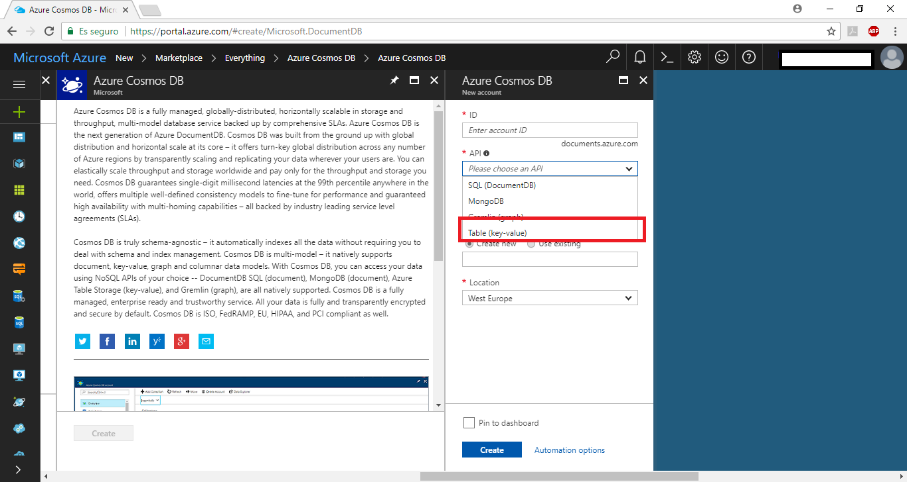
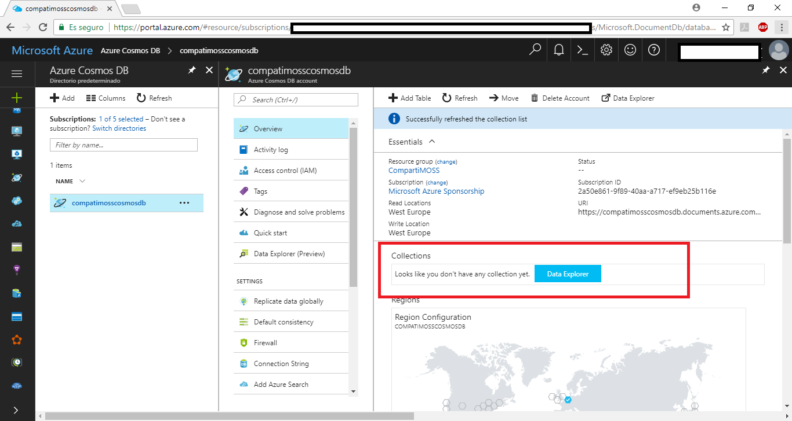
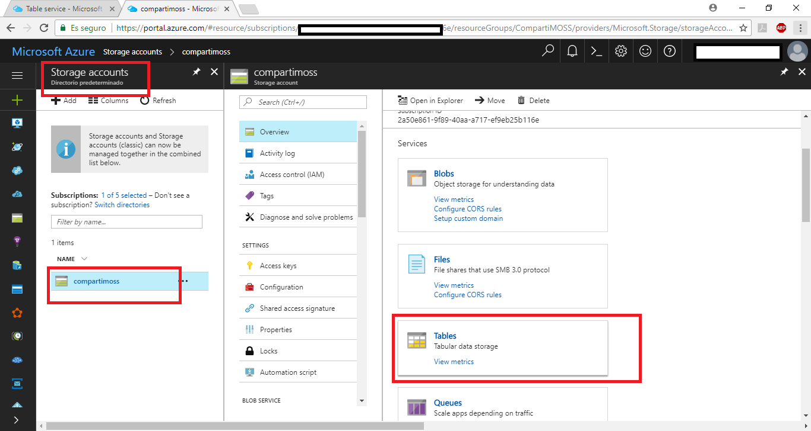
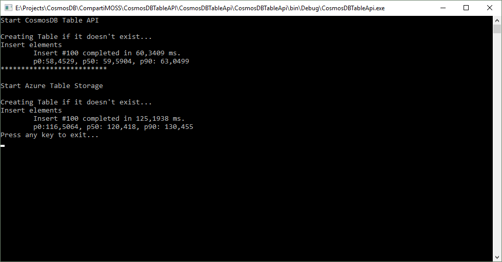
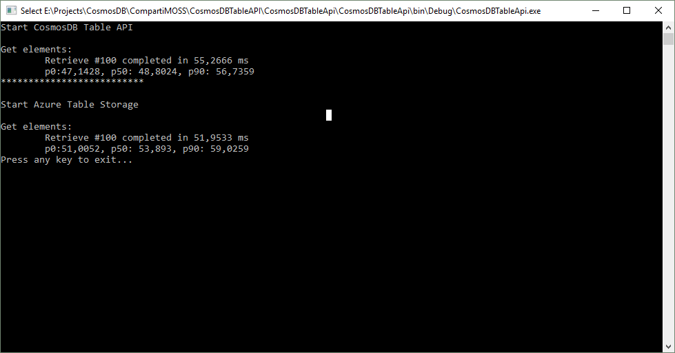
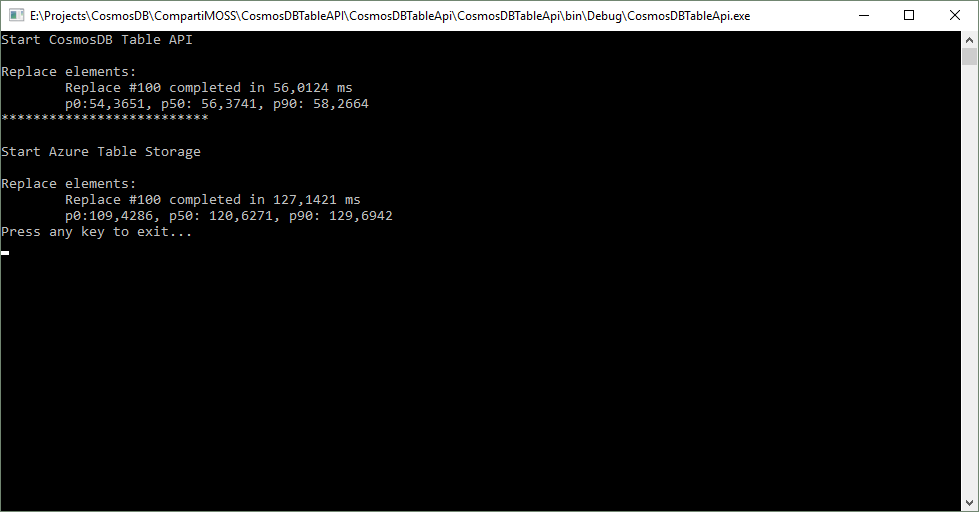

import ArticleHeader from '../../../components/article-header'

<ArticleHeader frontmatter={props.pageContext.frontmatter} />


En el Build 2017 Microsoft dio a conocer su nuevo servicio Cosmos DB ([https://docs.microsoft.com/en-us/azure/cosmos-db/](https&#58;//docs.microsoft.com/en-us/azure/cosmos-db/)).

Entre muchas de las características que hacen que Cosmos DB sea un servicio muy interesante está que es multi modelo, es decir, con un mismo servicio podemos utilizar cuatro tipos diferentes de persistencia de datos, en este caso: DocumentDB, MongoDB, Azure Table Storage y Gremlin (grafos).

En este articulo vamos a ver cómo usar Azure Table Storage a través de Cosmos DB Table API. Debemos tener en cuenta que esta API se encuentra todavía en *preview*.

**¿Cuándo utilizar Cosmos DB Table API y por qué?**

Cosmos DB Table API proporciona las mismas funcionalidades que Azure Table Storage pero con las ventajas y beneficios del servicio Cosmos DB.

Lo utilizaremos cuando nuestra aplicación requiera las siguientes características:

- Necesidad de guardar los datos con *key-value*.
- Necesidad de tener un esquema flexible (NoSQL).
- Necesidad de geo replicación.
- Necesidad de tener un alto *througput*.


**¿Qué beneficios nos ofrece utilizar Table API?**

En la siguiente tabla vamos a ver una comparativa ente Azure Table Storage y Cosmos DB Table API.


|   | **Azure Table Storage** | **Azure Cosmos DB: Table storage (preview)** |
| --- | --- | --- |
| **Latencia** | Rápido, pero no tiene límites de latencia. | Para escrituras y lecturas la latencia es de milisegundos a nivel de un solo dígito, siendo la latencia en lecturas menor a 10 ms y menor a 15 ms en escrituras al 99% en cualquier parte geográfica. |
| **Throughput** | Alta escalabilidad, pero no tiene thorugput dedicado por modelo y no por tabla. El límite de escalabilidad es de 20.000 operaciones por segundo. | Alta escalabilidad con throughput dedicado por tabla. No existe límite de throughput y soporta más de 10 millones de operaciones por tabla. |
| **Global Distribution** | Solo permite una sola región y una segunda de lectura para alta disponibilidad. | Permite replicación en más de 30 regiones en cualquier momento en cualquier lugar del mundo. |
| **Indexación** | Solo permite indexar en los índices primarios de la *PartitionKey* y *RowKey,* no en los secundarios. | Indexación automática para todas las propiedades. |
| **Query** | A la hora de ejecutar *querys* se usa el índice de la *primary key.* | Al indexar todas las propiedades, las *querys* son mucho más rápidas, además **Cosmos DB** soporta agregados, *geo-spatial* y ordenación. |
| **Consistencia** | La consistencia es del tipo *strong* para la regiones primarias y *eventual* para las secundarias. | Cinco tipos de consistencias: *Strong, Bounded Staleness, Session, Consistent Prefix y Eventual.* |


Para más información sobre la consistencia en Cosmos DB consultar: [https://docs.microsoft.com/en-us/azure/cosmos-db/consistency-levels](https&#58;//docs.microsoft.com/en-us/azure/cosmos-db/consistency-levels)

Ahora que ya tenemos claro las ventajas que nos ofrece Cosmos DB Tabe API, vamos a ver cómo utilizarlo. Lo que vamos a ver es un pequeño programa donde vamos a poder comparar las latencias entre Azure Table Storage y Cosmos DB Tabe API. Veremos que para ambos nos sirve el mismo código utilizando la misma librería WindowsAzure.Storage-Premium que está en *preview*.

Primero crearemos el servicio CosmosDB en Azure y seleccionaremos Table API



Una vez creada verás que se ha creado el servicio sin ninguna tabla asociada:



También deberéis crear un Azure Storage Account:



Ahora vamos a ver el código, si habéis usado Azure Table Storage veréis que no encontrareis grandes diferencias en las clases y los métodos utilizados. Lo que haremos es realizar operaciones sobre un ​​bucle de 100 elementos, los insertaremos, los obtendremos a partir de su PartitionKey y su RowKey, después realizaremos un update y finalmente los eliminaremos.

Lo primero que haremos es crear la conexión con el servicio:

```
CloudStorageAccount storageAccountCosmosDB = CloudStorageAccount.Parse("Your connection String");
```

```
CloudTableClient tableClientCosmosDB = storageAccountCosmosDB.CreateCloudTableClient();
```

​Como vemos necesitaremos añadir la *connectionstring* de nuestro servicio, si queremos utilizar Cosmos DB aquí deberemos introducir la conexión de este servicio y si queremos usar Azure Table Storage pondríamos su cadena de conexión.

El cuerpo principal de nuestro programa será el siguiente:

```
      public void Run(CloudTableClient tableClient, int numIterations)
```

```
      {
```

```
          List<ArticlesEntity> items = new List<ArticlesEntity>();
```

```
          Console.WriteLine("Creating Table if it doesn't exist...");
```

```
          //Create table
```

```
          CloudTable table = tableClient.GetTableReference(tableName);
```

```
          table.DeleteIfExists();
```

```
          CreateTable(table);
```

```
 
```

```
          //Insert Elements
```

```
          Console.WriteLine("Insert elements ");
```

```
          InsertItemsInTable(numIterations, table, items);
```

```
 
```

```
          //Get Elements
```

```
          Console.WriteLine("Get elements: ");
```

```
          RetrieveElementsFromTable(numIterations, table, items);
```

```
 
```

```
          //Replace Elements
```

```
          Console.WriteLine("Replace elements: ");
```

```
          ReplaceElementsInTable(numIterations, table, items);
```

```
 
```

```
          //Delete Elements
```

```
          Console.WriteLine("Delete elements: ");
```

```
          DeleteElements(numIterations, table, items);
```

```
 
```

```
      }
```

**​¿Cómo insertamos elementos?**

Crearemos un objeto *TableOperation*, que es un objeto que según la inicialización que le hagamos indicará al servicio la operación a ejecutar: insert, delete, etc.

Una vez creado ejecutamos en nuestra conexión creada esta operación, un ejemplo sería:

```
TableOperation insertOperation = TableOperation.Insert(item);
```

```
tableClientCosmosDB.Execute(insertOperation);
```

​Siguiendo con nuestro programa nuestro método de inserción sería:

```
private void InsertItemsInTable(int numIterations, CloudTable table, List<ArticlesEntity> items)
```

```
        {
```

```
            Stopwatch watch = new Stopwatch();
```

```
            List<double> latencies = new List<double>();
```

```
            for (int i = 0; i < numIterations; i++)
```

```
            {
```

```
                watch.Start();
```

```
                ArticlesEntity item = new ArticlesEntity()
```

```
                {
```

```
                    PartitionKey = Guid.NewGuid().ToString(),
```

```
                    RowKey = Guid.NewGuid().ToString(),
```

```
                    Email = $"{GetRandomString(6)}@mail.com",
```

```
                    LastArticleTitle = GetRandomString(50),
```

```
                    NumberOfArticles = GetRandomNumber(3)
```

```
                };
```

```
                // Insert item
```

```
                TableOperation insertOperation = TableOperation.Insert(item);
```

```
                table.Execute(insertOperation);
```

```
                double latencyInMs = watch.Elapsed.TotalMilliseconds;
```

```
 Console.Write($"\r\tInsert #{i + 1} completed in
```

```
 {latencyInMs} ms.");
```

```
                items.Add(item);
```

```
                latencies.Add(latencyInMs);
```

```
                watch.Reset();
```

```
            }
```

```
            latencies.Sort();
```

```
            Console.WriteLine($"\n\tp0:{latencies[0]}, p50: {latencies[(int)(numIterations * 0.50)]}, p90: {latencies[(int)(numIterations * 0.90");
```

```
        }
```

Si ejecutamos el programa obtenemos los siguientes resultados:



**¿Cómo obtenemos elementos?**

Como en el caso de la inserción, crearemos un objeto *TableOperation* mediante su constructor de *Retrieve* y le pasaremos la *PartitionKey* y la *RowKey* a buscar. Ejecutamos en nuestra conexión creada esta operación, un ejemplo sería:

```
TableOperation retrieveOperation = TableOperation.Retrieve<ArticlesEntity>(items[i].PartitionKey, items[i].RowKey);
```

```
table.Execute(retrieveOperation);
```

​Volviendo a nuestro ejemplo:

```
private void RetrieveElementsFromTable(int numIterations, CloudTable table, List<ArticlesEntity> items)
```

```
       {
```

```
           List<double> latencies = new List<double>();
```

```
           Stopwatch watch = new Stopwatch();
```

```
           for (int i = 0; i < numIterations; i++)
```

```
           {
```

```
               watch.Start();
```

```
              
```

```
               TableOperation retrieveOperation = TableOperation.Retrieve<Art
```

```
               iclesEntity>(items[i].PartitionKey, items[i].RowKey);
```

```
               table.Execute(retrieveOperation);
```

```
               double latencyInMs = watch.Elapsed.TotalMilliseconds;
```

```
               Console.Write($"\r\tRetrieve #{i + 1} completed in {latencyInMs} ms");
```

```
               latencies.Add(latencyInMs);
```

```
               watch.Reset();
```

```
           }
```

```
           latencies.Sort();
```

```
           Console.WriteLine($"\n\tp0:{latencies[0]}, p50: {latencies[(int)(numIterations * 0.50)]}, p90: {latencies[(int)(numIterations * 0.90)]}");
```

```
       }
```

​Si ejecutamos obtenemos los siguientes resultados:



Podemos observar que al obtener elementos por *Primary Key* la diferencia no es tan grande como en la inserción, pero Cosmos DB sigue siendo más rápido.

**¿Cómo actualizamos elementos?**

Siguiendo los mismos pasos anteriormente comentados. Por ejemplo:

```
TableOperation replaceOperation = TableOperation.Replace(items[i]);
```

```
table.Execute(replaceOperation);
```

El código de nuestra aplicación:

```
      private void ReplaceElementsInTable(int numIterations, CloudTable table, List<ArticlesEntity> items)
```

```
       {
```

```
           List<double> latencies = new List<double>();
```

```
           Stopwatch watch = new Stopwatch();
```

```
           for (int i = 0; i < numIterations; i++)
```

```
           {
```

```
               watch.Start();
```

```
               // Same latency as inserts, p99 < 15ms, and p50 < 6ms
```

```
               items[i].NumberOfArticles = 4;
```

```
               TableOperation replaceOperation = TableOperation.Replace(items[i]);
```

```
               table.Execute(replaceOperation);
```

```
               double latencyInMs = watch.Elapsed.TotalMilliseconds;
```

```
               Console.Write($"\r\tReplace #{i + 1} completed in {latencyInMs} ms");
```

```
               latencies.Add(latencyInMs);
```

```
               watch.Reset();
```

```
           }
```

```
           latencies.Sort();
```

```
           Console.WriteLine($"\n\tp0:{latencies[0]}, p50: {latencies[(int)(numIterations * 0.50)]}, p90: {latencies[(int)(numIterations * 0.90)]}");
```

```
       }
```

​Y si ejecutamos obtenemos:



Volvemos a ver que las diferencias se disparan cuando se trata de escritura.

**¿Cómo borramos elementos?**

Directamente ponemos el ejemplo dado que la pauta es la misma que en los casos anteriores:

```
TableOperation deleteOperation = TableOperation.Delete(items[i]);
```

```
table.Execute(deleteOperation);
```

​El código de nuestra aplicación:

```
private void DeleteElements(int numIterations, CloudTable table, List<ArticlesEntity> items)
```

```
        {
```

```
            List<double> latencies = new List<double>();
```

```
            Stopwatch watch = new Stopwatch();
```

```
            for (int i = 0; i < numIterations; i++)
```

```
            {
```

```
                watch.Start();
```

```
                // Same latency as inserts, p99 < 15ms, and p50 < 6ms
```

```
                TableOperation deleteOperation = TableOperation.Delete(items[i]);
```

```
                table.Execute(deleteOperation);
```

```
                double latencyInMs = watch.Elapsed.TotalMilliseconds;
```

```
                Console.Write($"\r\tDelete #{i + 1} completed in {latencyInMs} ms");
```

```
                latencies.Add(latencyInMs);
```

```
                watch.Reset();
```

```
            }
```

```
            latencies.Sort();
```

```
            Console.WriteLine($"\n\tp0:{latencies[0]}, p50: {latencies[(int)(numIterations * 0.50)]}, p90: {latencies[(int)(numIterations * 0.90)]}");
```

```
        }
```

​Y el resultado:


Vemos que al borrar elementos una vez más las diferencias no son tan grandes, pero sigue siendo mejor Cosmos DB.

**Conclusiones**

Como se puede observar utilizar CosmosDB Table API tiene muchas más ventajas que utilizar Azure Table Storage, y ya no solo por velocidad en las operaciones, sino por todo lo que nos ofrece Cosmos DB *out of the box*. También hemos podido ver que la migración de nuestro código se puede hacer de una forma sencilla y que no nos tocará realizar grandes cambios, seguramente muy pocos o ninguro.

El código completo de los ejemplos los podéis ver en: [https://github.com/bermejoblasco/CosmosDBTableAPI](https&#58;//github.com/bermejoblasco/CosmosDBTableAPI)

​

Referencias:

[https://docs.microsoft.com/en-us/azure/cosmos-db/create-table-dotnet](https&#58;//docs.microsoft.com/en-us/azure/cosmos-db/create-table-dotnet)


**Robert Bermejo**
 Cloud Architect & Azure Lead en Sogeti España, SLU | Microsoft Azure MVP

bermejoblasco@live.com
 @robertbemejo
 www.robertbermejo.com

