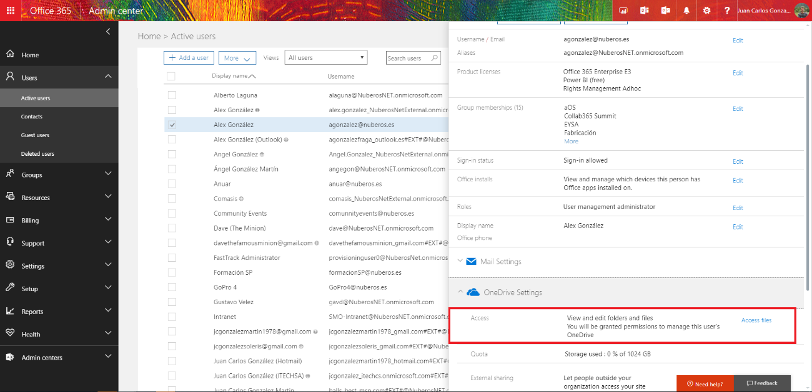
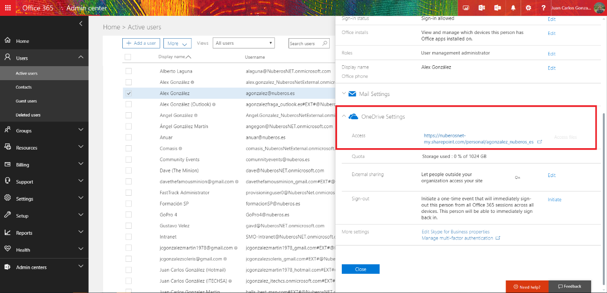
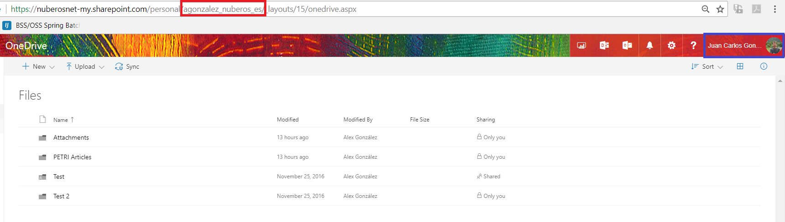
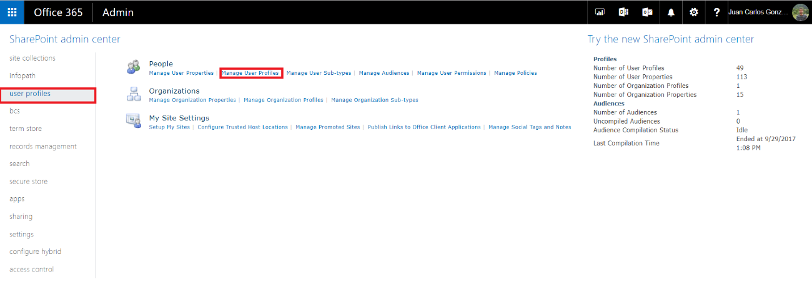
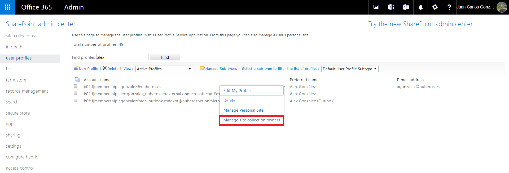
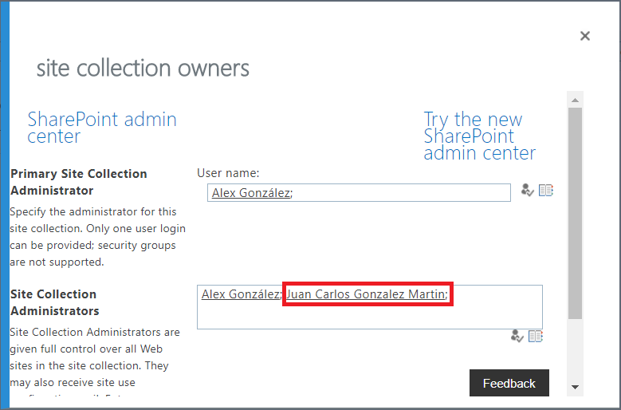

Añadir un administrador secundario a OneDrive for Business (ODFB) es una tarea que, como administradores de Office 365, es posible que tengamos que realizar en más de una ocasión como por ejemplo cuando un empleado abandona la compañía y se nos solicita que tomemos el control de los documentos almacenados en su ODFC. Para realizar esta tarea tenemos al menos 4 posibilidades como demostraré en este artículo:

·        Haciendo uso del Centro de Administración de Office 365.
·        Haciendo uso de las opciones de configuración de los Perfiles de Usuario en SharePoint Online (SPO) disponible en la administración de SPO.
·        Por medio de cmdlets estándar de SPO.
·        Por medio del Modelo de Objetos en Cliente (CSOM) para SPO.

**Añadiendo un administrador secundario a ODFB a través del Centro de Administración de Office 365**

Como administradores de Office 365 es muy sencillo tomar el control del ODFB de un usuario haciendo uso de la opción "Acceso a archivos" ("Access files") disponible al seleccionar un usuario en el listado de usuarios activos del tenant:

·        Para probar esta opción, navegamos a la Administración de Office 365 y en la sección Usuarios hacemos clic en Usuarios activos. A continuación, seleccionamos un usuario existente en el listado de forma que se muestra el panel de detalles del usuario. Si nos desplazamos por el panel, encontraremos una sección "Configuración de OneDrive" desde la que podremos tomar el control del ODFB del usuario haciendo clic en el enlace "Acceso a archivos"



·        Una vez que se ha hecho clic en “Acceso a archivos”, se mostrará el enlace al ODFB del usuario.



·        Si hacemos clic en el enlace del ODFB del Usuario, tendremos acceso al ODFB del Usuario con permisos de administrador.



**Añadiendo un administrador secundario a ODFB a través del Centro de Administración de SPO**

Como seguramente sabéis, ODFB está construido sobre el servicio de SPO en Office 365 lo que significa que muchas opciones de configuración están disponibles a través de la Administración de SPO. En concreto, podemos administrar algunas de las opciones de configuración de SPO a través del servicio de los perfiles de usuario de SPO. Por ejemplo, desde este servicio podemos añadir un administrador secundario al ODFB de un usuario:

·        En primer lugar, accedemos al centro de Administración de SPO y hacemos clic en el enlace de "perfiles de usuario" ("User profiles") disponible en el menú vertical. En la página de administración de los perfiles de usuario, hacemos clic en "Administrar perfiles de usuario" ("Manage user profiles").



·        En la página de “Administrar perfiles de usuario”, buscamos un usuario concreto y desplegamos las opciones de administración disponibles para su perfil. Hacemos clic en la opción “Administrar propietarios de la colección de sitios” (“Manage site collection owners option”).



·        En la Ventana de “Administrar propietarios de la colección de sitios”, simplemente añadimos / eliminamos un administrador secundario del ODFB del usuario. En mi caso, simplemente he editado el mismo usuario en el que ya había configurado un administrador secundario de ODFB a través del panel de detalle del usuario en el Centro de Administración de Office 365.



**Añadiendo un administrador secundario a ODFB usando cmdlets estándar de SPO**

Los comandos PowerShell para SPO proporciona una ruta alternativa para realizar tareas de administración de ODFB y SPO de manera que con unas pocas líneas de código PowerShell se puede añadir un administrador secundario a ODFB. En concreto, esta operación se pude realizar por medio del comando estándar Set-SPOSite como se muestra a continuación:

```
$ssODFBSite="<ODFB_Site_Url>"
```

```
$sSecondaryODFBAdmin ="<O365_User_To_Add>" 
```

```
Set-SPOUser -Site $sODFBSite -LoginName $sSecondaryODFBAdmin -IsSiteCollectionAdmin $true​
```


Se puede descargar un script Powershell más completo que permite añadir un administrador secundario al ODFB de un usuario desde el siguiente enlace: [How to add a secondary administrator to a user's ODFB](https://gallery.technet.microsoft.com/How-to-add-a-secondary-0b878d98?redir=0)

**Añadiendo un administrador secundario a ODFB por medio de CSOM**

Finalmente, la cuarta forma de añadir un administrador secundario a ODFB se pude lograr a través de la API CSOM para SPO que se utilice en una aplicación .NET (en una simple aplicación de consola) o en un script PowerShell. Por ejemplo, a continuación, se muestra el código PowerShell necesario para añadir un administrador secundario a ODFB usando CSOM:

```
$ssODFBSite="<ODFB_Site_Url>"
```

```
$sSecondaryODFBAdmin ="<O365_User_To_Add>"
```

```
$spoCtx = New-Object Microsoft.SharePoint.Client.ClientContext($sODFBSite) 
```

```
$spoCredentials = New-Object Microsoft.SharePoint.Client.SharePointOnlineCredentials($sUserName, $sPassword)   
```

```
$spoCtx.Credentials = $spoCredentials      
```

```
$spoUser=$spoCtx.Web.EnsureUser($sSecondaryODFBAdmin) 
```

```
$spoUser.IsSiteAdmin=$true 
```

```
$spoUser.Update() 
```

```
$spoCtx.Load($spoUser) 
```

```
$spoCtx.ExecuteQuery() ​
```


Se puede descargar un script Powershell más completo que permite añadir un administrador secundario al ODFB de un usuario haciendo uso de la API de CSOM de SPO desde el siguiente enlace: [How to add a secondary administrator to a user's ODFB (CSOM Edition)](https://gallery.technet.microsoft.com/How-to-add-a-secondary-8e1bcd66?redir=0)


**Conclusiones**

Añadir un administrador secundario al ODFB de un usuario se puede conseguir al menos de 4 formas diferentes aprovechando las capacidades de los centros de administración de Office 365 y SPO por un lado y de toda la potencia que los cmdlets estándar de SPO y la API CSOM proporcionan.


**Juan Carlos González Martín**
 Office Servers and Services MVP
 Cloud & Productivity Advisor 
jcgonzalezmartin1978@hotmail.com
 @jcgm1978 | [https://jcgonzalezmartin.wordpress.com/](https://jcgonzalezmartin.wordpress.com/)​

 
 
import LayoutNumber from '../../../components/layout-article'
export default LayoutNumber
