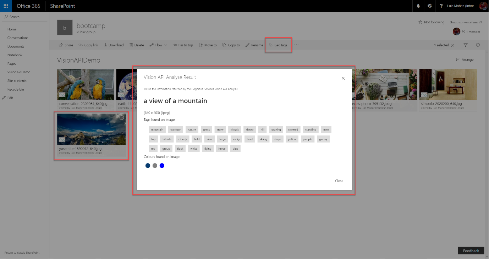
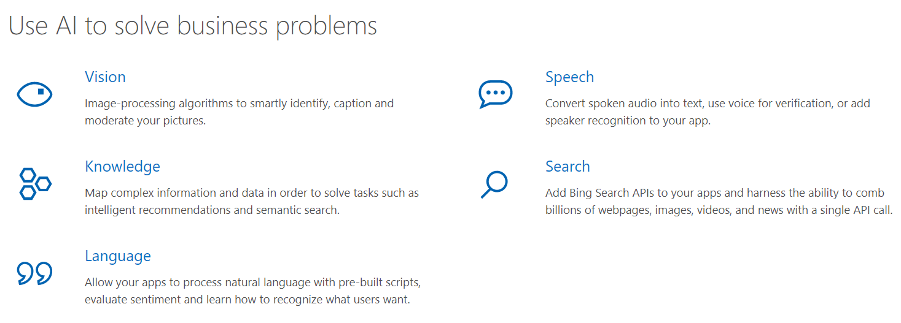
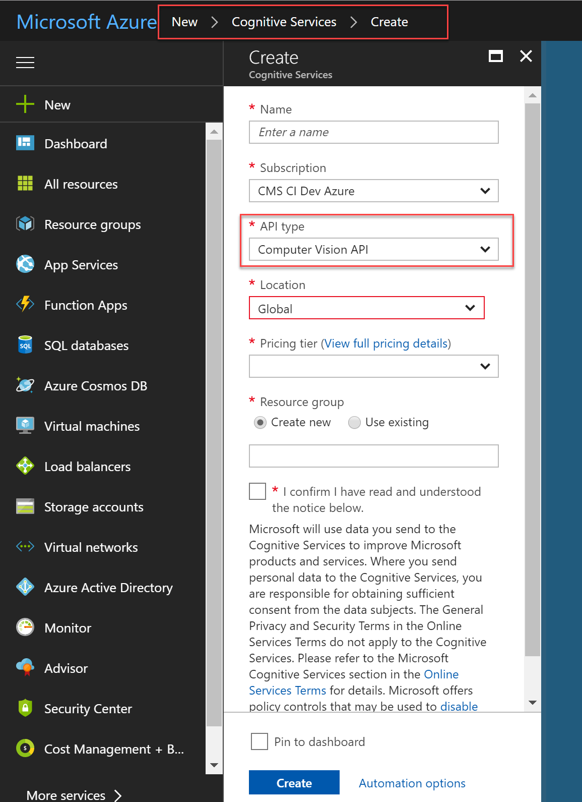
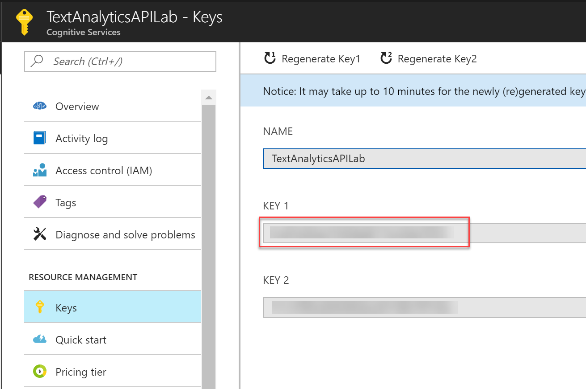
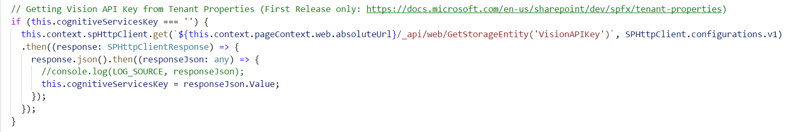
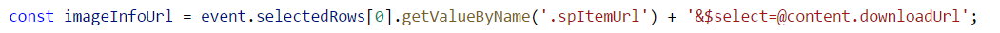
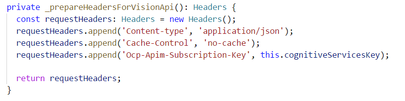
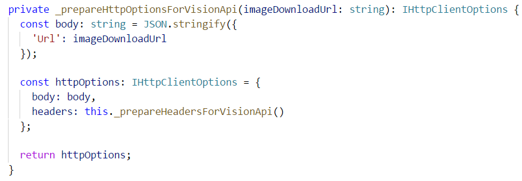
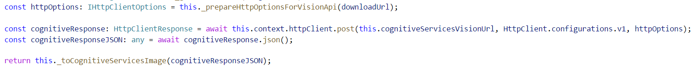
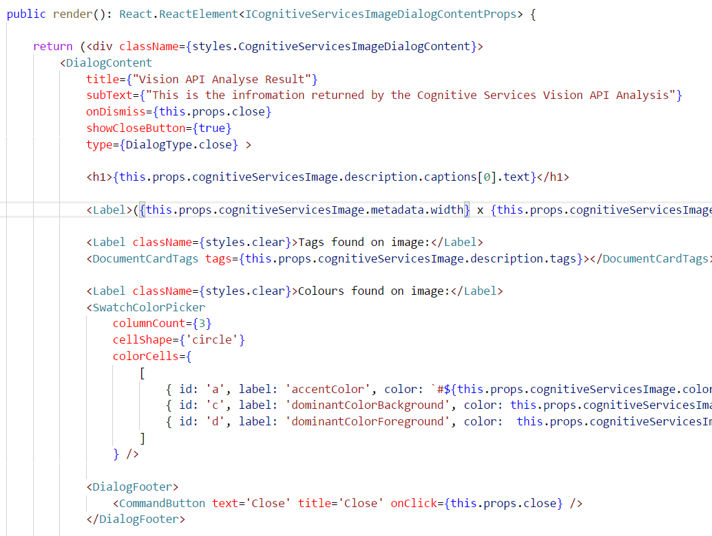

En este artículo, vamos a ver que ventajas nos aporta los MS Cognitive Services, y como podemos hacer uso de ellos desde soluciones basadas en el SharePoint Framework (SPFx). Durante el artículo, veremos cómo podemos registrar el servicio de *Vision API*, para posteriormente consumirlo desde una acción personalizada añadida a la *Command Bar*de una lista, haciendo uso de las capacidades de extensión de SPFx, en este caso con un *List View Command Bar customiser*. El resultado final podemos verlo en la imagen siguiente:

**Rápida introducción a los MS Cognitive Services**

Los Cognitive Services son un servicio más dentro de Azure, que nos ofrece capacidades de Inteligencia Artificial, pero abstrayéndonos de gran parte de la dificultad de este tipo de sistemas de AI y Machine Learning. Son servicios ya entrenados por Microsoft, y expuestos a través de APIs sencillas. Los servicios están organizados en diferentes categorías principales:

Podéis encontrar el detalle de estas categorías con sus diferentes servicios en el siguiente link:

[https://azure.microsoft.com/en-us/services/cognitive-services/?v=17.42n](https&#58;//azure.microsoft.com/en-us/services/cognitive-services/?v=17.42n)

Algunos ejemplos son:

·       Vision API: Este servicio ofrece capacidades de reconocimiento de imágenes y OCR. Este servicio será el utilizado para el artículo, y nos permitirá analizar una imagen almacenada en una biblioteca de SharePoint, y obtener información, como una descripción de la imagen, sus dimensiones, posibles tags, e incluso los colores dominantes que aparecen en la imagen.
·       Text Analytics API: Permite analizar un texto y obtener posibles palabras clave, y también evalúa el sentimiento del mismo, por lo que puede distinguir si el texto está indicando un sentimiento positivo o negativo, algo que es muy útil para analizar feedback de usuarios o comentarios en redes sociales.
·       L.U.I.S: Reconocimiento de lenguaje natural. Es la base de Cortana.
·       Translator Text API: Ofrece servicios de traducción automática.

**Registrar servicio Cognitive Services Vision API**

Para poder utilizar la Vision API de Cognitive Services, primero tenemos que registrar el servicio desde el portal de Azure, para así obtener la *Key* para invocar la API.

**Nota**: Debemos seleccionar expresamente el servicio que queremos utilizar, en este caso, la Vision API. Si queremos hacer uso de varios servicios, hay que registrarlos expresamente, y obtener una Key diferente para cada uno.

Una vez registrado, podemos obtener la Key desde la sección Keys del servicio:

**Introducción y uso de Tenant Properties en SharePoint Online**

Desde hace unas pocas semanas, tenemos una nueva funcionalidad disponible en SharePoint Online, llamada Tenant Properties. Esto no es más que algo muy similar a las famosas y veteranas: Property Bags, así que nos va a permitir almacenar pares de clave/valor a nivel de Tenant, y que luego podremos recuperar utilizando una API disponible. De esta manera, nos evitaremos *hard-codear* el valor de la Key en el mismo JavaScript.

**Nota**: En el momento de escritura del artículo, esta nueva funcionalidad está sólo disponible para Tenants en modo "First Release".

Para almacenar una Tenant Property, debemos hacer uso de los comandos de PowerShell para SharePoint Online (en su última versión).

Con los comandos instalados, abrimos la consola de comandos de SharePoint Online:

Primero, nos conectamos a nuestra Tenant (nos preguntara usuario y password). **Nota**: es necesario conectar a la URL de Admin:

Connect-SPOService -Url https://YOUR\_TENANT-admin.sharepoint.com

Para almacenar la Key (Las Tenant Properties se almacenan a nivel de AppCatalog, por lo que el parametro *site* debe especificar la URL del AppCatalog)

Set-SPOStorageEntity -Site "https://YOUR\_TENANT.sharepoint.com/sites/appcatalog" -Key "TextAPIKey" -value YOUR\_KEY\_HERE -Description "Key to use Text API" -Comments "O365 Dev Bootcamp 2017"

Podemos comprobar que la propiedad se ha creado correctamente con el siguiente comando:

Get-SPOStorageEntity -Site "https://YOUR\_TENANT.sharepoint.com/sites/appcatalog" -Key "TextAPIKey"

**Invocando Vision API desde spfx**

Para el artículo, estamos utilizando una *ListView Command Set extension*, pero sería similar si lo hacemos desde un webpart.

Primero de todo, necesitamos recuperar la API Key, que en el paso anterior hemos almacenado en una Tenant Property:

El siguiente paso consiste en obtener la URL de la imagen almacenada en SharePoint. Esto sería muy sencillo, si no fuera porque dicha URL está securizada, así que no podemos enviársela tal cual a la Vision API. Una opción sería obtener la imagen como un array de bytes, pero desde TypeScript no es tarea sencilla, así que utilizaremos un pequeño truco para poder trabajar con una URL. Existe una API que nos devuelve cierta información sobre un ítem de una lista. La URL tiene este formato:

"https://tenant.sharepoint.com:443/\_api/v2.0/drives/b!IgNz\_osK\_E6YZuP28vyURyJvxwztrcpNuqPkLRSqlOaVATUy1EqMT7tfP4UIuLhU/items/01HBKUZTUQKQB7NFK4HVHLU354TEWATCOP?version=Published&$select=@content.downloadUrl"

Lo bueno es que esa URL, viene en un campo del ítem seleccionado, por lo que podemos sacarla fácilmente desde una SPFx extensión:

Entre la diferente información proporcionada por esa API, tenemos una campo “@content.downloadUrl”, que nos ofrece la URL de la imagen, incluyendo un Token de Autenticación. Esto significa que, a todos los efectos, esa URL es pública, y si la cargamos en cualquier navegador, nos va a descargar la imagen de SharePoint, sin solicitarnos credenciales. Un ejemplo de esta URL “pública” sería:

"https://inheritscloud.sharepoint.com/sites/bootcamp/\_layouts/15/download.aspx?UniqueId=f6035490-5c95-4e3d-ba6f-bc992c0989cf&Translate=false&tempauth=eyJ0eXAiOiJKV1QiLCJhbGciOiJub25lIn0.eyJhdWQiOiIwMDAwMDAwMy0wMDAwLTBmZjEtY2UwMC0wMDAwMDAwMDAwMDAvaW5oZXJpdHNjbG91ZC5zaGFyZXBvaW50LmNvbUBjZDhiMzdkOS01M2RlLTQ2MzEtYTE5Ni0yZDAxZGM4MTQyNDMiLCJpc3MiOiIwMDAwMDAwMy0wMDAwLTBmZjEtY2UwMC0wMDAwMDAwMDAwMDAiLCJuYmYiOiIxNTEwMTY3OTY1IiwiZXhwIjoiMTUxMDE3MTU2NSIsImVuZHBvaW50dXJsIjoiZzhJM0w5UGhMMjR2VGk4bXM1K29Iem9mS1ZqOG9iVjkwTHAraFhkazBXVT0iLCJlbmRwb2ludHVybExlbmd0aCI6IjEzOSIsImlzbG9vcGJhY2siOiJUcnVlIiwiY2lkIjoiTXpSbU16SmhPV1V0TWpBME1TMDBNREF3TFdNMlpEa3RNamM0TXpBeFlqZzNNelF6IiwidmVyIjoiaGFzaGVkcHJvb2Z0b2tlbiIsInNpdGVpZCI6IlptVTNNekF6TWpJdE1HRTRZaTAwWldaakxUazROall0WlRObU5tWXlabU01TkRRMyIsIm5hbWVpZCI6IjAjLmZ8bWVtYmVyc2hpcHxsdWlzQGluaGVyaXRzY2xvdWQuY29tIiwibmlpIjoibWljcm9zb2Z0LnNoYXJlcG9pbnQiLCJpc3VzZXIiOiJ0cnVlIiwiY2FjaGVrZXkiOiIwaC5mfG1lbWJlcnNoaXB8MTAwMzdmZmVhMDhiOTg2NEBsaXZlLmNvbSIsInR0IjoiMCIsInVzZVBlcnNpc3RlbnRDb29raWUiOiIyIn0.SkNYbmlKenJ2a1lnNnF3RzFkcHlaenVOSGxBVUR1cS9RRWpNYmt3Tkt1ND0&ApiVersion=2.0"

Como veis, el parámetro “tempauth” es un token temporal de autenticación. Es un token oAuth2 a todos los efectos.

Una vez obtenida dicha URL, ya la podemos enviar al servicio de Vision API.

Primero preparamos las cabeceras de la petición, donde metemos la Key de la API:

Luego preparamos el body, donde incluimos la URL anterior: ​

Finalmente, enviamos la petición al servicio, y mapeamos el JSON obtenido, a un objeto de nuestro modelo:

Finalmente, con nuestro modelo, hacemos uso de varios componentes de ReactJS para mostrar el resultado en un Dialog:

Tenéis todo el proyecto en mi cuenta de GitHub:

[https://github.com/luismanez/sp-dev-fx-extensions/tree/react-command-vision-api-v2/samples/react-command-vision-api](https&#58;//github.com/luismanez/sp-dev-fx-extensions/tree/react-command-vision-api-v2/samples/react-command-vision-api)

El proyecto también ha sido aceptado como contribución en el repositorio de SharePoint, así que también podéis encontrarlo en el siguiente link:

[https://github.com/SharePoint/sp-dev-fx-extensions/tree/master/samples/react-command-vision-api](https&#58;//github.com/SharePoint/sp-dev-fx-extensions/tree/master/samples/react-command-vision-api)

##  Resumen 

Como veis, sumando la potencia de Cognitive Services y spfx, podemos dar una capa más de inteligencia a nuestro SharePoint.

**Luis Mañez**

SharePoint / Cloud Solutions Architect en ClearPeople LTD
 @luismanez
 [http://geeks.ms/lmanez/](http&#58;//geeks.ms/lmanez/)

