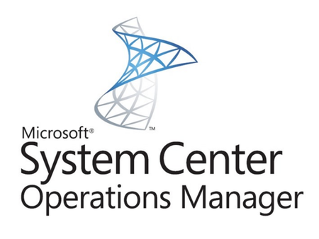
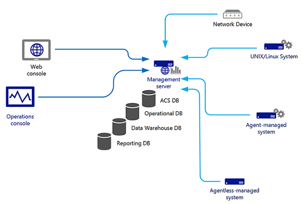
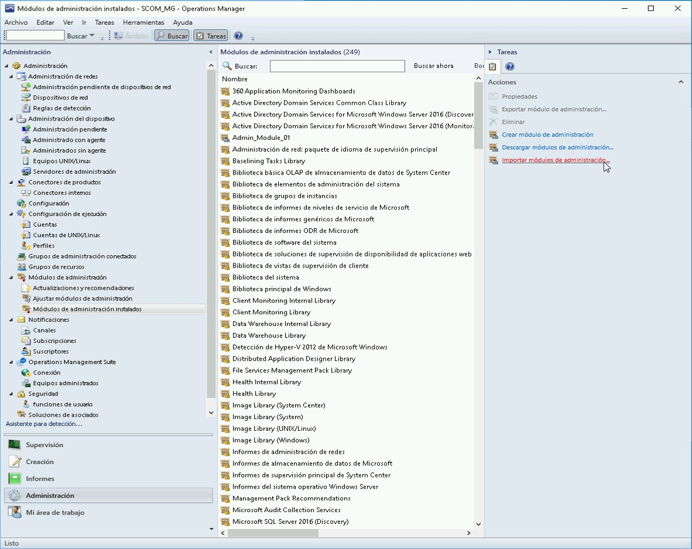

**¿Qué es SCOM?**

System Center 2016 Operations Manager (yo prefiero hablar de System Center Operations Manager 2016 aunque no sea correcto), también conocido como SCOM 2016, o de manera coloquial como OM (Operations Manager) es la aplicación desarrollada por Microsoft para poder monitorizar y controlar la infraestructura de sistemas y comunicaciones de nuestra explotación.

Simplificando el funcionamiento de SCOM, podemos decir que el administrador del sistema, instala el agente de SCOM, que es un pequeño programa que está siempre en ejecución, después registra el cliente en el servidor y configura en el mismo que cosas tiene que monitorizar.

Tras esto, el agente, tal como se ha dicho queda continuamente en ejecución y monitoriza aquellos recursos que consideremos importantes y tomando por ejemplo información del registro de eventos para buscar eventos que serán importantes para el correcto funcionamiento de la infraestructura.

Si se produce un evento que se cataloga como importante y sobre el que se debe actuar, el agente se pone en contacto con el servidor de SCOM para informarle de lo sucedido. SCOM actuará en función de la criticidad de la alarma y de la configuración que tenga preestablecida para este tipo de eventos.

Este software ha evolucionado mucho desde su lanzamiento en el año 1998, cuando fue lanzado al mercado, no por la propia Microsoft si no por una empresa británica llamada Serverware Group plc. Esta empresa vendió a Microsoft los derechos de explotación y desarrollo en el año 2000 y desde entonces ha ido evolucionando.

Esta evolución, llevó al equipo de producto a rediseñar y recodificar el programa entero en 2007 para lanzar System Center Operations Manager 2007, que ya se parecía más a lo que hoy conocemos como SCOM.

Posteriormente, se volvió a hacer un gran salto con la versión de System Center Operations Manager 2012, que ha tenido cierto grado de continuidad en las versiones 2012R2 y en la versión actual, que es System Center Operations Manager 2016.

Cuando hablo de cierto grado de continuidad, me refiero a que cambian cosas, pero no hay un gran salto en lo que es la arquitectura interna. De hecho, se mejoran muchas; se amplía el soporte a sistemas, se agiliza la gestión de consultas y de DDBB, etc. Pero a nivel apariencia y funcionamiento todo continúa bastante parecido.

Lo primero que tenemos que tener claro antes de empezar a plantearnos siquiera el adquirir la licencia de Microsoft System Center Operations Manager 2016, debemos saber que SCOM no es un producto aislado, sino que es un producto que está incluido en la suite Microsoft System Center que está compuesta por utilidades que nos permiten gestionar de manera integral y centralizada toda nuestra infraestructura.

Tal como ya se apuntará en el número 31 de esta publicación, publicado en marzo de este mismo año, System Center contiene varios productos, entre los que la estrella incontestable es System Center Configuration Manager, seguido en importancia por System Center Operations Manager, que es el aplicativo sobre el que vamos a hablar en esta serie de artículos. Pero no hay que olvidarse de otros elementos de la suite como Data Protection Manager, Service Manager, Orchestator y Virtual Machine Manager.

Aunque no es el propósito del presente artículo, vamos a repasar brevemente cual es la funcionalidad de cada uno de estos elementos:

·       System Center Configuration Manager: Herramienta destinada al despliegue de sistemas operativos, programas y aplicaciones, sin olvidar los parches de seguridad y las actualizaciones. 
·       System Center Operations Manager: Herramienta de monitorización centralizada de los sistemas de red, equipos, servidores y aplicativos. 
·       System Center Data Protection Manager: Herramienta profesional para realizar las copias de seguridad de Microsoft. 
·       System Center Service Manager: Herramienta dedicada a la creación, seguimiento y cierre de las incidencias y problemas, así como a la elaboración de inventario del parque de la empresa. Este elemento desarrolla todo su potencial en colaboración con el resto de elementos de la suite. 
·       System Center Orchestator: Herramienta de orquestación, dedicada a la automatización de respuestas a distintos eventos. 
·       System Center Virtual Machine Manager: Herramienta dedicada a la gestión de máquinas virtuales a lo largo de todo su ciclo de vida.

Estas explicaciones son muy simplistas, pero bastan para establecer los pilares sobre los que empezar a trabajar con SCOM.

Ahora que sabemos que no compramos la licencia de SCOM sola si no que se vende junto con el resto de los productos de la suite Microsoft System Center y sabemos también que puede sacar un mayor rendimiento a los productos de la misma mediante la instalación e integración de dichos productos, debemos pensar en si nos beneficia o no instalar otros productos de dicha suite.

Desde mi punto de vista sí, es profundamente enriquecedor ya que al pasarse la información de unos a otros e interactuar en función de lo que obtienen, se genera una retroalimentación que hace más funcional la detección y respuesta a incidentes que es lo que buscamos al fin y al cabo cuando desplegamos un sistema de monitorización.

Pongamos un ejemplo:

Si tenemos SCCM instalado que nos da el conocimiento de todos los elementos de nuestra infraestructura, además está conectado con SCOM y se ha desplegado Orchestator, puede darse la siguiente situación: SCOM recibe una alerta de un elemento del inventario de SCCM y que ha sido provisionado con el agente de SCOM, acto seguido, consulta las reglas establecidas en la orquestación y decide que ante tal alarma hay que proceder a realizar un reinicio.

Si nos fijamos en este ejemplo, el sistema ha sido capaz de corregir automáticamente un error, que es un error bien conocido, pero ¿Qué sucede si no queremos este nivel de automatización? O ¿Si no se encuentra con un error conocido?

Pongamos otro ejemplo:

Si tenemos la misma infraestructura, con SCCM, SCOM y Orchestator, Y además tenemos SCSM, puede generarse un escenario en el que cuando SCOM recibe una alerta de un elemento del inventario de SCCM y que ha sido provisionado con el agente de SCOM, acto seguido, consulta las reglas establecidas en la orquestación y en función de estas puede generar una incidencia que dirigirá por ejemplo al departamento de comunicaciones vía mail o si así está descrito en sus reglas realizará el reinicio del que hablábamos antes.

Como podemos ver, SCOM, junto al resto de la suite nos ofrece un gran potencial, que estará solamente limitado por nuestra imaginación, ya que el mundo de la orquestación, de la cual hablaremos en el futuro abre un abanico de posibilidades casi ilimitado.

**Componentes de SCOM:**

Cuando hablamos de SCOM, no hablamos de una aplicación "monolítica" como por ejemplo un Adobe Photoshop, si no que se trata de un pequeño grupo de aplicaciones que interactúan entre sí. Una vez más, es posible que peque de simplismo al hablar de esta manera, pero trato de ser lo más próximo y evitar argot complicado que pueda entorpecer el entendimiento del lector.

Tenemos varios componentes dentro del ecosistema de System Center Operation Manager que pasamos a enumerar a continuación:

·       Agente.
·       Servidor de administración. 
·       Consola del operador.
·       Consola web.
·       Servidor de base de datos. 
·       Servidor de informes.

Para que podamos proseguir debemos saber qué hace cada uno de ellos, por lo que pasamos a explicar brevemente su función: 
·       Agente: Es un pequeño programa de software que se instala en la máquina cliente y que se encarga de recopilar datos del mismo para enviárselos al servidor de SCOM. Envía datos sobre el estado de los distintos sistemas, aplicaciones y sobre el propio sistema operativo. 
·       Servidor de administración: Es propiamente dicho el corazón de SCOM. Contiene todas las herramientas de administración y gestión y se puede extender con paquetes adicionales para adquirir nuevas funcionalidades. 
·       Consola del operador: Aplicación que se puede instalar en cualquier equipo, servidor o cliente, siempre que cumpla unas especificaciones dadas y que permite realizar tareas de administración.
·       Consola web: Una pequeña aplicación que permite realizar ciertas tareas administrativas de las que se pueden hacer desde el servidor de administración o la consola del operador. Permite realizar estas tareas atacando una URL y sin necesidad de instalar ningún paquete.
·       Servidor de base de datos: Es un servidor destinado a hospedar las distintas instancias de System Center, como por ejemplo la base de datos operacional de SCOM. 
·       Servidor de informes: Es un aplicativo que corre sobre la base de datos. Almacena todos los eventos de la explotación sobre un periodo de tiempo predeterminado durante la configuración. Utiliza Bussines Inteligence para poder analizar y predecir comportamientos futuros.

**Orden de instalación de los componentes de SCOM:**

Puede parecernos lógico empezar a instalar el servidor de administración, pero en principio, esto no es del todo correcto. Para bien, deberíamos haber preparado previamente una máquina con un servidor de bases de datos Microsoft SQL Server que hospedará las distintas instancias de los componentes de System Center y una vez hecho eso podremos empezar a instalar el servidor de administración en un servidor dedicado únicamente para tal propósito.

Pero ojo, aquí estamos hablando de SCOM, pero ¿Qué sucede si queremos instalar otros productos de System Center? O ¿Qué sucede si estamos actualizando desde una versión anterior? Esto también lo tenemos que tener en cuenta.

Si vamos a realizar la actualización desde una instalación previa de SCOM 2012R2 integrada con otros componentes de la suite de System Center, debemos seguir el siguiente orden de manera obligatoria y por razones de seguridad, ya que en caso de no hacerlo así podemos encontrarnos con problemas durante el despliegue o a posteriori.

·       Orchestrator.
·       Service Manager.
·       Data Protection Manager.
·       Operations Manager.
·       Virtual Machine Manager.

El resto de los productos se podrán instalar posteriormente sin problemas, pero os recomiendo leeros la documentación de cada producto para evitar sustos. También debemos tener en cuenta la versión de los distintos componentes de Microsoft System Center 2012 para poder ser actualizados a Microsoft System Center 2016.

·       Para actualizar Data Protection Manager debemos tener una versión de System Center 2012 R2 con UR10 o posterior.
·       Para actualizar Operations Manager necesitamos System Center 2012 R2 con UR9 o posterior.
·       Para Orchestrator tendremos System Center 2012 R2 con UR8 o posterior.
·       La Automatización de administración de servicios necesita una versión anterior de System Center 2012 R2 con UR7 o posterior.
·       Para actualizar Service Manager requiere System Center 2012 R2 con UR9 o posterior.
·       Para actualizar Virtual Machine Manager requiere System Center 2012 R2 con UR9 o posterior.

**Requisitos de SCOM**

Lo siguiente que tenemos que definir son los requisitos mínimos que tiene que cumplir cada aplicativo que vamos a instalar. El primero, una vez instalada la base de datos (o no) es instalar el servidor de administración. Por ello vamos a empezar a mirar qué necesidades tiene, pero poniendo una pequeña nota previa sobre la base de datos. La base de datos, para no dar problema debe tener la intercalación configurada como "SQL\_Latin1\_General\_CP1\_CI\_AS". Esto es lo más importante en lo que respecta a la base de datos. Aun así, le dedicaremos un hueco en algún artículo posterior.

Los requisitos a nivel hardware del servidor de administración son:

·       Procesador mínimo: CPU de 4 núcleos a 2,66 GHz.
·       Memoria RAM mínima: 8 GB.           
·       Espacio en disco mínimo recomendado: 10 GB.

El servidor podrá ejecutar los siguientes sistemas operativos para poder soportar la posterior instalación de SCOM 2016:

·       Windows Server 2012 R2 Standard.
·       Windows Server 2012 R2 Datacenter.           
·       Windows Server 2016 Standard.
·       Windows Server 2016 Datacenter.   
·       Windows Server Core 2016.

Otras necesidades software del servidor de administración:

·       Windows PowerShell versión 2.0 o Windows PowerShell versión 3.0, así como las posteriores, que en el caso de Windows Server 2016 es la 5.1.
·       Debemos habilitar la administración remota de Windows.
·       Debemos instalar .NET Framework 4 o .NET Framework 4.5.

Mucho ojo también con la versión de .NET ya que puede causarnos grandes dolores de cabeza, al igual que la versión de PowerShell que deberemos instalar a pesar de tener una versión superior, ya que algunos de los scripts que usa System Center utilizan estas versiones. Tras haber hablado de estos requisitos, dejaremos en stand-by la instalación para dedicarle el siguiente artículo de esta misma serie.

**Conclusión**

Lo primero que tenemos que hacer antes de ponernos a desplegar Microsoft System Center Operations Manager 2016 en nuestra infraestructura es conocer las herramientas que lo integran, así como el entramado de aplicaciones que conforman la suite en la que se integra SCOM. Lo siguiente es conocer el orden de instalación y los requisitos necesarios para el despliegue.  Básicamente tenemos que darle una buena pensada, planificar todo bien y tener muy claro que necesitamos para poder crear la infraestructura apropiada, ya que no será lo mismo poner SCOM para una empresa con una sede y 20 servidores homogéneos que para una con 100 sedes y servidores de todo tipo.   De todas maneras, debemos recordar que éste es el primero de una serie de artículos que nos guiarán para poder desplegar sin problemas System Center Operations Manager 2016 en nuestras respectivas empresas.

**Juan Ignacio Oller Aznar** 
MVP Cloud and Datacenter Management 
jioller@live.com
 @jioller
 [http://blogs.itpro.es/jioller](http://blogs.itpro.es/jioller) 
[http://dtc2mobility.com](http://dtc2mobility.com/)

