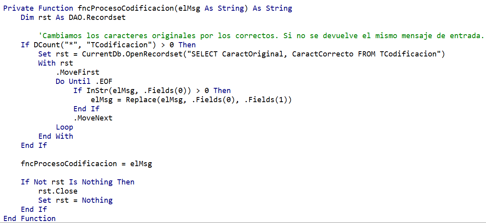

Los usuarios de una aplicación suelen tener dudas sobre el manejo de la misma. La respuesta típica a esta necesidad es crear una guía de ayuda que explica todos los pormenores del programa. Ya tenemos pues nuestro manual, ya sea impreso o digital, con un fabuloso índice y unos elaborados marcadores (si es una edición digital) que intentan facilitar la búsqueda de información que el usuario requiere.

¿Y si fuera posible que dicho usuario hiciera una pregunta directamente, en lenguaje natural, en nuestra aplicación MS Access, y obtuviera la respuesta conveniente? Teniendo en cuenta que, con toda probabilidad, no habrá dos usuarios que formulen la misma pregunta de la misma manera. Y, yendo un poco más allá, ¿y si los propios usuarios fueran los que nos ayudaran a "depurar" los mensajes de ayuda mediante un proceso de retroalimentación?

La primera pregunta es lo que podemos conseguir implementando en nuestra aplicación el *Cognitive Service* llamado *QnA Maker*, y es lo que intentaré explicar en este artículo. Y en el conjunto de dicha explicación intentaré esbozar un sistema para dar respuesta a esa segunda pregunta, lo que me permitirá introducir uno de los elementos que intervienen en la configuración del servicio.

**QnA Make: Visión Previa y Creación de nuestra BD de conocimiento**

Lo primero que debemos hacer es disponer de una cuenta, ya sea personal o corporativa, de Microsoft. Nos dirigiremos a la página [https://qnamaker.ai/](https&#58;//qnamaker.ai/) y nos pedirá el *login*. Entramos con los datos de nuestra cuenta y ya tenemos acceso al sistema de forma gratuita, aunque con limitaciones de cuota y uso: nuestra base de datos "de conocimiento" no puede superar los 20MB. Asimismo, cada clave de suscripción (hablaremos de ello más adelante) admite un máximo de 10.000 transacciones al mes y 10 transacciones por minuto.

Una vez hayamos entrado en la interface de QnA Maker nos encontraremos con diferentes apartados: (1) Visión preliminar del servicio / (2) Relación de servicios que hayamos creado (podemos crear más de uno) / (3) Creación de un nuevo servicio / (4) Documentación y ayuda / (5) Envío de nuestros comentarios a Microsoft.

Dado que el ejemplo a través del cual desarrollaremos esta explicación va a ser un sistema de ayuda en Access, lo que haremos será, como primer paso, crear un nuevo servicio (3) , al cual he puesto de nombre *AyudaAccess*.

Como segundo paso deberíamos crear nuestros pares de pregunta-respuesta. Eso lo podemos hacer de tres maneras: 1-Proporcionando una URL donde tengamos un sistema tipo FAQ / 2-Subiendo un archivo (cuidado, pues el peso del archivo no puede superar los 2MB) / 3-Creando los pares de manera manual. Eso es lo que nos pide la página web en a la que acabamos de acceder.

Como vamos a aprovechar las características de Access, en este punto simplemente lo que hacemos será crear el servicio a través del botón “Create”, a pie de dicha página web.

Hecho esto nos encontraremos con una pantalla a la que tendremos que recurrir varias veces. Sus elementos son los que podéis ver en la ilustración

Si hacemos algún cambio debemos, primero, hacer clic sobre el botón para guardar los cambios, y a continuación en el botón para publicarlos. Eso nos llevará a una pantalla donde se nos informará de las diferencias derivadas de nuestras manipulaciones, tal y como se muestra en la ilustración siguiente.

Es importante no olvidarse de volver a clicar sobre el botón “Publish” para que esos cambios pasen a definitivos.

Ya tenemos nuestro servicio creado. Ahora lo que necesitamos son las claves de suscripción y el identificador de nuestra base de datos de conocimiento. Y esta información la conseguiremos en la siguiente ventana que nos aparece tras publicar los cambios, donde se nos da una muestra de los elementos que necesitamos para poder acceder al servicio a través de REST (importante guardar esa información para, después, saber cómo configurar el código en VBA Access).

Hay que tener en cuenta que si creamos más de un servicio lo que nos cambiará será el identificador de la BD de conocimiento; la clave de suscripción será siempre la misma. Y permitidme hacer un inciso, dado que, realmente, disponemos de dos claves de suscripción: una primaria y una secundaria. Para poder obtener estas claves basta con irnos a la parte superior derecha y clicar sobre nuestro nombre de usuario. Se nos desplegará un menú con la opción que nos interesa.

Si seleccionamos la opción Mis Servicios (*My Services*) veremos todos los servicios que hayamos creado

**Estructurando nuestro Access**

Antes de entrar en la explicación comentaros que, al final del artículo, os dejaré un enlace donde podréis bajaros la base de datos de ejemplo para que podáis ver estructura y código a vuestro gusto (aunque sin los datos identificativos del servicio. Ahí vosotros deberíais poner los vuestros).

Dado que la idea es integrar al máximo todo el proceso en nuestro Access os indico a continuación las tablas que he creado, su estructura y su finalidad:

| **TABLA** | **ESTRUCTURA** | **FINALIDAD** |
| --- | --- | --- |
| TPares | ​ | Construirnos los pares y llevar un control de los mismos. Importante: indexar el campo [Par-Respuesta] |
| TServicios | ​ | Llevar un control de los datos clave para acceder al servicio. En este ejemplo solo utilizaré un servicio para evitar complicar en exceso el ejemplo |
| TErrores | ​ | Gestionar tanto los errores de Access como los errores devueltos por la respuesta del servicio |
| TNotificaciones | ​ | Nos permitirá recibir el *feedback* de los usuarios y nos servirá de base para "entrenar" nuestro servicio |
| TCodificacion | ​ | Necesaria para soslayar el problema de la codificación en español. |

¿Cuál va a ser la interfaz mínima que necesitaremos? Pues lo más básico será un cuadro de texto para que el usuario pueda introducir su pregunta, otro cuadro de texto para que el usuario pueda recibir la respuesta y un botón de comando para que el usuario pueda notificarnos que no está conforme con la respuesta dada.

Permitidme insistir: si utilizamos la BD de ejemplo, no debemos olvidarnos de introducir, en TServicios, los datos identificativos de nuestra BD de conocimiento y clave de suscripción.

**Preparando nuestros pares y subiéndolos a nuestra BD de conocimiento**

La preparación de los pares es tarea muy mecánica, pues simplemente basta ir rellenando los datos en nuestra tabla TPares. El único punto que debemos tener muy en cuenta es que, en las respuestas, debemos evitar el uso de los saltos de línea (en caso contrario se pierde la información tras el salto de línea en la respuesta).

Una vez rellenada nuestra tabla de pares, y dado que el campo principal [IdPar] no nos interesa en estos momentos, nos crearemos una consulta que nos recoja simplemente los campos [Par\_Pregunta] y [Par\_Respuesta]. Si vamos a realizar varias subidas podemos filtrar por [IdPar] (*&gt;UltimoSubido*), por ejemplo, o cualquier otro sistema que se nos ocurra.

El siguiente paso es exportar esa consulta a un archivo de texto. En las características de la exportación debemos indicar que se trata de un archivo delimitado, que el delimitador es la tabulación y que el cualificador de texto es "ninguno".

Obtenido nuestro archivo de texto lo abrimos con el bloc de notas y lo volvemos a guardar, sobrescribiéndolo, pero indicándole que queremos la codificación UTF-8.

¿Qué problema tendremos? El servicio está pensado para inglés y, en la propia información del mismo, se indica que para otros idiomas se puede utilizar la codificación UTF-16. Sin embargo, en las pruebas que he realizado no hay manera de conseguir que la devolución de la respuesta (que veremos más adelante) retorne con caracteres reconocibles para los acentos, la eñe, las comillas, etc. Quizá en versiones posteriores de *QnA Maker* este aspecto se "internacionalice" un poco más. De cualquier manera, a lo largo del texto os indicaré cómo solventar el problema de la codificación.

Ya estamos listos pues para volver a nuestra cuenta de QnA Maker y añadir nuestros pares. El proceso para realizar lo anterior es:

·       En mis servicios, editamos el servicio a través del icono del lápiz, a la derecha.
·       Seleccionamos la opción de configuración: *Settings.*
·       Elegimos la opción que nos permite cargar un archivo. Seleccionamos nuestro archivo de texto.
·       Guardamos y publicamos &gt;&gt; Si estamos conformes volvemos a publicar. Nuestros pares deberían haberse incorporado a nuestra BD de conocimiento.

Y ya que hemos hablado de codificación lo que haremos será introducir, en TCodificacion, los valores "extraños" devueltos y su equivalencia. Utilizo este sistema de tabla porque si nos aparece, en diferentes pruebas, algún carácter no codificado, la adición del mismo y su correspondencia en dicha tabla soluciona el problema, sin necesidad de tocar el código en absoluto.

La ilustración siguiente muestra la correspondencia para un archivo subido con codificación UTF-8.

**Programando nuestro código VBA**

El código se halla en un módulo estándar, que he llamado *mdlQ\_A*(). Los resultados se recogen en tres variables públicas, a saber: una variable que recoge la respuesta, una variable que recoge el porcentaje de validez de la respuesta (en formato texto) y una booleana que recoge la existencia de algún error durante el proceso.

Dado que los errores que pueden producirse son de dos tipos, y dado que en el sistema que os propongo recogemos dichos errores en una tabla, he creído conveniente estructurar el código en una especie de "cascada", en términos genéricos. Me explico: la primera tipología de error viene dada por los errores propios de VBA. Hasta aquí ningún secreto. Sin embargo, la segunda tipología viene dada por la respuesta del servicio. En este segundo caso, como obligatoriamente me veía forzado al análisis de la respuesta, he aprovechado el código para determinar la existencia de una respuesta correcta o de un error. Esquemáticamente sería algo así:

El inicio del proceso está situado en el evento “Después de actualizar” del cuadro de texto en el que el usuario escribe su pregunta, cuyo código sería:

Lo que nos lleva a ver que ya utilizamos dos de las variables públicas que comentaba unas líneas más arriba: *p\_hayError*(booleana), y *p\_msgFinal* (texto).

El código hace una llamada al procedimiento *subQ\_A*(), pasándole como argumento la pregunta realizada por el usuario. Ese código es el siguiente:

Fijémonos que lo que hago es buscar la información del identificador de la base de conocimiento y de la clave de suscripción en la tabla correspondiente, y con el primero me creo la cadena de conexión para el servicio REST. Y, si recordamos la ilustración 5 con el ejemplo que nos proporcionó *QnA Maker*, vamos configurando el objeto HTTP en sus cabeceras (importante la clave de suscripción), ejecutando un *Send*() que, como veis, debe tener muy en cuenta la existencia de comillas dobles en la construcción de su estructura.

En todo este proceso ya hemos gestionado la inserción de los errores de VBA a través de la llamada al procedimiento *subNotificoError*(), cuyo código es el siguiente:

Como veis, no es más que una SQL de inserción, donde me he tomado la libertad de informar "por detrás" a quién le ha saltado el error a través del uso de *Environ*().

Otra característica a destacar es que la respuesta del servicio, en caso de error, puede contener comillas simples. Es por ello por lo que utilizo la función *Replace*() para evitar un error de SQL.

Siguiendo con el código de *subQ\_A*(), el bloque *If*, a través de la función *fncGestionoError*(), es quien continúa con el proceso para analizar el mensaje recibido por el servicio. Si la función devuelve *True* se gestiona el error, esta vez del servicio, y, si no, se gestiona la respuesta, teniendo en cuenta el caso particular en el que no se encuentre una equivalencia, dado que el mensaje retornaría "No good match found in the KB", en inglés.

La función *fncGestionoError*() es, en realidad, un "puente" que me permite detectar el error devuelto por el servicio, si es el caso, y saber cómo debo procesar el mensaje; esto es, qué palabra clave debo buscar dentro del mensaje para obtener una respuesta legible para el usuario. Su código es, simplemente:

Y esta a su vez (de ahí lo que os comentaba del sistema "en cascada"), hace una llamada a un procedimiento denominado *subProcesoJSon*(). Como habéis intuido, la devolución del servicio es un JSON. Podríamos insertar un *parseador* en nuestro código para procesar ese JSON, pero dado que no requerimos grandes extracciones de datos me he decantado por realizar un sistema más manual.

Veamos: si el JSON devuelve error se recibe un mensaje del tipo:

Es decir, que en mensaje aparece el conjunto de caracteres (*error":*), que es el que utilizo para determinar si hay error en el mensaje, y la palabra "message", que es la que me da la descripción del error (y ese es el texto que introduciré en la tabla TErrores).

Analizo esos caracteres (*error":*) así porque si en la respuesta hubiéramos incluido la palabra "error" el código pensaría que hay un error, cuando eso no sería correcto. En consecuencia, en las respuestas, debemos evitar incluir el constructo (*error":*).

Por otra parte, si el mensaje llega sin errores obtendremos una respuesta del tipo:

De la anterior ilustración podemos extraer varias conclusiones:

·       La palabra clave no puede ser "answer", dado que previamente a esa palabra completa tenemos "answers". Debo pensar en construir otra palabra clave que vaya directa al grano. Eso lo consigo construyendo como palabra clave *answer":*
·       Aparece otra palabra clave, que es "score", que nos da el porcentaje de validez que el servicio "piensa" que ha alcanzado. En otras palabras, el tanto por cierto que cree que ha acertado en la respuesta.
·       La codificación nos juega una mala pasada, dado que no nos devuelve los caracteres para nosotros correctos (por ejemplo, *Men&#250* en lugar de *Menú*).

Con todos esos puntos en mente veamos qué hace el procedimiento *subProcesoJSon*():

El primer bloque *If* me discrimina por qué palabra clave debo buscar, y a partir de ahí ajusta el texto de la respuesta, sabiendo que los mensajes que debo capturar empiezan y acaban con comillas dobles.

A continuación, y si no se ha producido error, aprovecho para capturar el porcentaje de validez a través de una variable local.

Finalmente, y en el último bloque *If*, si hay error lo introduzco en la tabla TErrores. No necesito procesar su codificación dado que capturo el mensaje de error literal en inglés. Si no, asigno los valores del porcentaje y de la respuesta final a las variables públicas.

No obstante, la respuesta final podría ser no entendible por los problemas comentados de codificación. Sin embargo, y si recordamos el procedimiento *subQ\_A*(), determinamos que si todo ha ido bien y el mensaje devuelto no ha sido "No good match found in the KB", reasigno el valor de la variable pública *p\_msgFinal* a un nuevo valor "tratado" por la función *fncProcesoCodificacion*(), cuyo código es el siguiente:

Los resultados son espectaculares. A modo de ejemplo os muestro dos ilustraciones con los resultados obtenidos tras dos preguntas sobre lo mismo, pero formuladas de manera distinta (y diferente de la pregunta original del par):

**Aprovechar el feedback del usuario y entrenando a nuestro servicio**

Hemos comentado que le íbamos a dar al usuario la posibilidad de mostrar su disconformidad con la respuesta recibida, permitiéndole notificarnos que la ayuda recibida no ha sido útil. Esto es lo que hace el botón de comando de nuestro formulario, cuyo código es:

Dado que lo que guardamos es el identificador de la respuesta (para no duplicar el contenido de un texto largo), la obtención de la información para comprobar las notificaciones como administrador pasa por crearnos una consulta con, en mi caso, un *right join* para ver también aquellos mensajes huérfanos de respuesta en TPares.

Lo anterior no solo me permite ver la relación pregunta-respuesta\_obtenida que no ha gustado al usuario (junto con el dato del porcentaje de validez), sino que con ello puedo volver a mi servicio y “entrenar” su respuesta. ¿Cómo? Supongamos que un usuario ha realizado una pregunta y ha notificado que no está conforme con el resultado. La consulta anterior nos mostrará la siguiente información:

Automáticamente ya podemos comprobar que, por una pregunta tan escueta, el servicio solo le otorga una validez de respuesta de poco más del 19%. Y, obviamente, la respuesta no es acorde con lo pedido.

Lo que haremos a continuación es dirigirnos a nuestro servicio en el navegador y acceder a la opción “Test” (ver ilustración 3). Planteamos ahí la misma pregunta, con lo que obtenemos

En (1) podemos ver la pregunta y la respuesta obtenida. Y, dado que no la consideramos correcta, en (2) tenemos la posibilidad de elegir la respuesta que más se ajusta a dicha pregunta. Si la seleccionamos (en nuestro caso, "Hay varias maneras para c…") el servicio "aprenderá" cuál es la respuesta más adecuada para esta pregunta o variaciones similares.

Por otra parte, en (3), podemos añadir diferentes alternativas para esa pregunta en concreto.

Una vez "enseñada" la respuesta correcta (o, en su defecto, preguntas alternativas) no debemos olvidarnos de hacer clic sobre la opción de guardar ("Save and retrain") para salvar las modificaciones, y a continuación seguir todo el proceso de publicar dichas variaciones.

Ni que decir tiene que, hecho lo anterior, el usuario, ante la pregunta "Nueva tabla", obtendrá ahora la respuesta correcta.

**Consideraciones finales**

Ni que decir tiene que, por no alargar más este ya extenso artículo, no he profundizado en el uso de las API's del servicio. Para obtener la respuesta he recurrido a la API V1.0. Mas si ojeamos la documentación en su apartado "Api Reference" veremos que con la API V2.0 podemos manipular, a través de código, las distintas acciones que aquí os he enseñado a hacer manualmente. Para más información a dicha ayuda os remito.

Y como lo prometido es deuda aquí os dejo el enlace desde donde os podréis descargar la base de datos Access que he utilizado para esta explicación: [http://bit.ly/CompartimossQA](http&#58;//bit.ly/CompartimossQA)

**Conclusión**

Creo que el uso de este servicio representa una alternativa muy atractiva a un sistema de ayuda convencional. Si la preparación de los pares nos ha parecido "fatigosa" parémonos a pensar un momento en el tiempo que nos consumiría crear un *pdf* completo de ayuda, con sus ilustraciones y demás elementos, además de lo que es el texto de ayuda en sí (aunque en ningún caso descarto la complementariedad de ambos sistemas). La ventaja añadida es que, formados los usuarios en el nuevo sistema, la retroalimentación que les solicitamos les involucra en el proceso, lo que, en términos generales, podría considerarse como un factor positivo.

Y, por qué no decirlo (aunque quizás no sea políticamente correcto), el sistema nos permitiría sonreírnos ante la expresión asombrada del usuario que dice: "¿y con Access se puede hacer ESTO?".

Deseo que la explicación, si no útil, os haya resultado interesante.

**Miquel "Neckkito"**
 MVP Access
 neckkito@outlook.com
 @neckkito
 [http://bit.ly/neckkito](http&#58;//bit.ly/neckkito) ​

