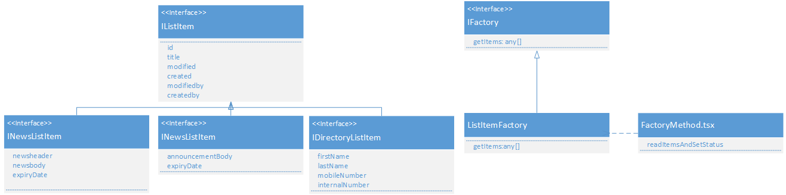
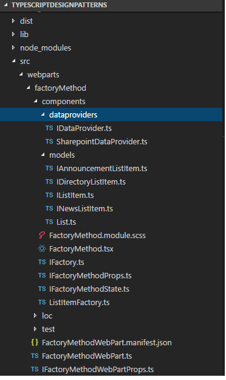

Si tus skills vienen del lado del desarrollo del servidor como los del autor de este texto, existe una gran posibilidad de haber utilizado: C # / .NET Farm solutions o servicios de WCF, REST API o ASP.NET WebForms o MVC, principalmente el singleton. El objetivo de este texto es describir el proceso de varios meses utilizando los patrones de diseño de Typescript aplicados a los webparts de SharePoint Framework, tomando en cuenta que SPFx es 100% del lado del cliente, pero eso no significa que se tiene que crear la lógica y la UI y poner todo en solo archivo .TS sin ningún tipo de estructura, como se puede ver en numerosos blogs, artículos e incluso en la documentación oficial de Microsoft.

Los patrones de diseño nos permiten crear código limpio y comprensible que cualquiera puede entender (con cierta experiencia) e introducir cambios luego de la entrega a la producción de manera sencilla, como arquitecto de soluciones fui responsable del diseño y la entrega de grandes proyectos, con ayuda de estos patrones se pudieron llevar a cabo una gran cantidad de ellos.

Quería escribir sobre este tema hace por mucho tiempo, pero no fue fácil hacerlo, como dijo Martil Golding, “siempre debes programar pensando que la persona que va a mantener tu código es un psicópata violento que sabe dónde vives”, pero ¿Cómo poder hacerlo? Una respuesta es, con los patrones de diseño. En este articulo explicare el patrón Factory Method y cómo usarlo en SPFx.​

**Patrones de diseño**

En ingeniería de software, un patrón de diseño es una solución de repetición general a un problema que comúnmente ocurre en desarrollo de software, un patrón de diseño no es un diseño que puede ser transformado directamente en código,  es una descripción o una plantilla para saber cómo resolver un problema que puede ser utilizado en muchas situaciones diferentes.​

**Patrones de diseño para creación de objetos**

1.       Método Fabrica (Factory Method).

2.       Abstract Factory.

3.       Builder.

4.       Prototype.

5.       Singleton.

Hay otras categorías de patrones también como: Comportamiento, estructural, principios SOLID entre otros, en este artículo me concentrare en el Método Fabrica y en próximos números de la revista veremos los patrones mencionados anteriormente.

######  

###### **Método de fábrica (Factory method)**

En la programación basada en clases, el patrón de método de fábrica es creacional ya que usa métodos de fábrica para tratar el problema de crear objetos sin tener que especificar la clase exacta del objeto que se creará. Esto se hace construyendo objetos llamando a un método de fábrica, ya sea especificado en una interfaz e implementado por clases secundarias o implementado en una clase base, opcionalmente anulado por clases derivadas en lugar de llamar a un constructor.

Otra definición que me gustó más y se ajusta perfectamente a mi muestra hoy es la siguiente, tomada de: https://www.javatpoint.com/factory-method-design-pattern

Un Patrón de Fábrica o un Patrón de Método de Fábrica dice que solo defina una interfaz o clase abstracta para crear un objeto, pero deje que las subclases decidan qué clase instanciar. En otras palabras, las subclases son responsables de crear la instancia de la clase.


**Ventaja del patrón de diseño de fábrica**

El Patrón de diseño de fábrica permite a las subclases elegir el tipo de objetos para crear, promueve el acoplamiento libre al eliminar la necesidad de vincular clases específicas de la aplicación en el código, eso significa que el código interactúa únicamente con la interfaz resultante o clase abstracta, de modo que, funcionará con cualquier clase que implemente esa interfaz o que amplíe esa clase abstracta.


**¿Cuando usar el patrón de diseño de fábrica?**

¿Cómo saber cuándo se usa? Para comenzar con la explicación de cómo aplicar el patrón de fabrica es necesario que existan tres supuestos:

a)       Cuando una clase no sabe qué subclases serán necesarias para crear.
b)      Cuando una clase requiera que sus subclases especifiquen los objetos que se crearán.
c)       Cuando las clases principales elijan la creación de objetos para sus subclases.

##### En un sitio SharePoint se pueden tener múltiples listas y todas ellas pueden tener diferentes columnas o campos, ¿por qué no crear una forma genérica para construir los objetos de la lista de elementos dependiendo de la lista seleccionada? En palabras simples un sitio web en el cual se pueda seleccionar la lista y en función de ella se mostrarán todas las columnas, esto se puede hacer de diversas maneras y con varios switch, "if", etc., pero en este caso, busque una solución más elegante, en otras palabras, traté de simplificarlo. 

##### Partiendo de lo ya mencionado y para comenzar, los patrones de diseño que utilizo estarán en mis repositorios de github: [https://github.com/levalencia](https&#58;//github.com/levalencia)



En el diagrama anterior en lugar de clases se tienen interfaces para el elemento de lista genérico *IListItem* y otras interfaces que extienden la base para agregar más campos según la lista, las noticias, los anuncios y el directorio. En el lado derecho del diagrama, tenemos una interfaz *IFactory* que declara la firma del método *getItems* y lo que debe devolver "arreglo de any" , es decir, cualquier objeto, recordemos que al final todos los elementos serán de tipo IListItem porque extienden esa interfaz. Y finalmente, en el componente *FactoryMethod* de React utilizamos *ListItemFactory* para obtener los elementos, desde el punto de vista del que llama, no importa qué devolverá, es la responsabilidad del método de fábrica crear realmente la lógica interna para saber qué tipo de instancia debería retornar.

**Estructura del proyecto**



**Modelos**

###### Tiene el código de los objetos de negocio que queremos que sean convertidos desde el *json* retornado por los servicios.

```
export  interface IListItem {    [key: string]: any;    id: string;    title: string;    modified: Date;    created: Date;    modifiedby: string;    createdby: string;}import {IListItem} from "./IListItem"; export interface  IAnnouncementListItem extends IListItem {    announcementBody: string;    expiryDate: Date;} import {IListItem} from "./IListItem"; export interface IDirectoryListItem extends IListItem {        firstName: string;        lastName: string;        mobileNumber: string;        internalNumber: string;}  import {IListItem} from "./IListItem"; export interface  INewsListItem extends IListItem {    newsheader: string;    newsbody: string;    expiryDate: Date;}​
```


**Clases de fábrica**

Entonces, la interfaz Factory es bastante simple, solo tenemos un método para implementar en las clases extendidas.

```
import { IListItem } from "./models/IListItem";import { SPHttpClient, SPHttpClientResponse } from "@microsoft/sp-http";export  interface IFactory {    getItems(requester: SPHttpClient, siteUrl: string, listName: string): Promise<any[]>;}​
```


A continuación,<br />es en este método donde existe una declaración switch para obtener una lista<br />diferente con una URL diferente (Seleccionar columnas) y entonces en el retorno<br />se obtienen diferentes tipos en concreto.

```
import { SPHttpClient, SPHttpClientResponse } from "@microsoft/sp-http";import { IWebPartContext } from "@microsoft/sp-webpart-base";import { IListItem} from "./models/IListItem";import { IFactory } from "./IFactory";import { INewsListItem } from "./models/INewsListItem";import { IDirectoryListItem } from "./models/IDirectoryListItem";import { IAnnouncementListItem } from "./models/IAnnouncementListItem"; export class ListItemFactory implements IFactory {    public getItems(requester: SPHttpClient, siteUrl: string, listName: string): Promise<any[]> {        switch(listName) {            case "GenericList":                let items: IListItem[];                return requester.get(`${siteUrl}/_api/web/lists/getbytitle('${listName}')/items?$select=Title,Id,Modified,Created,Author/Title,Editor/Title&$expand=Author,Editor`,                SPHttpClient.configurations.v1,                {                    headers: {                        "Accept": "application/json;odata=nometadata",                        "odata-version": ""                    }                })                .then((response: SPHttpClientResponse): Promise<{ value: IListItem[] }> => {                    return response.json();                })                .then((json: { value: IListItem[] }) => {                    console.log(JSON.stringify(json.value));                    return items=json.value.map((v,i)=>(                        {                            id: v.Id,                            title: v.Title,                            created: v.Created,                            createdby: v.Author.Title,                            modified: v.Modified,                            modifiedby: v.Editor.Title                        }                    ));                });            case "News":                let newsitems: INewsListItem[];                return requester.get(`${siteUrl}/_api/web/lists/getbytitle('${listName}')/items?$select=Title,Id,Modified,Created,newsheader,newsbody,expiryDate,Author/Title,Editor/Title&$expand=Author,Editor`,                SPHttpClient.configurations.v1,                {                    headers: {                        "Accept": "application/json;odata=nometadata",                        "odata-version": ""                    }                })                .then((response: SPHttpClientResponse): Promise<{ value: INewsListItem[] }> => {                    return response.json();                })                .then((json: { value: INewsListItem[] }) => {                    return newsitems=json.value.map((v,i)=>(                        {                             id: v.Id,                            title: v.Title,                            created: v.Created,                            createdby: v.Author.Title,                            modified: v.Modified,                            modifiedby: v.Editor.Title,                            newsheader: v.newsheader,                            newsbody: v.newsbody,                            expiryDate: v.expiryDate                        }                    ));                });            case "Announcements":                let announcementitems: IAnnouncementListItem[];                return requester.get(`${siteUrl}/_api/web/lists/getbytitle('${listName}')/items?$select=Title,Id,Modified,Created,announcementBody,expiryDate,Author/Title,Editor/Title&$expand=Author,Editor`,                SPHttpClient.configurations.v1,                {                    headers: {                        "Accept": "application/json;odata=nometadata",                        "odata-version": ""                    }                })                .then((response: SPHttpClientResponse): Promise<{ value: IAnnouncementListItem[] }> => {                    return response.json();                })                .then((json: { value: IAnnouncementListItem[] }) => {                    return announcementitems=json.value.map((v,i)=>(                        {                             id: v.Id,                            title: v.Title,                            created: v.Created,                            createdby: v.Author.Title,                            modified: v.Modified,                            modifiedby: v.Editor.Title,                            announcementBody: v.announcementBody,                            expiryDate: v.expiryDate                        }                    ));                });            case "Directory":                let directoryitems: IDirectoryListItem[];                return requester.get(`${siteUrl}/_api/web/lists/getbytitle('${listName}')/items?$select=Title,Id,Modified,Created,firstName,lastName,mobileNumber,internalNumber,Author/Title,Editor/Title&$expand=Author,Editor`,                SPHttpClient.configurations.v1,                {                    headers: {                        "Accept": "application/json;odata=nometadata",                        "odata-version": ""                    }                })                .then((response: SPHttpClientResponse): Promise<{ value: IDirectoryListItem[] }> => {                    return response.json();                })                .then((json: { value: IDirectoryListItem[] }) => {                    return directoryitems=json.value.map((v,i)=>(                        {                            id: v.Id,                            title: v.Title,                            created: v.Created,                            createdby: v.Author.Title,                            modified: v.Modified,                            modifiedby: v.Editor.Title,                            firstName: v.firstName,                            lastName: v.lastName,                            mobileNumber: v.mobileNumber,                            internalNumber: v.internalNumber                        }                    ));                });            default:                break;            }      }}​
```


**Propiedades y estados**

Las propiedades que pasan del elemento WebPart al componente se definen en la interfaz de utilería, cosas como*SPHttpclient* son importantes aquí, entonces el estado, el estado es donde realmente se almacena nuestra información devuelta del servidor, porque los elementos de lista pueden ser de tipos diferentes, yo creé una interfaz contenedora y según el tipo de lista, el estado se leerá desde una propiedad  diferente DetailsListItemState, DetailsNewsListItemState, etc.​


```
import { SPHttpClient } from "@microsoft/sp-http";import IDataProvider  from "./dataproviders/IDataProvider"; export interface IFactoryMethodProps {  listName: string;  spHttpClient: SPHttpClient;  siteUrl: string;  dataProvider: IDataProvider;  configureStartCallback: () => void;} import { IListItem } from "./models/IListItem";import { INewsListItem } from "./models/INewsListItem";import { IDirectoryListItem } from "./models/IDirectoryListItem";import { IAnnouncementListItem } from "./models/IAnnouncementListItem";import {  IColumn} from "office-ui-fabric-react/lib/DetailsList"; export interface IFactoryMethodState {  hasError: boolean;  status: string;  columns: IColumn[];  DetailsGenericListItemState: IDetailsGenericListItemState;  DetailsNewsListItemState: IDetailsNewsListItemState;  DetailsDirectoryListItemState : IDetailsDirectoryListItemState;  DetailsAnnouncementListItemState : IDetailsAnnouncementListItemState;} export interface IDetailsGenericListItemState {  items: IListItem[];} export interface IDetailsNewsListItemState {  items: INewsListItem[];} export interface IDetailsDirectoryListItemState {  items: IDirectoryListItem[];} export interface IDetailsAnnouncementListItemState {  items: IAnnouncementListItem[];}​
```


**El componente**

El componente tiene mucha lógica UI, pero la verdadera magia está en el método que consume el método fabrica es decir *readItemsAndSetStatus*, donde se usa la clase Fabrica  para obtener los elementos y luego se establece el estado correspondiente, esto es bastante bueno ya que se evita la redundancia en el método readItemsAndSetStatus

```
//#region Importsimport * as React from "react";import styles from "./FactoryMethod.module.scss";import  { IFactoryMethodProps } from "./IFactoryMethodProps";import {  IDetailsGenericListItemState,  IDetailsNewsListItemState,  IDetailsDirectoryListItemState,  IDetailsAnnouncementListItemState,  IFactoryMethodState} from "./IFactoryMethodState";import { IListItem } from "./models/IListItem";import { IAnnouncementListItem } from "./models/IAnnouncementListItem";import { INewsListItem } from "./models/INewsListItem";import { IDirectoryListItem } from "./models/IDirectoryListItem";import { escape } from "@microsoft/sp-lodash-subset";import { SPHttpClient, SPHttpClientResponse } from "@microsoft/sp-http";import { ListItemFactory} from "./ListItemFactory";import { TextField } from "office-ui-fabric-react/lib/TextField";import {  DetailsList,  DetailsListLayoutMode,  Selection,  buildColumns,  IColumn} from "office-ui-fabric-react/lib/DetailsList";import { MarqueeSelection } from "office-ui-fabric-react/lib/MarqueeSelection";import { autobind } from "office-ui-fabric-react/lib/Utilities";import PropTypes from "prop-types";//#endregion export default class FactoryMethod extends React.Component<IFactoryMethodProps, IFactoryMethodState> {  constructor(props: IFactoryMethodProps, state: any) {    super(props);    this.setInitialState();  }   // lifecycle help here: https://staminaloops.github.io/undefinedisnotafunction/understanding-react/   //#region Mouting events lifecycle   // the data returned from render is neither a string nor a DOM node.  // it's a lightweight description of what the DOM should look like.  // inspects this.state and this.props and create the markup.  // when your data changes, the render method is called again.  // react diff the return value from the previous call to render with  // the new one, and generate a minimal set of changes to be applied to the DOM.  public render(): React.ReactElement<IFactoryMethodProps> {    switch(this.props.listName) {        case "GenericList":         return <this.ListMarqueeSelection items={this.state.DetailsGenericListItemState.items} columns={this.state.columns} />;        case "News":        return <this.ListMarqueeSelection items={this.state.DetailsNewsListItemState.items} columns={this.state.columns}/>;        case "Announcements":       return <this.ListMarqueeSelection items={this.state.DetailsAnnouncementListItemState.items} columns={this.state.columns}/>;        case "Directory":        return <this.ListMarqueeSelection items={this.state.DetailsDirectoryListItemState.items} columns={this.state.columns}/>;        default:          return null;    }  }    // invoked once, only on the client (not on the server), immediately AFTER the initial rendering occurs.   public componentDidMount(): void {    // you can access any refs to your children    // (e.g., to access the underlying DOM representation - ReactDOM.findDOMNode).    // the componentDidMount() method of child components is invoked before that of parent components.    // if you want to integrate with other JavaScript frameworks,    // set timers using setTimeout or setInterval,    // or send AJAX requests, perform those operations in this method.    this._configureWebPart = this._configureWebPart.bind(this);    this.readItemsAndSetStatus("GenericList");  }   //#endregion   //#region Props changes lifecycle events (after a property changes from parent component)  public componentWillReceiveProps(nextProps: IFactoryMethodProps): void {    // in the parent component (webpart) when the dropdownchanges it triggers this event in the child component, however    // we need to check if the selected list is different to set the state    // setting the state will trigger a render    if(nextProps.listName !== this.props.listName) {      this.readItemsAndSetStatus(nextProps.listName);    }  }   //#endregion   //#region private methods  private _configureWebPart(): void {    this.props.configureStartCallback();  }   public setInitialState(): void {    this.state = {      status: this.listNotConfigured(this.props)        ? "Please configure list in Web Part properties"        : "Ready",      columns:[],      hasError: false,      DetailsGenericListItemState:{        items:[]      },      DetailsNewsListItemState:{        items:[]      },      DetailsDirectoryListItemState:{        items:[]      },      DetailsAnnouncementListItemState:{        items:[]      },    };  }   // reusable inline component  private ListMarqueeSelection = (itemState: {columns: IColumn[], items: IListItem[] }) => (      <div>          <DetailsList            items={ itemState.items }            columns={ itemState.columns }            setKey="set"            layoutMode={ DetailsListLayoutMode.fixedColumns }            selectionPreservedOnEmptyClick={ true }            compact={ true }>          </DetailsList>      </div>  )   // read items using factory method pattern and sets state accordingly  private   readItemsAndSetStatus(listName: string): void {    this.setState({      status: "Loading all items..."    });     const factory: ListItemFactory = new ListItemFactory();    factory.getItems(this.props.spHttpClient, this.props.siteUrl, listName)    .then((items: any[]) => {      const keyPart: string = listName === "GenericList" ? "Generic" : listName;       var myItems = null;      switch(listName) {          case "GenericList":              myItems = items as IListItem[];              break;          case "News":              myItems = items as INewsListItem[];              break;          case "Announcements":              myItems = items as IAnnouncementListItem[];              break;          case "Directory":              myItems = items as IDirectoryListItem[];              break;      }         // the explicit specification of the type argument `keyof {}` is bad and        // it should not be required.        this.setState<keyof {}>({          status: `Successfully loaded ${myItems.length} items`,          ["Details" + keyPart + "ListItemState"] : {            items          },          columns: buildColumns(myItems)        });    });  }   private listNotConfigured(props: IFactoryMethodProps): boolean {    return props.listName === undefined ||      props.listName === null ||      props.listName.length === 0;  }   //#endregion}​
```

**WebPart**

Y, finalmente, el código de la WebPart se<br />encuentra debajo, con comentarios para que el lector entienda el ciclo de vida<br />de los eventos.

```
import * as React from "react";import * as ReactDom from "react-dom";import { Version } from "@microsoft/sp-core-library";import {  BaseClientSideWebPart,  IPropertyPaneConfiguration,  PropertyPaneTextField,  PropertyPaneDropdown,  IPropertyPaneDropdownOption,  IPropertyPaneField,  PropertyPaneLabel} from "@microsoft/sp-webpart-base"; import * as strings from "FactoryMethodWebPartStrings";import FactoryMethod from "./components/FactoryMethod";import { IFactoryMethodProps } from "./components/IFactoryMethodProps";import { IFactoryMethodWebPartProps } from "./IFactoryMethodWebPartProps";import * as lodash from "@microsoft/sp-lodash-subset";import List from "./components/models/List";import { Environment, EnvironmentType } from "@microsoft/sp-core-library";import IDataProvider from "./components/dataproviders/IDataProvider";import MockDataProvider from "./test/MockDataProvider";import SharePointDataProvider from "./components/dataproviders/SharepointDataProvider"; export default class FactoryMethodWebPart extends BaseClientSideWebPart<IFactoryMethodWebPartProps> {  private _dropdownOptions: IPropertyPaneDropdownOption[];  private _selectedList: List;  private _disableDropdown: boolean;  private _dataProvider: IDataProvider;  private _factorymethodContainerComponent: FactoryMethod;   protected onInit(): Promise<void> {    this.context.statusRenderer.displayLoadingIndicator(this.domElement, "Todo");     /*    Create the appropriate data provider depending on where the web part is running.    The DEBUG flag will ensure the mock data provider is not bundled with the web part when you package the     solution for distribution, that is, using the --ship flag with the package-solution gulp command.    */    if (DEBUG && Environment.type === EnvironmentType.Local) {      this._dataProvider = new MockDataProvider();    } else {      this._dataProvider = new SharePointDataProvider();      this._dataProvider.webPartContext = this.context;    }     this.openPropertyPane = this.openPropertyPane.bind(this);     /*    Get the list of tasks lists from the current site and populate the property pane dropdown field with the values.    */    this.loadLists()      .then(() => {        /*         If a list is already selected, then we would have stored the list Id in the associated web part property.         So, check to see if we do have a selected list for the web part. If we do, then we set that as the selected list         in the property pane dropdown field.        */        if (this.properties.spListIndex) {          this.setSelectedList(this.properties.spListIndex.toString());          this.context.statusRenderer.clearLoadingIndicator(this.domElement);        }      });     return super.onInit();  }   // render method of the webpart, actually calls Component  public render(): void {    const element: React.ReactElement<IFactoryMethodProps > = React.createElement(      FactoryMethod,      {        spHttpClient: this.context.spHttpClient,        siteUrl: this.context.pageContext.web.absoluteUrl,        listName: this._dataProvider.selectedList === undefined ? "GenericList" : this._dataProvider.selectedList.Title,        dataProvider: this._dataProvider,        configureStartCallback: this.openPropertyPane      }    );     // reactDom.render(element, this.domElement);    this._factorymethodContainerComponent = <FactoryMethod>ReactDom.render(element, this.domElement);   }   // loads lists from the site and fill the dropdown.  private loadLists(): Promise<any> {    return this._dataProvider.getLists()      .then((lists: List[]) => {        // disable dropdown field if there are no results from the server.        this._disableDropdown = lists.length === 0;        if (lists.length !== 0) {          this._dropdownOptions = lists.map((list: List) => {            return {              key: list.Id,              text: list.Title            };          });        }      });  }   protected get dataVersion(): Version {    return Version.parse("1.0");  }   protected onPropertyPaneFieldChanged(propertyPath: string, oldValue: any, newValue: any): void {    /*    Check the property path to see which property pane feld changed. If the property path matches the dropdown, then we set that list    as the selected list for the web part.    */    if (propertyPath === "spListIndex") {      this.setSelectedList(newValue);    }     /*    Finally, tell property pane to re-render the web part.    This is valid for reactive property pane.    */    super.onPropertyPaneFieldChanged(propertyPath, oldValue, newValue);  }   // sets the selected list based on the selection from the dropdownlist  private setSelectedList(value: string): void {    const selectedIndex: number = lodash.findIndex(this._dropdownOptions,      (item: IPropertyPaneDropdownOption) => item.key === value    );     const selectedDropDownOption: IPropertyPaneDropdownOption = this._dropdownOptions[selectedIndex];     if (selectedDropDownOption) {      this._selectedList = {        Title: selectedDropDownOption.text,        Id: selectedDropDownOption.key.toString()      };       this._dataProvider.selectedList = this._selectedList;    }  }   // we add fields dynamically to the property pane, in this case its only the list field which we will render  private getGroupFields(): IPropertyPaneField<any>[] {    const fields: IPropertyPaneField<any>[] = [];     // we add the options from the dropdownoptions variable that was populated during init to the dropdown here.    fields.push(PropertyPaneDropdown("spListIndex", {      label: "Select a list",      disabled: this._disableDropdown,      options: this._dropdownOptions    }));     /*    When we do not have any lists returned from the server, we disable the dropdown. If that is the case,    we also add a label field displaying the appropriate message.    */    if (this._disableDropdown) {      fields.push(PropertyPaneLabel(null, {        text: "Could not find tasks lists in your site. Create one or more tasks list and then try using the web part."      }));    }     return fields;  }   private openPropertyPane(): void {    this.context.propertyPane.open();  }   protected getPropertyPaneConfiguration(): IPropertyPaneConfiguration {    return {      pages: [        {          header: {            description: strings.PropertyPaneDescription          },          groups: [            {              groupName: strings.BasicGroupName,              /*              Instead of creating the fields here, we call a method that will return the set of property fields to render.              */              groupFields: this.getGroupFields()            }          ]        }      ]    };  }}​
```


Para concluir este artículo en donde aprendió<br />a crear interfaces y extenderlas con otras interfaces para agregar campos, como<br />si fuera herencia de clases. Para obtener la última versión de la WebPart,<br />recuerda revisar mis repositorios en github: [https://github.com/levalencia](https&#58;//github.com/levalencia)


**Luis Valencia**

MVP Office Development

le.valencia@outlook.com

@levalencia

[http://www.luisevalencia.com](http&#58;//www.luisevalencia.com/)

