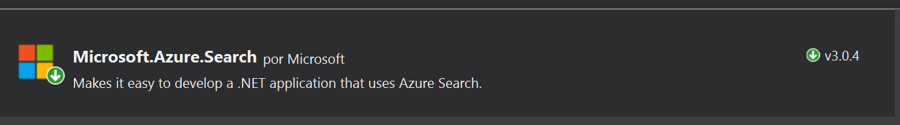

import ArticleHeader from '../../../components/article-header'

<ArticleHeader frontmatter={props.pageContext.frontmatter} />


**​Azure para dotar de inteligencia a tus aplicaciones**

Que Azure, y más en concreto Azure PaaS se ha convertido en nuestro pozo de los deseos es más que evidente. Para todo aquel que haya saboreado de este catálogo de servicios, sabrá que no estoy loco, ¿Cómo si no podríamos tener arquitecturas con escalado vertical y horizontal en un solo click, servicios de búsquedas que indexen millones de elementos con pocas líneas de código, o procesos inteligentes en Serverless que se disparen de forma mágica sin preocuparnos de ningún tipo de infraestructura?

**Azure algo más que músculo y arquitecturas ambiciosas**

No voy a decir que no tenga mérito hacer una buena arquitectura en Azure, pero es de ser honestos admitir que nos lo han puesto bastante más fácil que cuando estábamos en sistemas Onpremises

Me gustaría que con este artículo nos posicionemos en una visión más ambiciosa, y lleguemos a ver que con Azure PaaS podemos incluso dotar de inteligencia a nuestras aplicaciones, mejorarlas al punto que un usuario pueda tener una experiencia de usuario mejorada, y todo con el objetivo de retener usuarios en aplicaciones que durante años nos han dado tanto trabajo y horas de desarrollo profesional.

**¿Cómo mejorar SharePoint? – Seamos osados**

Vamos a empezar por un gran conocido nuestro, y no es otro que SharePoint. Yo he tenido la suerte de trabajar con SharePoint desde las versiones 2003 hasta la actual version 2016 y Online. Y la verdad los que conocemos este producto, y hemos visto su evolución, podemos determinar que es la joya de la corona, que posiblemente hemos maltratado hasta el punto de que poco a poco lo hemos ido olvidando e incluso relegando a una posición más secundaria.

Uno de los motivos de "su no evolución", en las últimas versiones, yo creo que es la gestión o la mala gestión del dato que todos como usuarios hacíamos de esta plataforma. Es decir, SharePoint nos permite tener y definir arquitecturas de la información muy completas basadas en una estructura de sitios compleja, tipos de contenido a medida del caso de uso planteado por el usuario, taxonomías…; y una serie de artefactos como listas y bibliotecas en las que podemos almacenar casi cualquier tipo de información.

**¿Dónde está el problema entonces?,** en mi humilde opinión que si bien definir esto es un proceso de mucha ingeniería y el resultado es inmejorable si se hace bien, luego el usuario o bien no quiere o no sabe cómo rellenar esto, dejando al final la información mínima en la plataforma. Esto la verdad es fatal ya que muchos servicios de SharePoint como el buscador necesitan alimentarse de los datos del usuario.

**¿Os imagináis que esto lo pudiéramos mejorar y conseguir que, con la mínima información por parte del usuario, nosotros pudiéramos autocompletar estos datos?**

**Buscador de noticias inteligente**

La idea planteada es hacer un buscador de noticias, que permita al usuario subir los datos de la noticia como puede ser el título, la imagen o el cuerpo de la noticia; pero por otro lado los tags para rastrear esta noticia en el buscador se van a generar de forma dinámica.


**Necesitamos un disparador, Webhook siempre contigo**

Todo necesita de un inicio, y en este caso vamos a implementar un cliente webhook que reciba la notificación de que se ha creado una nueva noticia. Como vimos en artículos [anteriores](/revistas/numero-32/eventos-sobre-sharepoint-online-con-webhooks), si registramos un webhook de forma correcta sobre la lista, nos va a permitir un mediante un cliente webhook que en este caso hemos implementado sobre un Azure Functions, recibir el evento y procesarlo de forma que sepamos que ha sucedido en esa biblioteca.


Para crear un Azure Function con nuestro cliente lo primero que tenemos que hacer es instalarnos las Tools de Azure [Functions para Visual Studio 2017](https&#58;//blogs.msdn.microsoft.com/visualstudio/2017/08/14/visual-studio-2017-version-15-3-released/) . Una vez instaladas las Tools, creamos un proyecto del tipo Azure Functions.


Sobre el proyecto creado, deberemos agregar una nueva función y como disparador seleccionaremos un HttpTrigger.


Con esto ya tenemos nuestra function creada, ya solo nos quedaría añadir nuestro código del cliente Webhook que podría ser algo parecido a lo siguiente:

```
public static class WebhooksClient
```

```
    {
```

```
        [FunctionName("WebhooksClient")]
```

```
 public static async Task<HttpResponseMessage>  Run([HttpTrigger(AuthorizationLevel.Function, "get", "post", Route =  null)]HttpRequestMessage req, TraceWriter log)
```

```
        {
```

```
            
```

```
            string validationToken = req.GetQueryNameValuePairs()
```

```
        .FirstOrDefault(q => string.Compare(q.Key, "validationtoken", true) == 0)
```

```
        .Value;
```

```
 
```

```
 
```

```
            if (validationToken != null)
```

```
            {
```

```
                log.Info($"Validation token {validationToken} received");
```

```
                var response = req.CreateResponse(HttpStatusCode.OK);
```

```
                response.Content = new StringContent(validationToken);
```

```
                return response;
```

```
            }
```

```
 
```

```
            
```

```
            var notifications = JsonConvert.DeserializeObject<ResponseModel<NotificationModel>>(content).Value;
```

```
 
```

```
            if (notifications.Count > 0)
```

```
            {
```

```
                
```

```
 
```

```
            }
```

```
        }
```

```
    }​
```


Si revisamos el código, es el código mínimo del que debemos de partir para crear un cliente Webhook. Por un lado, si recordamos del artículo anterior, cuando registramos un webhook sobre una lista, la primera vez se manda una petición al cliente para ver que este existe y es correcto, por eso necesitamos el primer bloque de código de “Validation Token”.

Luego el resto es obtener la notificación y deserializarla en un objeto NotificationModel (es un modelo estándar que podéis coger del artículo anterior), y por último dejamos hueco a lanzar la lógica que en diagrama aparece como “Indexar y obtener Tags”.


**Contenido dinámico con Search y Cognitives Services**

Este es el paso más interesante, porque hasta ahora simplemente estamos obteniendo el cambio vía webhook de un ítem en una biblioteca. Si hemos superado este punto, lo que vamos hacer es crear otra function que podemos denominar News o NewManager y que lo que va hacer es obtener la foto de la biblioteca, descargarla y procesarla.

Vamos a ver el siguiente código para que lo veamos más claro:

```
// Obtenemos la fotoSPOService spoM = new SPOService(site);var image = spoM.GetPhotoInfo(lista, id);
```

```
// Analizamos quien aparece en la fotoCelebrityService cService = new CelebrityService();var content = cService.MakeAnalysisCelebrity(image);var celebrityName = cService.GetCelebrity(content.celebrity);
```

```
log.Info("Obteniendo el celebrity");
```

```
//Indexamos los tagsvar azureSearch = new AzureSearchService();var indexCreate = azureSearch.CreateIndexAsync<AzureSearchModel>("newsindex", false, null).Result;var contentIndex = new AzureSearchModel() { IdSharepoint = id, Name = celebrityName, Tags = content.tags, Id = id };var uploadDocument = azureSearch.UploadDocuments<AzureSearchModel>("newsindex", new List<AzureSearchModel>() { contentIndex }.ToArray());spoM.SetResultNews(lista, id, JsonConvert.SerializeObject(content.tags));return req.CreateResponse(HttpStatusCode.OK, "Noticia categorizada");
```

Si lo analizamos poco a poco podemos dividir este código en 3 bloques:

·       Obtener la imagen desde SharePoint.
·       Enviarla a procesar: Analizar la foto, ¿Quién es?
·       Indexar los tags relacionados con la foto en Azure Search: 
o   Crear un index en el servicio.
o   Generar el contenido del index.
o   Subir el contenido al servicio.

Lo interesante es entender esta functions que es la más importante del proceso, ya que el código está compartido de forma pública en este repositorio [Git](https&#58;//github.com/tbsng15/SPOIntelligence.CompartiMoss.git).

**¿Quién eres? – API VISION**

Azure nos proporciona una gran variedad de servicios para dotar de inteligencia a nuestras aplicaciones que denomina servicios Cognitivos. Dentro de este catálogo podemos encontrar la API VISION, que nos permite obtener información práctica de las imágenes, analizar el sentimiento de las personas que aparecen ellas o detectar información más específica de caras o textos, entre otras funcionalidades.​


En este caso para el ejemplo se ha utilizado la parte de “Computer Vision API”, y más en concreto hemos utilizado la información relativa a Celebrities, para poder obtener la información necesaria de un famoso. Por ejemplo si a la biblioteca de SharePoint subiéramos la foto de Satya Nadella, podríamos obtener datos interesantes sobre él, con lo que construirnos nuestro listado de Tags.


Volviendo al código de nuestra function de News, necesitamos implementar un método MakeAnalysisCelebrity que nos obtenga desde el servicio de Vision de Cognitive services los datos de la foto:

```
CelebrityService cService = new CelebrityService();var content = cService.MakeAnalysisCelebrity(image);
```

​El contenido que vamos a devolver es algo parecido al siguiente modelo, y no es otro que los datos de un Celebrity y su listado de Tags

```
public class ContentResult{   public Celebrity celebrity { get; set; }   public List<string> tags { get; set; }}
```

Para empezar a trabajar con  Computer Vision API, debemos crearnos un servicio de este tipo en Azure, y obtener el suscription Key dentro del apartado de claves del servicio, ya que es necesario pasárselo en la cabecera de la petición al servicio. Para consumir el servicio, lo podemos hacer mediante el SDK de Azure, o bien haciendo peticiones a como a cualquier API, como vemos en el siguiente código:

```
public ContentResult MakeAnalysisCelebrity(Stream image){var client = new HttpClient();client.DefaultRequestHeaders.Add("Ocp-Apim-Subscription-Key", "*********");
```

```
string uri = "https://northeurope.api.cognitive.microsoft.com/vision/v1.0/analyze?details=celebrities&visualFeatures=Categories,Description,Color";
```

```
HttpResponseMessage response;
```

```
var buffer = GetImageAsByteArray(image);
```

```
using (var content = new ByteArrayContent(buffer)){// This example uses content type "application/octet-stream".// The other content types you can use are "application/json" and "multipart/form-data".content.Headers.ContentType = new MediaTypeHeaderValue("application/octet-stream");response = client.PostAsync(uri, content).Result;
```

```
string contentString = response.Content.ReadAsStringAsync().Result;var result = JsonConvert.DeserializeObject<RootCelebrityObject>(contentString);return new ContentResult { celebrity = result.categories.FirstOrDefault().detail.celebrities.FirstOrDefault(), tags = result.description.tags };}}
```

A tener en cuenta la construcción de la URL del servicio, ya que debemos especificarle que queremos consultar, en este caso necesitamos obtener "celebrities", y dentro de las que denomina "VisualFeatures", necesitamos los campos categorías, descriptions y color, ya que con ellas construimos los tags. Como se puede observar es una petición post, con los parámetros y las cabeceras que necesitamos, para poder serializar el objeto en un RootCelebrityObjet que es del tipo:

```
public class RootCelebrityObject{public List<Category> categories { get; set; }public Description description { get; set; }public string requestId { get; set; }public Metadata metadata { get; set; }}
```

​El resto de clases las obtenéis desde el [ejemplo](https&#58;//github.com/tbsng15/SPOIntelligence.CompartiMoss.git), pero en este caso es un mapeo directo desde lo que devuelve el servicio, analizando el json de salida se puede sacar sin problemas.

**Indexando los Tags obtenidos**

Una vez obtenemos el listado de Tags deberemos implementar haciendo uso de Azure Search un índice de búsquedas para nuestras noticias. Lo primero claro está es tener creado en el portal de Azure el Servicio de búsqueda, y después implementaremos un proyecto que maneje el servicio de Search.

En el ejemplo encontrareis un proyecto que se llama Encamina.SPO.Intelligence.Search, y con el cual podemos cubrir las tres necesidades básicas para interactuar con nuestro servicio:

·       **Create index**
Nos permite generar un nuevo index en el servicio, en el cual subiremos documentos con una estructura JSON y sobre los cuales haremos las consultas.

```
public async Task<Index​​​​> CreateIndexAsync<T>(string indexName, bool overwriteIfExists, List<Suggester> suggesters) where T : class
```

·       **Upload Document**
Este método permite subir los modelos generados desde la obtención de los Tags al servicio de búsqueda.

```
public async Task<KeyValuePair<bool, IndexBatch<T>>> UploadDocuments<T>(string indexName, T[] array) where T : AzureSearchModel
```

·       **Run query**
Lanza las consultas contra un índice en concreto, y mediante un texto pasado por parámetro

```
public async Task<Result<T>> RunQuery<T>(string indexName,SearchParameters searchParameters,string key,SearchContinuationToken continuationToken,bool highScoring = false)
```

Además de implementar el servicio es muy importante implementar de forma correcta el modelo que va a formar nuestro índice de búsqueda. En este caso si analizáis un poco los métodos del servicio, necesitamos implementar un modelo que se llame AzureSearchModel, y que puede ser de la siguiente forma:

```
public class AzureSearchModel{[System.ComponentModel.DataAnnotations.Key][IsFilterable]public string Id { get; set; }[IsRetrievable(true), IsSearchable, IsSortable]public string Name { get; set; }[IsRetrievable(true)]public string IdSharepoint { get; set; }[IsRetrievable(true), IsFacetable, IsFilterable, IsSearchable]public List<string> Tags { get; set; }}
```

Como se ve en la clase, le podemos especificar al servicio de búsqueda que campos de nuestro modelo son filtrables, o buscables. Para implementar este proyecto de forma correcta necesitaremos hacer uso del paquete nuget:​



**Solo queda probarlo, interfaz libre**

Una de las ventajas de utilizar Azure Functions con entrada por Http, es que somos independientes para visualizar estos datos donde queramos, es decir podemos por ejemplo utilizar SPFX para hacer un webpart en nuestro SharePoint o bien optar por algo más nativo y desarrollar una PowerApps.

En cualquier caso, por ver que esto funciona, vamos a ponerlo un poco más fácil aun así a los desarrolladores de Front-end y vamos a unificar los datos de nuestra lista de SharePoint con los datos obtenido desde nuestro Azure Search.

Para ello vamos a implementar una functions más que vamos a llamar Search, y que va a cruzar los datos del índice con los datos de la lista, y que tendrá una pinta parecida a lo siguiente:

```
public static class Search{[FunctionName("Search")]public static async Task<HttpResponseMessage> Run([HttpTrigger(AuthorizationLevel.Function, "get", "post", Route = null)]HttpRequestMessage req, TraceWriter log){log.Info("C# HTTP trigger function processed a request.");// parse query parameterstring text = req.GetQueryNameValuePairs().FirstOrDefault(q => string.Compare(q.Key, "text", true) == 0).Value;string site = req.GetQueryNameValuePairs().FirstOrDefault(q => string.Compare(q.Key, "site", true) == 0).Value;string library = req.GetQueryNameValuePairs().FirstOrDefault(q => string.Compare(q.Key, "library", true) == 0).Value;// Get request bodydynamic data = await req.Content.ReadAsAsync<object>();// Set name to query string or body datatext = text ?? data?.text;site = site ?? data?.site;library = library ?? data.library; var azureSearch = new AzureSearchService();var result = azureSearch.RunQuery<AzureSearchModel>("newsindex", new Microsoft.Azure.Search.Models.SearchParameters(), text, null).Result;var searched = JsonConvert.SerializeObject(result);var spoS = new SPOManager.SPOService(site);var resultSPO = spoS.GetData(library); return text == null? req.CreateResponse(HttpStatusCode.BadRequest, "Inserte texto de busqueda"): req.CreateResponse(HttpStatusCode.OK,new FullResult() { SearchResult = searched, SharepointResult = resultSPO });}}
```

Si observamos el código, veremos que nuestra función necesita revisar los datos del site, la biblioteca de Sharepoint, y por otro lado el "texto de búsqueda", sobre el cual haremos la consulta.

Después de esto necesitamos invocar al RunQuery de AzureSearchService que vimos en puntos anteriores, y tendremos un servicio que vía CSOM nos obtenga los datos de la biblioteca.
 Lo único necesario ahora es juntar ambos contenidos (search y SharePoint) y devolverlo en un objeto FullResult, que no es más que una clase de la siguiente forma:

```
public class FullResult{public string SearchResult { get; set; }public string SharepointResult { get; set; }}
```

En resumen, esta functions nos va a permitir devolver dos JSON de resultado, para que luego el desarrollador de front pueda cruzar los datos en cliente, ya que el índice de Azure tiene todos los identificadores de SharePoint. Este proceso se puede refinar tanto como sea necesario, filtrando por consultas paginadas, o reduciendo el número de resultados, pero para el ejemplo esto nos sobra.

Ya en función de las necesidades, podríamos englobar esta function en una UI personalizada, como podría ser la del siguiente ejemplo.


**Con muy poco obtenemos mucho….**

Está claro que este ejemplo es muy tonto, y que posiblemente no se dé este caso de uso en la realidad, pero podemos sacar conclusiones muy positivas. 
Desde una simple foto, podemos auto-completar los datos de nuestro SharePoint, y esto ya es un paso, un paso pequeñito que con un poco de imaginación podemos ir haciendo crecer.

Si pensamos que estamos en la era "social", en la que los Facebook, Instagram…, dominan el mercado de lo social, y en la que tenemos miles de fotos sin explotar, ya que no obtenemos casi información de esas imágenes para un uso empresarial. Si esto lo llevamos a las intranets, o las soluciones sociales de empresa como Yammer, podríamos empezar a recoger muchísima información útil e integrarla en nuestros desarrollos. Nada que no hagan ya aplicaciones como Delve por ejemplo.

La idea es que ya tenemos herramientas para mejorar la inteligencia y los procesos de nuestras aplicaciones, sin necesidad de insertar miles de registros en una base de datos, y mucho más aun tener un registro de datos vivo y dinámico.

Eso si no os paséis dando inteligencia, la humanidad y la privacidad de la gente os lo agradecerá, no queremos acabar como en Terminator o Blade Runner entre otros ejemplos :)


**Sergio Hernandez Mancebo**
Principal Team Leader en Encamina

@shmancebo

