Azure AD, la solución de identidad como servicio (IdaaS) de Microsoft, es un complejo sistema de gestión de identidades y acceso (IAM) que puede desplegarse en la nube o de forma híbrida, sincronizando directorios locales con Azure AD Connect. Dependiendo del tipo de licencia, tendremos a nuestra disposición una serie de características avanzadas de seguridad y administración que facilitarán la gestión de identidades y accesos a cualquier escala.

**¿Qué es AAD?**

Ante esta pregunta resulta tentador afirmar que AAD es la versión cloud de AD (Directorio Activo). Pero en realidad es mucho más. Azure AD ofrece administración de identidades y control de acceso a aplicaciones SaaS y locales, experiencia de inicio de sesión único, integración con bosques de AD local, y toda una serie de "extras" dependiendo de la versión que tengamos contratada: autenticación multifactor (MFA), administración de dispositivos, autoservicio de contraseñas y grupos, administración de cuentas con privilegios (PIM), control de acceso basado en roles (RBAC), protección de identidades, acceso condicional, etc.

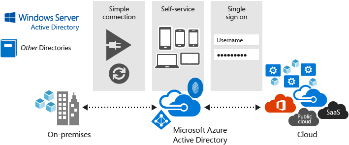

En este artículo vamos a profundizar en las características de seguridad avanzada que ofrece Azure AD Premium. Pero antes repasemos las opciones de licenciamiento y de arquitectura de identidades.

**Identidades**

Para la comprobación de identidades (autenticación) tenemos varias opciones:

·       **Identidad Cloud**: las cuentas se administran solamente en la nube. La autenticación la realiza Azure AD. Es la configuración por defecto cuando se crea un nuevo tenant de Office 365, por ejemplo.

Las demás opciones están disponibles utilizando AD Connect para sincronizar objetos de Directorio Activo local con Azure AD.

La ventaja de Azure AD Connect es que los usuarios pueden acceder a recursos locales y en la nube con la misma cuenta. Otra ventaja es que no se necesita crear cuentas en Azure AD, pues éstas se sincronizan desde el Directorio Activo local. Microsoft recomienda instalar Azure AD Connect en una máquina independiente con acceso al bosque de Directorio Activo local.

·       **Identidad sincronizada**: las identidades existen tanto en la nube como en local, pero la autenticación sucede en la nube. Requiere Servicios de Dominio de Directorio Activo (ADDS), Azure AD, y AD Connect con sincronización de contraseñas. Los usuarios y las contraseñas de ADDS se sincronizan con Azure AD.
·       **Federación con ADFS**: las identidades existen tanto en la nube como en local. La autenticación se realiza en local a través de los Servicios de Federación de Directorio Activo (ADFS) contra el Directorio Activo local.

Requiere ADDS federado con ADFS, Azure AD, y AD Connect. Los usuarios se sincronizan con Azure AD, pero no así las contraseñas. Además de los servidores ADDS y ADFS, se debe configurar Azure AD Connect para utilizar ADFS, y de esta forma federar los dos directorios, lo que genera una relación de confianza entre Azure AD y ADFS. El login ocurre en la nube, pero la autenticación se redirige al ADFS.

·       **Pass-through authentication**: las identidades existen tanto en la nube como en local. La autenticación se realiza en local a través del Directorio Activo (ADDS).

Requiere Servicios de Dominio de Directorio Activo (ADDS), Azure AD, y AD Connect con la opción de pass-through authentication. Los usuarios se sincronizan con Azure AD. Se instala un agente en un Windows Server local, para recibir y responder a peticiones de validación de contraseñas. Recibe las contraseñas cifradas desde Azure AD, las descifra y las valida contra el Directorio Activo local. La comunicación se realiza a través de un Bus de Servicio de Azure.

En cuanto al login, y a diferencia de la opción ADFS donde la contraseña se ingresa en local, en este caso tanto usuario como contraseña se ingresan en la nube, y Azure AD envía la contraseña cifrada al Directorio Activo para validación. Al igual que la opción ADFS, las contraseñas no se guardan en la nube.

·       **Federación con solución de terceros**: las identidades existen tanto en la nube como en local.

La autenticación se realiza en local a través de un servidor de identidades de terceros contra el Directorio Activo local. Requiere Azure AD, AD Connect con la opción "do not configure", y solución de identidades de terceros. Los usuarios se sincronizan con Azure AD, pero no así las contraseñas.

Relación de confianza entre Azure AD y la solución de terceros. El login se realiza en la nube, pero la autenticación se redirige al gestor de identidades de terceros.

El tipo de inicio de sesión se elige durante la instalación de Azure AD Connect:

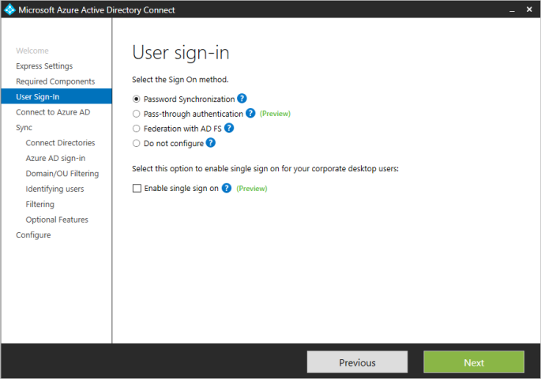

**Licencias**

Todos los servicios de Microsoft Online dependen de Azure AD a nivel de identidades, por lo que (tal vez no lo sepas, pero…) si usas Office 365 empresarial o Dynamics CRM online, ya tienes un directorio de Azure AD. Existen cuatro niveles de licenciamiento de Azure AD: Gratuito, Básico, Premium P1, Premium P2. En realidad son cinco, si contamos el directorio que se crea con un tenant de Office 365, y que ofrece características diferentes a las cuatro opciones de licenciamiento.

**Gratuito**

Con la edición gratuita de AAD se pueden administrar usuarios y grupos (límite de 500K objetos), registrar dispositivos, sincronizar directorios locales con AAD Connect, configurar SSO. Además, la edición gratuita proporciona colaboración B2B con usuarios y directorios externos, y también informes básicos de seguridad y uso.

Características de Windows 10 con Azure AD join disponibles en la versión gratuita de AAD: unir dispositivos Windows 10 a Azure AD, Windows Hello para Azure AD, Bitlocker recovery.

Además, los niveles gratuito y básico de Azure AD incluyen autenticación multifactor (MFA) con el modelo de pago por uso:

[https://azure.microsoft.com/es-es/pricing/details/multi-factor-authentication/](https://azure.microsoft.com/es-es/pricing/details/multi-factor-authentication/)

**Básico**

El nivel básico incluye todas las características de la licencia gratuita, más: administración de usuarios y grupos sin límite de objetos, acceso basado en grupo, proxy de aplicaciones (para publicar aplicaciones locales con AAD), autoservicio de restablecimiento de contraseña, personalización de páginas de login y acceso, SLA de 99,9%

**Office 365**

Las características del directorio de Azure AD que se crea con el tenant de Office 365 incluyen todas las del nivel básico, más: administración de usuarios y grupos sin límite de objetos de Office 365, autoservicio de restablecimiento de contraseña, personalización de páginas de login y acceso, SLA de 99,9%, y MFA sin coste para aplicaciones de Office 365.

**Premium P1**

Las novedades más importantes de las licencias premium, con respecto a los niveles gratuito y básico, son las características de seguridad y protección.

La licencia Premium P1 incluye todas las características de los planes básico y gratuito, más:

·       Grupos dinámicos.
·       Sincronización bi-direccional con directorios locales a través de Azure AD Connect.
·       Microsoft Identity Manager.
·       Cloud App Discovery.
·       Acceso condicional según grupo y ubicación.
·       Acceso condicional según dispositivo (administrado o unido a dominio).
·       Inscripción automática de dispositivos.

**Premium P2**

La licencia Premium P2 incluye todas las características del plan Premium P1, más:

·       Identity protection.
·       Acceso condicional basado en riesgo de inicio de sesión o de usuario.
·       Administración de cuentas con privilegios (PIM).

**Seguridad en Azure AD**

En cuanto a la seguridad, Azure AD protege aplicaciones, datos e identidades con varias características Premium. En las próximas líneas analizaremos cuatro de esas características:

·       Autenticación Multifactor (MFA).
·       Protección de identidades.
·       Administración de cuentas con privilegios.
·       Acceso Condicional.

**MFA**

La autenticación multifactor es un método que requiere más de una comprobación y agrega otro nivel de seguridad a las transacciones e inicios de sesión del usuario. Funciona mediante la solicitud de dos o más de los siguientes métodos de verificación:

·       Un elemento conocido (por ejemplo, contraseña).
·       Un elemento disponible (un dispositivo de confianza que no se puede duplicar con facilidad, como un móvil).
·       Un elemento físico de identificación (biométrico).

Para la segunda comprobación pueden usarse los siguientes métodos:

·       Llamada de teléfono.
·       SMS.
·       Notificación en App móvil.
·       Código de verificación en App móvil.
·       Tokens OATH de terceros.

**Versiones de MFA**

**MFA para Office 365**: Esta versión funciona exclusivamente con aplicaciones de Office 365 y se administra desde el portal de Office 365.

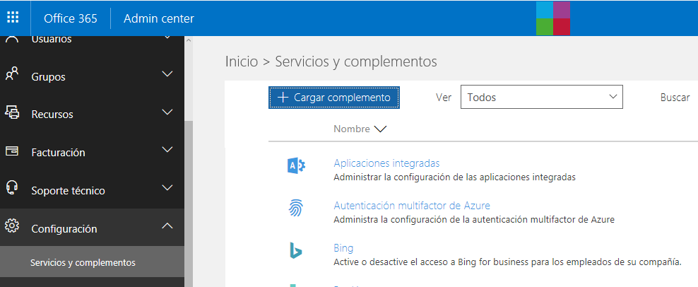

En la consola de administración de Office 365, vamos a Configuración &gt; Servicios y complementos &gt; Azure MFA

En el panel de configuración de Azure MFA para Office 365, además de la gestión de usuarios a los que se requiere MFA, tenemos la opción de omitir IPs o rangos de IP de la autenticación multifactor.

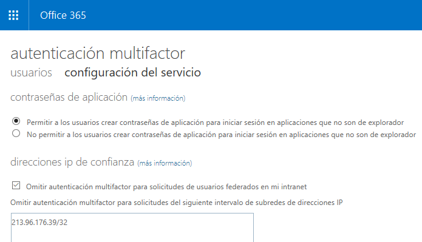

**MFA para administradores de Azure**: se puede habilitar MFA para administradores globales de Azure, sin coste adicional.

**Azure MFA**: Conocida como la versión "completa", Azure Multi-Factor Authentication ofrece opciones de configuración adicionales e informes avanzados a través del [Portal de Azure clásico](https://manage.windowsazure.com/) (uno de los últimos servicios de Azure que continúan en el portal clásico). Azure Multi-Factor Authentication se incluye en los [planes de Azure Active Directory Premium](https://www.microsoft.com/cloud-platform/azure-active-directory-features) y en los [planes de Enterprise Mobility + Security](https://www.microsoft.com/cloud-platform/enterprise-mobility-security-pricing), y se puede implementar en la nube o de forma local.

Si nos decantamos por una implementación local, debemos descargar la imagen desde el portal de Azure, instalar y configurar en un servidor local:

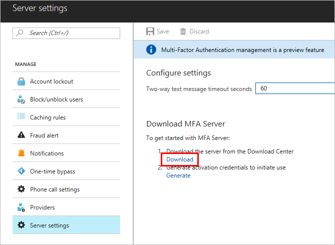

Más detalles en el siguiente enlace:

[https://docs.microsoft.com/es-es/azure/multi-factor-authentication/multi-factor-authentication-get-started-server](https://docs.microsoft.com/es-es/azure/multi-factor-authentication/multi-factor-authentication-get-started-server)

**Protección de identidades**

Azure AD Identity Protection es una característica de la versión Premium P2 que permite:
·       Detectar identidades vulnerables.
·       Configurar respuestas automáticas a posibles amenazas a las identidades.
·       Investigar y resolver incidentes relacionados con las identidades.

**Azure AD Identity****Protection** va más allá de una simple monitorización y reporting, permitiendo establecer directivas basadas en riesgos que puedan desencadenar una respuesta cuando se alcanza un determinado nivel de riesgo. Por ejemplo, una directiva podría bloquear accesos, forzar el reseteo de contraseñas, o exigir MFA. La detección de vulnerabilidades incluye configuración de Azure AD, como AAD Privileged Identity Management y también la presencia de aplicaciones cloud no gestionadas.

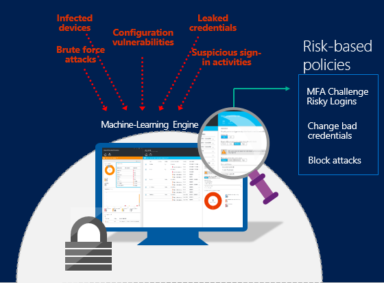

AAD Identity Protection detecta 6 tipos de riesgos, y a cada uno le asigna un nivel: Alto, Medio, o Bajo.

·         Usuarios con credenciales comprometidas.

·         Inicios de sesión desde IPs anónimas.

·         Viaje imposible a ubicaciones atípicas.

·         Inicios de sesión desde ubicaciones inusuales.

·         Inicios de sesión desde dispositivos infectados.

·         Inicios de sesión desde IPs con actividades sospechosas.

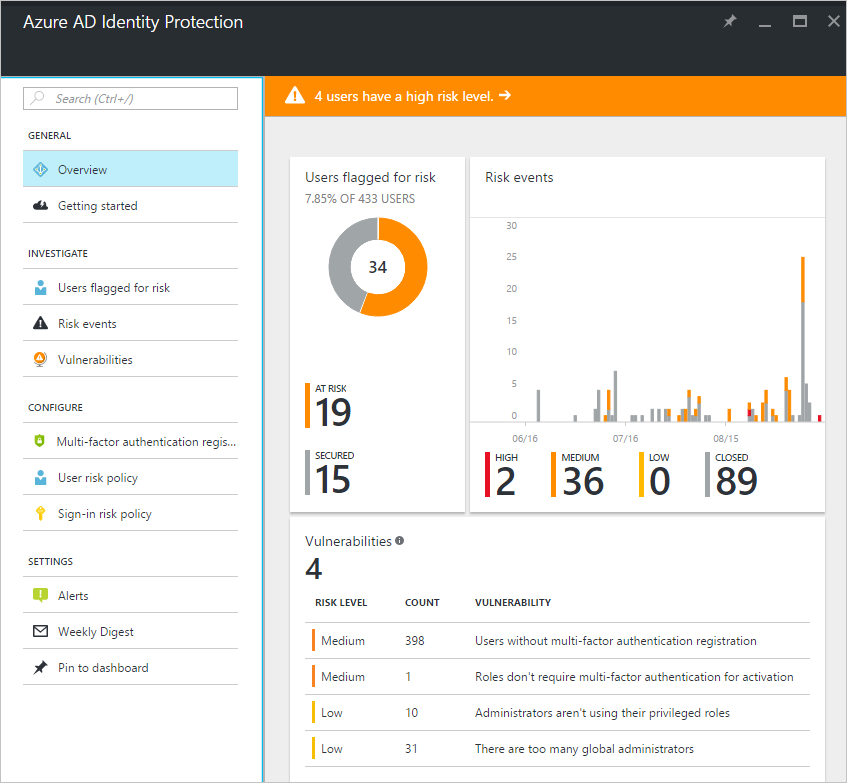

Al igual que Advanced Threat Analytics (ATA) o Azure Advanced Threat Protection (AATP), Azure AD Identity Protection utiliza Machine Learning y análisis de comportamiento para detector actividades sospechosas en relación a identidades de usuarios. Por cada incidente detectado se crea un evento de riesgo.

En cada directiva se definen acciones para resolver los eventos de riesgo cuando se alcanza un cierto nivel. El nivel por defecto es Medio.

Azure AD Identity protection permite seleccionar a qué usuarios se va a aplicar la directiva, de tal modo que se pueden crear diferentes directivas para diferentes grupos de riesgo.

[https://docs.microsoft.com/es-es/azure/active-directory/active-directory-identityprotection](https://docs.microsoft.com/es-es/azure/active-directory/active-directory-identityprotection)

**Administración de cuentas con privilegios**

Azure AD Privileged Identity Management es otra característica de Azure AD Premium P2 que ayuda a gestionar y proteger las credenciales de administrador, monitorizando las actividades de los administradores y restringiendo el acceso a los recursos.

Las configuraciones disponibles son:

·       Ver los usuarios con rol de administrador.
·       Habilitar acceso de administrador puntual ("just in time").
·       Obtener reportes históricos de acceso de administrador.
·       Obtener reportes de cambios de permisos de administrador.
·       Alertas sobre accesos de administrador.

Azure AD PIM introduce el concepto de "administrador apto" (según la traducción de "elegible administrator" del portal de Azure). Cuando un usuario se define como "administrador apto" recibe permisos de administrador puntuales para determinada aplicación, por un período de tiempo limitado.

El rol de "administrador apto" está inactivo hasta que el usuario necesita acceder, momento en el cual debe completar un proceso de activación para convertirse en administrador por tiempo limitado.

En el panel de control podemos ver la siguiente información:

·       Alertas sobre mejoras de seguridad.
·       Número de usuarios en cada rol con privilegios.
·       Número de usuarios aptos y permanentes.
·       Revisiones de acceso en curso.

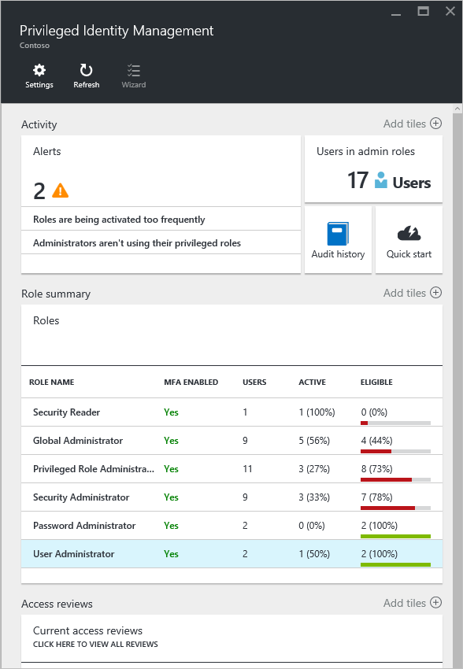

**Administración de roles con privilegios**

Con Azure AD Privileged Identity Management, podemos agregar o quitar administradores permanentes o aptos en cada rol de directorio de Azure AD.  Mediante la [configuración de roles](https://docs.microsoft.com/es-es/azure/active-directory/active-directory-privileged-identity-management-how-to-change-default-settings) se establecen las propiedades de activación de rol apto para las aplicaciones de Azure AD como:

·       La duración del período de activación del rol.
·       La notificación de activación del rol.
·       La información que un usuario debe proporcionar durante el proceso de activación del rol.
·       Número de incidente.
·       [Approval workflow requirements (Requisitos de flujo de trabajo de aprobación) (versión preliminar)](https://docs.microsoft.com/es-es/azure/active-directory/privileged-identity-management/azure-ad-pim-approval-workflow).

**Activación de rol**

Para [activar un rol](https://docs.microsoft.com/es-es/azure/active-directory/active-directory-privileged-identity-management-how-to-activate-role), un administrador apto solicita una "activación" puntual para ese rol. Se puede solicitar la activación mediante la opción Activar mi rol en Administración de Azure AD PIM. La activación del rol es personalizable. En la configuración de PIM, se puede determinar la duración de la activación, así como la información que el administrador debe proporcionar para activar el rol.

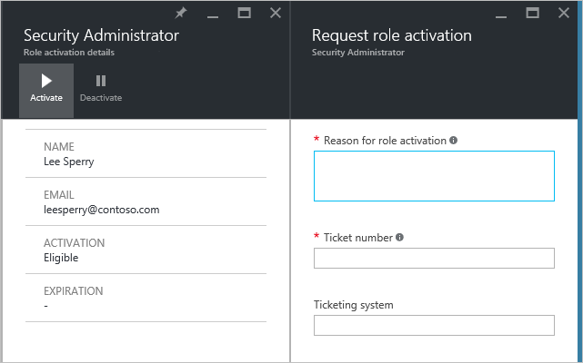

**Acceso Condicional**

El acceso condicional es una funcionalidad de **Azure AD Premium** que permite aplicar controles de acceso a las aplicaciones según condiciones específicas. El cumplimiento de estas condiciones permitirá o bloqueará el acceso. La implementación del acceso condicional se basa en directivas. Estas directivas definen los requisitos de acceso mediante declaraciones basadas en el siguiente patrón:

Al reemplazar las declaraciones por información real, obtenemos un ejemplo de una declaración de directiva:

*Cuando los usuarios intentan acceder a las aplicaciones desde IPs anónimas, se bloquea el acceso.*

En el contexto del acceso condicional de Azure AD,
·       "Si ocurre esto" se denomina declaración de condición
·       "Se debe hacer esto" se denomina controles.

La combinación de una condición con los controles representa una directiva de acceso condicional.

**Controles**

En una directiva de acceso condicional, los controles definen qué es lo que debe suceder cuando se cumple una condición. Con estos controles se bloquea o permite el acceso con requisitos adicionales. Cuando la directiva permite el acceso, debemos seleccionar al menos un requisito.
Existen dos tipos de controles:
·       **Controles de concesión**: determinan los requisitos para que un usuario pueda autenticarse e iniciar sesión, por ejemplo MFA, dispositivo unido a dominio, o dispositivo administrado:

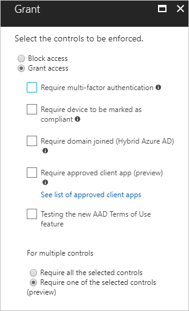

·       **Controles de sesión**: Azure AD envía información del dispositivo a la aplicación, y es ésta la que limita la experiencia del usuario. De momento sólo disponible para SharePoint online.

Para más información sobre cómo utilizar el Acceso Condicional de Azure AD para controlar el acceso a SharePoint online:
[https://support.office.com/es-es/article/Controlar-el-acceso-desde-dispositivos-no-administrados-5ae550c4-bd20-4257-847b-5c20fb053622?ui=es-ES&rs=es-ES&ad=ES](https://support.office.com/es-es/article/Controlar-el-acceso-desde-dispositivos-no-administrados-5ae550c4-bd20-4257-847b-5c20fb053622?ui=es-ES&amp;rs=es-ES&amp;ad=ES)

**Declaración de condición**

En las directivas de acceso condicional, se definen los criterios que es necesario satisfacer para que los controles se apliquen.

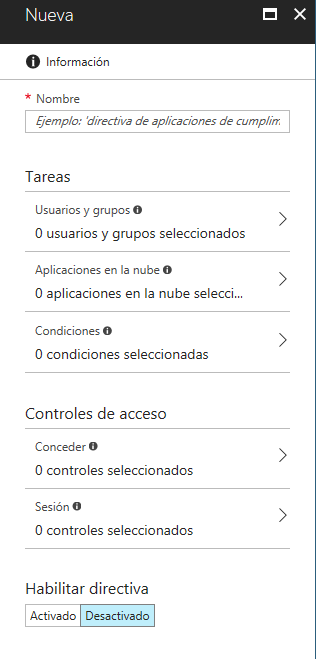

**Usuarios y grupos**
Aquí se seleccionan los usuarios y grupos a los que aplica la directiva. También podemos seleccionar usuarios o grupos a excluir de la aplicación de la directiva.

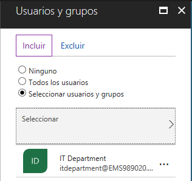

**Aplicaciones en la nube**
Seleccionamos las aplicaciones a las que aplica la directiva. Aquí podremos seleccionar cualquier aplicación registrada en Azure AD, desde todas las apps de Office 365 y Microsoft online, hasta Azure Information Protection, administración de Azure, o aplicaciones propias.

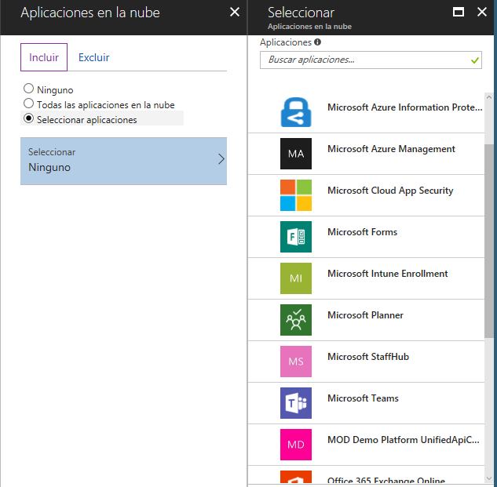

Ejemplo de Acceso Condicional aplicado a SharePoint online: exigir MFA a usuarios externos, usando Grupos Dinámicos.
[https://blogs.technet.microsoft.com/kekirkpa/2017/10/13/enforcing-multi-factor-authentication-for-external-users-on-sharepoint-online/](https://blogs.technet.microsoft.com/kekirkpa/2017/10/13/enforcing-multi-factor-authentication-for-external-users-on-sharepoint-online/)
Ejemplo de Acceso Condicional aplicado a Azure Information Protection: exigir MFA para el acceso móvil a documentos confidenciales
[http://blogs.encamina.com/por-una-nube-sostenible/2017/10/27/azure-information-protection-acceso-condicional-a-documentos/](http://blogs.encamina.com/por-una-nube-sostenible/2017/10/27/azure-information-protection-acceso-condicional-a-documentos/)

**Condiciones extra**

Además de usuarios y aplicaciones, hay otras condiciones que podemos configurar, como inicio de sesión en riesgo (Identity Protection), localizaciones (IPs de confianza de MFA), plataformas de dispositivos móviles, o aplicaciones cliente:

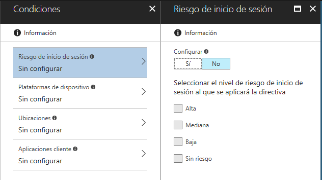

¡Y listo! Habilitamos la directiva y ya comenzará a aplicarse.

**Casos de uso**

·       Exigir MFA para las aplicaciones que tienen acceso a datos confidenciales. 
·       Exigir MFA para el acceso desde redes que no son de confianza.
·       Acceso a Office 365 sólo desde dispositivos unidos a dominio, utilizando Intune.

[https://www.microsoft.com/en-us/cloud-platform/conditional-access](https://www.microsoft.com/en-us/cloud-platform/conditional-access)

**Conclusión**

Dentro de su firme apuesta por la seguridad, Microsoft está llevando la protección a todos los rincones de la nube. También a las identidades. En este artículo he querido dar un paseo por algunas de las complejas características de seguridad de Azure AD. Pero hay más. Mucho más.

**Pablo Ortiz Baiardo**
 Cloud Solutions Specialist
 ortiz.pablo@gmail.com
 @portiz2017

http://blogs.encamina.com/por-una-nube-sostenible/ 
https://www.linkedin.com/in/portiz

 
 
import LayoutNumber from '../../../components/layout-article'
export default LayoutNumber
