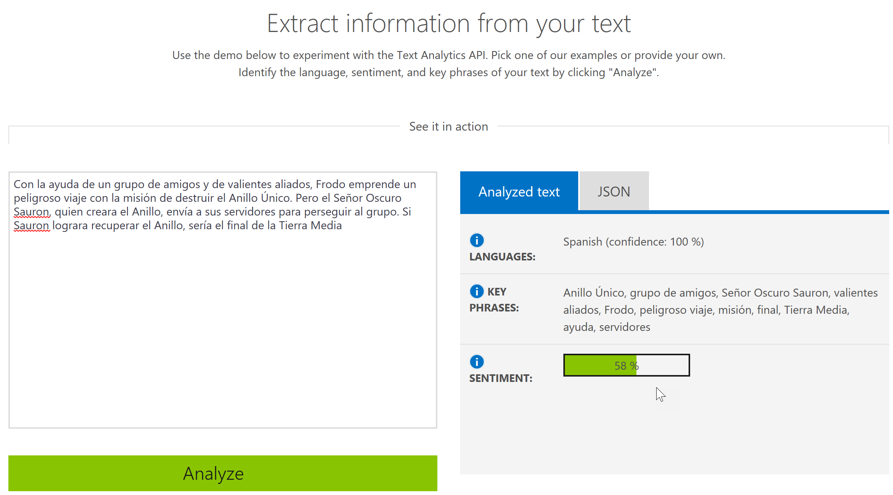
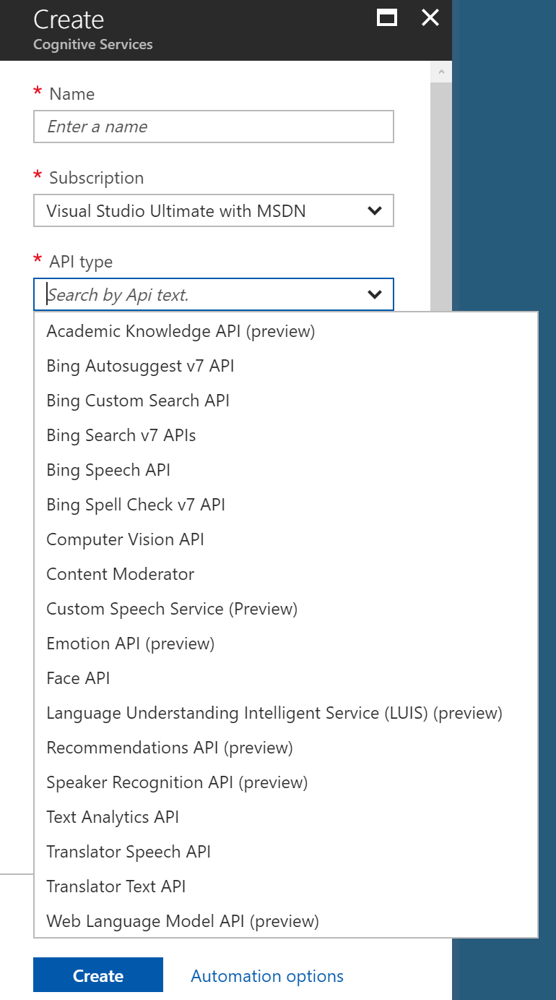
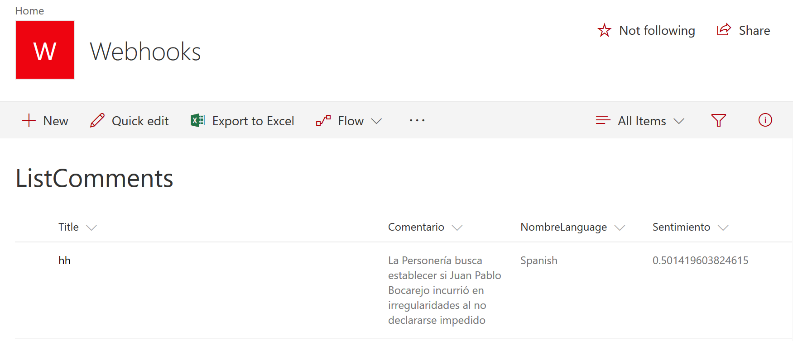

**Que es el Azure Text Analytics API**

El servicio de Análisis de Texto de Azure permite el procesamiento de texto en tres formas diferentes: detección del lenguaje utilizado, extracción de palabras clave y análisis de sentimiento. El servicio forma parte del conjunto de Cognitive Services de Azure, que es una colección de algoritmos de Inteligencia Artificial que se pueden utilizar en la nube de Microsoft.

La parte de detección de lenguaje permite encontrar que lenguaje es utilizado en un texto. Hasta este momento es posible detectar 120 lenguajes con el Text Anaytics API. El resultado de una consulta devuelve el nombre del lenguaje, su código y un indicador de la probabilidad de acierto de la detección (un integer entre 0 y 1).

La extracción de palabras clave identifica las palabras o frases mas importantes en una oración. Esta parte del API se puede utilizar para determinar rápidamente el tema de una oración, crear resúmenes y para utilizar con sistemas de búsqueda.

El análisis de sentimiento produce un resultado sobre que tan positivo o negativo es un texto. El resultado es un integer entre 0 (sentimiento negativo) y 1 (sentimiento positivo). El análisis funciona para 120 idiomas y se puede utilizar para analizar comentarios, revisiones de productos, emociones en social media e Emails, etc. El análisis de sentimiento utiliza técnicas avanzadas de procesamiento de texto en algoritmos de Inteligencia Artificial, no simple "diccionarios" de palabras "buenas" y "malas", por lo que los resultados se mejoran constantemente con cada nueva consulta.

Las tres partes de Text Analytics API aceptan texto Unicode codificado como UTF-8 o UTF-16 y con un máximo de 5000 caracteres por documento; una consulta puede contener hasta 1000 documentos, pero no debe exceder 1 MB de tamaño.

Microsoft proporciona un simulador del API ([https://azure.microsoft.com/en-us/services/cognitive-services/text-analytics/](https&#58;//azure.microsoft.com/en-us/services/cognitive-services/text-analytics/)) que permite introducir un texto cualquiera y encontrar su idioma, palabras clave y sentimiento:



**Configuración del Azure Text API**

Para utilizar el Text API es necesario crear primero el servicio en Azure:

(1)    Entre al portal de manejo de Azure ([https://portal.azure.com](https&#58;//portal.azure.com/)) utilizando sus credenciales.
(2)    Vaya a la sección de "Resource Groups" y cree un nuevo Grupo de Recursos (también es posible reutilizar un grupo ya existente).
(3)    Cree una cuenta de Cognitive Services:
-          En el Resource Group, utilice el botón de "+Add" para crear un recurso, busque por "cognitive services" en la casilla de búsqueda y seleccione "Cognitive Services" en los resultados.
-          Asígnele un nombre al servicio y utilice el Grupo de Recursos deseado. En "API type" seleccione "Text Anaytics API". En la casilla de "Pricing tier" seleccione el número máximo de transacciones que utilizara por mes, lo que determina el precio del servicio (gratis si se utilizan menos de 25000 transacciones por mes). Confirme el anuncio de privacidad que aparece en la configuración (Microsoft utilizara los datos enviados para mejorar automáticamente los algoritmos de reconocimiento).



(4)    Una vez creado el servicio, haga clic sobre su nombre en la lista de recursos del Resource Group, vaya a "Keys" y copie el valor de "Key 1"

**Utilizando el Azure Text API con SharePoint**

En el siguiente ejemplo se va a utilizar una Lista de SharePoint con un campo de "Comentarios". Cuando se introduce un nuevo elemento en la Lista con un comentario, un WebHook hace que una Función de Azure comience a funcionar, utilice el texto del comentario para hacer una llamada al Azure Text Analytics API y determina su lenguaje, palabras clave y sentimiento. Finalmente, estos valores son introducidos de regreso en el elemento de la Lista.

**Nota:** la creación y configuración de una Función de Azure se puede encontrar el en artículo "SharePoint y Azure – Azure Functions" ([http://www.compartimoss.com/revistas/numero-30/sharepoint-y-azure-azure-functions](/revistas/numero-30/sharepoint-y-azure-azure-functions)). La configuración y utilización de WebHooks de SharePoint se puede encontrar en el artículo "Eventos sobre SharePoint Online con Webhooks" ([http://www.compartimoss.com/revistas/numero-32/eventos-sobre-sharepoint-online-con-webhooks](/revistas/numero-32/eventos-sobre-sharepoint-online-con-webhooks)).

(2)    Cree una cuenta de Funciones básica en el Grupo de Recursos, asignándole un nombre, plan de servicios y cuenta de storage.
(3)    Utilizando Visual Studio 2017 (o Visual Studio 2016 con el AddIn para programar Funciones de Azure), cree una nueva solución del tipo "Azure Function". Una vez creada la solución, agréguele una Función del tipo "Http Trigger" con derechos de acceso anónimos.
(4)    Agréguele a la solución los paquetes NuGet "Microsoft.Azure.CognitiveServices.Language" (versión "1.0.0-preview"), "AppForSharePointOnlineWebToolkit" y "Newtonsoft.Json".

Al inicio del archivo .cs de la Función en Visual Studio, añada las siguientes directivas:

```
using System;
```

```
using System.Collections.Generic;
```

```
using System.Configuration;
```

```
using System.Security;
```

```
using Newtonsoft.Json;
```

```
using Microsoft.SharePoint.Client;
```

```
using Microsoft.Azure.CognitiveServices.Language.TextAnalytics;
```

```
using Microsoft.Azure.CognitiveServices.Language.TextAnalytics.Models;
```

```
(1)    Reemplace toda la rutina "Run" con el siguiente código (reemplace los valores de "baseUrl", "myUserName" y "myPassword" por los valores correctos de su sistema):
```

```
        [FunctionName("TextAnalyticsFunction")]
```

```
        public static async Task<HttpResponseMessage> Run([HttpTrigger(AuthorizationLevel.Anonymous, "post", Route = null)]HttpRequestMessage req, TraceWriter log)
```

```
        {
```

```
            // Registration
```

```
            string validationToken = req.GetQueryNameValuePairs()
```

```
                .FirstOrDefault(q => string.Compare(q.Key, "validationtoken", true) == 0)
```

```
                .Value;
```

```
            if (validationToken != null)
```

```
            {
```

```
                var myResponse = req.CreateResponse(HttpStatusCode.OK);
```

```
                myResponse.Content = new StringContent(validationToken);
```

```
                return myResponse;
```

```
            }
```

```
 
```

```
            // Changes
```

```
            var myContent = await req.Content.ReadAsStringAsync();
```

```
            var allNotifications = JsonConvert.DeserializeObject<ResponseModel<NotificationModel>>(myContent).Value;
```

```
 
```

```
            if (allNotifications.Count > 0)
```

```
            {
```

```
                foreach (var oneNotification in allNotifications)
```

```
                {
```

```
                    // Login in SharePoint
```

```
                    string baseUrl = "https://dominio.sharepoint.com/";
```

```
                    string myUserName = "usuario@dominio.onmicrosoft.com";
```

```
                    string myPassword = ConfigurationManager.AppSettings["usuarioPW"];
```

```
 
```

```
                    SecureString securePassword = new SecureString();
```

```
                    foreach (char oneChar in myPassword) securePassword.AppendChar(oneChar);
```

```
                    SharePointOnlineCredentials myCredentials = new SharePointOnlineCredentials(myUserName, securePassword);
```

```
 
```

```
                    ClientContext SPClientContext = new ClientContext(baseUrl + oneNotification.SiteUrl);
```

```
                    SPClientContext.Credentials = myCredentials;
```

```
 
```

```
                    // Get the Changes
```

```
                    GetChanges(SPClientContext, oneNotification.Resource, log);
```

```
                }
```

```
            }
```

```
 
```

```
            return new HttpResponseMessage(HttpStatusCode.OK);
```

```
        }
```


Esta rutina primero se encarga de hacer el registro del WebHook (si la consulta contiene un parámetro "validationtoken" en el Query String). Después de registrado el WebHook, cada consulta es procesada para extraer las notificaciones que contiene. En cada notificación de la colección de notificaciones se hace un logeo en SharePoint para obtener los cambios detectados en la Lista (por medio de la rutina "GetChanges").

(10)       La rutina "GetChanges" recibe el contexto de SharePoint y el identificador de la Lista, y tiene la forma:​


```
        static void GetChanges(ClientContext SPClientContext, string ListId, TraceWriter log)
```

```
        {
```

```
            // Get the List
```

```
            Web spWeb = SPClientContext.Site.RootWeb;
```

```
            List changedList = spWeb.Lists.GetById(new Guid(ListId));
```

```
            SPClientContext.Load(changedList);
```

```
            SPClientContext.ExecuteQuery();
```

```
 
```

```
            // Create the ChangeToken and Change Query
```

```
            ChangeToken lastChangeToken = new ChangeToken();
```

```
            lastChangeToken.StringValue = string.Format("1;3;{0};{1};-1", ListId, DateTime.Now.AddMinutes(-1).ToUniversalTime().Ticks.ToString());
```

```
            ChangeToken newChangeToken = new ChangeToken();
```

```
            newChangeToken.StringValue = string.Format("1;3;{0};{1};-1", ListId, DateTime.Now.ToUniversalTime().Ticks.ToString());
```

```
            ChangeQuery myChangeQuery = new ChangeQuery(false, false);
```

```
            myChangeQuery.Item = true;  // Get only Item changes
```

```
            myChangeQuery.Add = true;   // Get only the new Items
```

```
            myChangeQuery.ChangeTokenStart = lastChangeToken;
```

```
            myChangeQuery.ChangeTokenEnd = newChangeToken;
```

```
 
```

```
            // Get all the Changes
```

```
            var allChanges = changedList.GetChanges(myChangeQuery);
```

```
            SPClientContext.Load(allChanges);
```

```
            SPClientContext.ExecuteQuery();
```

```
 
```

```
            foreach (Change oneChange in allChanges)
```

```
            {
```

```
                if (oneChange is ChangeItem)
```

```
                {
```

```
                    // Get what is changed
```

```
                    ListItem changedListItem = changedList.GetItemById((oneChange as ChangeItem).ItemId);
```

```
                    SPClientContext.Load(changedListItem);
```

```
                    SPClientContext.ExecuteQuery();
```

```
 
```

```
                    // Create a Text Analytics client
```

```
                    ITextAnalyticsAPI AnalyticsClient = new TextAnalyticsAPI();
```

```
                    AnalyticsClient.AzureRegion = AzureRegions.Westeurope;
```

```
                    AnalyticsClient.SubscriptionKey = "c52262ef44d14e4cbe59....";
```

```
 
```

```
                    string textToExaminate = changedListItem["Comentario"].ToString();
```

```
                    CognitiveText myText = getCognitiveProps(textToExaminate, AnalyticsClient);
```

```
 
```

```
                    // Insert the values back in the Item
```

```
                    changedListItem["NombreLanguage"] = myText.LanguageName;
```

```
                    changedListItem["Sentimiento"] = myText.SentimentScore;
```

```
                    changedListItem.Update();
```

```
                    SPClientContext.ExecuteQuery();
```

```
                }
```

```
            }
```

```
        }​
```


Primero se crea un objeto que contiene la Lista utilizando el contexto de SharePoint. Luego se crea una consulta de cambio (variable "myChangeQuery") que especifica que se requieren los cambios ocurridos en el último minuto, que ocurren en elementos de la Lista y que sean del tipo "Add", es decir, elementos nuevos. Luego de ejecutar la consulta, se examina cada uno de los cambios y se obtiene un objeto con el elemento agregado (el que contiene, a su vez, el texto del comentario). Note que en un sistema de producción se debe guardar el valor del ultimo ChangeToken para hacer el sistema más dinámico, no utilizando valores fijos como en este ejemplo.

En la misma rutina se crea un cliente del Analytics Text API utilizando la clave de suscripción (punto 04 en este articulo). La rutina "getCognitiveProps" se encarga de hacer la consulta en Azure utilizando el Text Anaytics API. Cuando ya se han obtenido los valores del texto, se introducen en los campos "NombreLenguage" y "Sentimiento" del elemento de la Lista.

(11)       La rutina "getCognitiveProps" recibe como parámetros de entrada el texto del comentario y una referencia al cliente del Text Anaytics API:


```
        static CognitiveText getCognitiveProps(string TextToExaminate, ITextAnalyticsAPI AnalyticsClient)
```

```
        {
```

```
            CognitiveText myText = new CognitiveText();
```

```
            myText.Text = TextToExaminate;
```

```
            myText.TextId = Guid.NewGuid().ToString();
```

```
 
```

```
            // Extracting language
```

```
            LanguageBatchResult resultLanguage = AnalyticsClient.DetectLanguage(
```

```
                    new BatchInput(
```

```
                        new List<Input>()
```

```
                        {
```

```
                          new Input(myText.TextId, myText.Text)
```

```
                        }));
```

```
            myText.LanguageCode = resultLanguage.Documents[0].DetectedLanguages[0].Iso6391Name;
```

```
            myText.LanguageName = resultLanguage.Documents[0].DetectedLanguages[0].Name;
```

```
 
```

```
            // Getting key-phrases
```

```
            KeyPhraseBatchResult resultPhrases = AnalyticsClient.KeyPhrases(
```

```
                    new MultiLanguageBatchInput(
```

```
                        new List<MultiLanguageInput>()
```

```
                        {
```

```
                          new MultiLanguageInput(myText.LanguageCode, myText.TextId, myText.Text)
```

```
                        }));
```

```
            myText.KeyPhrases = new List<string>(resultPhrases.Documents[0].KeyPhrases);
```

```
 
```

```
            // Extracting sentiment
```

```
            SentimentBatchResult resultSentiment = AnalyticsClient.Sentiment(
```

```
                    new MultiLanguageBatchInput(
```

```
                        new List<MultiLanguageInput>()
```

```
                        {
```

```
                          new MultiLanguageInput(myText.LanguageCode, myText.TextId, myText.Text)
```

```
                        }));
```

```
            myText.SentimentScore = resultSentiment.Documents[0].Score;
```

```
 
```

```
            return myText;
```

```
        }​
```


Cada consulta al Text Anaytics API puede contener múltiples documentos, como se indicó en la introducción del artículo. Cada documento tiene que tener un identificador, que es lo que inicialmente realiza la rutina: asignarle un GUID al texto a analizar. En este caso se esta enviando siempre un solo texto (un solo documento), por lo que solo es necesario crear un GUID. Inicialmente se extrae el lenguaje utilizado por medio del método "DetectLanguage", el que produce dos valores: el nombre del lenguaje y su abreviatura según ISO6391. Luego se extraen las palabras clave, y finalmente el valor del sentimiento. Todos los valores se almacenan en un objeto del tipo "CognitiveText" que está definido en la clase correspondiente:

public class CognitiveText

{

public string Text { get; set; }

public string TextId { get; set; }

public string LanguageName { get; set; }

public string LanguageCode { get; set; }

public double? SentimentScore { get; set; }

public List&lt;string&gt; KeyPhrases { get; set; }

}

(1)      Otras tres clases definen objetos utilizados por el WebHook:

```
        public class ResponseModel<T>
```

```
        {
```

```
            [JsonProperty(PropertyName = "value")]
```

```
            public List<T> Value { get; set; }
```

```
        }
```

```
 
```

```
        public class NotificationModel
```

```
        {
```

```
            [JsonProperty(PropertyName = "subscriptionId")]
```

```
            public string SubscriptionId { get; set; }
```

```
 
```

```
            [JsonProperty(PropertyName = "clientState")]
```

```
            public string ClientState { get; set; }
```

```
 
```

```
            [JsonProperty(PropertyName = "expirationDateTime")]
```

```
            public DateTime ExpirationDateTime { get; set; }
```

```
 
```

```
            [JsonProperty(PropertyName = "resource")]
```

```
            public string Resource { get; set; }
```

```
 
```

```
            [JsonProperty(PropertyName = "tenantId")]
```

```
            public string TenantId { get; set; }
```

```
 
```

```
            [JsonProperty(PropertyName = "siteUrl")]
```

```
            public string SiteUrl { get; set; }
```

```
 
```

```
            [JsonProperty(PropertyName = "webId")]
```

```
            public string WebId { get; set; }
```

```
        }
```

```
 
```

```
        public class SubscriptionModel
```

```
        {
```

```
            [JsonProperty(NullValueHandling = NullValueHandling.Ignore)]
```

```
            public string Id { get; set; }
```

```
 
```

```
            [JsonProperty(PropertyName = "clientState", NullValueHandling = NullValueHandling.Ignore)]
```

```
            public string ClientState { get; set; }
```

```
 
```

```
            [JsonProperty(PropertyName = "expirationDateTime")]
```

```
            public DateTime ExpirationDateTime { get; set; }
```

```
 
```

```
            [JsonProperty(PropertyName = "notificationUrl")]
```

```
            public string NotificationUrl { get; set; }
```

```
 
```

```
            [JsonProperty(PropertyName = "resource", NullValueHandling = NullValueHandling.Ignore)]
```

```
            public string Resource { get; set; }
```

```
        }​
```


(13)      Registre el WebHook (utilizando Postman, por ejemplo, como se indica en el artículo mencionado al principio del artículo) y cree un elemento en la Lista. El WebHook hará que la Función realice su trabajo, analice el texto, y cambie los valores en el elemento:



**Conclusiones**

El servicio de Análisis de Texto de Azure puede llegar a ser una herramienta muy valiosa en SharePoint, especialmente en lo que se refiere a su parte de análisis de sentimiento. El Azure Text Anaytics API es fácil de utilizar desde cualquiera lenguaje de programación, y produce resultados confiables rápida y seguramente. El API utiliza algoritmos de Inteligencia Artificial que se mejoran con el uso, por lo no es necesario crear ni entrenar algoritmos propios.


**Gustavo Velez**
 MVP Office Servers and Services
 gustavo@gavd.net
 http://www.gavd.net​

