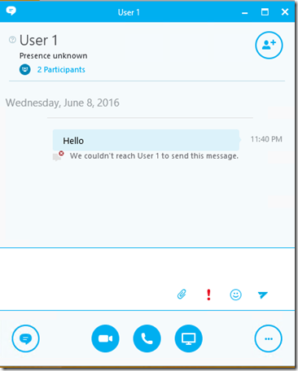

import ArticleHeader from '../../../components/article-header'

<ArticleHeader frontmatter={props.pageContext.frontmatter} />

Cuantas veces un cliente les pide restringir la comunicación entre OU’s , o que nadie pueda enviar IM al CIO. O en las compañías bancarias y financieras solamente permitir que los cajeros o usuarios reciban IM únicamente, que no hagan otra acción.

La solución a esto es una herramienta de 3ros llamada ETHICAL WALL. Con una solución de este tipo, lo que se pretende es evitar fuga de información basándonos en políticas para limitar la comunicación entre nuestros usuarios. Así que nosotros como administradores seremos capaces de restringir las características y funcionalidades que los usuarios pueden utilizar entre ellos. Desde bloquear quien puede ver presencia y enviar mensajes, sino hasta quien puede enviar archivos, Audio y Video o compartir el escritorio.

Les mostrare como un Ethical Wall puede ayudarnos a cumplir con el objetivo.

Lo primero que vemos es que tenemos dos diferentes endpoints, y las diferentes funcionalidades que podemos habilitar\deshabilitar entre ellos. Y no son restrictivas en ambos sentidos, sino que podemos seleccionar que únicamente el punto A no pueda ver la presencia del punto B. Pero el punto B si podrá ver la presencia del A. Es decir, no son mutuamente excluyentes.

Un Endpoint no solamente es un usuario, un endpoint puede ser una OU, un dominio Federado, un número de teléfono, etc. Aquí está la lista con todas las posibilidades de Endpoint.

Ahora les mostraré como Ethical Wall trabaja.

**Ejemplo1.**

En la imagen previa pueden ver que tenemos dos usuarios internos, Endpoint A ( user1@ucblogmx.mvp ) y Endpoint B ( user2@ucblogmx.mvp ) . Se bloqueo al usuario 2 la posibilidad de llamar, compartir escritorio y transferencia de archivos al usuario 1.

Si el usuario 2 trate de enviar un archivo al usuario 1, recibe el siguiente mensaje de error.

Pero el usuario 1 puede enviar archivos sin problema.

**EJEMPLO 2.**

Ahora les mostraré como bloquear comunicaciones de usuarios de bajo nivel a los Gerentes/Administradores/CIO:

·       Tengo dos Ou's Managers y Mortals

·       El usuario 1 es miembro de la OU Managers

El usuario 2 es miembro de la OU Mortals

Ahora, la regla del Ethical wall quedo de la siguiente manera.

Donde solamente los usuarios de la OU Managers, pueden comunicarse con los usuarios de la OU Mortals. A continuación, se muestra como un Gerente puede comunicarse con un usuario normal.

Pero cuando un normal intenta buscar a un Gerente, se ve lo siguiente.

La presencia del usuario1 no se muestra al usuario2, y cuando intenta enviar IM, el ethical wall rechaza la comunicación. Esto fue solamente un ejemplo de como funciona, pero pueden definir políticas a niveles mas avanzados no solamente de usuario a usuario.

**NOTA:** Agradezco a fabbricadigitale por la oportunidad y apoyo para probar Ethical Wall.

Si deseas tener mayor información sobre Ethical Wall o cualquier tema relacionado con Skype for Business o Microsoft Teams, no dudes en contactarme.

**Rodolfo Castro Aguilar**
 MVP Office Server and Services
 SFB User Group: [https://www.facebook.com/groups/S4BUGIberoamerica/](https&#58;//www.facebook.com/groups/S4BUGIberoamerica/)
Twitter : @ucblogmx
 http://ucblogmx.com ​

