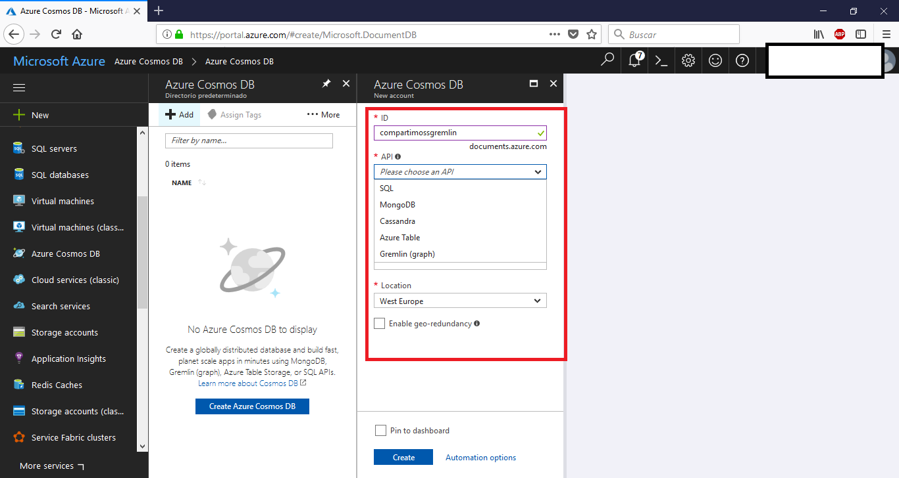
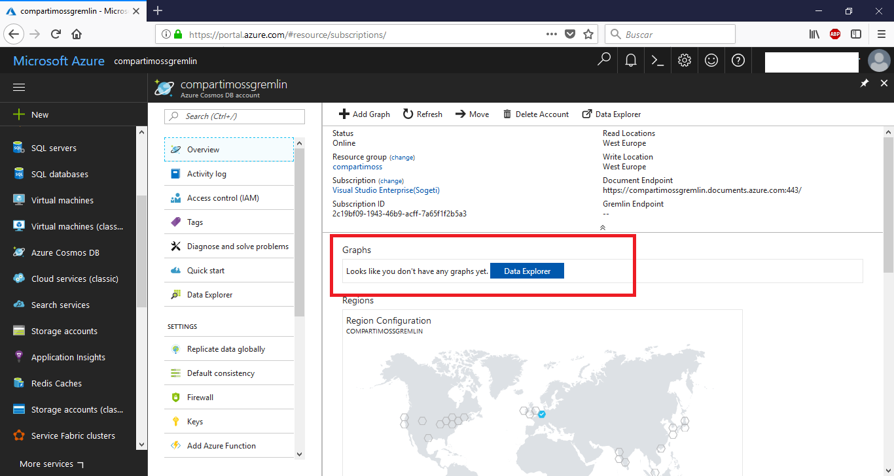
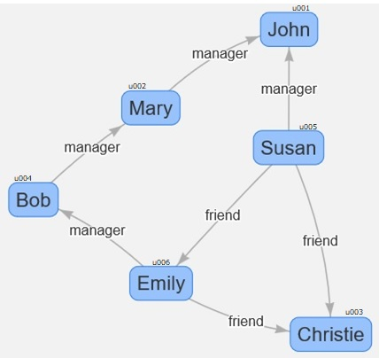
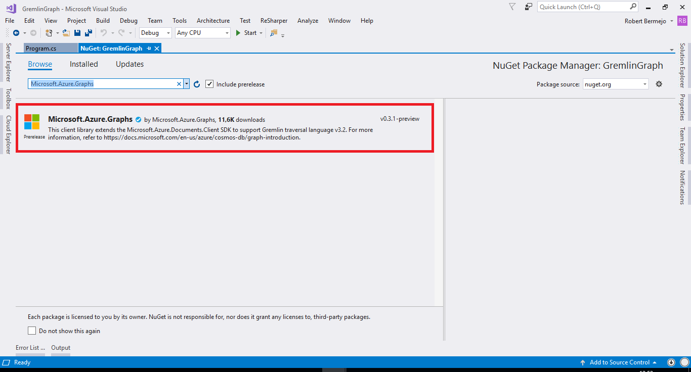
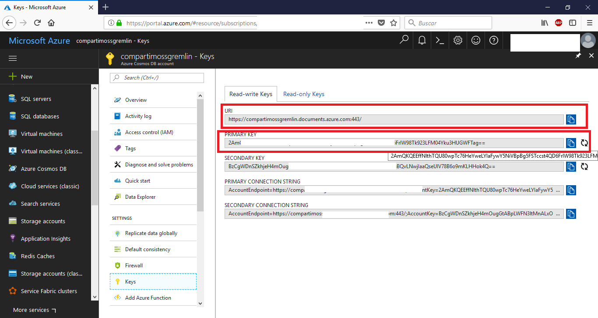
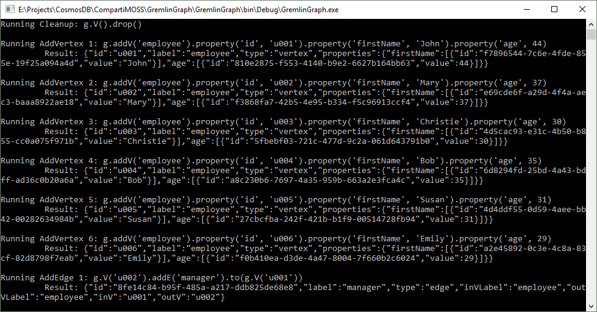
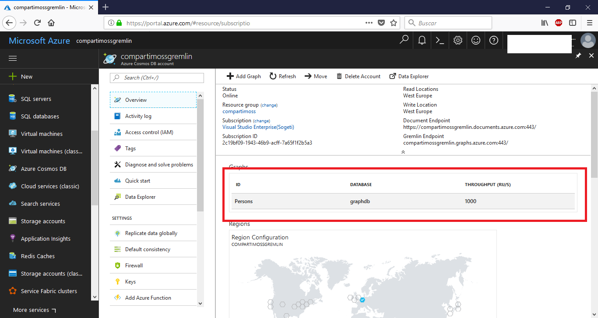
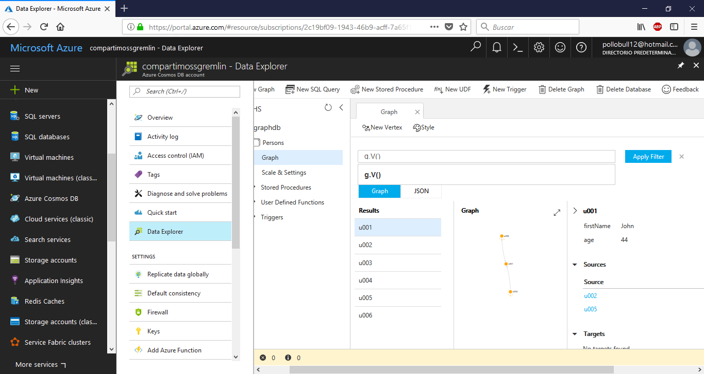

Una vez que Microsoft anunció en el Build 2017 su nuevo servicio Cosmos DB ([https://docs.microsoft.com/en-us/azure/cosmos-db/](https://docs.microsoft.com/en-us/azure/cosmos-db/)), en el Connect 2017 del 15 al 17 de Noviembre ([https://www.microsoft.com/en-us/connectevent/default.aspx](https://www.microsoft.com/en-us/connectevent/default.aspx)) anunciaron que los servicios de Azure Table Storage y Gremlin (grafos) dejaban de estar en preview.

En este articulo vamos a conocer la API para Gremlin de Cosmos DB.

**¿Qué es Gremlin Graph?**

Gremlin es un producto de Apache TinkerPop, que nos permite tener base de datos de grafos y realizar consultas sobre estos grafos mediante rutas transversales definida en pasos y que se ejecutan de forma secuencial.

Cada paso se ejecuta de forma automática y pasa el resultado al siguiente paso y las operaciones que se pueden ejecutar en cada paso son tres:

·       *Map* à Transformación de los objetos de la secuencia.
·       *Filter* à Eliminar objetos de la secuencia.
·       *Side Effect*à Estadísticas de cálculo de la secuencia.

**¿Cuándo utilizaremos una BBDD de grafos?**

Una BBDD de grafos nos puede ser útil en los siguientes escenarios:

·       Redes sociales
·       Geolocalización
·       Detección fraudes y anomalías.

**¿Por qué utilizar Gremlin con Cosmos DB y no directamente?**

No existe diferencia apreciable entre utilizar Gremlin directamente o mediante Cosmos DB, el hecho de utilizarla mediante Cosmos DB lo que nos permitirá es beneficiarnos de las características que nos ofrece este servicio:

·       Distribución global.
·       Escalabilidad de throughpout y storage.
·       99,99% de disponibilidad
·       Auto indexación y partición
·       Latencias de lectura &lt; 10 ms y de escritura indexada de &lt; 15 ms.

**Cosmos DB Gremlin Graph en Azure**

Lo primero que vamos hacemos es crear el servicio Cosmos DB seleccionando Gremlin (graph).



Una vez creada verás que se ha creado el servicio sin ningún grafo asociado:



Una vez tenemos creado el servicio vamos a ver cómo crear grafos y consumirlos mediante .Net.

El grafo que vamos a construir es el siguiente:



Crearemos un proyecto de consola y añadimos el paquete NuGet:



Lo primero que haremos es crear la conexión con el servicio:

```
string endpoint = ConfigurationManager.AppSettings["Endpoint"];
```

```
string authKey = ConfigurationManager.AppSettings["AuthKey"];
```

```
using (DocumentClient client = new DocumentClient(
```

```
               new Uri(endpoint),
```

```
               authKey,
```

```
               new ConnectionPolicy { ConnectionMode = ConnectionMode.Direct, ConnectionProtocol = Protocol.Tcp }))
```

```
 {
```

```
               Program p = new Program();
```

```
               p.RunAsync(client).Wait();
```

```
 }
```

Creamos la conexión informando el *endopoint* y la *key* para realizar la conexión:​



Acto seguido creamos un *databse* y la *collection* que contendrá el grafo.

```
Database database = await client.CreateDatabaseIfNotExistsAsync(
```

```
                              new Database { Id = "graphdb" });
```

```
DocumentCollection graph = await client.CreateDocumentCollectionIfNotExistsAsync(
```

```
              UriFactory.CreateDatabaseUri("graphdb"),
```

```
              new DocumentCollection { Id = "Persons" },
```

```
              new RequestOptions { OfferThroughput = 1000 });
```

**​Definiendo las operaciones**

Las operaciones de Gremlin las tenemos que definir con su sintaxis, por lo que las tenemos que escribir en él código como *string*. En nuestro ejemplo:

```
Dictionary<string, string> gremlinQueries = new Dictionary<string, string>
```

```
{
```

```
   { "Cleanup",      "g.V().drop()" },
```

```
   { "AddVertex 1",    "g.addV('employee').property('id', 'u001').property('firstName', 'John').property('age', 44)" },
```

```
   { "AddVertex 2",   g.addV('employee').property('id', 'u002').property('firstName', 'Mary').property('age', 37)" },
```

```
   { "AddVertex 3",   g.addV('employee').property('id', 'u003').property('firstName', 'Christie').property('age', 30)" },
```

```
   { "AddVertex 4",   g.addV('employee').property('id', 'u004').property('firstName', 'Bob').property('age', 35)" },
```

```
   { "AddVertex 5",   g.addV('employee').property('id', 'u005').property('firstName', 'Susan').property('age', 31)" },
```

```
   { "AddVertex 6",  "g.addV('employee').property('id', 'u006').property('firstName', 'Emily').property('age', 29)" },
```

```
   { "AddEdge 1",    "g.V('u002').addE('manager').to(g.V('u001'))" },
```

```
   { "AddEdge 2",    "g.V('u005').addE('manager').to(g.V('u001'))" },
```

```
   { "AddEdge 3",    "g.V('u004').addE('manager').to(g.V('u002'))" },
```

```
   { "AddEdge 4",    "g.V('u005').addE('friend').to(g.V('u006'))" },
```

```
   { "AddEdge 5",    "g.V('u005').addE('friend').to(g.V('u003'))" },
```

```
   { "AddEdge 6",    "g.V('u006').addE('friend').to(g.V('u003'))" },
```

```
   { "AddEdge 7",    "g.V('u006').addE('manager').to(g.V('u004'))" },
```

```
   { "ReturnVertex", "g.V().hasLabel('employee').has('age', gt(40))" },
```

```
   { "AndOr",        "g.V().hasLabel('employee').and(has('age', gt(35)), has('age', lt(40)))"},
```

```
   { "Transversal",  "g.V('u002').out('manager').hasLabel('employee')" },
```

```
   { "outE/inV",     "g.V('u002').outE('manager').inV().hasLabel('employee')" },
```

```
   { "CountVertices","g.V().count()" },
```

```
   { "Filter Range", "g.V().hasLabel('employee').and(has('age', gt(35)), has('age', lt(40)))"},
```

```
};
```

​Mediante un diccionario definimos las operaciones que vamos a ejecutar, y mediante el siguiente código las ejecutaríamos todas

```
foreach (KeyValuePair<string, string> gremlinQuery in gremlinQueries)
```

```
{
```

```
  Console.WriteLine($"Running {gremlinQuery.Key}: {gremlinQuery.Value}");
```

```
  IDocumentQuery<dynamic> query = client.CreateGremlinQuery<dynamic>(graph, gremlinQuery.Value);
```

```
  while (query.HasMoreResults)
```

```
  {
```

```
     foreach (dynamic result in await query.ExecuteNextAsync())
```

```
     {
```

```
         Console.WriteLine($"\t {JsonConvert.SerializeObject(result)}");
```

```
     }
```

```
  }
```

```
  Console.WriteLine();
```

```
}
```

Como vemos mediante *CreateGremlinQuey* creamos la *query* a ejecutar, y mediante el comando *ExecuteNextAsync* las ejecutamos.​



Ahora si vamos al portal vemos que se ha creado la colección:



Ahora podemos ir a ver los datos al *data explorer*:



Aquí podríamos ejecutar cualquiera de las operaciones que hemos ejecutado anteriormente.

**¿Qué operaciones podemos ejecutar?**

En la siguiente tabla se enumeran todas las operaciones que soporta Cosmos DB para Gremlin Graph.​


| Step | Descripción |
| --- | --- |
| addE | Agrega una arista entre dos vértices. |
| addV | Agrega un vértice al grafo. |
| and | Garantiza que todos los recorridos devuelven un valor. |
| as | Modulador de pasos para asignar una variable a la salida de un paso. |
| by | Modulador de pasos que se usa con group y order. |
| coalesce | Devuelve el primer recorrido que devuelve un resultado. |
| constant | Devuelve un valor constante. Se usa con coalesce. |
| count | Devuelve el número del recorrido. |
| dedup | Devuelve los valores sin duplicados. |
| drop | Quita los valores (vértice/arista). |
| fold | Actúa como una barrera que calcula el agregado de los resultados. |
| group | Agrupa los valores en función de las etiquetas especificadas. |
| has | Se utiliza para filtrar las propiedades, los vértices y las aristas. Admite las variantes hasLabel, hasId, hasNot y has. |
| inject | Inserta valores en un flujo. |
| is | Se usa para filtrar mediante una expresión booleana. |
| limit | Se usa para limitar el número de elementos en el recorrido. |
| local | Encapsula localmente una sección de un recorrido, de forma similar a una subconsulta. |
| not | Se usa para generar la negación de un filtro. |
| optional | Devuelve el resultado del recorrido especificado si produce un resultado; en caso contrario, devuelve el elemento que realiza la llamada. |
| or | Garantiza que al menos uno de los recorridos devuelve un valor. |
| order | Muestra los resultados con el criterio de ordenación especificado. |
| path | Devuelve la ruta de acceso completa del recorrido. |
| project | Proyecta las propiedades como un mapa. |
| properties | Devuelve las propiedades de las etiquetas especificadas. |
| range | Filtra el intervalo de valores especificado. |
| repeat | Repite el paso el número de veces especificado. Se usa para crear bucles. |
| sample | Se usa para tomar muestras de datos del recorrido. |
| select | Se usa para proyectar los resultados del recorrido. |
| store | Se utiliza para realizar agregados sin bloqueo del recorrido. |
| tree | Agrega las rutas de acceso desde un vértice en un árbol. |
| unfold | Extrae un iterador como un paso. |
| union | Combina los resultados de varios recorridos. |
| V | Incluye los pasos necesarios para los recorridos entre los vértices y las aristas V, E, out, in, both, outE, inE, bothE, outV, inV, bothV y otherV |
| where | Se usa para filtrar los resultados del recorrido. Admite los operadores eq, neq, lt, lte, gt, gte y between |


**Tabla 1.- Operaciones CosmosDB Gremlin Graph.**

**Conclusiones**

La forma de usar Gremlin es muy fácil y sencilla como se puede ver, además puedes seguir ejecutando las operaciones por la cli de Gremlin apuntando simplemente al servicio de Cosmos DB.

El código completo de los ejemplos los podéis ver en:

·       [https://github.com/bermejoblasco/CosmosDBGremlinExample](https://github.com/bermejoblasco/CosmosDBGremlinExample)

Referencias:

·       [https://docs.microsoft.com/en-us/azure/cosmos-db/gremlin-support](https://docs.microsoft.com/en-us/azure/cosmos-db/gremlin-support)

·        [https://tinkerpop.apache.org/gremlin.html](https://tinkerpop.apache.org/gremlin.html)

·        [https://tsmatz.wordpress.com/2017/07/04/azure-cosmos-db-gremlin-graph-tutorial/](https://tsmatz.wordpress.com/2017/07/04/azure-cosmos-db-gremlin-graph-tutorial/)


**Robert Bermejo**
 Team Leader en ENCAMINA | Microsoft Azure MVP

bermejoblasco@live.com
 @robertbemejo
 www.robertbermejo.com

 
 
import LayoutNumber from '../../../components/layout-article'
export default LayoutNumber
