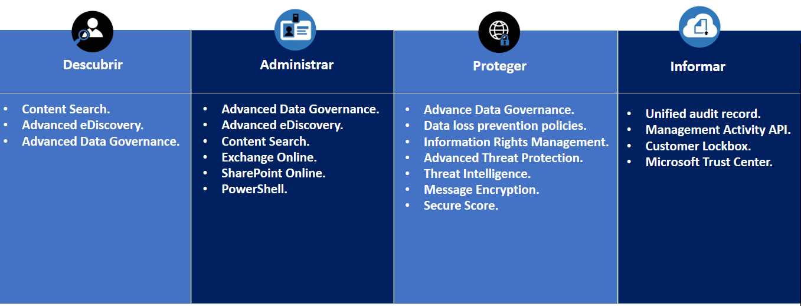

El nuevo **Reglamento Europeo de Protección de Datos** (**RGPD** o más conocido por sus siglas en inglés **GDPR**) entró en vigor en mayo de 2016 y es aplicable a partir de mayo de 2018, es decir se ha incluido un período de transición de dos años.

En este período transitorio, los responsables y encargados del tratamiento de datos deben ir preparando y adoptando las medidas necesarias para cumplir con el reglamento en el momento en que sea de aplicación.

**GDPR** tiene como **objetivo** primordial, **unificar los estándares de la Unión Europea** en **protección de datos** y lograr que los ciudadanos europeos tengan mayor control sobre sus datos personales, entendiéndose estos como toda información relativa a una persona física identificada o identificable cuya identidad pueda determinarse directa o indirectamente.

Para más información:
[http://www.agpd.es/portalwebAGPD/temas/reglamento/index-ides-idphp.php](http&#58;//www.agpd.es/portalwebAGPD/temas/reglamento/index-ides-idphp.php)

**Microsoft Office 365**

Muchos clientes se preguntan cómo en **Office 365** pueden**cumplir** con el reglamento **GDPR** y cuáles son las medidas que tienen que tomar.

Office 365 es un buen sitio para cumplir con el reglamento, además de **cumplir tanto con la mayoría de los estándares internacionales como los específicos de la industria** como ENISA IAF, ISO/IEC 27001, 27018, FedRAMP, SOC 1 y SOC 2, HIPAA, sin olvidar el [Esquema Nacional de Seguridad / ENS](https&#58;//blogs.technet.microsoft.com/hectormontenegro/2016/04/21/microsoft-office-365-y-azure-certificados-frente-al-esquema-nacional-de-seguridad-ens/) o la [AEPD](http&#58;//www.agpd.es/portalwebAGPD/resoluciones/autorizacion_transf/auto_transf_2014/common/pdfs/TI-00032-2014_Resolucion-de-fecha-09-05-2014_de-MICROSOFT-CORPORATION_a-Estados-Unidos.pdf).

Hay que tener en cuenta cuales son las **responsabilidades en el ámbito GDPR**, para ello en el contrato de **términos de los servicios online del 1 de febrero de 2018** ya se incluye el Anexo 4: Términos de conformidad con el Reglamento General de Protección de Datos de la Unión Europea.

| *"A los efectos de los presentes Términos RGPD, el Cliente y Microsoft convienen en que el****Cliente es el responsable del tratamiento de los Datos Personales del Cliente****y que Microsoft es el encargado del tratamiento de dichos datos, con la salvedad de que, si el Cliente está actuando en calidad de encargado del tratamiento, entonces Microsoft es un sub encargado del tratamiento"*   |
| --- |

Se puede destacar el segundo apartado dentro de roles y ámbito de aplicación.

Para más información [http://www.microsoftvolumelicensing.com/DocumentSearch.aspx?Mode=3&DocumentTypeId=31](http&#58;//www.microsoftvolumelicensing.com/DocumentSearch.aspx?Mode=3&amp;DocumentTypeId=31)

**DAPI (Descubrir, Administrar, Proteger e Informar)**

La **preparación** para cumplir**GDPR puede ser compleja** y es necesario sentar unas bases claras para poder adjuntarnos al nuevo reglamento, **Microsoft recomienda centrarse en cuatros pasos claves** conocido como **DAPI** (Descubrir, Administrar, Proteger e Informar).

**1.****Descubrir**

El primer paso es analizar los datos personales que poseemos y el lugar donde se encuentran.

La definición de “datos personales” es bastante amplia conforme GDPR, ya que estos corresponden a cualquier dato que tenga relación con una persona natural identificada o que sirva para identificar a una persona natural.

Es importante realizar un inventario de los datos, esto ayuda a entender cuales son personales e identifica los sistemas donde se almacenan, procesan, comparten y el tiempo de conservación de los mismos.

**2.****Administrar**

Para cumplir GDPR es necesario gestionar y controlar los datos personales, por ese motivo es necesario tener un plan de gobernanza de datos ya que nos ayuda a definir directivas, roles y responsabilidades para el acceso, la administración y el uso de datos personales, además de ayudar a asegurarse que su práctica cumple con el reglamento.

**3.****Proteger**

GDPR eleva el nivel de exigencia en la seguridad de la información, requiere que las organizaciones adopten las medidas adecuadas para proteger los datos personales contra la pérdida, el acceso o la divulgación no autorizada.

Es necesario disponer de medidas de seguridad para proteger los datos personales.

**4.****Informar**

GDPR establece nuevos estándares en materia de transparencia, responsabilidad y mantenimiento de registros, siendo necesario mantener registro sobre las categorias de datos personales, identidades de terceros con los que se comparten los datos, si hay paises extranjeros que reciben los datos personales,  las medidas de seguridad organizacionales/técnicas y los tiempos de conservación de los datos.

Una forma de lograr esto es mediante el uso de herramientas de auditoría, lo que puede ayudar a asegurar que cualquier procesamiento de datos personales se rastrea y registra.

**Herramienta de evaluación del GDPR de Microsoft**

Microsoft proporciona una herramienta para ayudar a evaluar la madurez del cumplimiento en nuestra organización, esta disponible en dos modalidades:

·        **Versión Online**

La podemos encontrar en [https://www.gdprbenchmark.com/es/questions](https&#58;//www.gdprbenchmark.com/es/questions)

Actualmente, se realizan 26 preguntas agrupadas por DAPI, como se puede aprececiar en la siguiente imagen:

Al finalizar el cuestionario, se presenta como resultado el nivel de madurez que tenemos en el cumplimiento del reglamento y algunas recomendaciones para su mejora, como se puede apreciar en la siguiente imagen:

·        **Versión local en Excel**

La podemos descargar de  [https://assets.microsoft.com/en-us/gdpr-detailed-assessment.zip](https&#58;//assets.microsoft.com/en-us/gdpr-detailed-assessment.zip).   Actualmente, se realizan 162 preguntas agrupadas por DAPI, como se pude apreciar en la siguiente imagen:

También presenta en el resultado el nivel de madurez y  recomendaciones, como se puede apreciar en la siguiente imagen.

Nota: para ver el resultado es necesario tener instalado Power BI Desktop en el equipo.

**Herramientas para ayudar a cumplir GDPR en Office 365**

Microsoft ofrece una serie de herramientas para ayudar a cumplir con el reglamento GDPR en Office 365, a continuación se enumeran algunas de ellas:

·        **Content Search.**

Herramienta de búsqueda de contenidos en todas las carpetas públicas de Exchange y SharePoint Online y OneDrive de la empresa, nos ayuda a encontrar e identificar los datos  personales  que pueden ser relevantes para el cumplimiento.

·        **Advanced eDiscovery.**

P ermite identificar los datos relevantes con mayor agilidad y precisión que las búsquedas tradicionales por palabra clave y encuentra archivos prácticamente idénticos,  reconstruye hilos de correo e identifica temas clave y relaciones entre datos, ademas de propocionar a los interesados una copia exportable de sus datos personales en caso que sea solicitado.

·        **Advanced Data Governance.**

Proporciona recomendaciones de políticas proactivas y clasificaciones de datos automáticas que ayudan a identificar, clasificar y administrar datos e información confidencial, así como a aplicar políticas de retención y supresión. La función de etiquetas permite clasificar automáticamente los datos personales y la información confidencial de toda la organización, así como aplicar reglas de retención y supresión basadas en dicha clasificación.

·        **Exchange Online.**

Utiliza reglas de flujo de correo de Exchange Online para enrutar el correo con determinadas palabras clave, como permisos o supresión, a buzones específicos. Esto permite crear un proceso personalizado para recibir, administrar y responder a estas solicitudes.

·        **SharePoint Online.**

Podemos utilizarlo para efectuar un seguimiento y administración de los manuales de las solicitudes de permisos de las personas a las que se refieren los datos personales.

·        **PowerShell.**

Mediante PowerShell podemos realizar muchas acciones DAPI, pero lo importe es que podemos realizar acciones para identificar, ratificar, eliminar, informar y exportar datos personales de forma totalmente personalizada.

·        **Data loss prevention.**

Permiten aplicar automáticamente restricciones de acceso a los datos y restringir su uso compartido.

·         **Information Rights Management.**

Ayuda a evitar el acceso a la información personal en Office 365 por parte de personas no autorizadas.

·        **Advanced Threat Protection .**

Protege correo electrónico, archivos y las aplicaciones de Office 365 contra ataques desconocidos y sofisticados.

•         **Threat Intelligence.**

Ayuda a detectar de forma proactiva y a protegerse contra amenazas avanzadas en Office 365.

•         **Message Encryption.**

El cifrado de mensajes de Office 365 complementa la Azure Information Protection, y hace que sea más fácil compartir correos electrónicos protegidos con cualquier persona, tanto de dentro como de fuera de tu organización.

•         **Secure Score.**

Analiza la seguridad de la organización en Office 365 en función de  actividades normales y la configuración de seguridad y asigna una puntuación.

•         **Unified audit record.**

Permite hacer un seguimiento y registrar las actividades en nuestro entorno de Office 365, incluyendo actividades de usuario y de administrador en Exchange Online, SharePoint Online y OneDrive para la Empresa. Se puede utilizar el registro de auditoría unificado para registrar la resolución de las solicitudes de permisos de las personas a las que se refieren los datos y registrar eventos asociados con la modificación, supresión o transferencia de datos personales.

•         **Management Activity API.**

Servicios de informes que permiten obtener transacciones agregadas, pudiendo ser consumida por otras herramientas.

•         **Customer Lockbox.**

Permite controlar si se permite el acceso a nuestros datos office 365 por parte del ingeniero de soporte técnico Microsoft, dicho permiso puede ser temporal con una fecha de expiración, para que solo tenga vigencia en el proceso de evaluación por parte del soporte técnico.

•         **Microsoft Trust Center.**

Es el centro de Microsoft donde se encuentra información detallada sobre seguridad, privacidad y ofertas de cumplimiento, políticas, características y prácticas de los productos de Microsoft en la nube.

**Conclusiones**

Ya es obligatorio cumplir con el Reglamento Europeo de Protección de Datos GDPR. Office 365 es un buen sitio para cumplir con el reglamento, además de cumplir con la mayoría de los estándares internacionales como específicos de la industria. Microsoft demuestra que tiene un gran compromiso de informar y ayudar a sus clientes para cumplir con el reglamento de la Unión Europea, como se puede apreciar en

[https://www.microsoft.com/en-us/TrustCenter/Privacy/gdpr](https&#58;//www.microsoft.com/en-us/TrustCenter/Privacy/gdpr) , además de recomendar los pasos claves (DAPI) que nos tenemos que centrar.

Office 365 dispone de un gran número de herramientas que nos facilitan conseguir el cumplimiento del reglamento: Content Search, Advanced eDiscovery, Advanced Data Governance, Data loss prevention policies, Advanced Threat Protection, Threat Intelligence, Message Encryption, Secure Score, etc.

**MARTIN LUIS LOPEZ REQUENA**

SharePoint Solution Architect & Trainer at everis

martinluislopez@hotmail.com

