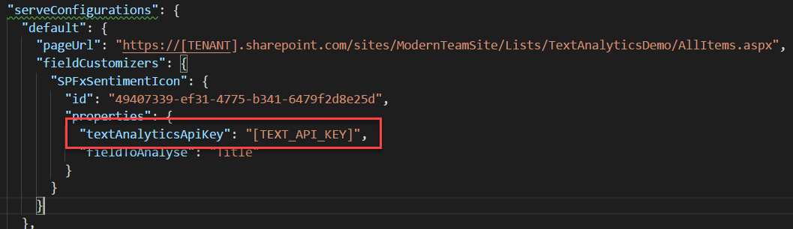
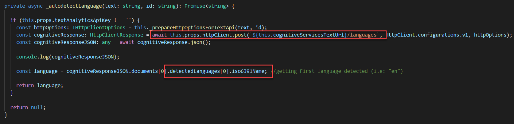
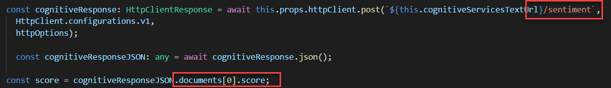
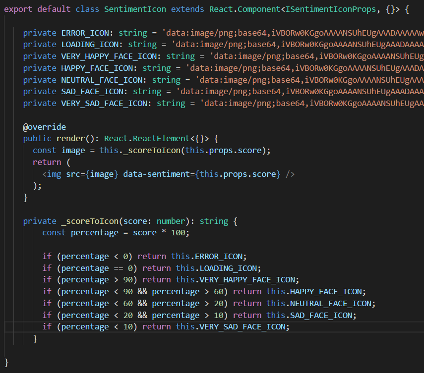

En este artículo, vamos a seguir con los MS Cognitive Services desde SPFx. En este caso hablaremos de la Text Analytics API, que como podemos deducir de su nombre, nos va a dar capacidades de análisis de texto. La API ofrece 3 endpoints:

·         Autodetección de Idioma: Podemos detectar el idioma en el que está el texto analizado.

·         Keywords: Palabras clave del texto analizado.

·         Sentimiento: Indica cuánto de sentimiento negativo o positivo hay en el texto analizado.

Como parte del artículo vamos a desarrollar un “*spfx field customiser*”, que mostrará un emoticono resultado de analizar el sentimiento del texto proporcionado en un campo de la lista. Además, utilizaremos la función de autodetección de idioma, para previamente a invocar la función de sentimiento, sepamos en qué idioma está escrito el texto.

La siguiente imagen muestra el resultado final:


**Registrar servicio Cognitive Services Vision API**

Antes de entrar en código, recordemos del artículo anterior que para poder utilizar la *Text Analytics* API de Cognitive Services, primero tenemos que registrar el servicio desde el portal de Azure, para así obtener la *Key* para invocar la API.


**Nota**: Debemos seleccionar expresamente el servicio que queremos utilizar, en este caso, Text Analytics API. Si queremos hacer uso de varios servicios, hay que registrarlos expresamente, y obtener una Key diferente para cada uno.

Una vez registrado, podemos obtener la Key desde la sección Keys del servicio:


**Nota sobre la Tenant Properties API GetStorageEntity**

En el artículo anterior, vimos como almancear la API Key como una Tenant property, de tal manera que la Key se recuperaba desde código, evitando hard-codearla en TypeScript. Este método sigue siendo válido, pero cabe destacar que actualmente hay un bug reconocido en la API que recupera un Tenant Property y que no funciona cuando el usuario es un usuario externo. El bug está registrado en GitHub y por el momento no ha sido corregido todavía. Tenéis más información en el siguiente link:

[https://github.com/SharePoint/sp-dev-docs/issues/1137](https&#58;//github.com/SharePoint/sp-dev-docs/issues/1137)

Una alternativa a utilizar la Tenant properties API para guardar la Key del Text-Analytics API es proporcionar la Key como Property de la SPFx extensión. El siguiente fragmento muestra como configurarlo desde el serve.json para debug en SPO Workbench:



Posteriormente en nuestro código de la Extensión, podemos acceder al valor con un simple:

```
​this.properties.textAnalyticsApiKey​
```

**Invocando la API para auto detección de idioma**

Antes de nada, para invocar cualquier método de la *Text Analytics API*, tenemos que usar la siguiente URL base, que además, va a depender de la zona en la que hayamos registrado el servicio en el portal de Azure. En este caso estamos haciendo uso de la zona "*Westus*"

```
private cognitiveServicesTextUrl: string = `https://westus.api.cognitive.microsoft.com/text/analytics/v2.0/`;
```

Desde esa URL base, para detectar el idioma del texto que queremos analizar, podemos hacer una llamada al endpoint de "*languages*"



**Nota**: Recordar del artículo anterior, que podemos enviar varios textos a analizar en la misma petición (es lo que la API llama "*documents*"). Además, el texto puede contener diferentes idiomas, de ahí que en código estemos accediendo al primer idioma detectado:

```
​detectedLanguages[0]
```


Y de ahí, a su código ISO (i.e: *en* para inglés, *es* para español, etc.)

**Invocando a la API para análisis de sentimiento**

Una vez que tenemos claro el idioma del texto, ya podemos invocar al endpoint de análisis de sentimiento, la siguiente imagen muestra el código más relevante:



El "*score*" es un número decimal entre 0-1, donde 0 sería un sentimiento muy negativo, y 1 un sentimiento muy positivo (un valor entre medias indicaría un comentario neutro, donde no se expresa ningún tipo de sentimiento).

**Pintando el emoticono del sentimiento**

Para acabar, ya sólo nos queda pintar el "score" como emoticono. Para ello, hemos creado un nuevo componente de React que hace la traducción entre el número y el icono, aplicando nuestras propias reglas de negocio (por ejemplo, es responsabilidad de cada uno decidir si quiere considerar una puntuación de 0.6 como positiva, neutra, muy positiva, etc.



Como podéis ver, primero hemos definido unas constantes con los diferentes iconos que queremos utilizar (en formato base64, pero también podrían ser URLs a imágenes). Finalmente, definimos las diferentes escalas que queremos aplicar a cada icono, según la puntuación de sentimiento obtenida.

**Código fuente disponible en GitHub**

Tenéis todo el proyecto en mi cuenta de GitHub:

[https://github.com/luismanez/office365-developer-bootcamp-2017](https&#58;//github.com/luismanez/office365-developer-bootcamp-2017)

El proyecto también ha sido aceptado como contribución en el repositorio de SharePoint, así que también podéis encontrarlo en el siguiente link:

[https://github.com/SharePoint/sp-dev-fx-extensions/tree/master/samples/react-command-vision-api](https&#58;//github.com/SharePoint/sp-dev-fx-extensions/tree/master/samples/react-command-vision-api)


**Luis Mañez**

SharePoint / Cloud Solutions Architect en ClearPeople LTD
 @luismanez
 [http://geeks.ms/lmanez/](http&#58;//geeks.ms/lmanez/)​​

