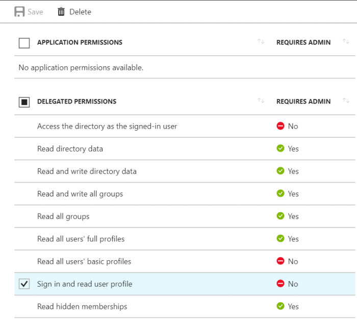

Hay varios requerimientos que surgen en un ambiente corporativo con la finalidad de tener mayor control y poder automatizar ciertas actividades de despliegue. Para comenzar, existen lo que se definen como módulos de PowerShell. Se debe tomar en cuenta que no es muy común hablar de automatizar tareas a través de PowerShell en lo referente a la tecnología Power BI pero veremos durante este artículo que es sumamente potente, y flexible. En primer lugar, como referencia, podemos partir por la siguiente descarga:

[https://www.powershellgallery.com/packages/Microsoft.PowerBI.PowerShell/1.2](https&#58;//www.powershellgallery.com/packages/Microsoft.PowerBI.PowerShell/1.2)

Veremos a continuación cuales son los componentes necesarios para comenzar y configurar la conexión e integración:

**Requerimientos:**

·         Contar con un tenant de Azure Active Directory y un usuario corporativo.

·         Registrar un App de Power BI.

·         Registrar dicha App de Power BI en Azure.

·         Aplicar permisos para la aplicación en Azure Active Directory.

·         Instalar el Módulo de PowerShell para Power BI.

**Registro de Power BI App:**

·         Ingresar dev.powerbi.com/apps.

·         Ingresar con una cuenta existente de Power BI.

·         Definir un Nombre de App en el cuadrante correspondiente.

·         Para PowerShell selección App Nativa.

·         Registrar un App de Power BI

·         Registrar dicha App de Power BI en Azure.

·         Aplicar permisos para la aplicación en Azure Active Directory.

·         Instalar el Módulo de PowerShell para Power BI.

·         Ingresar lo siguiente como URL de Redirección:

[https://login.microsoftonline.com/nombreorganizacion.onmicrosoft.com/oauth2](https&#58;//login.microsoftonline.com/nombreorganizacion.onmicrosoft.com/oauth2)

·         Agregar todas las APIS que correspondan para nuestro caso. Se puede chequear un poco mas en detalle la información de permisos desde el siguiente link:

[https://powerbi.microsoft.com/en-us/documentation/powerbi-developer-power-bi-permissions/](https&#58;//powerbi.microsoft.com/en-us/documentation/powerbi-developer-power-bi-permissions/)

·         Dar click en el botón de Registrar App.

·         Tomar nota del Client ID ya que nos será solicitado.


**Paso a paso del  Registro de Power BI App**

A continuación, se detalla como registrar paso a paso la Power BI App:

- Registro de la App de Powe​​r BI​


·         Registro de la App de Power BI en Azure:


·         Seleccionar nuevo registro de aplicación.

·         En el formulario siguiente que aparece agregar la siguiente información:

o     Agregar un nombre en el cuadro de dialogo.

o     Seleccionar Nativo en el Tipo de Aplicación, desde el cuadro desplegable.

o     Agregar como URL de redireccionamiento:

[https://login.microsoftonline.com/contoso.onmicrosoft.com/oauth2](https&#58;//login.microsoftonline.com/contoso.onmicrosoft.com/oauth2)


·         Dar click en la opción de Crear.


**Aplicar permisos para nuestra aplicación en Azure Active Directory:**

·       En la sección de Registro de Aplicaciones seleccionar nuestra nueva App:

​

·         Abrir la Ventana de Windows Azure Active Directory API, y seleccionar la opción de Acceso a Directorio con usuario logueado. Luego guardar:




·       Abrir la API del Servicio Power BI, seleccionar todos los permisos debajo de Permisos Delegados y guardar


·       Seleccionar Otorgar Permisos


**Instalación del Módulo de Power BI y dependencias**


Ahora instalaremos el Módulo de Power BI y dependencias. En primer lugar, lo descargamos desde la galería de PowerShell. Solo debemos abrir una ventana de PowerShell e ingresar los siguientes comandos:


Install-Module -Name Microsoft.ADAL.PowerShell
      Install-Module -Name Microsoft.PowerBI.PowerShell


En estos momentos ya estamos en condiciones de comenzar a utilizar la integración que hemos realizado. Por lo tanto, empezaremos a utilizar el Módulo de Power BI y visualizar la información de salida en un Reporte de Power BI. Los pasos que daremos:

·         Qué podemos lograr con el Modulo de Power BI (comandos).

·         Escribir un script de reporting para enviar datos a Power BI.

·         Crear un reporte a partir de un DataSet en Power BI.


**Comandos disponibles en el Módulo de Power BI en PowerShell**


Los comandos disponibles en el Módulo de Power BI para PowerShell son los siguientes:

·       Connect-PowerBi

·       Switch-PowerBIContext

·       Add-PowerBIDataSet

·       Get-PowerBIDataSets

·       Get-PowerBITables

·       Update-PowerBITableSchema

·       Add-PowerBIRows

·       Remove-PowerBIRows

·       Get-PowerBIGroups

·       New-PowerBIDataSet

·       New-PowerBITable

·       New-PowerBIColumn

Con estos comandos somos capaces de crear y editar un dataset. Recordemos que podemos darle un vistazo para detalles a la página oficial del Módulo de Power BI aquí:

 [https://www.powershellgallery.com/packages/Microsoft.PowerBI.PowerShell/1.2/Content/Microsoft.PowerB...](https&#58;//www.powershellgallery.com/packages/Microsoft.PowerBI.PowerShell/1.2/Content/Microsoft.PowerBI.PowerShell.psm1%0b%0b)
**Escribir un Script para envío de datos a Power BI**

**En una primer, y simple etapa podemos crear un script para enviar datos a Power BI. El script se encargará de recopilar información de Grupos de Office 365, Administradores y Miembros y publicar los mismos en Power BI.**


·       **Script de Configuración**: Esta primer etapa recoge información de Office 365 y crea un dataset en Power BI donde podremos alojar dicha información.

```
$Username = "MyAccount@mydomain.onmicrosoft.com"$Password = "**********" #Define $info array$info = @() #Get all groups$Groups = Get-UnifiedGroup | Select-Object Alias,Accesstype,ManagedBy,PrimarySmtpAddress,Displayname,Notes,GroupMemberCount,GroupExternalMemberCount,WhenChanged foreach($Group in $Groups) {     Write-Host -Object "Number of Groups left to process $GroupsCount" -ForegroundColor Green    $Members = Get-UnifiedGroupLinks -Identity $Group.alias -LinkType members    $Owners = Get-UnifiedGroupLinks -Identity $Group.alias -LinkType owners    $MembersCount = $Members.count    $OwnerCount = $Group.ManagedBy     foreach($Owner in $Owners){        $Object=[PSCustomObject]@{            Name = $Group.Displayname            Group = $Group.Alias            Email = $Group.PrimarySmtpAddress            UserName = $Owner.name            NumberOfMembers = $Group.GroupMemberCount            MemberOrOwner = 'Owner'            NumberOfOwners = $OwnerCount.count            GroupType = $Group.AccessType            ExternalMemberCount = $Group.GroupExternalMemberCount            WhenChanged = $Group.WhenChanged | Get-Date -Format 'yyyy.MM.dd hh:mm'            Description = $Group.Notes            }#EndPSCustomObject        $info+=$object    }     foreach($Member in $Members){        $Object=[PSCustomObject]@{            Name = $Group.Displayname            Group = $Group.Alias            Email = $Group.PrimarySmtpAddress            UserName = $Member.name            NumberOfMembers = $Group.GroupMemberCount            MemberOrOwner = 'Member'            NumberOfOwners = $OwnerCount.count            GroupType = $Group.AccessType            ExternalMemberCount = $Group.GroupExternalMemberCount            WhenChanged = $Group.WhenChanged | Get-Date -Format 'yyyy.MM.dd hh:mm'            Description = $Group.Notes            }#EndPSCustomObject        $info+=$object    }     $GroupsCount-- } #Connects to PowerBIConnect-PowerBI -AuthorityName MyAccount.onmicrosoft.com -ClientId 'fa7af8a7-56ad-429f-8f57-76b1bd2087e1'  -UserName $username -Password $password### #Groups reporting data.#Defines collums in the table you are going to create. $col1 = New-PowerBIColumn -ColumnName Name -ColumnType String$col2 = New-PowerBIColumn -ColumnName Group -ColumnType String$col3 = New-PowerBIColumn -ColumnName Email -ColumnType String$col4 = New-PowerBIColumn -ColumnName UserName -ColumnType String$col5 = New-PowerBIColumn -ColumnName NumberOfMembers -ColumnType Int64$col6 = New-PowerBIColumn -ColumnName MemberOrOwner -ColumnType String$col7 = New-PowerBIColumn -ColumnName NumberOfOwners -ColumnType Int64$col8 = New-PowerBIColumn -ColumnName GroupType -ColumnType String$col9 = New-PowerBIColumn -ColumnName ExternalMemberCount -ColumnType Int64$col10 = New-PowerBIColumn -ColumnName WhenChanged -ColumnType DateTime$col11 = New-PowerBIColumn -ColumnName Description -ColumnType String #Creates table from defined collums.#Comment out after first time setup.$table1 = New-PowerBITable -TableName GroupReport -Columns $col1,$col2,$col3,$col4,$col5,$col6,$col7,$col8,$col9,$col10,$col11 #Creates dataset from defined table.#Comment out after first time setup.$dataset = New-PowerBIDataSet -DataSetName GroupReport -Tables $table1 #Adds dataset and get datasetid.#Comment out after first time setup.$datasetid = Add-PowerBIDataSet -DataSet $dataset #Take note of datasetid so you have it for when you are updating the dataset.$datasetid #Remove commeting after firsttime setup on line below.#Remove-PowerBIRows -DataSetId datasetid -TableName $table1 #Set datasetid manualy after first time setupAdd-PowerBIRows -DataSetId $datasetid -TableName GroupReport -Rows $info
```


·        **Crear un reporte a partir de un DataSet en Power BI.**Los pasos por seguir para crear un primer reporte a partir del Dataset creado son:

o   Ingresamos a [https://powerbi.microsoft.com](https&#58;//powerbi.microsoft.com/) y nos logueamos con nuestra cuenta.

o   Nos dirigimos a Mi ambiente de trabajo y seleccionamos desde el cuadro desplegable en Datasets, y desde Acciones seleccionamos la opción de Crear Reporte


o   Seleccionamos Stack Columns como formato visual.
o   Al tener seleccionado este formato grafico seleccionamos los campos Group, y NumberofMembers
o   Selecccionamos la opción Contar debajo de Valores.


o   Dejamos de seleccionar la gráfica, y expandimos la entidad UserName debajo de Campos, Ahora tenemos una tabla con todos los usuarios que son miembros de nuestros grupos de Office 365.


o   Al seleccionar en la tabla de UserName y dar click sobre un nombre y podremos ver la magia de Power BI. Podemos ver ahora en la gráfica de columnas a que grupos pertenece el usuario seleccionado


**Gastón Cruz**
Data Plaform MVP | Business Intelligence Technical Manager
@GastoFCruz​

