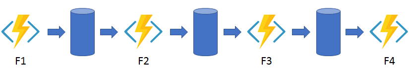
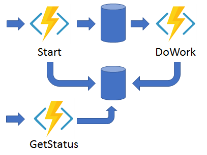

A estas alturas todo el mundo conoce el concepto *serverless* y conoce que nos ofrecen las **Azure Functions** y también las mayores limitaciones que tienen:

·         Timeout máximo de 10 minutos.

·         Dificultad para orquestar diferentes funciones.

Para poder dar salida a estas dos limitaciones y abrir un nuevo mundo en el *serverless*, Microsoft ha sacado la versión preview de las **Azure Durable Functions**.

**¿Qué es una Durable Function?**

Las **Durable Functions** son una extensión de **Azure Functions** y por tanto una extensión de **Azure WebJobs**, que nos permite escribir *workflows* mediante código. Entonces, si podemos escribir *workflows* y no tenemos servidores, y estos escalan automáticamente y no tenemos control ninguno sobre estos ¿Cómo se coordinan los *workflows*?

**Event Sourcing**

**Azure Durabel Functions** implementa el patrón *event sourcing* ( [https://docs.microsoft.com/es-es/azure/architecture/patterns/event-sourcing](https://docs.microsoft.com/es-es/azure/architecture/patterns/event-sourcing) ), lo que permite saber y controlar el estado de la función en cada momento y poder interactuar con ella.

En este punto ya podemos inferir algunas de las ventajas que nos proporcionan las **Azure Durable Functions**:

·         *Worflows* implementados con código sin necesidad de diseñadores o especificaciones JSON como por ejemplo **Logic Apps**.

·         Al *usar event sourcing* nunca perdemos el estado de la función si por ejemplo el proceso se recicla o la VM donde se está ejecutando se reinicia o se cae. Siempre tenemos un punto de control y sabemos el estado exacto.

·         Se pueden llamar a otras funciones de forma síncrona o asíncrona e interactuar con el resultado de estas.

**Triggers, Flujos y Clases**

¿Como desencadenamos la ejecución de una **Durable Function**? Pues sí, has acertado mediante *triggers* como funciones normales. En este caso hay una diferencia, que la orquestación de la función no se lanza directamente, sino que se requiere que se lance mediante una función superior, en el siguiente esquema se ve esta jerarquía:


Vamos a explicar el esquema y como funciona mediante un ejemplo. El ejemplo consiste en insertar en forma masiva datos en **Dynamics 365**. El problema que nos encontramos en este caso es que solo se puede ejecutar 2 *ExecuteMultipleRequest* simultáneamente y 1.000 elementos en cada una de ellas, estos valores son limitaciones por defecto.

En nuestro caso y después de pruebas, para el buen rendimiento y evitar errores en un *tenant* *trial* insertamos 50 elementos a la vez.

Pasos:

1-        Creamos 1.000 ficheros con los 50 elementos que queremos insertar.

2-        Los subimos a un **blob storage.**

3-        Lanzamos la ejecución de la **Durable Functions** de forma que haya dos orquestaciones a la vez ejecutándose.

4-        La orquestación hace lo siguiente:

a.         Comprueba que el fichero exista.

b.         Si existe lo descarga e inserta en Dynamics

c.         Añada un elemento, con un 1, en la cola para que se relanza la **Durable Function** con una nueva ejecución

5-        Si el fichero no existe se finaliza la ejecución.

De esta forma siempre tenemos dos instancias ejecutando el *workflow* y aprovechando al máximo la potencia tanto de las funciones como los límites **Dynamics 365**.

Empezamos explicando el lanzador:

```
[FunctionName("CounterStart")]

public static async Task Run(

[QueueTrigger("operation2")] string instanceId,

[OrchestrationClient] DurableOrchestrationClient client, TraceWriter log)

{

var count = Convert.ToInt32(instanceId);

if (count &lt;= 2)

{

for (int i = 1; i &lt;= count; i++)

{

log.Info($"Client Operation 2 : Start Counter {i}");

await client.StartNewAsync("Counter", i);

}

}

else

{

log.Info($"Client Operation 2 : Start Counter {count}");

await client.StartNewAsync("Counter", count);

}

}
```

Como podemos observar esta función está esperando una entrada en una cola llamada Operation2, y según el valor que nos llegue se lanzarán tantas funciones orquestadoras como indique el valor. En este caso el primer elemento deberá ser un 2 para lanzar dos orquestaciones y después 1 para ir lanzando nuevas orquestaciones.

En el código anterior podemos ver el *trigger***OrchestrationClient** y la clase vinculada **DurableOrchestrationClient**. Esta clase os permitirá realizar lo siguiente:

·         Ejecutar una nueva orquestación: **StartNewAsync**.

·         Consultar el estado:  **GetStatusAsync.**

·         Enviar eventos a las orquestaciones para realizar acciones: **RaiseEventAsync.**

·         Finalizar orquestaciones: **TerminateAsync.**

El código de la orquestación es el siguiente:

```
[FunctionName("Counter")]

public static async Task Run(

[OrchestrationTrigger] DurableOrchestrationContext counterContext,

TraceWriter log)

{

int numberOfExecutions = 0;

try

{

numberOfExecutions = counterContext.GetInput&lt;int&gt;();

log.Info($"\*\*\*\*\*\*\*\*{counterContext.InstanceId}: Current counter state is {numberOfExecutions}. isReplaying: {counterContext.IsReplaying} Waiting for next operation.\*\*\*\*\*\*\*\*\*\*\*\*\*\*");


log.Info($"\*\*\*\*\*\*\*\*\*{counterContext.InstanceId}: Call activity ExistFile from {numberOfExecutions}\*\*\*\*\*\*\*\*\*\*\*\*\*");

var existsFile = await counterContext.CallActivityAsync&lt;bool&gt;("ExistFile", numberOfExecutions.ToString());


if (existsFile)

{

log.Info($"\*\*\*\*\*\*\*\*\*{counterContext.InstanceId}: EXISTS FILE {numberOfExecutions}.json \*\*\*\*\*\*\*\*\*\*\*\*\*");


log.Info($"\*\*\*\*\*\*\*\*\*{counterContext.InstanceId}: Call activity AddCRM from {numberOfExecutions}\*\*\*\*\*\*\*\*\*\*\*\*\*");

await counterContext.CallActivityAsync("AddCRM", numberOfExecutions.ToString());


log.Info($"\*\*\*\*\*\*\*\*\*Add element to queeue \*\*\*\*\*\*\*\*\*\*\*\*\*");

await counterContext.CallActivityAsync("AddQueueTrigger", numberOfExecutions.ToString());

log.Info($"\*\*\*\*\*\*\*\*\*END element to queeue \*\*\*\*\*\*\*\*\*\*\*\*\*");

}

else

{

log.Info($"\*\*\*\*\*\*\*\*\*{counterContext.InstanceId}: NO EXIST FILE {numberOfExecutions}.json \*\*\*\*\*\*\*\*\*\*\*\*\*");

}


log.Info($"\*\*\*\*\*\*\*\*\*Return {counterContext.InstanceId}: FINISH from {numberOfExecutions}\*\*\*\*\*\*\*\*\*\*\*\*\*");

}

catch (Exception ex)

{

log.Error($"\*\*\*\*\*\*\*\*\*\*ERROR General execution: {numberOfExecutions} -  {counterContext.IsReplaying} - {counterContext.InstanceId} \*\*\*\*\*\*\*\*\*", ex.InnerException != null ? ex.InnerException : ex);

if (!counterContext.IsReplaying)

{

log.Info($"\*\*\*\*\*\*\*\*\*\*RETRY execution: {numberOfExecutions} - {counterContext.InstanceId} \*\*\*\*\*\*\*\*\*");

counterContext.ContinueAsNew(numberOfExecutions);

}

}

}
```

Esta es la función orquestadora, donde tenemos **OrchestrationTrigger** y la clase para este *trigger* **DurableOrchestrationContext**. En este método podemos ver como se ejecutan varias functions de forma encadenada. Esta clase contiene todos los métodos necesarios para poder orquestar llamadas a funciones como:

·         Ejecutar una función: **CallActivityAsync, CallActivityWithRetryAsync.**

·         Ejecutar otras funciones orquestadoras: **CallSubOrchestratorAsync, CallSubOrchestratorWithRetryAsync.**

·         Continuar con una nueva ejecución de la orquestación manteniendo la instancia actual: **ContinueAsNew**.

·         Espera eventos externos: **WaitForExternalEvent.**

En el ejemplo podemos ver que lo único que hacemos, como hemos dicho, encadenar diferentes llamadas a funciones una detrás de otra cuando acaban su ejecución mediante el método **CallActivityAsync**, que tiene dos parámetros: el nombre de la función a ejecutar, y el valor a pasar.

Por ejemplo, una de las que estamos ejecutando es la de añadir un elemento en la cola cuando se ha acabado correctamente todas las demás ejecuciones:

```
[FunctionName("AddQueueTrigger")]

[return: Queue("operation2", Connection = "AzureWebJobsStorage")]

public static string AddQueueTrigger(

[ActivityTrigger] string numberOfExecution,

TraceWriter log)

{

try

{

var nextNumber = Convert.ToInt32(numberOfExecution);

nextNumber = nextNumber + 2;

log.Info($"Add Element To queue: {nextNumber}");

return nextNumber.ToString();

}

catch (Exception ex)

{

log.Error($"\n\*\*\*\*\*\*\*\*\*\*\*\*\* ERROR execute CRM {numberOfExecution} \*\*\*\*\*\*\*\*\*\*\*\*\*\*\*\*\*\*", ex);

return "0";

}

}
```

  Aquí observamos el *trigger* **AcitivityTrigger** y en este caso como parámetro pásanos un *string*. Esta función se ejecuta y una vez ejecutada la orquestación recoge el resultado y continua su proceso. Todo proceso se guarda en una **Azure Table**, que es donde se van guardando los diferentes estados para poder saber el estado. 


En la imagen anterior, podemos ver el flujo de una ejecución de una orquestación y de los registros que se van dejando en esta tabla.

**Patrones**

Con todo lo explicado hasta el momento se pueden implementar cinco patrones:

1-        Encadenamiento de Funciones àEs el patrón que hemos implementado en el ejemplo,   se van encadenando funciones a medida que la anterior finaliza.



2  -        Fan-out/ Fan-in àSe lanzan funciones en paralelo y la orquestación espera que finalicen todas para realizar alguna acción con el resultado devuelto. ​


3  -        Async Http APIs à Este patrón nos sirve cuando queremos coordinar el estado de las operaciones dese una aplicación externa.



4  -        Singletons con estado  à Cuando queremos ejecutar bucles infinitos.


5-        Interacción humana à En ocasiones necesitamos una interacción de un externo, como por ejemplo un humano para poder continuar con el flujo de trabajo, un ejemplo sería cuando queremos hacer una doble autenticación en un registro donde esperamos que el usuario introduzca un código generado para acabar el registro.


**Restricciones**

Pero no todo va a ser tan bonito, hay algunas consideraciones o restricciones que hay que tener en cuenta:

·         El código debe ser determinista, ya que se reproducirá varias veces y siempre ha de devolver el mismo resultado.

·         En el orquestador no se deben producir bloqueos, es decir, no se deben hacer llamadas de E/S, *Thread.Sleep* o equivalentes.

·         En el orquestador se deben evitar bucles infinitos ya que podemos quedarnos sin memoria

Pequeñas consideraciones que se deben tener en cuenta para poder utilizar esta gran nueva versión de **Azure Functions**.

El código completo de los ejemplos los podéis ver en:

```
 https://github.com/bermejoblasco/Dynamics365DurbleFunctions  
```

```
 Referencias: 
```

```
 https://docs.microsoft.com/es-es/azure/azure-functions/durable-functions-overview  
```

```
   
```

**Robert Bermejo**
 Team Leader en ENCAMINA | Microsoft Azure MVP

bermejoblasco@live.com
 @robertbemejo
 www.robertbermejo.com

 
 
import LayoutNumber from '../../../components/layout-article'
export default LayoutNumber
