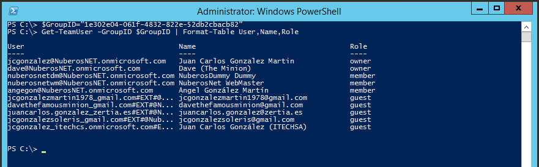

Una de las características más demandadas en Microsoft Teams no disponible hasta hace relativamente poco tiempo es la posibilidad de poder gestionar y administrar la plataforma por medio de PowerShell. Afortunadamente, para dar respuesta a este requerimiento Microsoft liberó en noviembre de 2017 una primera versión de los comandos PowerShell para Microsoft Teams que, aunque actualizada en diciembre del mismo año, aún tiene mucho margen de mejora como veremos en este artículo.

**Pre-requisitos para trabajar con PowerShell para Microsoft Teams**

Para poder comenzar a administrar y gestionar Microsoft Teams por medio de PowerShell, lo primero que tendremos que hacer es descargarnos e instalar la versión más reciente del Módulo de PowerShell para Microsoft Teams:

·         La versión más reciente del módulo de PowerShell para Microsoft Teams disponible a la fecha de redacción de este artículo es la 0.9.1 y para poder descargarla e instalarla hay que seguir el procedimiento detallado en la PowerShell Gallery:

[https://www.powershellgallery.com/packages/MicrosoftTeams/0.9.1](https://www.powershellgallery.com/packages/MicrosoftTeams/0.9.1)

·         De acuerdo con las instrucciones de instalación, para instalar el módulo de PowerShell para Microsoft Teams simplemente necesitamos abrir la consola de Windows PowerShell en nuestro equipo y ejecutar la siguiente instrucción:

Install-Module -Name MicrosoftTeams

·         Cuando se solicite, confirmamos que deseamos instalar el módulo desde el repositorio de la PowerShell Gallery:


·         Una vez instalado, podemos de forma sencilla obtener el listado completo de comandos disponibles. Como se puede apreciar en la Figura 1, la versión 0.9.1 de los comandos PowerShell para Microsoft Teams cuenta con un total de 23 cmdlets.


**Conectándose a Microsoft Teams por medio de PowerShell**

Para conectarnos a Microsoft Teams por medio de PowerShell podemos hacer uso del cmdlet Connect-MicrosoftTeams tal y como muestra el siguiente código:

```
$sUserName="jcgonzalez@nuberosnet.onmicrosoft.com"$sMessage="Type your Office 365 credentials"$TeamsCredentials=Get-Credential -UserName $sUserName -Message $sMessageConnect-MicrosoftTeams -Credential $TeamsCredentials 
```


Como resultado de la ejecución del código anterior, se muestra por pantalla la cuenta que se está conectando a Microsoft Teams así como los valores de las siguienes propiedades:

·         Environment

·         Tenant.

·         TenantId.

·         TenantDomain.​

​

**Operaciones básicas con Teams utilizando PowerShell**

El comando Get-Team permite obtener el listado de Teams a los que pertenece el usuario actual y no todos los Teams del tenant como cabría esperar. Para cada Team se devuelven las siguientes propiedades:

·         El ID del Grupo de Office 365 vinculado al Team.

·         El nombre para mostrar del Team.

·        La Descripción del Team.​

​

El comando Get-TeamUser permite obtener los integrantes de un Team (Propietarios, Miembros e Invitados) identificado por medio del identificador de Grupo (GroupId). Por ejemplo, para obtener las propiedades User, Name y Role de los integrantes de un Team basta con ejecutar las siguientes sentencias PowerShell:

```
$GroupID="1e302e04-061f-4832-822e-52db2cbacb82" 
```

```
Get-TeamUser -GroupID $GroupID | Format-Table User,Name,Role
```


La salida de pantalla que se obtiene al ejecutar el código PowerShell anterior es el siguiente:



El cmdlet New-Team permite crear un nuevo Team en el tenant indicando o bien el Grupo de Office 365 a partir del qué se va a crear el Team o bien el nombre para mostrar (DisplayName). Opcionalmente se puede indicar también valores para los parámetros Alias y Description del comando.

```
$sTeamName="SharePoint Saturday Events" 
```

```
New-Team -DisplayName $sTeamName
```


Una vez ejecutado el comando New-Team, se visualiza por pantalla el identificador del Grupo de Office 365 asociado al Team:


Una secuencia PowerShell más completa para crear un nuevo Team con New-Teams es la siguiente:

```
$sTeamName="SharePoint & Office 365 Madrid 2018"$sTeamAlias="SPSO365Madrid2018"$sTeamDescription="Team for the SharePoint & Office 365 Madrid 2018"$Classification="Internal Only" 
```

```
New-Team -DisplayName $sTeamName -Alias $sTeamAlias -Description $sTeamDescription -AccessType Private -Classification $Classification -AddCreatorAsMember $False​
```


Como vemos, la secuencia anterior permite crear un nuevo Team indicado nombre, alias, tipo de acceso (privado), escala de clasificación (“Internal Only”) y también qué el usuario que está creando el Team no será añadido como propietario al Team.
  Para añadir un nuevo usuario de tipo integrante a un Team utilizaremos el cmdlet Add-TeamUser de la siguiente forma:

```
$GroupID="1e302e04-061f-4832-822e-52db2cbacb82"$sUserName="agonzalez@nuberos.es"Add-TeamUser -GroupId $GroupID -User $sUserName -Role Member
```


De la misma forma, el comando Remove-TeamUser nos permite eliminar un usuario de acuerdo con las siguientes sentencias PowerShell:


```
$GroupID="1e302e04-061f-4832-822e-52db2cbacb82"$sUserName="agonzalez@nuberos.es" Remove-TeamUser -GroupId $GroupID -User $sUserName
```


**Operaciones básicas con canales de Teams utilizando PowerShell**

De la misma forma que podemos realizar operaciones básicas con Teams en nuestro tenan utilizando PowerShell, podremos hacer uso también de PowerShell para realizar operaciones con calanes de un Team:

·         El comando Get-TeamChannel nos permite obtener los canales de un Team concreto identificado por medio del parámetro GroupId:

```
$GroupID="1e302e04-061f-4832-822e-52db2cbacb82"
```

```
Get-TeamChannel -GroupId $GroupID
```


·        Para crear un nuevo canal en un Team disponemos del cmdlet New-TeamChannel:

```
$GroupID="d06aae62-2357-464e-80a8-5090c084f47a"$sChannelName="SharePoint Saturday Madrid 2018"$sTeamDescription="Canal para el evento SharePoint Saturday Madrid 2018" 
```

```
New-TeamChannel -GroupId $GroupID -DisplayName $sChannelName -Description $sTeamDescription
```


·         El cmdlet Set-TeamChannel permite actualizar un canal de un Team de acuerdo con la siguiente sintaxis:

```
$GroupID="d06aae62-2357-464e-80a8-5090c084f47a"$sCurrentChannelName="SharePoint Saturday Madrid 2018"$sNewChannelName="SharePoint & Office 365 Saturday Madrid 2018"
```

```
Set-TeamChannel -GroupId $GroupID -CurrentDisplayName $sChannelName -NewDisplayName $sNewChannelName
```


·         Finalmente, el comando Remove-TeamChannel se puede utilizar para borrar un canal en un Team.

**Comandos PowerShell para acceder a las configuraciones de Teams**

Para finalizar el artículo, a continuación, se destallan algunos de los comandos que permiten interactuar con un Team desde el punto de vista de su configuración:

·         Para visualizar las configuraciones de lo que pueda hacer un integrante de un Team disponemos del comando Get-TeamMemberSettings:​

```
$GroupID="d06aae62-2357-464e-80a8-5090c084f47a" Get-TeamMemberSettings -GroupId $GroupID
```


Como resultado se mostrarán las configuraciones aplicadas a integrantes del Team:


·         Para cambiar las configuraciones de un integrante de un Team se puede utilizar el comando Set-TeamMemberSettings:

```
$GroupID="d06aae62-2357-464e-80a8-5090c084f47a"Set-TeamMemberSettings -GroupId $GroupID -AllowDeleteChannels $false Get-TeamMemberSettings -GroupId $GroupID
```

·         El comando Get-TeamMessagingSettings permite visualizar las configuraciones a nivel de mensajes en Teams:

```
$GroupID="d06aae62-2357-464e-80a8-5090c084f47a" 
```

```
Get-TeamMessagingSettings -GroupId $GroupID
```


·         Las configuraciones de los mensajes en un Team se pueden modificar por medio de Set- TeamMessagingSettings.

·         Las configuraciones de usuarios invitados en Teams, así como uso de Stickers & Memes se pueden obtener con los comandos Get-TeamGuestSettings y Get-TeamFunSettings.


**Conclusiones**

Desde el pasado mes de noviembre disponemos de una primera versión (Beta) del módulo de comandos PowerShell para Microsoft Teams que fue actualizado el pasado mes de diciembre.   Los comandos PowerShell disponibles para Microsoft Teams permiten realizar operaciones básicas con Teams, Canales de Teams y las configuraciones de un Team y presentan ciertas limitaciones como por ejemplo la imposibilidad de listar todos los Teams de un tenant con el comando Get-Team.

**Referencias**

·        **A Teams PowerShell Primer:** [https://www.petri.com/teams-powershell-primer](https://www.petri.com/teams-powershell-primer)

·        **Why the PowerShell Module for Teams is Critically Flawed:** [https://www.petri.com/powershell-module-teams-critically-flawed](https://www.petri.com/powershell-module-teams-critically-flawed)

·        **Documentación de los commandos PowerShell para Microsoft Teams:**  [https://docs.microsoft.com/en-us/powershell/module/teams/?view=teams-ps](https://docs.microsoft.com/en-us/powershell/module/teams/?view=teams-ps)


**Juan Carlos González Martín**
 Office Servers and Services MVP
 Cloud & Productivity Advisor 
 jcgonzalez  martin1978@hotmail.com 
 @jcgm1978 |  [https://jcgonzalezmartin.wordpress.com/](https://jcgonzalezmartin.wordpress.com/) ​

 
 
import LayoutNumber from '../../../components/layout-article'
export default LayoutNumber
