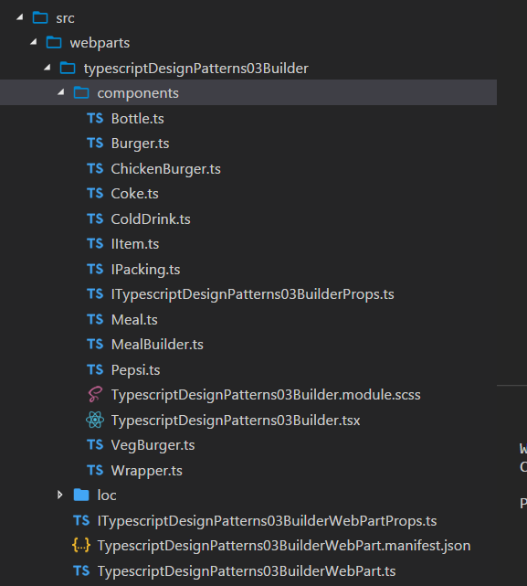

import ArticleHeader from '../../../components/article-header'

<ArticleHeader frontmatter={props.pageContext.frontmatter} />


El patrón  constructor nos permite construir objetos complejos usando objetos simples de una manera sencilla y paso a paso.  Este patrón es de la categoría de patrones creaciones y nos provee una de las maneras mas sencillas para simplificar la creación de objetos.

La idea de este ejemplo es contruir un objeto complejo a partir de objetos sencillos, una Comida a partir del objeto hamburgesa, papas frías, gaseosa).   Supón que tienes una lista en SharePoint para almacenar hamburgesas, otra para gaseosas, otra para postres, y quieres construir diferentes tipos de menu, eso seria el ejemplo perfecto.

**UML**

El diagrama UML de lo que vamos a construir es el siguiente (Figura 1):


**Estructura del Proyecto**

Para el ejemplo hemos creado un componente con todas las clases necesarias y vamos a discutir las clases una por una.



**IItem.ts**

Esta interfaz es la que necesitan implementar todos los productos para que estos tengan una estructura común.

```
Import Ipacking from “./Ipacking”;
```

```
interface Iitem {  
```

```
    name(): string;
```

```
    packing(): Ipacking;
```

```
    price(): number;
```

```
}
```

```
 
```

```
export default Iitem;  
```

**Ipacking.ts**

Esta interfaz es la que necesitan implementar todos los tipos de Paquetes, por ejemplo botellas, bolsa, etc.  Es la forma que podríamos definir comportamiento y propiedades communes segun el tipo de paquete usado por el producto.

```
interface IPacking {  
```

```
    pack(): string;
```

```
} 
```

```
export default IPacking;  
```

**Bottle.ts**

Este es un tipo de paquete, implementa la interfaz IPacking.

```
import IPacking from "./IPacking";
```

```
class Bottle implements IPacking {  
```

```
    public pack(): string {
```

```
       return "Bottle";
```

```
    }
```

```
}
```

```
export default Bottle;  
```

**Wrapper.ts**

```
import IPacking from "./IPacking";
```

```
class Wrapper implements IPacking {  
```

```
    public pack(): string {
```

```
       return "Wrapper";
```

```
    }
```

```
}
```

```
export default Wrapper; 
```

**Burger.ts**

Esta es la clase abstracta de la cual nuestras clases especificas tienen que implementar, esta clase existe para que todas las hamburguesas tengan una estructura y comportamiento comun.

```
import IItem from "./IItem";  
```

```
import Wrapper from "./Wrapper";  
```

```
import IPacking from "./IPacking";
```

```
abstract class Burger implements IItem {  
```

```
    public name(): string {
```

```
        throw new Error("Method not implemented.");
```

```
    }
```

```
    public packing(): IPacking {
```

```
        return new Wrapper();
```

```
    }
```

```
    public abstract price(): number ;
```

```
}
```

```
export default Burger;  
```

**ChickenBurger.ts**

La hamburguesa de pollo, implementada los métodos necesarios.

```
import Burger from "./Burger";
```

```
class ChickenBurger extends Burger {  
```

```
    public price(): number {
```

```
        return 15;
```

```
    }
```

```
    public name(): string {
```

```
        return "Chicken Burger";
```

```
    }
```

```
}
```

```
export default ChickenBurger;
```

**VegBurger.ts**

La hamburguesa vegetariana, implementando los métodos necesarios.

```
import Burger from "./Burger";
```

```
class VegBurger extends Burger {  
```

```
    public price(): number {
```

```
        return 11;
```

```
    }
```

```
    public name(): string {
```

```
        return "Veg Burger";
```

```
    }
```

```
}
```

```
export default VegBurger;
```

**Colddrink.ts**

Todas las geseosas implementarían la clase abstracta de ColdDrink que define las propiedades y comportamiento común entre ellas.

```
import IItem from "./IItem";  
```

```
import IPacking from "./IPacking";  
```

```
import Bottle from "./Bottle";
```

```
abstract class ColdDrink implements IItem {  
```

```
    public name(): string {
```

```
        throw new Error("Method not implemented.");
```

```
    }
```

```
    public packing(): IPacking {
```

```
        return new Bottle();
```

```
    }
```

```
    public abstract price(): number ;
```

```
}
```

```
export default ColdDrink;
```

**Coke.ts**

Una implementación de la clase anterior para definir su precio y nombre.

```
import ColdDrink from "./ColdDrink";
```

```
class Coke extends ColdDrink {  
```

```
    public price(): number {
```

```
       return 2.5;
```

```
    }
```

```
    public name(): string {
```

```
        return "Coca Cola";
```

```
    }
```

```
}
```

```
export default Coke;
```

**Pepsi.ts**

```
import ColdDrink from "./ColdDrink";
```

```
class Pepsi extends ColdDrink {  
```

```
    public price(): number {
```

```
       return 1.5;
```

```
    }
```

```
    public name(): string {
```

```
        return "Pepsi Cola";
```

```
    }
```

```
}
```

```
export default Pepsi;
```

**Meal.ts**

Esta clase representa el comportamiento completo para la construcción de un Menu, tiene métodos para agregar ítems al Menu, obtener el costo total, y mostrar los productos del menú.

```
import IItem from "./IItem";
```

```
class Meal {  
```

```
    private items: IItem[];
```

```
    public addItem(item: IItem): void {
```

```
        this.items.push(item);
```

```
    }
```

```
    public getCost(): number {
```

```
        let cost: number  = 0;
```

```
        for(let item of this.items) {
```

```
            cost+= item.price();
```

```
        }
```

```
 
```

```
        return cost;
```

```
    }
```

```
    public showItems(): string {
```

```
        let returnStr: string;
```

```
        for(let item of this.items) {
```

```
            returnStr +="Item:" + item.name;
```

```
            returnStr +=", Packing:" + item.packing().pack();
```

```
            returnStr +=", Price: " + item.price();
```

```
        }
```

```
        return returnStr;
```

```
    }
```

```
}
```

```
export default Meal;  
```

**MealBuilder.ts**

Esta clase es la que construye los Menus, retornando un objeto tipo Meal para cada tipo de Menu, el cual tiene diferentes productos.  Por simplicidad se han creado solo 2 menus.

```
import Meal from "./Meal";  
```

```
import VegBurger from "./VegBurger";  
```

```
import Coke from "./Coke";  
```

```
import ChickenBurger from "./ChickenBurger";
```

```
class MealBuilder {  
```

```
    public prepareVegMeal(): Meal {
```

```
        let meal: Meal= new Meal();
```

```
        meal.addItem(new VegBurger());
```

```
        meal.addItem(new Coke());
```

```
        return meal;
```

```
    }
```

```
    public prepareNonVegMeal(): Meal {
```

```
        let meal: Meal= new Meal();
```

```
        meal.addItem(new ChickenBurger());
```

```
        meal.addItem(new Coke());
```

```
        return meal;
```

```
    }
```

```
}
```

```
export default MealBuilder;  
```

**ITypescriptDesignPatterns03BuilderProps.ts**

Hemos creado una propiedad que nos guardara la decisión tomada por el usuario final (selectedMeal), y la agregamos a las “Props” del componente React.

```
export interface ITypescriptDesignPatterns03BuilderProps {  
```

```
  description: string;
```

```
  selectedMeal: string;
```

```
}
```

**TypescriptDesignPatterns03Builder.tsx**

Esta es nuestra clase de componente, aquí tenemos un constructor y en el constructor llamamos el método SetMeal, en el cual enviamos la opción elegida por el usuario como parámetro. Una vez el menú esta construido, en el método render podemos utilizar el método showItems para mostrar lo seleccionado.

```
import * as React from "react";  
```

```
import styles from "./TypescriptDesignPatterns03Builder.module.scss";  
```

```
import { ITypescriptDesignPatterns03BuilderProps } from "./ITypescriptDesignPatterns03BuilderProps";  
```

```
import { escape } from "@microsoft/sp-lodash-subset";  
```

```
import MealBuilder from "./MealBuilder";  
```

```
import Meal from "./Meal";  
```

```
import { IPropertyPaneConfiguration } from "@microsoft/sp-webpart-base/lib/propertyPane/propertyPane/IPropertyPane";  
```

```
import {  
```

```
  PropertyPaneDropdown
```

```
} from "@microsoft/sp-webpart-base";
```

```
import Version from "@microsoft/sp-core-library/lib/Version";
```

```
export default class TypescriptDesignPatterns03Builder extends React.Component<ITypescriptDesignPatterns03BuilderProps, {}> {
```

```
  private mealBuilder: MealBuilder ;
```

```
  private items: string;
```

```
  private meal: Meal;
```

```
  constructor(props: ITypescriptDesignPatterns03BuilderProps, state: any) {
```

```
    super(props);
```

```
    this.setMeal(props.selectedMeal);
```

```
    this.mealBuilder = new MealBuilder();
```

```
  }
```

```
  public render(): React.ReactElement<ITypescriptDesignPatterns03BuilderProps> {
```

```
    return (
```

```
        <div className={styles.typescriptDesignPatterns03Builder}>
```

```
          <div className={styles.container}>
```

```
            <div className={`ms-Grid-row ms-bgColor-themeDark ms-fontColor-white ${styles.row}`}>
```

```
              <div className="ms-Grid-col ms-lg10 ms-xl8 ms-xlPush2 ms-lgPush1">
```

```
                <span className="ms-font-xl ms-fontColor-white">Welcome to Burger Company!</span>
```

```
                <p className="ms-font-l ms-fontColor-white">You have selected the following.</p>
```

```
                  <span className={styles.label}>{this.meal.showItems()}</span>
```

```
              </div>
```

```
            </div>
```

```
          </div>
```

```
        </div>
```

```
      );
```

```
    }
```

```
  protected get dataVersion(): Version {
```

```
    return Version.parse("1.0");
```

```
  }
```

```
  private setMeal(selectedMeal: string): void {
```

```
     if(selectedMeal === "VegMeal") {
```

```
        this.meal = this.mealBuilder.prepareVegMeal();
```

```
     }
```

```
     if(selectedMeal === "NonVegMeal") {
```

```
      this.meal = this.mealBuilder.prepareNonVegMeal();
```

```
   }
```

```
  }
```

```
}
```

Y finalmente

**TypescriptDesignPatterns03BuilderWebPart.ts**

Esta es la clase del webpart que genera Sharepoint Framework, aca lo único que hacemos es definir la propiedad de tipo DropDown, y luego utilizar el componente con la opción seleccionada.

```
import * as React from "react";  
```

```
import * as ReactDom from "react-dom";  
```

```
import { Version } from "@microsoft/sp-core-library";  
```

```
import {  
```

```
  BaseClientSideWebPart,
```

```
  IPropertyPaneConfiguration,
```

```
  PropertyPaneTextField,
```

```
  PropertyPaneDropdown
```

```
} from "@microsoft/sp-webpart-base";
```

```
import * as strings from "TypescriptDesignPatterns03BuilderWebPartStrings";  
```

```
import TypescriptDesignPatterns03Builder from "./components/TypescriptDesignPatterns03Builder";  
```

```
import { ITypescriptDesignPatterns03BuilderProps } from "./components/ITypescriptDesignPatterns03BuilderProps";  
```

```
import { ITypescriptDesignPatterns03BuilderWebPartProps } from "./ITypescriptDesignPatterns03BuilderWebPartProps";
```

```
export default class TypescriptDesignPatterns03BuilderWebPart extends  
```

```
  BaseClientSideWebPart<ITypescriptDesignPatterns03BuilderWebPartProps> {
```

```
  public render(): void {
```

```
    const element: React.ReactElement<ITypescriptDesignPatterns03BuilderProps > = React.createElement(
```

```
      TypescriptDesignPatterns03Builder,
```

```
      {
```

```
        description: this.properties.description,
```

```
        selectedMeal: this.properties.selectedMeal
```

```
      }
```

```
    );
```

```
    ReactDom.render(element, this.domElement);
```

```
  }
```

```
  protected get dataVersion(): Version {
```

```
    return Version.parse("1.0");
```

```
  }
```

```
  protected getPropertyPaneConfiguration(): IPropertyPaneConfiguration  {
```

```
    return {
```

```
      pages: [
```

```
        {
```

```
          header: {
```

```
            description: "Header"
```

```
          },
```

```
          groups: [
```

```
            {
```

```
              groupName: "Group",
```

```
              groupFields: [
```

```
                PropertyPaneDropdown("meal", {
```

```
                  label: "Select meal",
```

```
                  options: [
```

```
                    { key: "Veg", text: "Veg" },
```

```
                    { key: "Nonveg", text: "Nonveg" }
```

```
                  ],
```

```
                  selectedKey: "Nonveg"
```

```
                })
```

```
              ]
```

```
            }
```

```
          ]
```

```
        }
```

```
      ]
```

```
    };
```

```
  }
```

```
}
```

El Proyecto se encuentra en mi repositorio de github: [https://github.com/levalencia/TypescriptDesignPatterns03-Builder](https&#58;//github.com/levalencia/TypescriptDesignPatterns03-Builder)


**Luis Valencia**
 MVP SharePoint
 levm38@outlook.com

@levalencia

[http://www.luisevalencia.com](http&#58;//www.luisevalencia.com/)

