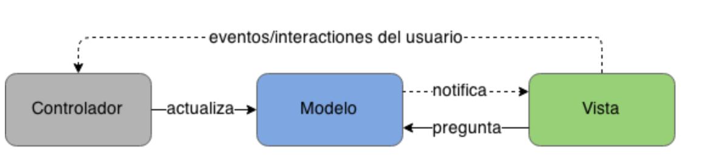
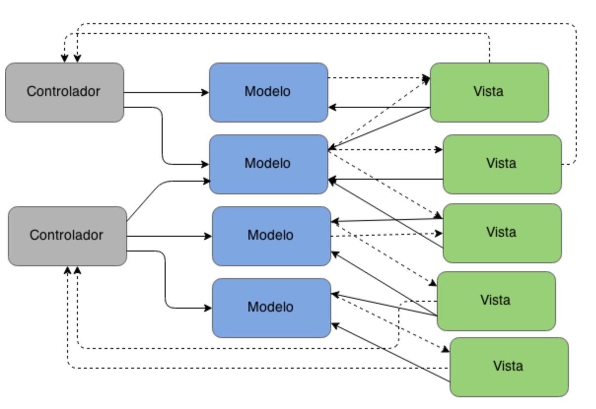
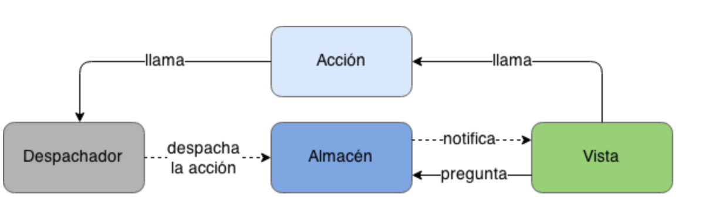
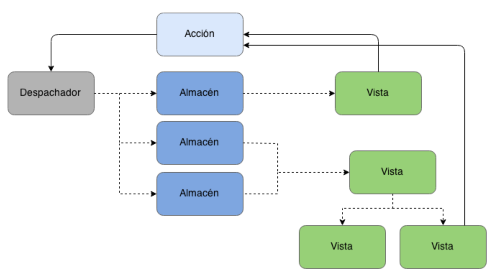
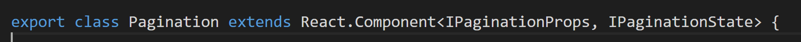

Los tiempos en el desarrollo sobre Office 365 han cambiado, del desarrollo tradicional centrado en tecnología en servidor hemos pasado a un desarrollo en el que la gran mayoría de nuestros esfuerzos se centran en el FronEnd. Como se ha comentado en anteriores artículos publicados, el tooling de herramientas ha cambiado totalmente: Visual Studio Code, Typescript, Gulp, WebPack, NodeJS son algunas de las que ahora no deben de faltar para los "nuevos" Office Developers. Estas herramientas están claras, donde vienen las dudas principalmente es en la elección del framework JavaScript que se va a utilizar. Naturalmente el equipo de producto comenta que se puede utilizar cualquiera, sin embargo, vemos que hacen un especial hincapié en ReactJS (siendo un producto de Facebook). ¿Que tiene ReactJS para que sea nuestra elección?  ¿Cuáles son sus principales características? ¿Qué cosas debemos de conocer de React para poder adoptarlo y que sea un framework en el que nos sintamos cómodos con él?  A lo largo de una serie de artículos voy a intentar explicar todo lo que hubiera necesitado cuando hace un año empezamos a adoptarlo como Framework para nuestros desarrollos tanto dentro de SharePoint como fuera ellos.

**¿Qué es ReactJS?**

Aunque parezca una pregunta obvia no lo es tanto, ReactJS NO es un framework JavaScript como tal, es una librería que se encarga solamente del renderizado/visualización de nuestro componente. Estamos acostumbrados al Framework JavaScript que se encarga de todo, Route, Services, MVC …como pueda ser Angular, esto hace que tengamos un gran acoplamiento/dependencia con la evolución de nuestro desarrollo. Al decir esto no quiero decir que ReactJS no tengan otras librerías auxiliares que se encarguen de esto, React-Route, React-Dom, React-Redux, simplemente que las elecciones de estas librerías ya son decisión del desarrollador y no impuestas por el Framework.

Vamos a centrarnos en su principal virtud que es el renderizado, uno de los grandes problemas que ha ocurrido principalmente cuando desarrollamos en el Front, es que la manipulación de los elementos del DOM es lento y costoso por lo tanto si estamos continuamente modificando sus valores eso hace que la interfaz de usuario quede un poco fea, mostrando la carga de los elementos en varios pasos, ocultando diversas pantallas antes. En definitiva, el acceso al DOM continuo tiene problemas de rendimiento y además de diseño. ¿Cómo soluciona ReactJS este problema? Para solucionarlo ellos han creado un DOM Virtual que es el que nosotros modificamos directamente en nuestros desarrollos, ahora bien, el éxito no es solamente este DOM virtual sino la implementación de un algoritmo que se encarga de comparar el DOM virtual con el DOM real y solamente modifica los nodos que se han modificado desde su último renderizado. Esto ha sido a nivel de eficiencia el principal motivo por el que ha crecido ReactJS.

**¿Qué trae de nuevo ReactJS respecto a otras librerías/Frameworks?**

Junto con este algoritmo de renderizado del DOM virtual, ReactJS implementa en cierta forma la especificación de Web Components. El estándar, en realidad, se compone de 4 subelementos complementarios, pero independientes entre sí: Custom Elements (elementos personalizados), Templates (plantillas), Shadow DOM (DOM oculto) y HTML Imports. Este estándar lo que trata es de poner un poco de orden a todo el desarrollo que se realiza en el Front y que no sea un mundo totalmente diferente al resto de desarrollos.

Este estándar lo implementan todos los nuevos Frameworks JavaScript que se han desarrollado en los últimos años. Sin embargo, la particularidad de ReactJS es que va unido a una nuevo paradigma de arquitectura/patrón para implementar aplicaciones grandes. Este nuevo paradigma es lo que se llaman arquitecturas Flux (no confundir con Redux del cual hablaremos en el siguiente artículo) estas arquitecturas se basan en que la aplicación sigue un flujo lógico de ejecución y cualquiera persona es capaza de seguirlo (siempre que se implemente bien).  Para ver un ejemplo de este tipo de arquitectura podemos observar como Microsoft implementó Delve basándose en este patrón [https://medium.com/@delveeng/how-we-use-the-flux-architecture-in-delve-effc551f8fbc](https://medium.com/%40delveeng/how-we-use-the-flux-architecture-in-delve-effc551f8fbc)

Para que tengamos claro que es Flux vamos a poner un ejemplo simple, ahora mismo en una aplicación MVC tenemos lo que se llama el "two binding" es decir algo similar a la siguiente imagen:



Conforme vamos añadiendo más controladores a la aplicación nuestro modelo se complica mucho más:



Con una arquitectura Flux la secuencia de la aplicación se simplifica mucho más quedando de la siguiente forma:



Y aunque incrementemos el número de vistas y de “Dispatch/Controladores” la aplicación no se complica más de la cuenta:



La arquitectura flux tiene propiedades que la hacen única y provee importantes garantías, todas giran alrededor de un flujo de datos explícito y fácil de entender, aumentando la capacidad de seguir, reproducir y realizar pruebas en estados de aplicación específicos. Sus principales características:

·       **Síncronas**: El despachador de acciones y las funciones dentro de los almacenes son síncronos. Todas las operaciones asincrónicas deben invocar una acción le comunica al sistema el resultado de la operación. Los creadores de acciones pueden llamar APIs asincrónicamente, los almacenes idealmente no lo deben hacer. Esta regla hace que el flujo de información sea extremadamente explícito y en caso de errores fácilmente se puede identificar la acción ese estado erróneo de la aplicación.
·       **Inversión del Control:** Los almacenes se auto actualizan en respuesta a acciones en lugar de ser actualizados por un controlador o modulo similar, ningún otro componente de la aplicación contiene lógica sobre como actualizar el estado. Como los almacenes se auto actualizan en respuesta a acciones y únicamente sincrónicamente, realizar pruebas es tan sencillo como inicializar con un estado específico, invocar una acción y verificar que el estado final es el esperado.
·       **Cero acciones en cascadas:** Flux no permite despachar una segunda acción como resultado de una primera acción, esto ayuda a prevenir actualizaciones en cascada que son difíciles de mantener y debuggear. Además, ayuda a pensar en las interacciones de la aplicación en una forma más semántica.

**El ciclo de vida de un componente**

Para empezar a crear un componente tiene dos parámetros que se le pasan al componente, el primer parámetro son las Props (propiedades) y el segundo parámetro es el State o estado del componente.



Esta es una de las primeras dudas que nos planteamos a la hora de empezar el propio desarrollo cuando utilizo las Props y cuando utilizo el State. Para saber cuándo hay que utilizar cada una de ellas hay que saber su definición. Por un lado, las Props son propiedades inmutables dentro de un componente es decir que su valor no se modifica en dicho componente. Mientras el State es el estado que tiene el propio componente en un determinado momento, este State se puede modificar en el propio componente.

Lo ideal a la hora que empezamos a desarrollar componentes es ir creando un componente principal en el que tenemos las propiedades de nuestro desarrollo y estas propiedades se van inyectado en los estados de los componentes hijos. Cuando incorporemos una librería como Redux veremos la importancia de saber muy bien estos dos parámetros.

Junto con saber diferenciar bien el State y las Props es necesario entender bien el ciclo de vida de un componente, para ello un componente React tiene un método “Render” que es el encargado de “pintar” el HTML del propio componente, pero junto con este método principal hay una serie de métodos que se lanzan antes de este render: ComponentWillMount, ComponenteDidMount, ComponentDidMount, ComponenteWillMount, ComponentReceiveProps. Estos métodos podríamos verlos como un símil al típico OnLoad de un WebPart clásico.

Dentro de estos métodos se hacen operaciones como pueda ser llamar a una API para cargar los datos de un componente. El flujo del componente es que una vez nos traemos los datos, se notifica esta modificación al componente y una vez estos datos se modifican el componente se vuelve a renderizar. Por eso, aunque la primera vez os suene a chino, dentro de estos métodos NO se debe de modificar el estado del propio componente, el motivo: puedes entrar en un bucle infinito.

**Show me the code**

Tras toda esta introducción sobre React vamos a dirigirnos y abrimos una solución de SPFX. Si nos damos cuenta en la clase en la que se renderiza el WebPart se renderiza un objeto de ReactJS, dentro de este componente se le pasan los elementos que se van a encargar de pintar nuestro componente. Como aspectos que son curiosos es que dentro de la clase que extiende nuestro WebPart, tenemos diversas propiedades como es el contexto donde encontramos todas propiedades de dicho componente. Si este Contexto lo queremos utilizar en nuestro Componente deberemos de inyectárselo como Propiedad a nuestro componente.  De tal forma que quedaría de la siguiente forma:

```
export default class HelloWorldWebPart extends BaseClientSideWebPart<IHelloWorldWebPartProps> {   public render(): void {        const element: React.ReactElement<IHelloWorldProps > = React.createElement(      HelloWorld,      {        description: this.properties.description,        context: this.context      }    );     ReactDom.render(element, this.domElement);  }
```

Una vez ya tenemos el punto de arranque nos quedaría la forma de como planteamos la comunicación entre los diversos componentes que lo utiliza y como organizar nuestro código de tal forma que nuestros desarrollos no sean código spaghetti.

¿Pero, ahora bien, en SharePoint necesitamos utilizar solamente React o necesitamos de librerías auxiliares Flux, React Router, etc? Está es otra de las cuestiones que necesitamos saber que opción y no dejarnos llevar por las modas sino por las necesidades que tenemos y sobre todo el contexto en el que estamos que no hay que olvidarlo es dentro de un sitio de SharePoint Online. Todo esto lo abordaremos en el siguiente número.


**Adrián Diaz Cervera**
Architect Software Lead at Encamina
MVP Office Development
[http://blogs.encamina.com/desarrollandosobresharepoint](http://blogs.encamina.com/desarrollandosobresharepoint)
[http://geeks.ms/blogs/adiazcervera](http://geeks.ms/blogs/adiazcervera)        
adiaz@encamina.com @AdrianDiaz81​

 
 
import LayoutNumber from '../../../components/layout-article'
export default LayoutNumber
