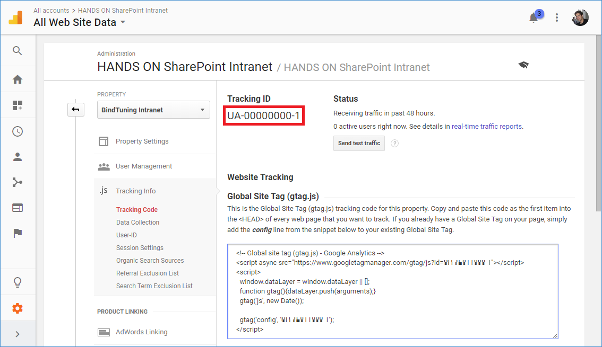
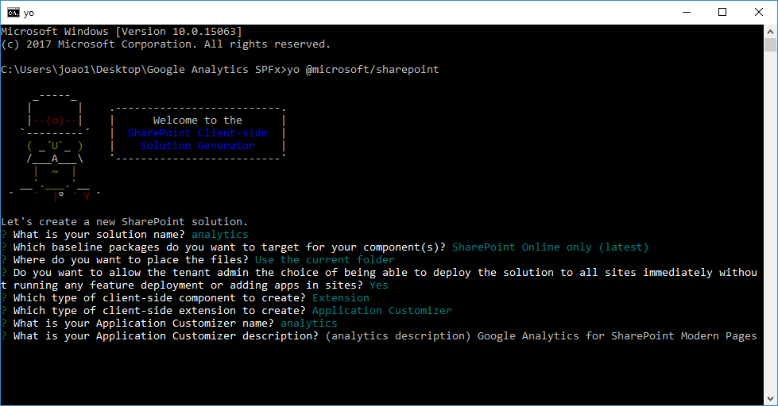
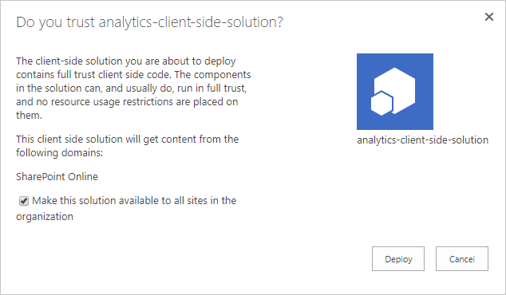
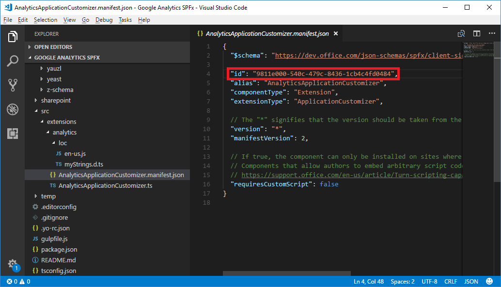

Having an analytics tool monitoring your intranet is essential to understand the engagement of the users and how they are interacting with the content that is published. Google Analytics is widely used in the internet, it provides a concise analysis with reports of everything that happens in your site as well as real time reports, mostly targeted for public sites it also works on SharePoint intranets. Google Analytics is added to the sites using a script provided by Google, while this is not a problem for classic SharePoint Sites, with the modern no script site things are a bit different.

In this article, I explain step by step how to build and deploy an Application Customizer using the SharePoint Framework Extensions to add Google Analytics to the modern SharePoint following the best practices recommended by Microsoft.

**How to setup Google Analytics**

First things first, before we get into the SharePoint bits let’s set up google analytics and get everything you need.

- Sign in to your  [Analytics account](https://www.google.com/analytics/web/#home/).
- Select the [Admin](https://support.google.com/analytics/answer/6132368) tab.
- Select an account from the menu in the *ACCOUNT* column, or *CREATE NEW ACCOUNT* if you don’t have one already.
- Select a property from the menu in the *PROPERTY* column.
- Under *PROPERTY*, click **Tracking Info -&gt; Tracking Code.**
- Save the **Tracking Id.**




**Create the Application Customizer Extension project**

The Application Customizer is one of the available extension types provided by the SharePoint Framework and allows you to add custom JavaScript to every page in a site or web, to achieve the steps below you need to have installed the SPFx v1.4 or higher.

- Create a folder with the name of the project *e.g. analytics*.
- Open the console window in the new directory.
- Type the command `yo @microsoft/sharepoint.`
- When prompted:

    - Accept the default **app-extension** as your solution name, and press **Enter**.
    - Choose **SharePoint Online only (latest)**, and press **Enter**.
    - Choose **Use the current folder**, and press **Enter**.
    - Choose **Y** to make the extension available to be added without activating any features.
    - Choose **Extension** as the client-side component type to be created.
    - Choose **Application Customizer** as the extension type to be created.
    - Provide a name to the extension. *e.g. analytics*
    - Provide a description to the extension. *e.g. Google Analytics for SharePoint modern pages*




5. The download of all the requirements might take a few minutes, once it's done you will see a message indicating the success of the operation.

**Build the extension**

Now that you have the extension project created let's proceed and modify it to include the Google Analytics JavaScript code.

1. Type code . to open the project (this will open visual studio code but you can use another editor).
2. On your solution go to **src/extensions/analytics** and open the **AnalyticsApplicationCustomizer.ts**
3. Locate the interface it **IAnalyticsApplicationCustomizerProperties** and replace it by the code below, this property will be used to store your tracking ID.


```
export interface IAnalyticsApplicationCustomizerProperties {    trackingID: string; }
```

4. Locate the OnInit method and replace it by the code below

```
      public onInit(): Promise<void> {              let trackingID: string = this.properties.trackingID;          if (!trackingID) {                           Log.info(LOG_SOURCE, "Tracking ID not provided";);          }else{                           var gtagScript = document.createElement("script");                           gtagScript.type = "text/javascript";                           gtagScript.src = `https://www.googletagmanager.com/gtag/js?id=${trackingID}`;                               gtagScript.async = true;                         document.head.appendChild(gtagScript);                                eval(`                                           window.dataLayer = window.dataLayer || [];                                           function gtag(){dataLayer.push(arguments);}                                           gtag('js', new Date());                                               gtag('config',  '${trackingID}');                         `);        }        return Promise.resolve();    }
```

This snippet is a modified version of the code provided by Google, it was converted from JavaScript to TypeScript to use the **Tracking Id** dynamically.

**Package the analytics solution**

To deploy the analytics solution to all the users it needs to be packaged and installed on SharePoint Online. The instructions below are specific for SPFx 1.4 or higher and will make use of the Asset Packaging functionality.

1. On your project go to the **config** folder, open the **package-solution.json** and confirm if the property includeClientSideAssets exists in the solution, if it doesn't exist it means that you are not using SPFx 1.4.


2. To get the basic structure for the packaging run the command `gulp bundle –ship.`

`3.`To get the installation package run the command `gulp package-solution –ship.`

`4.`On your project structure navigate to sharepoint/solution, in this folder you will find the **\*.sppkg** installation file.


**Install Google Analytics on Modern SharePoint**

Extensions won't be automatically enabled. SharePoint Framework extensions must be specifically associated to sites, lists, and fields programmatically to be visible to site users.

To achieve the steps described in this section you will need to install the [SharePoint PnP PowerShell](https://msdn.microsoft.com/en-us/pnp_powershell/pnp-powershell-overview).

1. Open your **App Catalog** and upload the **sppkg** file
2. Check the box **Make this solution available to all sites in the organization**




3. On your project go to **src/extensions/analytics** and open the **AnalyticsApplicationCustomizer.manifest.json**

4. Copy the **id** value.

5. Open the PowerShell command line.

6. To establish a connection, execute the command `Connect-PnPOnline -UseWebLogin -Url https://yourtenant.sharepoint.com/.`

`7.`To enable the extension, execute the command `Add-PnPCustomAction -ClientSideComponentId "id" -Name "Analytics" -Title "Analytics" -Location ClientSideExtension.ApplicationCustomizer -ClientSideComponentProperties: '{"trackingID":"UA-00000000-1"} -Scope site`

``Replace the **“id”** by the client component id

Replace the **“UA-00000000-1”** by your own google analytics tracking id.




**Conclusion**

In this article, you learned how to add Google Analytics to the Modern SharePoint sites and how to create an application customizer step by step. If you were already using Google Analytics to monitor the SharePoint usage now you can combine your existent solution with this approach to get a complete overview of all sites and pages.


**Joao Ferreira**

SharePoint Developer

 
 
import LayoutNumber from '../../../components/layout-article'
export default LayoutNumber
