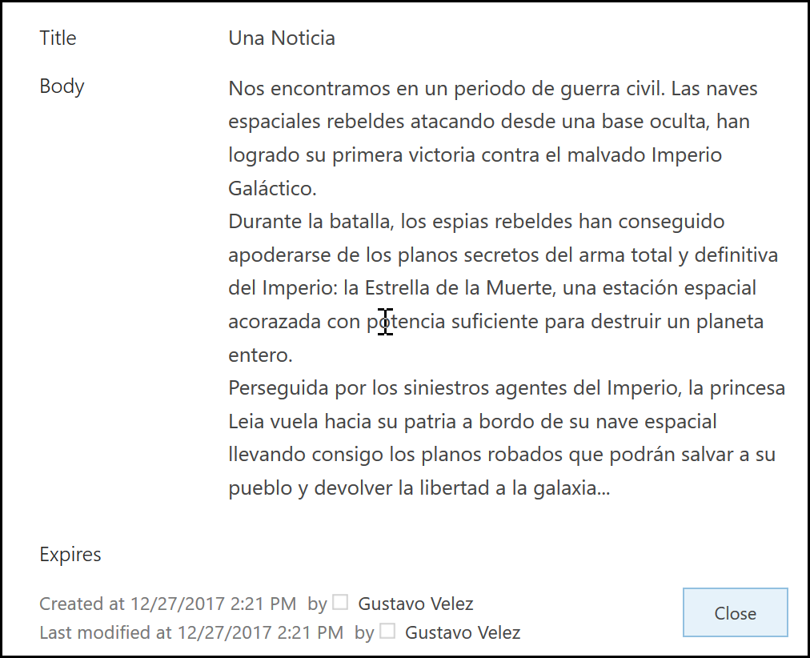

import ArticleHeader from '../../../components/article-header'

<ArticleHeader frontmatter={props.pageContext.frontmatter} />

**Que es el Microsoft Translator API**

El servicio de Traducción de Azure permite, entre otras cosas, traducir textos de un idioma a otro automáticamente, permitiendo integrar textos en múltiples idiomas desde cualquier tipo de aplicación. El servicio forma parte del conjunto de Cognitive Services de Azure, que es una colección de algoritmos de Inteligencia Artificial que se pueden utilizar en la nube de Microsoft.

El servicio de Traducción ha utilizado desde su principio un algoritmo de Traducción Estadística Mecánica (SMT, Statistical Machine Translation), pero como esta plataforma ya ha alcanzado su máximo desarrollo y no es posible mejorarla, Microsoft ha comenzado a utilizar otro tipo de algoritmo basado en Inteligencia Artificial llamado DNN, Deep Neural Networks. El cambio entre los dos algoritmos se esta haciendo incrementalmente, pero los usuarios solamente notaran las mejoras en cuanto a la calidad de las traducciones pues la API de comunicación no cambia. DNN ofrece mejores traducciones porque utiliza el contexto de toda la frase para crear el texto traducido, no solamente el contexto de algunas palabras antes y después de la palabra a traducir.

El Azure Translator API es una herramienta ideal para utilizar en SharePoint: una tarea recurrente en la creación de Portales es poder ofrecer la misma información en varios idiomas simultáneamente. Aunque en este momento la calidad de las traducciones no es totalmente perfecta (y probablemente nunca lo será), el nivel es suficientemente alto como para poder reducir considerablemente los costos de traducción manual ya que los traductores solamente necesitan revisar los textos, no traducirlos desde cero. La calidad de las traducciones varia dependiendo de los idiomas: traducir de un idioma cualquiera al inglés tiene generalmente mucha mas calidad que traducir desde el inglés a otro idioma. También se puede observar que la calidad depende del idioma: lenguajes muy utilizados como el español y francés producen resultados de traducción superiores a idiomas menos usados. En este momento el servicio de traducción soporta 62 idiomas, incluyendo dos dialectos de Klingon, Yucatec Maya y Hmong Daw. Microsoft trabaja constantemente para aumentar el numero de idiomas, pero hay que tener en cuenta que se necesita aproximadamente un millón de palabras en textos originales para entrenar los algoritmos de IA, lo que no facilita el trabajo.

**Configuración del Azure Translator API**

Para utilizar el Translator API es necesario crear primero el servicio en Azure:

1.          Entre al portal de manejo de Azure ( [https://portal.azure.com](https&#58;//portal.azure.com/) ) utilizando sus credenciales.

2.         Vaya a la sección de "Resource Groups" y cree un nuevo Grupo de Recursos (también es posible reutilizar un grupo ya existente).

3.         Cree un servicio de "Translator Text API":

·         En el Resource Group, utilice el botón de "+Add" para crear un recurso, busque por "translator" en la casilla de búsqueda y seleccione "Translator Text API" en los resultados.

·         Asígnele un nombre al servicio y utilice el Grupo de Recursos deseado. En la casilla de "Pricing tier" seleccione un servicio dependiendo de la cantidad de traducciones a esperar por mes, lo que determina el precio del servicio (gratis si se utilizan menos de 2.000.000 de caracteres por mes). Acepte el anuncio de privacidad que aparece en la configuración (Microsoft utilizara los datos enviados para mejorar automáticamente los algoritmos de traducción).​

4  .         Una vez creado el servicio, haga clic sobre su nombre en la lista de recursos del Resource Group, vaya a "Keys" y copie el valor de "Key 1".

**Utilizando el Azure Translation API con SharePoint**

En el siguiente ejemplo se van a utilizar dos Listas de Anuncios de SharePoint en donde el campo de "Body" de un elemento nuevo creado en la Lista en Español será traducido al inglés y utilizado para crear otro anuncio en la Lista de Anuncios en inglés. Cuando se introduce un nuevo elemento en la Lista de Anuncios en español, un WebHook hace que una Función de Azure comience a funcionar, utilice el texto del "Body" para hacer una llamada al Azure Translation API y cree el elemento en la Lista en Ingles.

**Nota:** la creación y configuración de una Función de Azure se puede encontrar el en artículo "SharePoint y Azure – Azure Functions" ( [http://www.compartimoss.com/revistas/numero-30/sharepoint-y-azure-azure-functions](/revistas/numero-30/sharepoint-y-azure-azure-functions) ). La configuración y utilización de WebHooks de SharePoint se puede encontrar en el artículo "Eventos sobre SharePoint Online con Webhooks" ( [http://www.compartimoss.com/revistas/numero-32/eventos-sobre-sharepoint-online-con-webhooks](/revistas/numero-32/eventos-sobre-sharepoint-online-con-webhooks) ).

5  .         Cree una cuenta de Funciones básica en el Grupo de Recursos, asignándole un nombre, Plan de Servicios y cuenta de Azure Storage.

6  .         Utilizando Visual Studio 2017 (o Visual Studio 2016 con el AddIn para programar Funciones de Azure), cree una nueva solución del tipo "Azure Function". Una vez creada la solución, agréguele una Función del tipo "Http Trigger" con derechos de acceso anónimos.

7  .         Agregue a la solución los paquetes NuGet, "AppForSharePointOnlineWebToolkit" y "Newtonsoft.Json".

8  .         Reemplace toda la rutina "Run" con el siguiente código:

[FunctionName("TranslationFunction")]

public static async Task&lt;HttpResponseMessage&gt; Run([HttpTrigger(AuthorizationLevel.Anonymous, "post", Route = null)]HttpRequestMessage req, TraceWriter log)

{

// Registration

string validationToken = req.GetQueryNameValuePairs()

.FirstOrDefault(q =&gt; string.Compare(q.Key, "validationtoken", true) == 0)

.Value;

if (validationToken != null)

{

var myResponse = req.CreateResponse(HttpStatusCode.OK);

myResponse.Content = new StringContent(validationToken);

return myResponse;

}

// Changes

var myContent = await req.Content.ReadAsStringAsync();

var allNotifications = JsonConvert.DeserializeObject&lt;ResponseModel&lt;NotificationModel&gt;&gt;(myContent).Value;

if (allNotifications.Count &gt; 0)

{

foreach (var oneNotification in allNotifications)

{

// Login in SharePoint

string baseUrl = "https://gustavo.sharepoint.com";

string myUserName = "gustavo@gustavo.onmicrosoft.com";

string myPassword = ConfigurationManager.AppSettings["gustavoPW"];

SecureString securePassword = new SecureString();

foreach (char oneChar in myPassword) securePassword.AppendChar(oneChar);

SharePointOnlineCredentials myCredentials = new SharePointOnlineCredentials(myUserName, securePassword);

ClientContext SPClientContext = new ClientContext(baseUrl + oneNotification.SiteUrl);

SPClientContext.Credentials = myCredentials;

// Get the Changes

GetChanges(SPClientContext, oneNotification.Resource, log);

}

}

return new HttpResponseMessage(HttpStatusCode.OK);

}

Esta rutina primero se encarga de hacer el registro del WebHook (si la consulta contiene un parámetro "validationtoken" en el Query String). Después de registrado el WebHook, cada consulta es procesada para extraer las notificaciones que contiene. En cada notificación de la colección de notificaciones se hace un logeo en SharePoint para obtener los cambios detectados en la Lista (por medio de la rutina "GetChanges").

9 .         La rutina "GetChanges" recibe el contexto de SharePoint y el identificador de la Lista, y tiene la forma:

static void GetChanges(ClientContext SPClientContext, string ListId, TraceWriter log)

{

// Get the List

Web spWeb = SPClientContext.Site.RootWeb;

List listaAnunciosES = spWeb.Lists.GetByTitle("AnnouncementsES");

SPClientContext.Load(listaAnunciosES);

List listaAnunciosEN = spWeb.Lists.GetByTitle("AnnouncementsEN");

SPClientContext.Load(listaAnunciosEN);

SPClientContext.ExecuteQuery();

// Create the ChangeToken and Change Query

ChangeToken lastChangeToken = new ChangeToken();

lastChangeToken.StringValue = string.Format("1;3;{0};{1};-1", ListId, DateTime.Now.AddMinutes(-1).ToUniversalTime().Ticks.ToString());

ChangeToken newChangeToken = new ChangeToken();

newChangeToken.StringValue = string.Format("1;3;{0};{1};-1", ListId, DateTime.Now.ToUniversalTime().Ticks.ToString());

ChangeQuery myChangeQuery = new ChangeQuery(false, false);

myChangeQuery.Item = true;  // Get only Item changes

myChangeQuery.Add = true;   // Get only the new Items

myChangeQuery.ChangeTokenStart = lastChangeToken;

myChangeQuery.ChangeTokenEnd = newChangeToken;

// Get all the Changes

var allChanges = listaAnunciosES.GetChanges(myChangeQuery);

SPClientContext.Load(allChanges);

SPClientContext.ExecuteQuery();

foreach (Change oneChange in allChanges)

{

if (oneChange is ChangeItem)

{

// Get what is changed

ListItem anuncioES = listaAnunciosES.GetItemById((oneChange as ChangeItem).ItemId);

SPClientContext.Load(anuncioES);

SPClientContext.ExecuteQuery();

string textoParaTraducir = anuncioES["Body"].ToString().Replace("\"", "'");

string lenguajeDe = "es";

string lenguajeA = "en";

string apiKey = ConfigurationManager.AppSettings["apiKey"];

string textoTraducido = getTraduccion(textoParaTraducir, lenguajeDe, lenguajeA, apiKey);

// Insert the values in the EN List

ListItemCreationInformation newAnuncioENInfo = new ListItemCreationInformation();

ListItem anuncioEN = listaAnunciosEN.AddItem(newAnuncioENInfo);

anuncioEN["Title"] = anuncioES["Title"];

anuncioEN["Body"] = textoTraducido;

anuncioEN.Update();

SPClientContext.ExecuteQuery();

}

}

}

Primero se crean dos objetos que contienen las Listas de Anuncios de SharePoint. Luego se crea una consulta de cambio (variable "myChangeQuery") que especifica que se requieren los cambios ocurridos en el ultimo minuto, que ocurren en elementos de la Lista y que sean del tipo "Add", es decir, elementos nuevos. Luego de ejecutar la consulta, se examina cada uno de los cambios y se obtiene un objeto con el Anuncio agregado (el que contiene, a su vez, el texto del "Body").

En la misma rutina se llama a la rutina "getTraduccion", la que se encarga de hacer la consulta en Azure para traducir el texto, utilizando como parámetros de entrada el texto a traducir, el idioma de origen, el idioma de destino y la llave obtenida en el punto 4. Cuando ya se ha obtenido el texto traducido, se crea un nuevo elemento en la Lista de Anuncios en inglés.

10  .         La rutina "getTraduccion" recibe como parámetros de entrada el texto a traducir, los idiomas de origen y de destino y la clave del servicio de Traducción:

static string getTraduccion(string TextoParaTraducir, string LenguajeDe, string LenguajeA, string ApiKey)

{

string txtTraducido = string.Empty;

AzureAuthToken authTokenSource = new AzureAuthToken(ApiKey.Trim());

string authToken = authTokenSource.GetAccessTokenAsync().Result;

string uriTraduccion = "https://api.microsofttranslator.com/v2/Http.svc/Translate?text=" +

HttpUtility.UrlEncode(TextoParaTraducir) +

"&from=" + LenguajeDe + "&to=" + LenguajeA;

HttpWebRequest httpWebRequest = (HttpWebRequest)WebRequest.Create(uriTraduccion);

httpWebRequest.Headers.Add("Authorization", authToken);

using (WebResponse myResponse = httpWebRequest.GetResponse())

using (Stream stream = myResponse.GetResponseStream())

{

DataContractSerializer mySerializer = new DataContractSerializer(Type.GetType("System.String"));

txtTraducido = (string)mySerializer.ReadObject(stream);

}

return txtTraducido;

}

Cada consulta al Translation API se realiza por medio de una llamada REST a un URL pre-especificado del servicio de Traducción, utilizando como parámetros los dos valores de los idiomas y el texto a traducir. En este caso se está utilizando el método "Translate" en la llamada REST, pero existen otros 12 métodos que se pueden utilizar, incluyendo métodos para traducir no un texto solo sino también un array de textos en una sola llamada, detectar el idioma original, enumerar los idiomas que se pueden utilizar y separar palabras en un texto completo.

Esta rutina llama inicialmente el método "GetAccessTokenAsync" de la clase "AzureAuthToken" para obtener el token de acceso al servicio de traducción utilizando la llave obtenida al momento de configuración descrito en el punto 4. Esta clase tiene un método sincrónico y otro asincrónico para obtener el token, pero Microsoft especifica que es preferible utilizar el método asincrónico. La clase ha sido creada por Microsoft, se puede encontrar en la información de Azure y tiene la forma:

using System;

using System.Net;

using System.Net.Http;

using System.Threading.Tasks;

namespace TranslationFunction

{

/// &lt;summary&gt;

/// Client to call Cognitive Services Azure Auth Token service in order to get an access token.

/// Exposes asynchronous as well as synchronous methods.

/// &lt;/summary&gt;

public class AzureAuthToken

{

/// URL of the token service

private static readonly Uri ServiceUrl = new Uri("https://api.cognitive.microsoft.com/sts/v1.0/issueToken");

/// Name of header used to pass the subscription key to the token service

private const string OcpApimSubscriptionKeyHeader = "Ocp-Apim-Subscription-Key";

/// After obtaining a valid token, this class will cache it for this duration.

/// Use a duration of 5 minutes, which is less than the actual token lifetime of 10 minutes.

private static readonly TimeSpan TokenCacheDuration = new TimeSpan(0, 5, 0);

/// Cache the value of the last valid token obtained from the token service.

private string \_storedTokenValue = string.Empty;

/// When the last valid token was obtained.

private DateTime \_storedTokenTime = DateTime.MinValue;

/// Gets the subscription key.

public string SubscriptionKey { get; }

/// Gets the HTTP status code for the most recent request to the token service.

public HttpStatusCode RequestStatusCode { get; private set; }

/// &lt;summary&gt;

/// Creates a client to obtain an access token.

/// &lt;/summary&gt;

/// &lt;param name="key"&gt;Subscription key to use to get an authentication token.&lt;/param&gt;

public AzureAuthToken(string key)

{

if (string.IsNullOrEmpty(key))

{

throw new ArgumentNullException(nameof(key), "A subscription key is required");

}

this.SubscriptionKey = key;

this.RequestStatusCode = HttpStatusCode.InternalServerError;

}

/// &lt;summary&gt;

/// Gets a token for the specified subscription.

/// &lt;/summary&gt;

/// &lt;returns&gt;The encoded JWT token prefixed with the string "Bearer ".&lt;/returns&gt;

/// &lt;remarks&gt;

/// This method uses a cache to limit the number of request to the token service.

/// A fresh token can be re-used during its lifetime of 10 minutes. After a successful

/// request to the token service, this method caches the access token. Subsequent

/// invocations of the method return the cached token for the next 5 minutes. After

/// 5 minutes, a new token is fetched from the token service and the cache is updated.

/// &lt;/remarks&gt;

public async Task&lt;string&gt; GetAccessTokenAsync()

{

if (string.IsNullOrWhiteSpace(this.SubscriptionKey))

{

return string.Empty;

}

// Re-use the cached token if there is one.

if ((DateTime.Now - \_storedTokenTime) &lt; TokenCacheDuration)

{

return \_storedTokenValue;

}

using (var client = new HttpClient())

using (var request = new HttpRequestMessage())

{

request.Method = HttpMethod.Post;

request.RequestUri = ServiceUrl;

request.Content = new StringContent(string.Empty);

request.Headers.TryAddWithoutValidation(OcpApimSubscriptionKeyHeader, this.SubscriptionKey);

client.Timeout = TimeSpan.FromSeconds(2);

var response = await client.SendAsync(request);

this.RequestStatusCode = response.StatusCode;

response.EnsureSuccessStatusCode();

var token = await response.Content.ReadAsStringAsync();

\_storedTokenTime = DateTime.Now;

\_storedTokenValue = "Bearer " + token;

return \_storedTokenValue;

}

}

/// &lt;summary&gt;

/// Gets a token for the specified subscription. Synchronous version.

/// Use of async version preferred

/// &lt;/summary&gt;

/// &lt;returns&gt;The encoded JWT token prefixed with the string "Bearer ".&lt;/returns&gt;

/// &lt;remarks&gt;

/// This method uses a cache to limit the number of request to the token service.

/// A fresh token can be re-used during its lifetime of 10 minutes. After a successful

/// request to the token service, this method caches the access token. Subsequent

/// invocations of the method return the cached token for the next 5 minutes. After

/// 5 minutes, a new token is fetched from the token service and the cache is updated.

/// &lt;/remarks&gt;

public string GetAccessToken()

{

// Re-use the cached token if there is one.

if ((DateTime.Now - \_storedTokenTime) &lt; TokenCacheDuration)

{

return \_storedTokenValue;

}

string accessToken = null;

var task = Task.Run(async () =&gt;

{

accessToken = await this.GetAccessTokenAsync();

});

while (!task.IsCompleted)

{

System.Threading.Thread.Yield();

}

if (task.IsFaulted)

{

throw task.Exception;

}

if (task.IsCanceled)

{

throw new Exception("Timeout obtaining access token.");

}

return accessToken;

}

}

}

11  .          Otras tres clases definen objetos utilizados por el WebHook:

public class ResponseModel&lt;T&gt;

{

[JsonProperty(PropertyName = "value")]

public List&lt;T&gt; Value { get; set; }

}

public class NotificationModel

{

[JsonProperty(PropertyName = "subscriptionId")]

public string SubscriptionId { get; set; }

[JsonProperty(PropertyName = "clientState")]

public string ClientState { get; set; }

[JsonProperty(PropertyName = "expirationDateTime")]

public DateTime ExpirationDateTime { get; set; }

[JsonProperty(PropertyName = "resource")]

public string Resource { get; set; }

[JsonProperty(PropertyName = "tenantId")]

public string TenantId { get; set; }

[JsonProperty(PropertyName = "siteUrl")]

public string SiteUrl { get; set; }

[JsonProperty(PropertyName = "webId")]

public string WebId { get; set; }

}

public class SubscriptionModel

{

[JsonProperty(NullValueHandling = NullValueHandling.Ignore)]

public string Id { get; set; }

[JsonProperty(PropertyName = "clientState", NullValueHandling = NullValueHandling.Ignore)]

public string ClientState { get; set; }

[JsonProperty(PropertyName = "expirationDateTime")]

public DateTime ExpirationDateTime { get; set; }

[JsonProperty(PropertyName = "notificationUrl")]

public string NotificationUrl { get; set; }

[JsonProperty(PropertyName = "resource", NullValueHandling = NullValueHandling.Ignore)]

public string Resource { get; set; }

}​

12 .         Registre el WebHook en la Lista de Anuncios en español (utilizando Postman, por ejemplo, como se indica en el artículo mencionado al principio del artículo) y cree un anuncio nuevo en la Lista. El WebHook hará que la Función realice su trabajo, traduzca el texto, y cree un nuevo Anuncio en la Lista de Anuncios en inglés:

**Conclusiones**

El servicio de Traducción de Texto de Azure puede llegar a ser una herramienta muy valiosa en SharePoint, especialmente en lo que se refiere a la creación de contenido traducido automáticamente a diferentes idiomas. El Azure Translation API es fácil de utilizar desde cualquiera lenguaje de programación, y produce resultados confiables rápida y seguramente. El API utiliza algoritmos de Inteligencia Artificial que se mejoran con el uso, por lo no es necesario crear ni entrenar algoritmos propios.

**Gustavo Velez**
 MVP Office Servers and Services
 gustavo@gavd.net
 http://www.gavd.net

