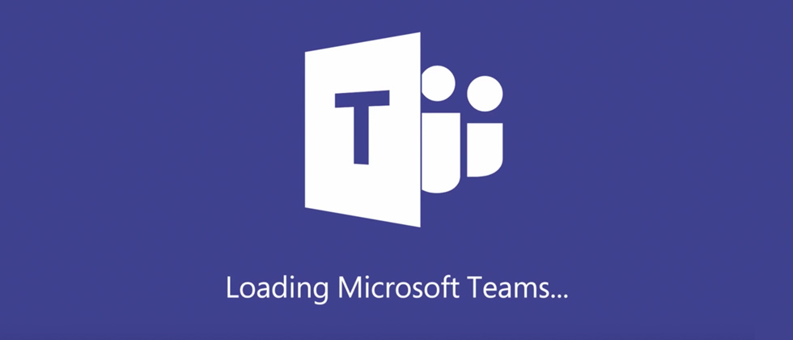
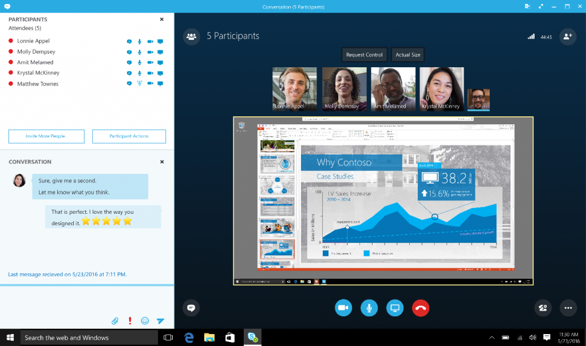

Desde las primeras aproximaciones de Microsoft a las comunicaciones en tiempo real, se ha intentado cubrir todas las necesidades que pudiera requerir el ámbito empresarial. Naciendo con un chat y presencia, hasta ir agregando todas esas funcionalidades que tanto apreciamos (o tal vez no tanto) de nuestro Skype for Business.

Pero para decirle adiós primero tendríamos que entender desde donde vino y con ello entender porque se va.

¿Quién escucho de LCS? ¿y de OCS? ¿Y muchos más ya están familiarizados con Lync y Skype for Business… pero que tienen en común todas estas herramientas? (el nombre no es algo que compartan) Todos ellos han sido evoluciones de un mismo producto (Communication Server) de Microsoft, si bien el re-branding no ha sido del todo acertado, lo que si lo ha sido es la funcionalidad que va agregando versión tras versión. No solo es cambiarle el nombre y el look-and-feel, sino que realmente iban agregando valor al pasar de una versión a otra, y no solo para mantenerte actualizado.

Entonces estamos hablando que desde LCS 2003 hasta la versión SFB 2015 se ha venido evolucionando un producto, hasta el cliente que tenemos hoy en día. Pero ya han pasado 3 años desde la última versión. También estamos en la revolución de la nube, en la lucha por los XaaS (X as a Service) , serverless, cloud cloud cloud, etc.

Si toda la infraestructura ha ido evolucionando, y llevándonos a soluciones que anteriormente no se veían prometedoras. ¿Las comunicaciones tendrían que mantenerse tal y como son hoy en día?

Si bien varios aun desean tener todo por escrito en un correo, los mensajes instantáneos y las llamadas lograron quitarle un poco el trabajo a todo ese engorroso trabajo de redactar un correo para pedir una autorización, para pedir un Vo.Bo.

La comunicación unilateral no tenía más futuro, necesitábamos colaborar y comunicarnos todos.

También esto fue debido a un cambio generacional, la mentalidad va cambiando de acuerdo a la generación en la que crecimos y nos desarrollamos, lo podemos ver simplemente en el hogar, con algo tan sencillo como la música de nuestros padres, la nuestra y la de nuestros hijos, cada generación tiene diferente foco, diferentes necesidades. Pues todas estas mentalidades también se ven reflejadas en las empresas.

La brecha generacional también va cambiando las necesidades tecnológicas y va requiriendo que la tecnología se adapte.

Ahora estamos en una sociedad móvil, una sociedad conectada a Internet para todo. Para las compras, para el clima, para la TV, para ver a los niños por streaming en la escuela. Con redes sociales para pedir un transporte, para pedir alimentos, para felicitar a la tía que no vemos desde quien sabe cuánto tiempo.

Era de esperarse que no tardara mucho en socializar el entorno empresarial. Se tuvieron sus primeros intentos con Yammer (servicio que en lo personal no todos usan) y pues empezaron a salir los primeros en establecer una nueva forma de comunicación (Slack, Spark).

Y es en este punto donde “nace” Teams, ¿y porque hago énfasis en “nace”?  porque Teams llega con la idea de una nueva forma de comunicación, pero tomando como base toda la experiencia que se tiene de la familia de Communication Server, entonces Teams no empieza de cero, al contrario, Teams tiene toda la parte de comunicación en tiempo real cubierta.

Presencia, IM, Conferencias, Audio, Video, Movilidad, Multiplataforma, Integración con otros servicios (aun en roadmap).

Tiene mas de 10 años de experiencia en este ámbito, sumándole todas estas nuevas funcionalidades de crear teams, agregar aplicaciones, tabs, menciones, GIF’s, Memes …. Si, aunque parezcan cosas sin importancia son el “toque” especial de la nueva generación …

Si bien se ha tratado de que los clientes de la familia CS sean amigables al usuario, Microsoft Teams puede ser visto como un entorno mas sociable, menos rígido, donde tenias que estar en completo control de que no dijeras una palabra de más y no pongas un punto donde no va.

Esta comunicación es mas informal, mas espontanea (OJO nunca he dicho que deja de ser una herramienta empresarial, y debe siempre de ser utilizada de manera respetuosa y responsable) una comunicación que los usuarios llevan en el día a día en otras plataformas.

Pasamos a las comunicaciones inteligentes, comunicaciones que no son solamente “unificadas” sino que son colaborativas, son incluyentes e innovadoras. Cuanto trabajo no nos simplifica el uso de bots, cuando trabajo nos simplifica el tener las herramientas en una sola interfaz y poder compartirla y colaborar con todo el equipo de trabajo. Hacer mención para que pongan foco en la conversación, adjuntar ahí mismo el documento y trabajar directamente sobre el, etc.

En conclusión, Skype morirá (en su momento) pero para dejar paso a una tecnología con Skype en su ADN. Así que, amigos lectores, por ahora pueden estar tranquilos de que su servicio de Skype aun es funcional, pero la recomendación es que empiecen a adoptar Microsoft Teams para algunos casos de uso particulares, y poco a poco vayan conociendo sus bondades.

Espero que esto les sea de ayuda y si desean saber mas de lo que viene para Skype y MS Teams, síganme en mis redes sociales y únanse al único User Group en Espanol de Skype & Teams.

**Rodolfo Castro Aguilar**

MVP Office Server and Services

Twitter : @ucblogmx

facebook.com/groups/SkypeTeamsUG/

ucblogmx.com ​

 
 
import LayoutNumber from '../../../components/layout-article'
export default LayoutNumber
