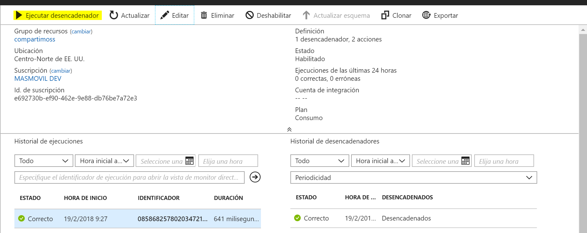

Durante muchos años los modelos relacionales han sido el pan nuestro de cada día, y alrededor de ellos se han ido incorporando infinidad de procesos para poder tanto insertar como extraer datos de forma sencilla. Hablamos de las famosas ETL, los servicios de Reporting, los Jobs de nuestros SQL Server, procedimientos almacenados y como no nuestros queridos Trigger.

Los años han pasado, las arquitecturas han cambiado, pero no las necesidades de saber si un evento se ha producido sobre nuestros datos, esa necesidad de controlar los cambios no ha desaparecido, pero por suerte si han evolucionado las técnicas.

**¿Qué entendemos por Trigger serverless?**

Actualmente y no solo en el mundo de la tecnología, tenemos la necesidad de “imponer” nombres a cosas que antes dábamos por supuestas. Esto genera un fenómeno de novedad, que a veces asusta, ya que por ejemplo conceptos como DevOps, ALM o Serverless no son tan novedosos como el mercado pinta, ya que en menor o mayor medida todo desarrollador o arquitecto serio ya los aplicaba en la fase de diseño e implementación de sus aplicaciones.

Me voy a centrar en “***definir” a mi manera*** lo que entiendo como **Trigger serverless,**ya que es muy importante que todos entendamos lo mismo para luego darle el mismo uso.

Para mí el **serverless**en general (ya sea una arquitectura, un evento o un proceso) me lleva en primera instancia a pensar en un sistema en el cual no **nos tiene que preocupar** la parte de **infraestructura** del mismo, que no sabemos donde se aloja, sobre que maquinas se ejecuta, y que tipo de hardware necesita, *simplemente funciona y funciona* como nosotros queremos. 
 
 Pero como soy un romántico, esto sería muy sencillo y poco clasificatorio en mi opinión, por lo que a mí me gusta pensar que serverless es la definición de un sistema del cual **no sabemos** sus **límites de escalado**, **volúmenes de ejecución** por minuto ni **numero de usuarios** que lo van a consumir, y aun así estoy 100% tranquilo de que **va a funcionar un 99,99% de las veces**.

Por tanto, uniendo todo un poco, para mi un evento serverless, es un evento que *se produce bajo un cambio en un sistema X y se ejecuta sobre un proceso muy potente en un sistema serverless Y*.

**Conectando tu CosmosDB con Azure Function**

En Azure si hablamos de servicio de base de datos no relacional sin duda debemos pensar en Cosmos DB, que nos permite entre otros muchos modelos crear una un Cosmos DB SQL, que no es más que el antiguo Document DB pero que permite realizar consultas SQL sobre nuestras colecciones de documentos. Por otro lado, el mayor exponente de un servicio serverless en Azure son las Azure Functions, y como es de esperar es muy sencillo conectar una Comos DB Document DB API a un Azure Functions sin tener que desarrollar nada de inicio.

Lo primero vamos a crear una Azure Functions en blanco y la vamos a llamar compartimossFunctions. Accedemos a nuestra suscripción de Azure y seleccionamos y creamos una nueva Azure Functions tal y como se ve en la imagen.

En mi caso he elegido un plan por consumo, pero es indiferente para el ejemplo.

Una vez creado el servicio de Azure Function CompartimossFunctions, si ya tenemos creada una collection de Document DB o SQL API (como se puede ver en este [ejemplo](https&#58;//docs.microsoft.com/es-es/azure/cosmos-db/create-sql-api-dotnet) ), debemos acceder a nuestro servicio de SQL API , y en el menú generar seleccionamos “Agregar Función de Azure”.

Como se ve en la figura anterior, en mi servicio he creado una collection CompartimossCollection. Debemos seleccionar la colección sobre la que vamos a crear el evento, la functions que hemos creado en el paso anterior, y por último el lenguaje.

En cuanto termine el proceso de creación que es instantáneo, se nos redirige a la functions CompartimossFunction que hemos enlazado. Podemos comprobar que se ha creado una función nueva “compartimossCollectionTrigger”, con el siguiente código de ejemplo:

#r "Microsoft.Azure.Documents.Client"

using Microsoft.Azure.Documents;

using System.Collections.Generic;

using System;

public static async Task Run(IReadOnlyList&lt;Document&gt; input, TraceWriter log)

{

log.Verbose("Document count " + input.Count);

log.Verbose("First document Id " + input[0].Id);

}

Además, se ha creado un trigger, que vincula a nuestra colección de CosmosDB con nuestra functions. La ventaja de hacer este ejemplo así es que nos evitamos tener que configurar las conexiones de nuestro trigger de forma manual desde el Azure Functions.
  Para testear que todo funciona correctamente, deberemos acceder al explorador de datos de nuestro Cosmos, y añadir un documento nuevo a nuestra colección. 
 
 

Si accedemos a “supervisar” nuestra función veremos que se ha ejecutado correctamente y ha dejado traza de la subida del documento.

Este proceso se podría hacer tanto desde la propia creación de la función, como desde Visual Studio, teniendo el mismo resultado. Aunque para el api de SQL funciona correctamente usando colecciones de documentos, no podemos decir lo mismo para por ejemplo un TABLE API, ya que el código C# generado de ejemplo no funciona correctamente, teniendo que adaptarlo para soporta un **CosmosDB Trigger.**

**Logic App, la opción “no code” para Jobs de integración**

Para el que no conozca lo que es una Logic App, se puede resumir como un servicio de Azure PaaS que nos permite diseñar workflows con una interfaz muy potente, y mediante conectores y llamadas a servicios realizar procesos de integración entre diferentes sistemas.

Hoy en día Logic App no tiene un desencadenador o un trigger por defecto contra CosmosDB, pero si tenemos un conector que nos permite entre otras cosas manipular documentos de nuestras colecciones.  Por eso podríamos definir un proceso que integre nuestro CosmosDB SQL del ejemplo anterior, con cualquier otro sistema como un Sharepoint o un Dynamics entre otros.

Vamos a ver un ejemplo de cómo obtener todos los documentos de una colección de Cosmos DB.

Para ello vamos a seguir los siguientes pasos:

1.         Elegimos como desencadenador una **periodicidad** de 3 minutos.

2.         Añadimos una nueva acción **“ComosDB” para consultar un documento**:

a.         Nos pedirá que creemos una nueva **conexión** como se ve en la siguiente imagen.

​

b  .         Una vez configurada la conexión seleccionamos la acción **“Consultar documentos de CosmosDB”**, y configuramos la acción según la imagen.​

​

> > c  .         Para poder mapear la consulta a una estructura JSON utilizamos la acción **REDACTAR** que nos permite mapear el cuerpo de la consulta a una estructura más legible. Quedando un flujo como el siguiente:

Si guardamos el flujo, y seleccionamos ejecutar, veremos el resultado de la ejecución y en concreto obtendremos todos los documentos de la colección.

Entrando en el detalle de la ejecución, podemos ver los resultados de cada Acción o Paso, y en concreto investigar el contenido de nuestra estructura JSON de resultado.

**¿Cómo se produce el evento?: Fuente de cambios**

Hemos visto un par de ejemplos de cómo integrarnos con nuestro servicio de Cosmos DB, permitiendo extender nuestra base de datos no relacional con procesos serverless, dotando de potencia a nuestras aplicaciones. Pero si recordamos con Azure Functions si hemos podido crear un evento y suscribirnos por así decirlo a nuestro Cosmos DB pero con nuestro workflow en Logic App no, ¿Esto por qué sucede?

A día de hoy el sistema que queremos sincronizar con el servicio de CosmosDB debe ser "compatible" con la llamada Fuente de Cambios. La fuente de cambios guarda cada uno de los cambios de nuestros documentos, de forma ordenada y se pueden procesar de forma asíncrona. Los cambios están disponibles para cada intervalo de claves de partición dentro de una colección de documentos.

Si observamos el anterior diagrama, para Azure Functions si existe un trigger desde la Fuente de Cambios, y es la propia fuente la que realiza una llamada a nuestra función cuando un documento es modificado o insertado.

**Mejorando el pasado, disfrutando el presente, en busca del futuro**

Hemos oído muchas veces que plagar de procedimientos almacenados, o de triggers nuestras bases de datos era peligroso o incluso una muy mala práctica.

Esto provocó que viviésemos durante años peleados con servicios de integración y de reporting, que eran difíciles de implementar y por si fuera poco aun más de monitorizar.

Bueno, pues el presente es evidente que nos permite recuperar esos trabajos de integración y de extracción, incluso añadir lógica de negocio a nuestros datos, sin necesidad de hacer aplicaciones complejas, con estos pequeños procesos serverless que ya Azure nos proporciona podemos crear aplicaciones complejas y sobre todo asegurando una performance muy alta.

¿Dónde está el futuro?, en mi opinión orquestando estos eventos, teniendo control de tus datos y de sus procesos, uniendo estas piezas para crear una verdadera arquitectura serverless a prueba de bombas.

**Sergio Hernández Mancebo**

Principal Team Leader en Encamina

@shmancebo​

