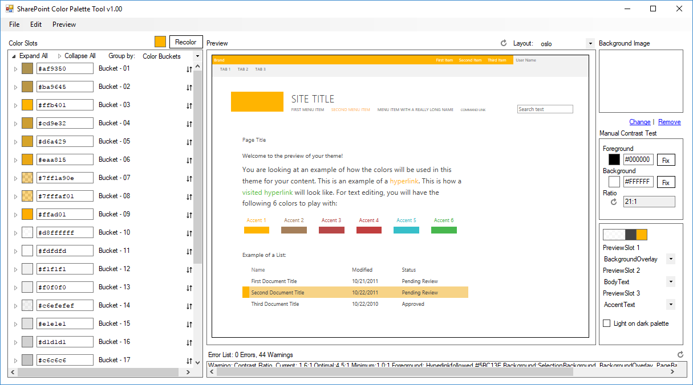
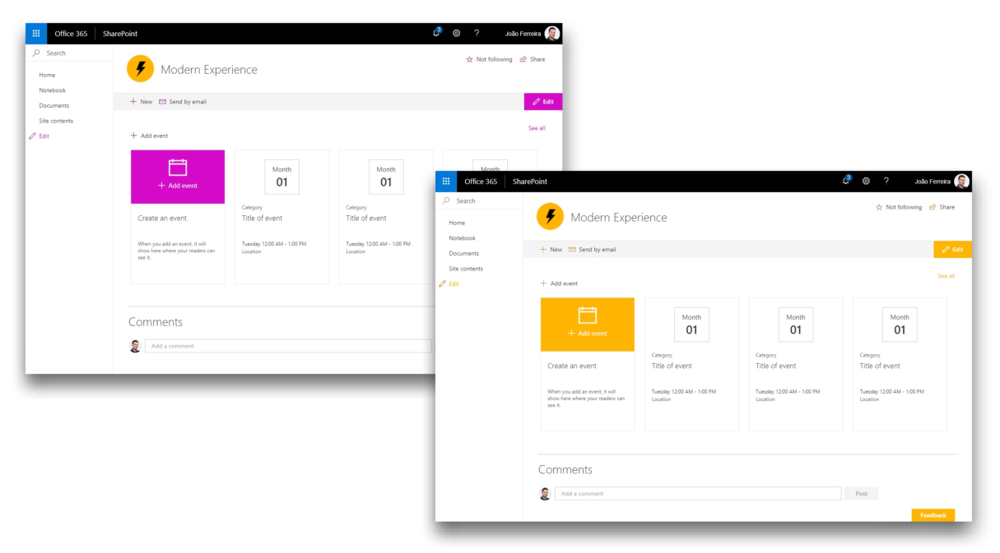
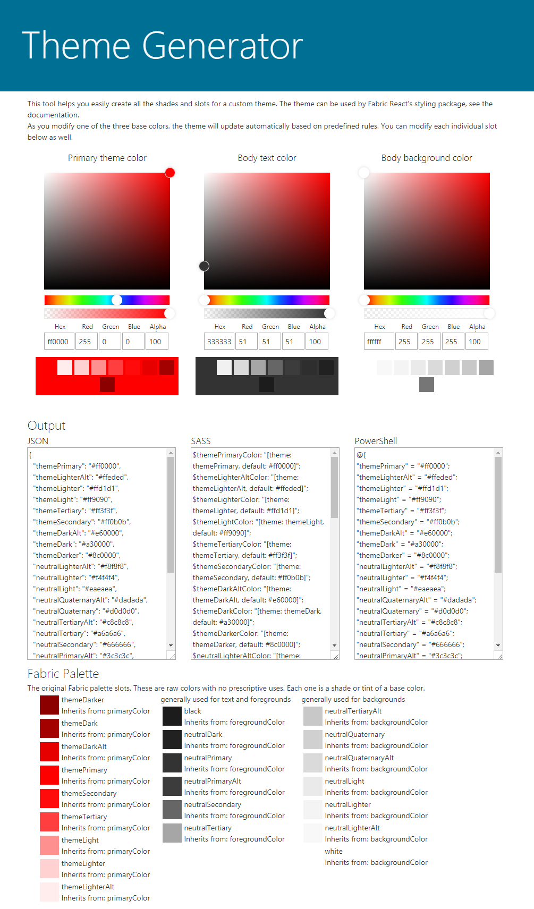
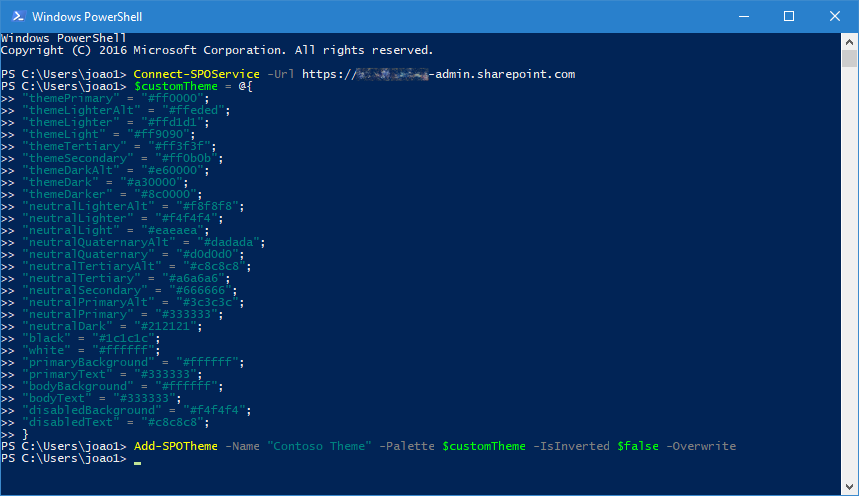
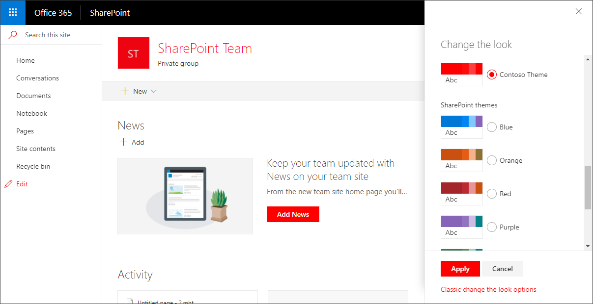

SharePoint modern experience is available for Lists, Document Libraries and Pages and while it delivers new functionalities to the end users it lacks some of the customization options available in the classic SharePoint.

The modern experience is provided with a theme that is responsible to format the colours of the elements in the page. On modern site collections like team and communication sites there’s a native interface that allows the administrator to select the theme, but on classic site collections things are a little bit different and the modern experience will receive a random color applied automatically.

**Requirements**

To achieve the steps described in this article you will need to install the [SharePoint Color Pallet Tool](https://www.microsoft.com/en-us/download/details.aspx?id=38182),
[SharePoint PnP PowerShell](https://msdn.microsoft.com/en-us/pnp_powershell/pnp-powershell-overview)and [SharePoint Online Management Shell](https://www.microsoft.com/en-us/download/details.aspx?id=35588). SharePoint Color Pallet Tool provides the color palette functionality to use with SharePoint designs. SharePoint PnP PowerShell and SharePoint Online Management Shell provide a set of commands that allows you to perform complex operations towards SharePoint simplifying the process using PowerShell.

**How to change the color of SharePoint modern experience within a classic site collection**

To change the color of SharePoint modern experience within a classic site collection just follow bellow steps:

1. Open      the SharePoint Color Pallet Tool.
2. Click      on the color tile next to the Recolor button.
3. Introduce      your main color for the theme, it needs to be provided in RGB.
4. Click Recolor, modify the individual color slots      as needed.​




1. Go      to File and Save the color scheme.
2. Copy      or [download](http://handsontek.net/Downloads/ApplyNewColorSiteCollection.zip) the PowerShell script bellow.


```
1.   cls
```

```
2.   $themeName = "Yellow"
```

```
3.    
```

```
4.   #URL of the site collection
```

```
5.   $targetSiteCollection = "https://contoso.sharepoint.com/"
```

```
6.    
```

```
7.   #Path of the source folder containing your color file (ends with \)
```

```
8.   $filePath = "C:\path\to\file\"
```

```
9.    
```

```
10. #File name including extension
```

```
11. $fileName = "yellow.spcolor"
```

```
12.  
```

```
13. #Autenticate on SharePoint Online site collection, credentials might be requested
```

```
14. Connect-PnPOnline -UseWebLogin -Url $targetSiteCollection
```

```
15.  
```

```
16. #Get the relatative url of the site collection 
```

```
17. $relativeWebUrl = Get-PnPWeb
```

```
18. $relativeWebUrl = $relativeWebUrl.ServerRelativeUrl
```

```
19.  
```

```
20. #Path to the theme gallery
```

```
21. $targetDir = "/_catalogs/theme/15"
```

```
22.  
```

```
23. #Upload the theme file to the themes library
```

```
24. Add-PnPFile -Path ($filePath+$fileName) -Folder $targetDir
```

```
25.  
```

```
26. #Register the theme on the Composed Looks list
```

```
27. Add-PnPListItem -List "Composed Looks" -ContentType "Item" -Values @{"Title"=$themeName; "Name"=$themeName; "MasterPageUrl"=$relativeWebUrl+"/_catalogs/masterpage/seattle.master, "+$relativeWebUrl+"/_catalogs/masterpage/seattle.master"; "ThemeUrl"=$relativeWebUrl+"/_catalogs/theme/15/"+$fileName+", "+$relativeWebUrl+"/_catalogs/theme/15/"+$fileName+""; "DisplayOrder"="1"}
```

```
28.  
```

```
29. #Reset all sites in the site collection to use the uploaded theme
```

```
30. $pathToColorFile = $relativeWebUrl+"/_catalogs/theme/15/"+$fileName
```

```
31. write-host "Applying the theme..."
```

```
32. Set-PnPTheme -ColorPaletteUrl $pathToColorFile -ResetSubwebsToInherit
```

```
33.  
```

1. Modify      the variables $themeName, $targetSiteCollection and $filePath to reflect your      values
      The script automates the following tasks:


    - Upload the color file to the Theme library.
    - Register the theme on the Composed Looks list.
    - Apply the theme to all the sites of the site collection.
1. Execute      the script on the PowerShell console e.g.      ./ApplyNewColorSiteCollection.ps1.
2. If      requested authenticate on SharePoint Online.


The process might take a few minutes depending of the number of sites you have in your site collection; the theme will be applied to all the existent sites but unfortunately it will not be applied to sites created after the execution of the script.​



**How to change the color of SharePoint modern Team and Communication sites**

If you are using exclusively modern team or communication sites, Microsoft as a solution that will allow you to pick a theme from a graphical user interface, the new theming experience allow site owners to apply themes to all modern pages in the site collection, to deliver new engaging and familiar looks.

By default, there are 8 themes available but you as an Administrator can create and deploy yours. To create the color themes Microsoft provides the Theme Generator, an online tool that generates the color palette to be deployed in the tenant.

In the tool you will be able to introduce the primary theme color, body text color and body background color. The Fabric palette is generated in three formats, JSON, SASS and PowerShell, as an Admin you will need to use the PowerShell version.

1. Open      the [Theme      Generator](https://developer.microsoft.com/en-us/fabric#/styles/themegenerator).
2. Define your      colors.
3. Save the      PowerShell version of the schema.​




**Deploy the theme**

To deploy new SharePoint themes, you will need to use the [SharePoint Online Management Shell](https://www.microsoft.com/en-us/download/details.aspx?id=35588), and you will need to be a SharePoint Admin.

1. To      connect to your SharePoint Online environment open PowerSh​ell and execute      the command:


```
1.   Connect-SPOService -Url https://contoso-admin.sharepoint.com
```

1. In      the console create a PowerShell variable with the generated ​​color pallet.


```
1.   $customTheme = @{
```

```
2.   "themePrimary" = "#ff0000";
```

```
3.   "themeLighterAlt" = "#ffeded";
```

```
4.   "themeLighter" = "#ffd1d1";
```

```
5.   "themeLight" = "#ff9090";
```

```
6.   "themeTertiary" = "#ff3f3f";
```

```
7.   "themeSecondary" = "#ff0b0b";
```

```
8.   "themeDarkAlt" = "#e60000";
```

```
9.   "themeDark" = "#a30000";
```

```
10. "themeDarker" = "#8c0000";
```

```
11. "neutralLighterAlt" = "#f8f8f8";
```

```
12. "neutralLighter" = "#f4f4f4";
```

```
13. "neutralLight" = "#eaeaea";
```

```
14. "neutralQuaternaryAlt" = "#dadada";
```

```
15. "neutralQuaternary" = "#d0d0d0";
```

```
16. "neutralTertiaryAlt" = "#c8c8c8";
```

```
17. "neutralTertiary" = "#a6a6a6";
```

```
18. "neutralSecondary" = "#666666";
```

```
19. "neutralPrimaryAlt" = "#3c3c3c";
```

```
20. "neutralPrimary" = "#333333";
```

```
21. "neutralDark" = "#212121";
```

```
22. "black" = "#1c1c1c";
```

```
23. "white" = "#ffffff";
```

```
24. "primaryBackground" = "#ffffff";
```

```
25. "primaryText" = "#333333";
```

```
26. "bodyBackground" = "#ffffff";
```

```
27. "bodyText" = "#333333";
```

```
28. "disabledBackground" = "#f4f4f4";
```

```
29. "disabledText" = "#c8c8c8";
```

```
30. }
```

1. To      deploy the theme run the command below, define the custo​​m Name that will      be visible on SharePoint online and in the Palette argument reference the      variable created on step #2


```
1.   Add-SPOTheme -Name "Contoso Theme" -Palette $customTheme -IsInverted $false -Overwrite​
```



1. To      validate if the theme was successfully​​ deployed run the command below and      validate if it is listed


```
1.   Get-SPOTheme
```


**Apply the theme**

To apply the theme deployed:

1. Open your      modern site and click on the cog icon.
2. Click on      Change the Look.
3. Select your custom theme and click Apply.​




**Conclusion**

There are several ways to apply a consistent branding to SharePoint sites depending the version and type of sites used but with the methods explained in this article you will be able to automate the process and maintain your intranet with a same look and feel across multiple site collections.

Note: When compared with the classic themes, the modern version will only change the colors, the option to change the font and the background image is only available to the classic themes.


João Ferreira

SharePoint developer | BindTuning​

 
 
import LayoutNumber from '../../../components/layout-article'
export default LayoutNumber
