Cuando una empresa desarrolla una aplicación para sus clientes, externos a su organización, uno de los puntos claves es el desarrollo que permitirá el acceso a esta aplicación. ¿Qué puntos se deben tener en cuenta?

·       Permitir varios proveedores de identidad:

o   Registro.

o   Proveedores de terceros: Twitter, Facebook, LinkedIn, etc.

·       Permitir autenticación multi factor.

·       Restablecimiento de contraseña.

·       Posibilidad de implementar políticas según los casos.

·       SSO entre diferentes.

Para poder dar salida a todos estos requerimientos tenemos dos opciones:

·       Implementamos el servicio de identidad: ya sea uno custom, con identity server…

·       Utilizamos un servicio ya implementado y preparado para ello.

En mi caso, a los clientes, es la segunda opción la que les aconsejo, y además les aconsejo utilizar Azure AD B2C.  El objetivo de este artículo es explicar un que es Azure AD B2C, que podemos hacer con él y de esta forma entender porque utilizarlo.

**Pilares de Azure AD B2C**

Los pilares sobre los que se basa Azure AD B2C son cinco:

·       Cuentas locales y sociales.

·       Autenticación Multi-Factor.

·       Políticas de: sign up, sign in, sign up o sign in, password reset y profile editing.

·       Customización de la experiencia de usuario: Pantalla login, registro, edición perfil usuario y reseteo de password.

·       Fácil integración en el desarrollo de aplicaciones que utilicen Azure AD B2C.

**Cuentas locales y sociales**

Si queremos dar un buen servicio a nuestros usuarios, una de las opciones que debemos darle es que pueda realizar el login en nuestra aplicación mediante alguna de sus cuentas de redes sociales que ya utilicé. Hay muchos usuarios que prefieren utilizar una única identidad en todas las aplicaciones para no tener infinitas cuentas, otros utilizar varias y otros que prefieren tener una por sistema.

Resumiendo, Azure AD B2C brinda a los usuarios finales la posibilidad de elegir entre:

·       "Traer su propia identidad" (BYOI) mediante el uso de una de sus cuentas sociales como Amazon, Facebook, Google+, LinkedIn, cuenta de Microsoft (MSA), etc.

·        Crear una nueva cuenta local (dirección de correo electrónico arbitraria).

Por defecto cuando creas una cuenta de Azure AD B2C solo tienes la opción de crear cuentas locales:

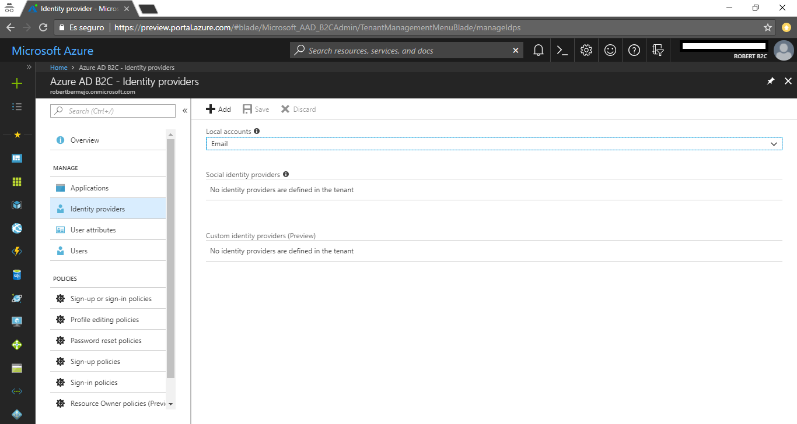

Para dar la opción de poder interactuar con cuentas externas, hay que darle a la opción Add y activar el proveedor deseado. Actualmente las opciones son: Microsoft Account, Google, Faebook, LinkdIn, Amazon, Weibo (Preview), QQ (Preview), WeChat (Preview), Twitter (Preview), GitHub (Preview).

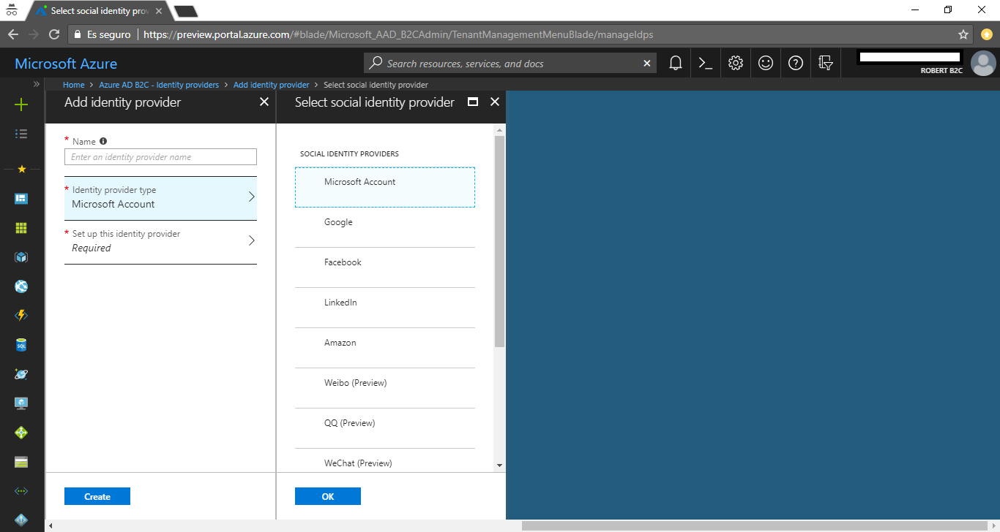

Para cada una de ellas deberás introducir el ClientId y el ClientSecret obtenido de la plataforma de origen. Una vez habilitadas a nivel de Tenant, cuando creemos o editamos una política podremos seleccionar que tipo de cuenta se requiere para esa política concreta.

**Autenticación Multi-Factor**

Azure AD B2C permite una segunda capa de seguridad a la hora de registrarse o logarse. Actualmente esta segunda capa solo se puede hacer mediante llamadas de teléfono y mensajes de texto. La autenticación Multi-Factor se activa o desactiva cuando se crea o edita una política. La razón por la que se hace a nivel de políticas es porque de esta forma se puede administrar el Multi-Factor por aplicación, no todas nuestras aplicaciones tienen porque realizar Multi-Factor, o incluso a nivel de partes concretas de una aplicación.

**Políticas**

Las políticas son la parte más importante de Azure AD B2C. En ellas se definen cuál será la experiencia del usuario cuando inicie una sesión, edite su perfil, se registre en la aplicación o cambié su contraseña. Cuando creamos una política, está nos permite configurar los siguientes puntos:

·       Tipo de cuenta que se puede usar para el registro: local o alguna de terceros permitida (Facebook, Twitter…).

·       Atributos que son necesarios para identificar a los clientes: Nombre, dirección, teléfono.

·       Uso de autenticación Multi-Factor.

·       URL de la página customizada.

·       Claims: La información que se añadirán a los claims cuando el usuario esté logado.

¿Y cómo Azure B2C sabe que política aplicar en cada momento? Cuando se hace la llamada https uno de los campos que se deben enviar es la política a aplicar. Por ejemplo, si tuviéramos una policita de Sign-in con el nombre de siginpolice la llamada https de login de usuario sería:

https://login.microsoftonline.com/contosob2c.onmicrosoft.com/oauth2/v2.0/authorize?client\_id=\{El id de tu aplicación registrada\}\&redirect\_uri=\{url registrada de respuesta\}&response\_mode=form\_post\&response\_type=id\_token&scope=openid&nonce=dummy&&p=siginpolice(que es nuestra política definida)

Se pueden definir las siguientes políticas:

·       Sign-up or Sign-in à Política que nos sirve tanto para cuando un usuario haga login como si se registra.

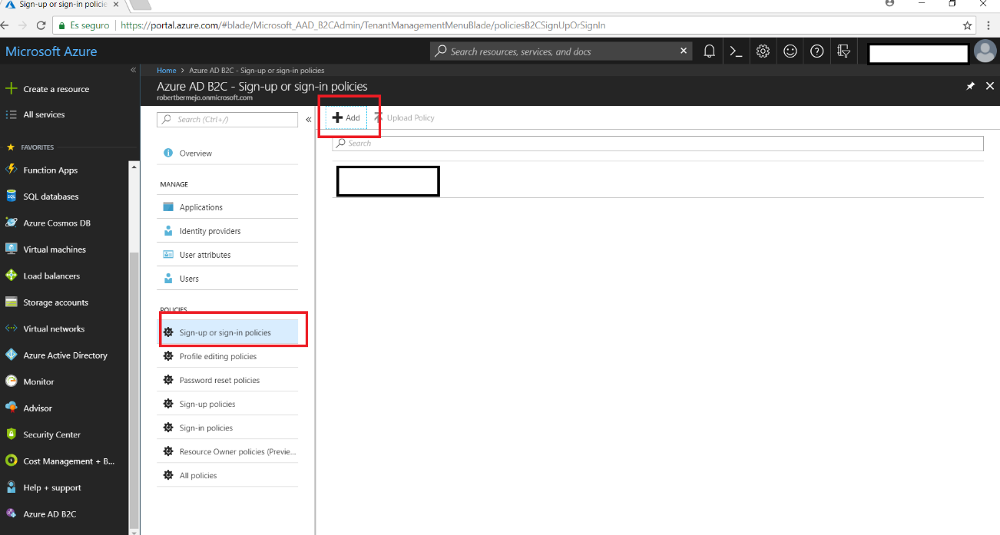

Los campos que rellenar son:

o   Proveedor de identidad à las opciones que se nos mostrarán serán aquellas que habremos definido con anterioridad a nivel de servicio.

o   Los atributos à Campos que queremos que se muestren en el formulario, las opciones que se nos mostrarán son todos los que hay por defecto más aquellos que hayamos creado de forma custom.

o   Claims à Una vez el usuario se haya logado que atributos queremos que aparezcan en los claims.

o   Autenticación multifacotr à Si queremos activar la autenticación multifactor o no.

o   Page UI Custom à Si queremos utilizar una página customizada, la URL de la página cusmtomizada que será la que aparezca tanto en el login como en el registro.

·       Profile editing à Nos servirá para configurar la experiencia que tendrá el usuario cuando edite su perfil.

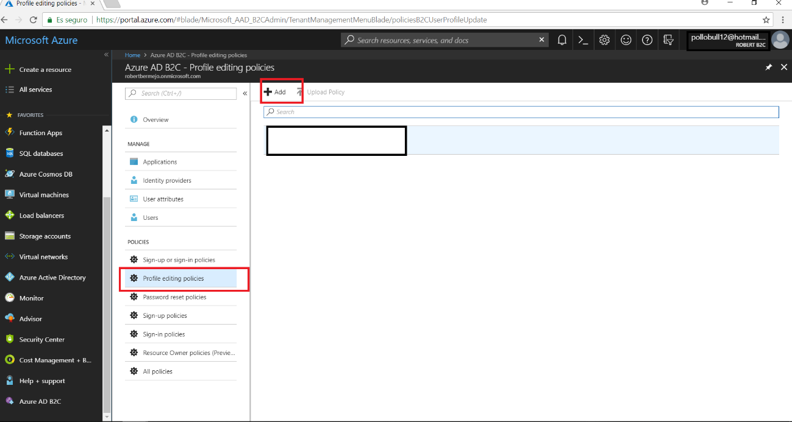

Los campos a rellenar son los mismos que en la política anterior, excepto que no existe la opción de autenticación multifactor porque no es una política de autenticación.

·       Password reset à Nos servirá para configurar la experiencia que tendrá el usuario cuando quiera hacer el reset de su password.

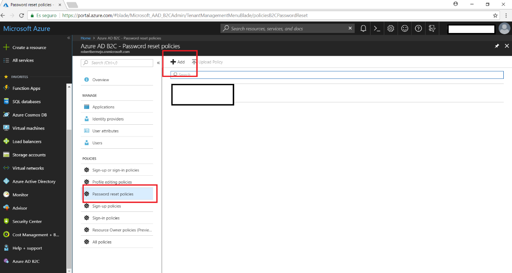

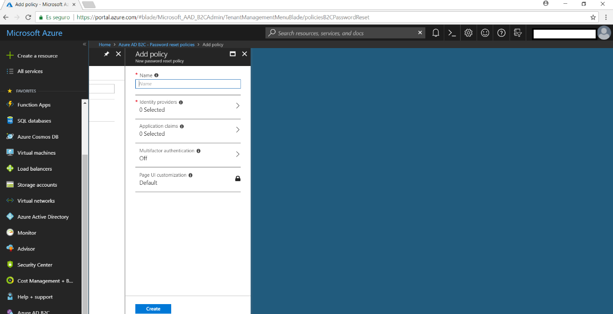

Como se puede ver en la imagen anterior se pueden configurar todos los campos de Signin-Signup excepto la configuración de los atributos a mostrar, en este caso son por defecto.

·       Sign-Up à Nos servirá para configurar la experiencia que tendrá el usuario cuando quiera registrarse en la aplicación.

Los campos que se mostrarán para ser configurados son los mismos que en Sign-up or Sign-in

·       Sign-In à Nos servirá para configurar la experiencia que tendrá el usuario cuando quiera hace el login en la aplicación.

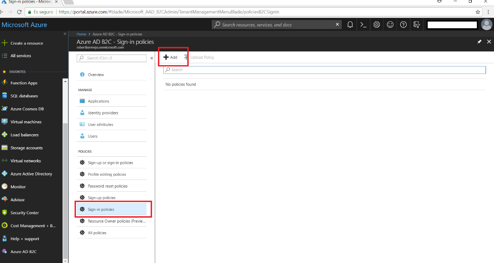

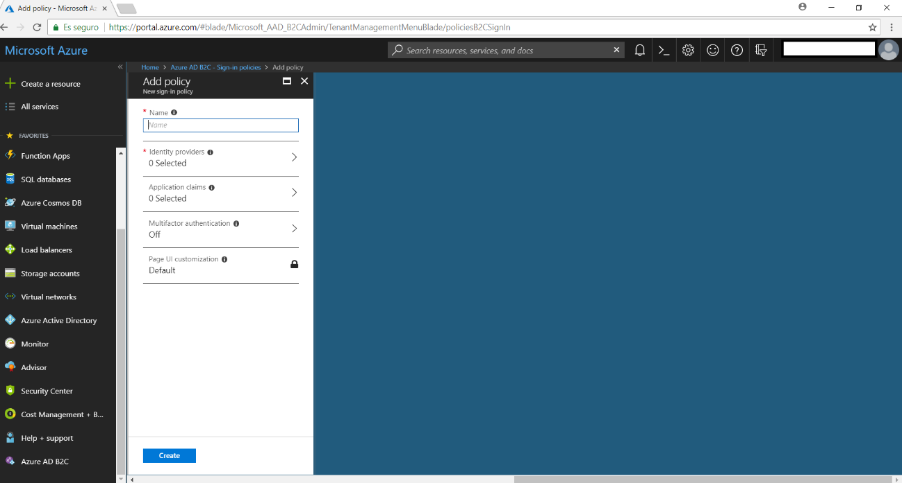

Como podemos observar los campos son los mismos excepto que en este caso no tiene sentido que podamos configurar los atributos que saldrán en pantalla.

·       Resource Owner Policies à Esta política nos permitirá definir los claims que queremos devolver cuando se ejecutar cuando se esté ejecutando el Flow de *resource owner password credential*s (ROPC).

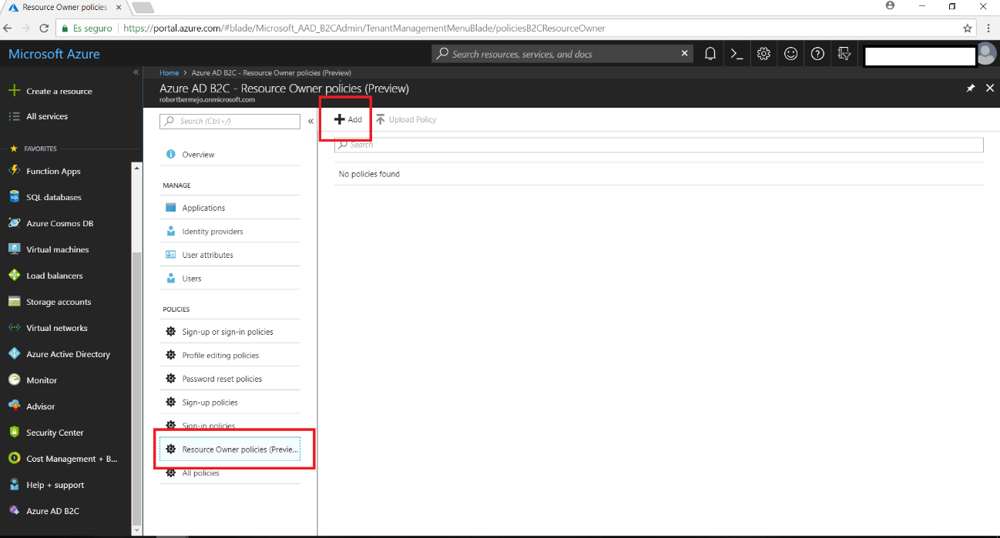

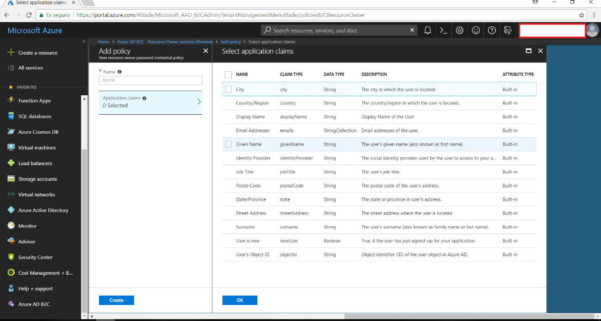

A continuación, vamos a ver un ejemplo de customización Sign-Up y Sign-In. En la siguiente imagen se puede ver el resumen de la configuración:

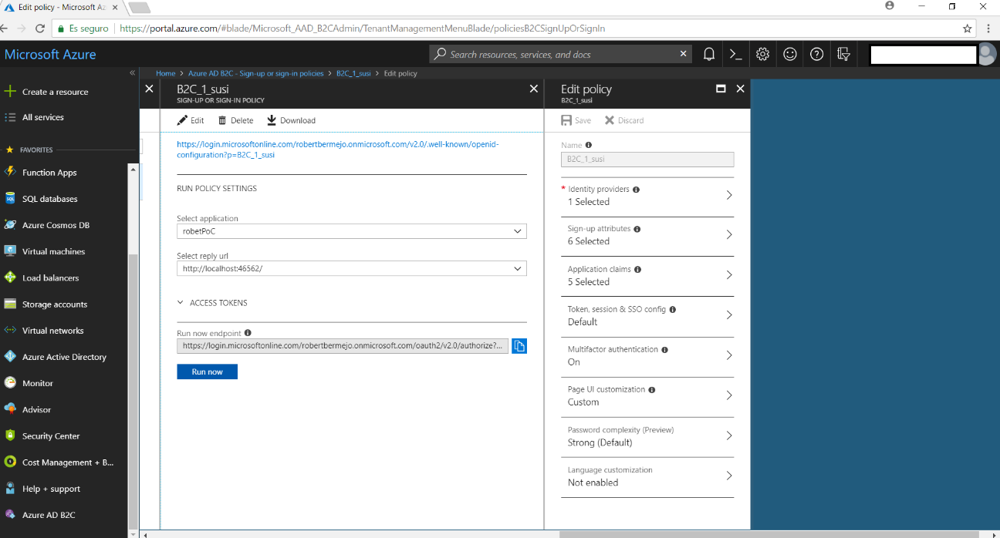

Para finalizar vamos a ver cómo sería el flujo en una aplicación:

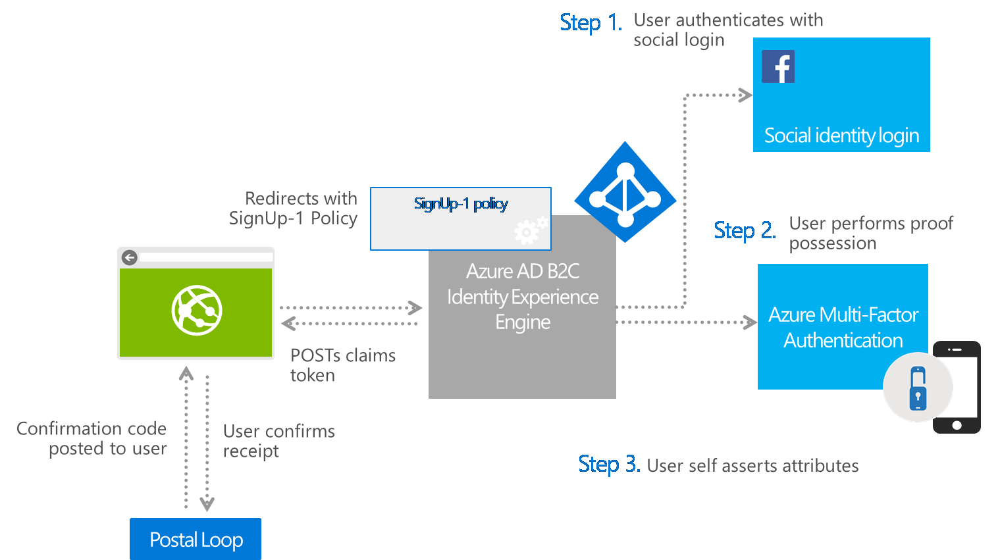

1.       El usuario realiza un Sign-up en la aplicación, y es redireccionado al proveedor de identidad configurado, en este caso Facebook. Si la autenticación tiene éxito, se cachea el token recibió y se continua con el segundo paso de autenticación como sea definido en la política.

2.       Una vez el usuario ha finalizado el ciclo de la doble autenticación, el orquestador inicia el proceso de registro donde el usuario verifica la información.

Como podemos ver Azure AD B2C es una opción muy a tener en cuenta ya que nos da una gran variedad de opciones para que nuestros clientes puedan usar nuestras aplicaciones.

Más información en: https://docs.microsoft.com/es-es/azure/active-directory-b2c/

**Robert Bermejo**
 Cloud Specialist Consultant en TOKIOTA | Microsoft Azure MVP

bermejoblasco@live.com
 @robertbemejo
 www.robertbermejo.com

 
 
import LayoutNumber from '../../../components/layout-article'
export default LayoutNumber
