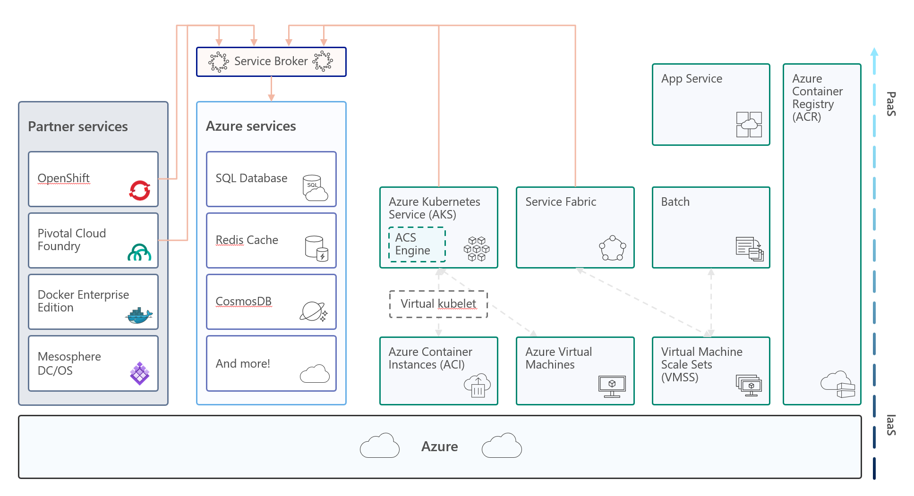
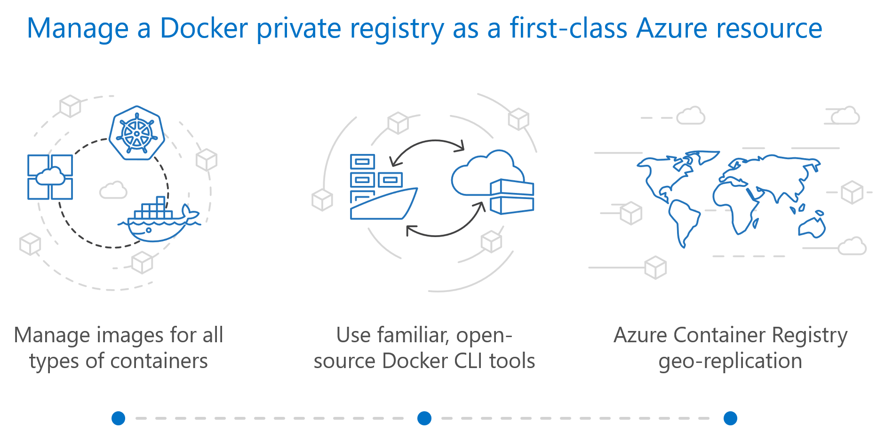
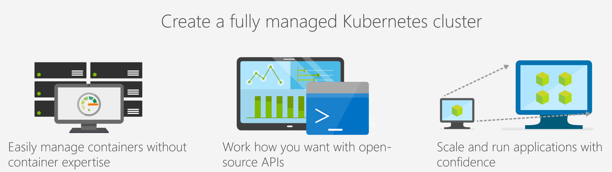
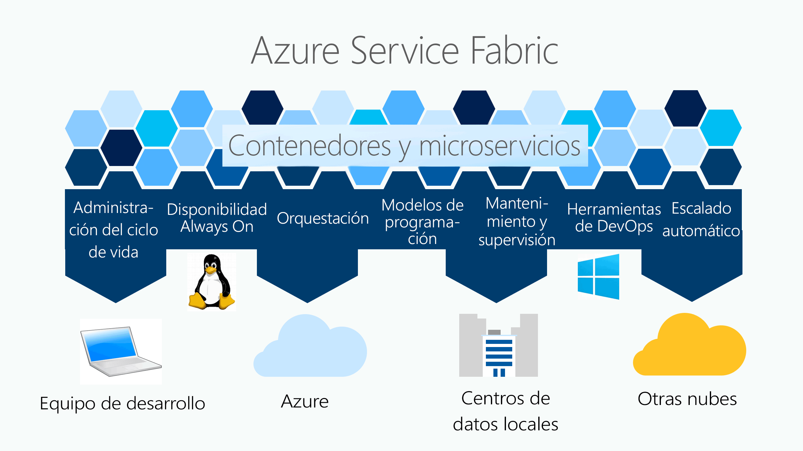
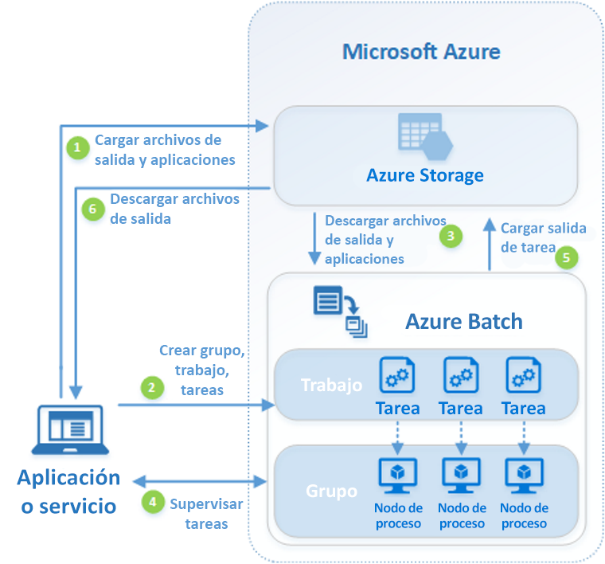

El mundo del desarrollo de aplicaciones no para de evolucionar y las opciones de ejecución aumentan a un ritmo endiablado, tanto que es complicado mantenerse al día y más complicado tener proyectos que hagan uso de la tecnología más adecuada en cada momento.

Uno de los principales culpables de este ritmo frenético es la nuble pública. Mes a mes, vemos cómo evoluciona y aparecen servicios nuevos que permiten exprimir al máximo nuestras aplicaciones con arquitecturas de ejecución especializadas para los requisitos actuales.

Desde el punto de vista de la arquitectura de ejecución, la llegada de los contenedores ha sido una revolución y, no sólo para el maravilloso mundo de los microservicios, sino que también para las opciones Serverless que nos ofrecen. Microsoft y el equipo de producto de Azure lo sabe y es por ello por lo que tenemos diversas opciones para ejecutar, administrar y monitorizar contenedores en el cloud de Microsoft.

​

Como podemos ver en la imagen anterior de Microsoft, el soporte a contenedores en Azure no sólo se basa en los servicios donde ejecutar nuestros contenedores, sino que internamente existe un "Service Broker" encargado de dar soporte a las aplicaciones de otros Partners que usan contenedores.

**Azure Container Registry**

Este servicio es un repositorio de imágenes de contenedores del tipo DC/OS, Docker, Swarm, Kubernetes, Service Fabric, etc. Con Azure Container Registry podemos compilar, almacenar y administrar las imágenes de los contenedores de nuestras aplicaciones que estarán disponibles para que se instancien desde nuestros orquestador o servicio de contenedores favorito.

Un servicio fundamental para publicar las versiones de nuestras aplicaciones de forma segura y que se haga uso de ellas desde nuestros sistemas de microservicios.

**Azure Kubernetes Service (AKS)**

AKS es un servicio administrado de un cluster de Kubernetes que nos permite ejecutar aplicaciones en contenedores. [Kubernetes](https://kubernetes.io/) es un sistema Open-Source para orquestar los contenedores de las aplicaciones basadas en microservicios, y Azure nos ofrece este servicio ahorrándonos todo el trabajo de instalar y configurar el cluster para preocuparnos de ejecutar nuestros contenedores y monitorizarlos.

Por su puesto, aísla la aplicación de la infraestructura donde se ejecuta para resolver problemas escalado ante la demanda de los recursos o posibles fallos en las máquinas virtuales donde estamos ejecutando nuestros contenedores.

**Azure Service Fabric**

[Service Fabric](https://github.com/Microsoft/service-fabric) es la tecnología base que donde se ejecuta la infraestructura principal de Azure y otros servicios, como Skype Empresarial, Intune, Azure Event Hubs, Azure Data Factory, Azure Cosmos DB, Azure SQL Database, Dynamics 365 y Cortana. Pensado para ejecutar sistemas distribuidos y abstraernos de la confiabilidad, la escalabilidad, la administración y la latencia que necesitan estos sistemas.

En resumidas palabras, Azure Service Fabric es el servicio administrado para ejecutar un cluster de Service Fabric en Azure, que nos permite orquestar nuestras aplicaciones de microservicios, bien mediante el uso de contenedores Docker o implementando un SDK específico para el desarrollo de estos servicios.

**App Service Web App for Containers**

Una versión de las aplicaciones web del App Service de Azure que nos ofrece la posibilidad de utilizar un contenedor donde se ejecuta, en cada instancia del App Service, nuestra aplicación. Una buena opción para ejecutar nuestra aplicación junto con sus dependencias, por ejemplo, para aplicaciones legacy que necesitamos ejecutar en Azure y sacar todo el provecho de la ejecución en un servicio PaaS, como el autoescalado.

**Azure Batch**

Azure Batch es un servicio de orquestación para ejecutar de procesamiento por lotes. El objetivo de este servicio es determinar el número de instancias de máquinas virtuales o nodos que se necesitan para ejecutar las tareas programadas en un trabajo predeterminado. Por ejemplo, para calcular el riesgo de una cartera de clientes mediante simulaciones de Monte Carlo, para ejecutar el renderizado de una película de animación o para ejecutar los algoritmos que permiten obtener el análisis del genoma de una muestra de un ser humano.

Como podemos ver en la imagen anterior, que define a alto nivel la arquitectura de ejecución, la ejecución de las tareas se delega a un nodo de proceso que no es más que una máquina virtual o un contenedor. La ventaja de utilizar un contenedor, frente a una máquina virtual, es que podemos empaquetar todas las dependencias de ejecución en el contenedor y despreocuparnos del entorno de ejecución que, al fin y al cabo, es una plantilla personalizada de máquina virtual en Azure.

**Azure Service Fabric Mesh**

Mesh nos ofrece la misma funcionalidad que tenemos en Service Fabric pero sin tener que preocuparnos de la administración del cluster o de las operaciones de parcheo del mismo. Azure Service Fabric Mesh permite desplegar microservicios en contenedores y escalar para satisfacer la demanda de trabajo.

**Azure Container Instances**

Por último, pero no por ello menos importante, tenemos la versión Serverless de contenedores. ACI nos ofrece la posibilidad de ejecutar contenedores sin preocuparnos del entorno de ejecución ni del cluster donde se ejecutará el mismo. Está pensando para la ejecución de aplicaciones basadas en eventos o para trabajos de procesamiento de datos, pero también podemos utilizarlo para extender la capacidad de AKS instancias microservicios bajo demanda que se ejecutan en este servicio.

**Conclusiones**

Los contenedores nos simplifican los desarrollos y facilitan la ejecución de las aplicaciones en entornos empresariales, sin embargo, no es la solución para todos los problemas. Estos servicios de Azure nos permiten ejecutar nuestros contenedores de una forma fácil, sencilla pero segura.

**Alberto Diaz Martin**
 MVP Azure
 adiazcan@hotmail.com
 @adiazcan

[http://blogs.encamina.com/por-una-nube-sostenible/](http://blogs.encamina.com/por-una-nube-sostenible/)

 
 
import LayoutNumber from '../../../components/layout-article'
export default LayoutNumber
