Como cambian los tiempos, las personas y los pueblos, no podíamos esperar menos de nuestra amada tecnología, que si cabe evoluciona y se transforma más rápido que nadie. Si hablamos de arquitecturas software, podemos decir que es el momento de potenciar el uso de las librerías cliente (React, Angular,Vue…) y cómo no, el momento de pensar en arquitecturas serverless con objetivos muy ambiciosos de rendimiento y escalado.

El servicio del que os voy a hablar, creo que representa muy bien esta situación, mejora tanto el rendimiento en cliente como el rendimiento en backend, es llevar a un nivel más nuestro querido SignalR.

**¿Qué es SignalR?**

Para el que no conozca ASP.NET SignalR, es una librería que permite conectar en nuestras aplicaciones, la capa de backend con el lado cliente, en ambas direcciones, y sobre todo en tiempo real sin necesidad de recargar pantalla. Para conseguirlo, necesitábamos montar un SignalR Hub en el backend de nuestra web, y mediante una conexión Websocket, podíamos enviar mensajes a cada uno de nuestros clientes.

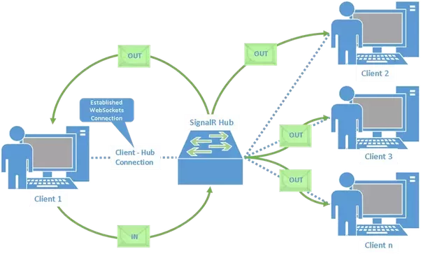

Como vemos en la siguiente figura, cada mensaje que se envía al Hub de SignalR, este lo distribuye por el canal indicado en la petición, a cada uno de los clientes conectados (Hub Proxy).

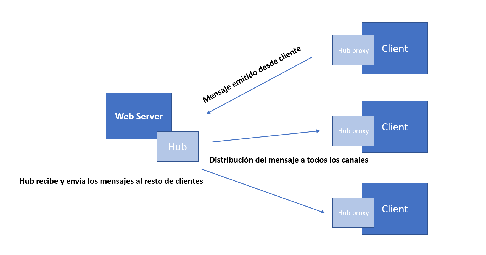

Este sistema funcionaba bien, pero siguiendo un poco la tendencia actual, ¿Si empezamos a tener un tráfico excesivo de mensajes en nuestro Hub como dimensionamos el backend? ¿Qué coste tendría? ¿Por qué repetir este proceso de arquitectura para cada una de mis aplicaciones, no puedo tener un servicio único y escalable?

**Para resolver todas estas preguntas / peticiones, entra en juego Azure SignalR.**

**¿Qué aporta Azure SignalR?**

Este servicio es 100% compatible con la librería de SignalR, y lo que viene es a proporcionarnos un servicio 100% administrado, distribuido y multi-servidor, que nos va a permitir dimensionar y escalar tal y como queramos nuestra solución con SignalR.  La principal diferencia con las soluciones que hemos visto anteriormente es que:

·       **Descargamos de trabajo al backend**, el nuevo backend de SignalR estará alojado en un servicio en Azure, o lo que es lo mismo el Hub ya no se ejecutará desde la web.
 Ahora el mensaje se le enviará al servicio de Azure, en el que tendremos definido el Hub, el mensaje ahora puede venir de un Azure Function, de un App Service o de cualquier otro de origen de datos ya que es una simple llamada HttpPost.

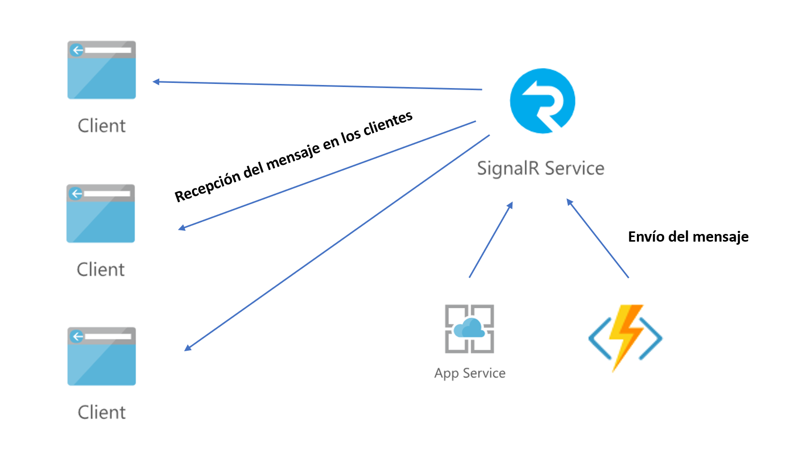

·       Podremos conectar a un servicio tanto clientes como digamos, pudiendo escalar el servicio bajo demanda.

·       Las conexiones al servicio se realizan con autenticación multifactor, gracias a la clave de acceso, que nos devuelve un token de sesión válido para que las aplicaciones clientes consuman el servicio.

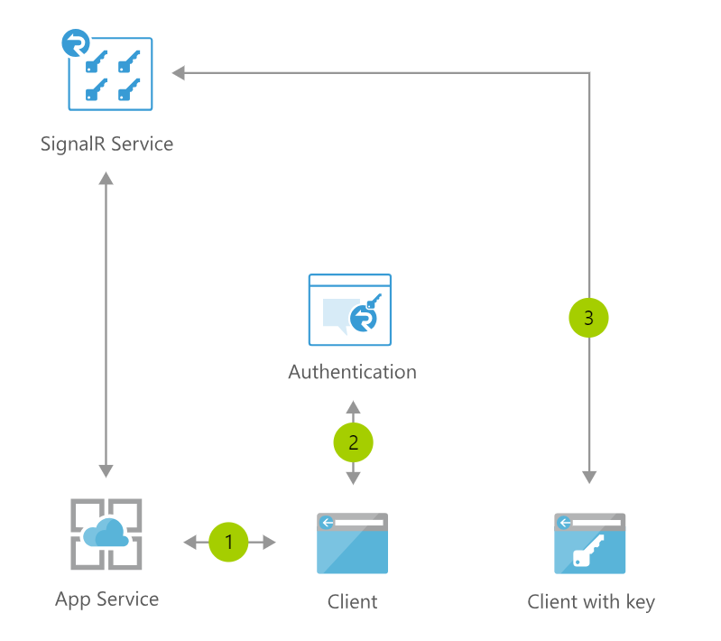

**ASP.NET Core y SignalR, tu primer ejemplo**

Una vez hemos visto las características del servicio, vamos a realizar un pequeño ejemplo en ASP.NET Core, creando un servicio de SignalR en Azure, y una aplicación de consola que envíe datos al servicio, para que la aplicación cliente que desplegaremos en Azure reciba los mensajes. Tanto los clientes, como la aplicación estarán autenticados contra el servicio de Azure SignalR mediante la cadena de conexión y la clave de acceso que daremos de alta en el portal de Azure.

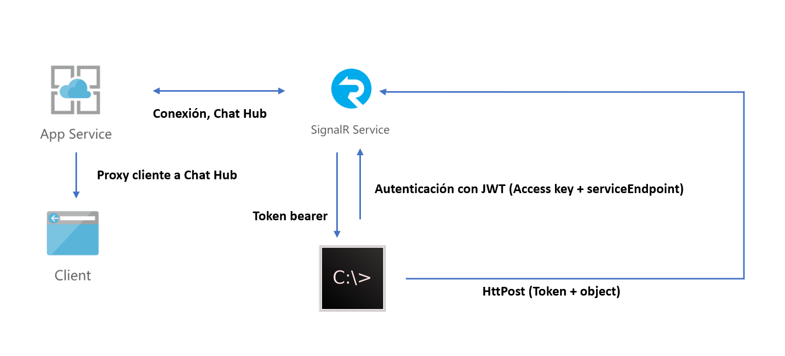

El ejemplo completo nos lo podemos descargar de [GitHub](https&#58;//github.com/tbsng15/AzureSignalR_Compartimoss.git) ya terminado, aunque con este artículo podremos crearlo desde cero.

**Configurando el servicio en una aplicación web**

Antes de empezar recordar que el ejemplo está desarrollado con Visual Studio 2017 y .Net Core 2.0, que nos podremos descargar de [https://www.microsoft.com/net/download/windows](https&#58;//www.microsoft.com/net/download/windows) .
 Además necesitaremos node.js instalado para poder descargar paquetes  [**npm**](https&#58;//www.npmjs.com/get-npm) .

1.       El primer punto es crear una solución en Visual Studio, y en concreto en .NET Core 2.0 una Web MVC.

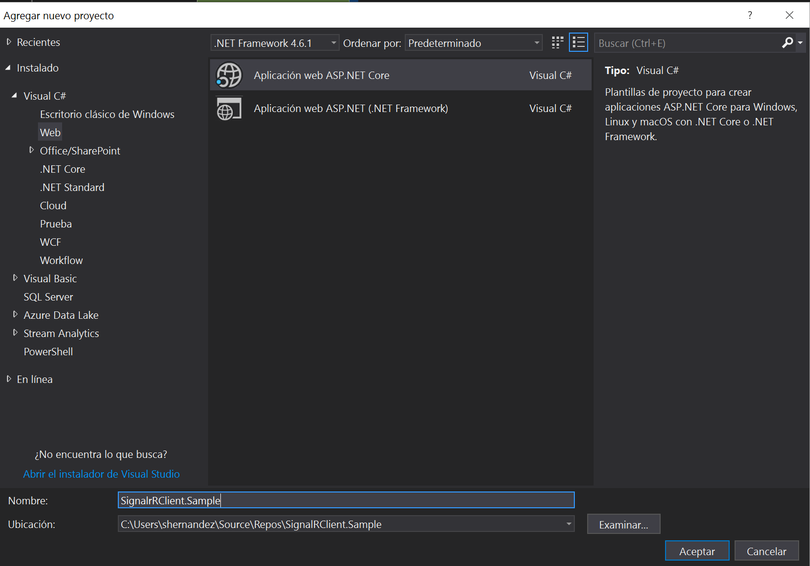

1.       Como el ejemplo está desarrollado en una web ASP.NET con MVC, seleccionamos la opción “Aplicación Web (controlador vista y modelos)”, aunque podríamos optar por hacer una solución Angular o React, eso sí con JavaScript, porque al menos por mi experiencia actual, al ser un servicio en preview, la autenticación con TypeScript, al conectar nuestro proxy hub con el servicio de Azure da error.

2.       Una vez creada la solución, necesitamos descargarnos los siguientes paquetes:

·       Paquete Nuget - Microsoft.Azure.SignalR -v 1.0.0-preview1-10009 
 Para instalarlo deberemos desde una consola, situándonos en el path del proyecto MVC que acabamos de crear,ejecutar el comando “dotnet add package Microsoft.Azure.SignalR -v 1.0.0-preview1-10009”

·       Paquete npm  aspnet/signalr
 Para instalarlo deberemos ejecutar desde una consola la instrucción “npm install @aspnet/signalr”

3.       Una vez instalado los paquetes, deberemos copiar en la carpeta /webroot/js la librería signalR.js que nos acabamos de descargar, además de añadir al layout de la web el siguiente código, para poder instanciar el fichero:

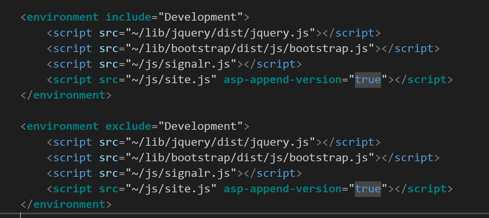

1.       En el fichero startup.cs deberemos modificar los métodos:

·       ConfigureServices:

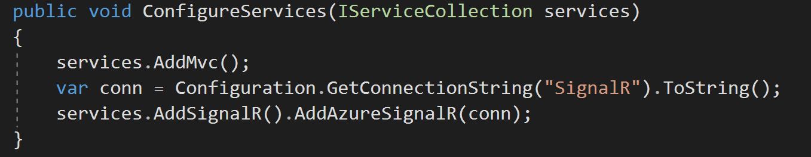

Con este código registramos el servicio de SignalR en nuestra aplicación, y ya podremos hacer uso de este, además .NET Core, se encargará de inyectarlo en los controllers, para que podamos instanciar entre otras cosas un HubContext de signalR como veremos luego. Además, el servicio instanciado es nuestro servicio de Azure mediante la cadena de conexión que deberemos obtener desde el portal de Azure, una vez creemos el servicio.

·       **Configure:**

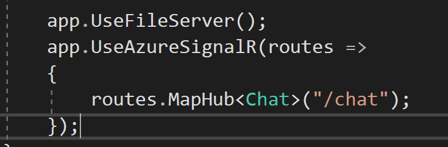

Este código es muy importante, ya que nos permitirá instanciar el Hub en el contexto, y definir el proxy que vamos a utilizar, en este caso “/chat”. Como vemos en el código, debemos mapear una clase Chat (aun por crear) a nuestro servicio de SignalR.

1.       Deberemos crear una clase Chat.cs, que va a actuar de Hub en nuestra web y que permitirá definir los ProxyHub en el lado cliente, eso si consumiendo el servicio de Azure tal cual hemos especificado en la configuración de la app.

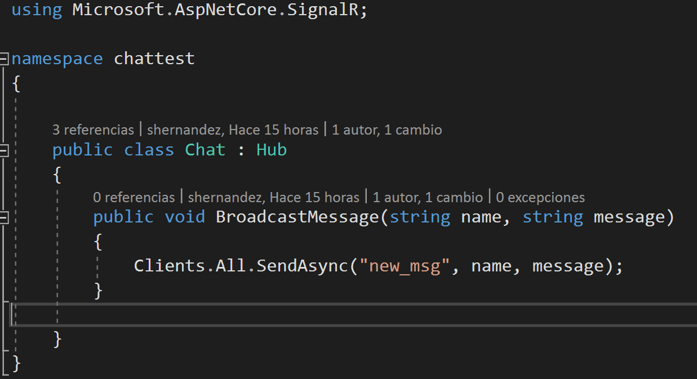

1.       Ya solo nos falta crear el servicio cliente que instancie el hub “/Chat” y que utilice el canal “new\_msg” que hemos definido en nuestro hub.
 Para ello añadimos a la vista Index de nuestra web un código muy sencillo que va a mostrar un alert con el dato recibido en el evento.

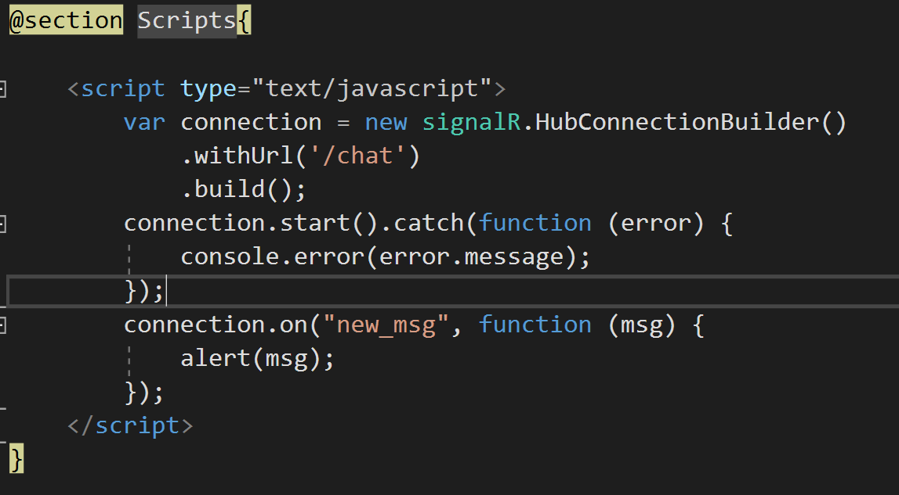

Si analizamos un poco el código, tenemos que creamos una conexión con HubConnectionBuilder, y lo apuntamos nuestro Hub “/chat”. Además, necesitamos configurar con “connection.on” las entradas por el canal “new msg”. Con este código, ya tenemos nuestro “proxyHub”, y la conexión por websocket abierta, para que podamos recibir los mensajes por el canal. En el momento de carga de la vista si hacemos uso de la developer tools del navegador deberíamos obtener algo parecido a la siguiente imagen, si no es así deberemos revisar nuestro código.

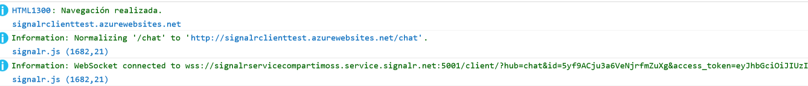

**Creando el servicio en Azure**

La aplicación ya la tenemos preparada, a falta de indicarle la cadena de conexión al nuevo servicio de Azure de SignalR. Para ello accedemos al portal de Azure y creamos un nuevo servicio del tipo SignalR Service, aclarar que es un servicio aun en “Preview” por lo que debemos estar predispuestos a que esto puede cambiar de un día para otro.

El servicio es muy sencillo, simplemente deberemos rellenar los datos habituales:

·       Nombre del servicio: MySignalRSampleService.

·       Elegir suscripción de Azure.

·       Elegir o crear un grupo de recursos – CompartimossSample.

·       Location o región – West Europe.

·       Price – Tier : Aquí podemos escoger entre la versión gratuita sin escalado (suficiente para el ejemplo), o escoger la básica que ya podemos definir unidades de escalado, y que tiene un coste de 20,68 € mes (precio estimado).

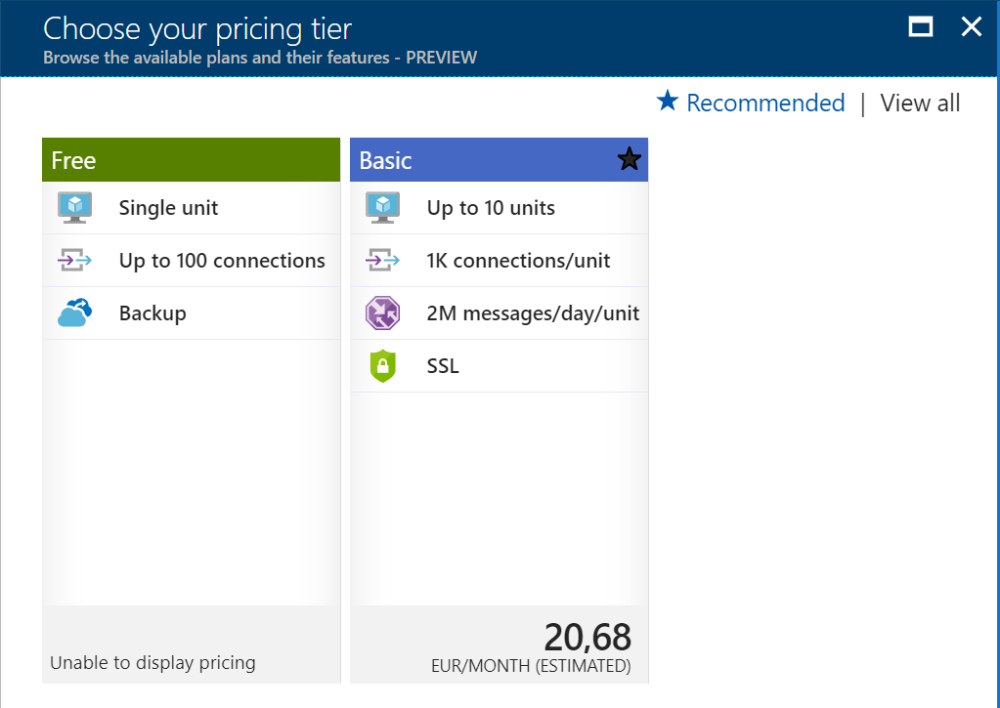

Si todo va como debe, y tenemos creado el servicio, deberemos acceder al mismo, y en el apartado key podremos ver las cadenas de conexión, y copiar la cadena primaria, para poder incluirla en el proyecto.

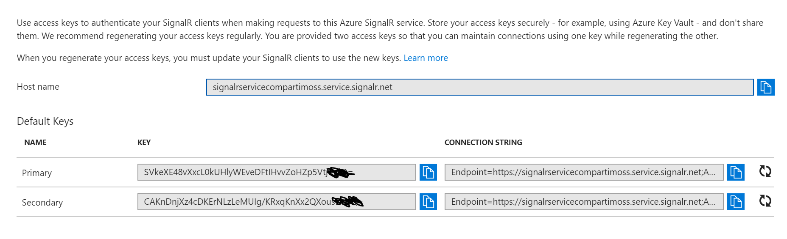

Por último, solo nos quedaría volver al proyecto, y añadir al fichero appsetting.json (para cada uno de los entornos) el siguiente JSON de conexión.

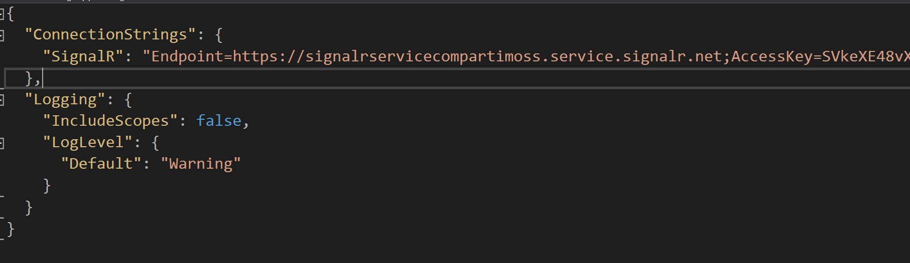

**Comprobando la conexión, enviando datos desde la web**

En este punto tenemos todo configurado, pero es difícil saber si ha ido todo correcto, para ello vamos a hacer una pequeña prueba añadiendo a un controller la inserción de un mensaje en el canal de SignalR, para comprobar que el cliente está configurado correctamente y obtenemos conexión y contexto de autenticación con el servicio de Azure.

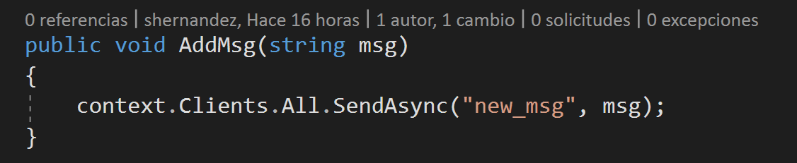

Pero para poder instanciar el contexto de SignalR, vamos a hacer uso de la inyección de dependencias de .NET Core, y a modificar el constructor de nuestro HomeController.

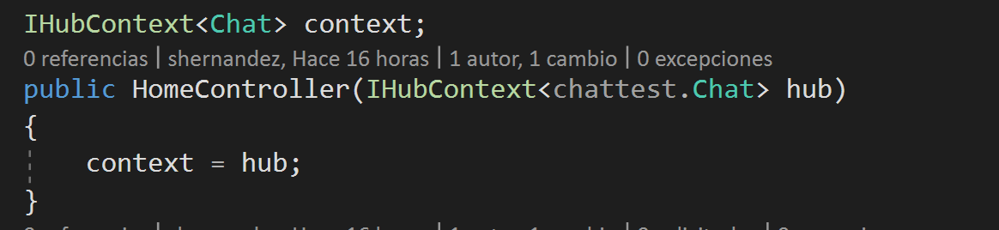

Si con la aplicación compilada y lanzada desde nuestro Visual Studio, invocamos la petición GET http:localhost:portApp/Home/AddMsg?msg=mensajeatrasmitir, deberíamos ver en la Home/Index un alert con el mensaje pasado por querystring. Hasta aquí hemos dejado la aplicación funcional, pero sigue siendo el backend el que desde el controller envía el mensaje al lado cliente, aún nos queda un poco de trabajo.

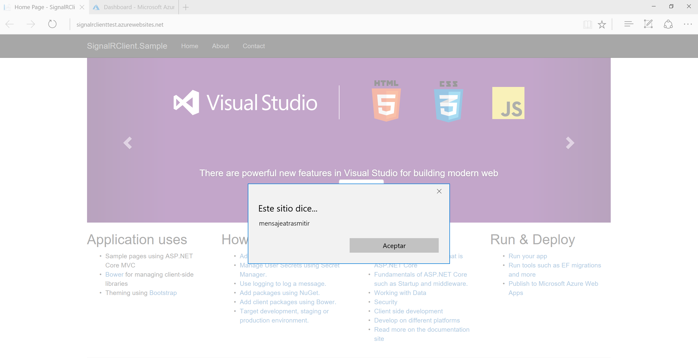

**Enviando datos directamente desde el servicio en Azure**

Vamos a dar por supuesto, que ya tenemos la APP 100% funcional y desplegada en un Azure App Service.  Para que no tengamos problemas con SignalR en Azure, deberemos dejar en las settings del app service activados los websocket, o no funcionará correctamente.

Ahora vamos a crear una aplicación de consola, y la añadiremos a nuestra solución con el siguiente código:

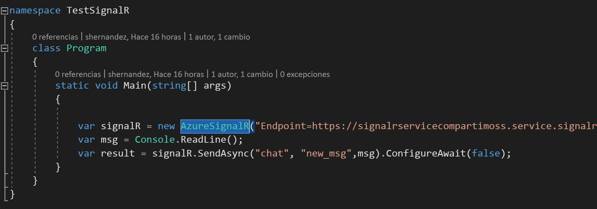

Si revisamos el código, nos falta por crear una clase “AzureSignalR” que ahora veremos, y que recibe como parámetro de entrada el mismo endpoint que hemos venido utilizando en el ejemplo anterior (Azure SignalR service).

La clase AzureSignalR que deberemos crear dentro del proyecto de consola, se va a encargar de generar el JWT para obtener el token de seguridad, utilizando la cadena de conexión.

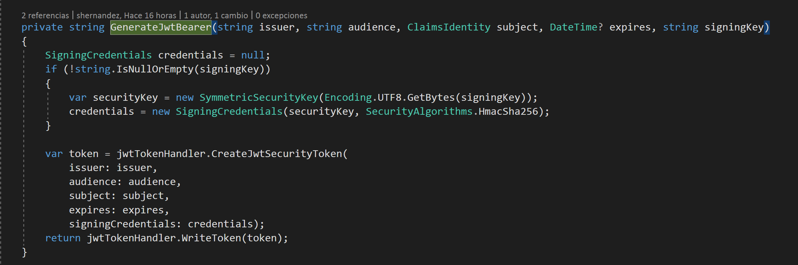

Además, va a realizar un POST con el mensaje a trasmitir, que en este caso recoge por consola.

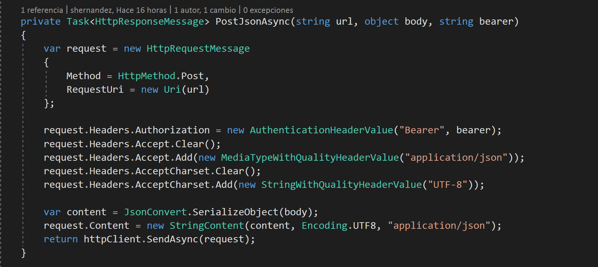

La diferencia con el ejemplo anterior es que el dato que recibe ahora la web si es enviado desde el hub de Azure SignalR, que ahora si actúa como backend.

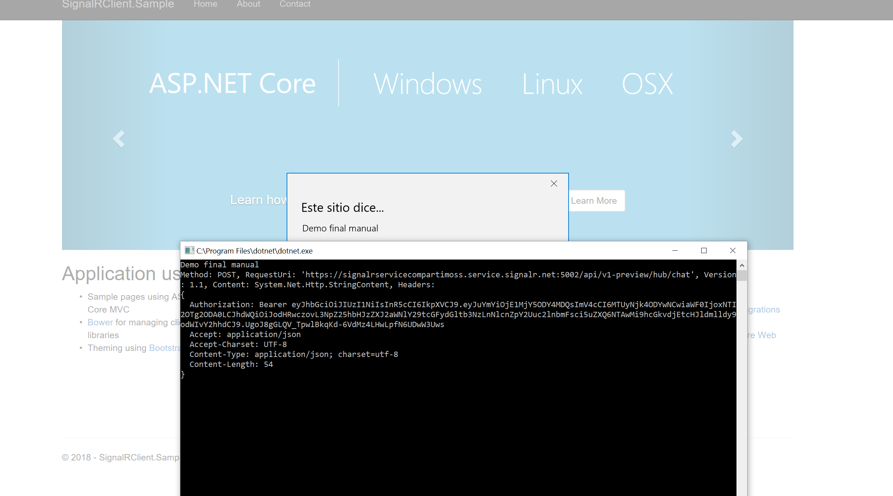

**Conclusiones**

Aun siendo un servicio en preview, y que le queda trabajo sobre todo con la integración con TypeScript, documentación y ejemplos; animo a todo el mundo a empezar a utilizarlo en entornos de desarrollo, y a probar lo sencillo que es integrarlo con las apps que necesiten de eventos en tiempo real como son estos ejemplos de SignalR.

Cada vez más va a ser necesario aligerar los backend de las webs, para incluir nuevas piezas serverless, y eso equivale a mucho más trabajo asíncrono, en background y por lo tanto intentar que la parte cliente esté 100% conectada y no veo una forma mejor que empezar con este tipo de servicios.

Como pista, si queremos hacer una verdadera solución “real time” os animo a que combinéis Azure SignalR y Azure Event Grid, ya que están condenados a entenderse y podremos monitorizar en tiempo real todos los eventos de nuestros backends en una solución cliente.

**Sergio Hernandez Mancebo**

Principal Team Leader en ENCAMINA

@shmancebo

