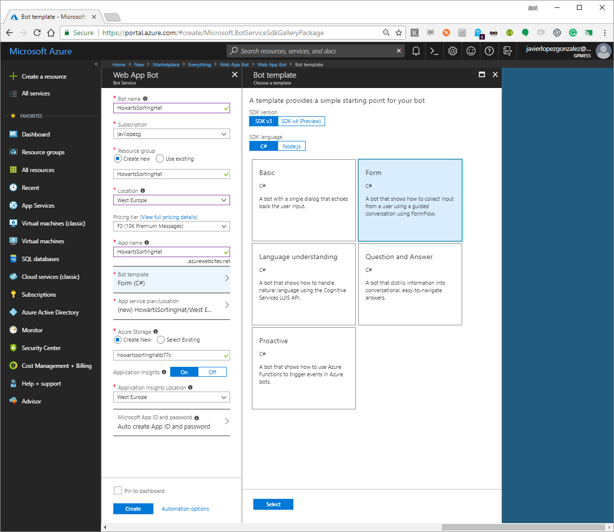
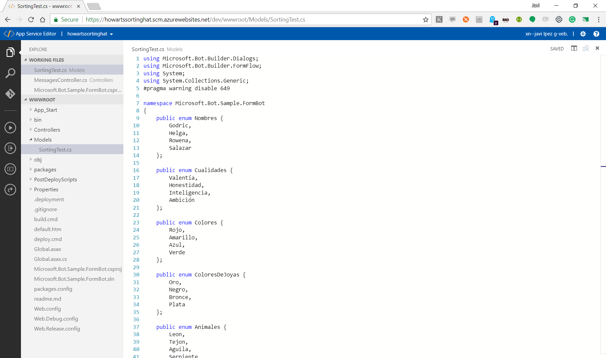
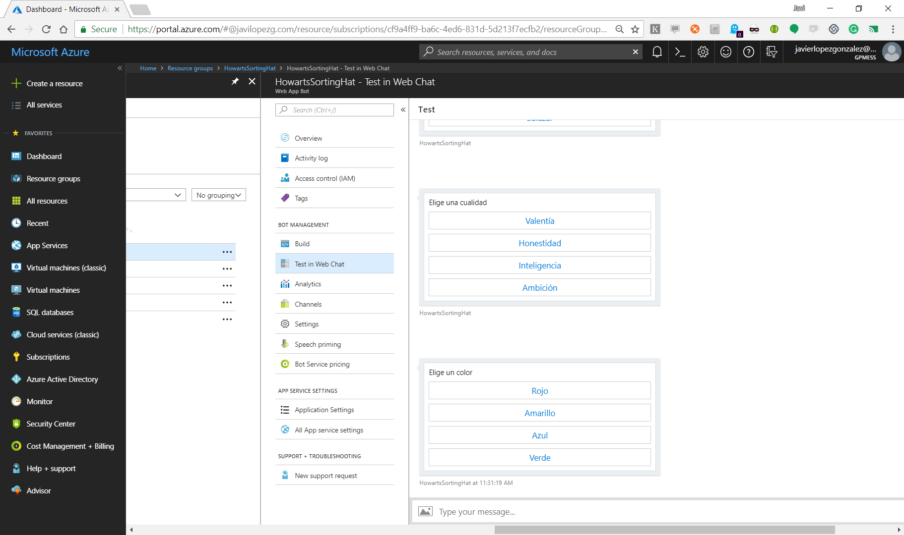

​Los chatbots, las interfaces conversacionales, que empezaron a estar de moda hace un par de años resultan muy divertidos, pero no siempre son útiles. Requiere bastante esfuerzo diseñar una conversación teniendo en cuenta todas las opciones de respuesta que pueden plantear los usuarios. Pero: ¿es necesario controlar todas las posibles entradas para realizar una tarea de negocio? En la mayoría de las aplicaciones, la respuesta es un rotundo “no”. Si así fuese, no se basarían la mayoría de apps en formularios para recoger datos con los que hacer algo.

Microsoft nos provee, dentro del Bot Framework, de un modo sencillo de modelar pequeñas funcionalidades de negocio que antes resolveríamos con un simple formulario. FormFlow es un motor que, a partir de un modelo de datos, es capaz de automatizar una conversación para recuperar toda la información necesaria para completar el modelo y que así podamos hacer lo que queramos con los datos.

Gracias a él, podemos aprovechar la omnipresencia (por estar en muchos canales en los que ya están presentes los usuarios) de un chatbot para estar más cerca de nuestro público objetivo.

Vamos a ver a continuación como podemos desplegar un chatbot sencillo en Azure. Veréis que el uso de FormFlow es tan sencillo que ni siquiera necesitaremos abrir Visual Studio para codificarlo. ¡Va a ser cosa de magia! En concreto, vamos a hacer un simulador del Sombrero Seleccionador de Howarts que decidía, en las historias de J. K. Rowling, a que casa iban los alumnos de la escuela de magia.

Es un ejemplo muy sencillo, pero completo, que nos servirá de base para afrontar cualquier aplicación sencilla que se base en la recopilación de un conjunto de los datos con los que después hacer algo, ya sea realizar unos cálculos (como es nuestro caso, pero podría ser el de calcular las condiciones de una hipoteca, o el precio que se aplicaría en tu seguro de coche), llamar a una API (por ejemplo para grabar la solicitud de esa hipoteca, o la petición de la llamada de un comercial de seguros), o cualquier otra cosa que se nos ocurra.

Como la mayoría del bot está basado en la definición de un modelo de datos será una tarea sencilla por muy complejo que lo queramos hacer, ya que la magia ya está codificada por Microsoft en las tripas de FormFlow.

Lo primero que tenemos que hacer, es crear en Azure un nuevo bot (Web App Bot). Para facilitarnos el trabajo, vamos a partir de un bot de ejemplo, por lo que a la hora de crear la aplicación le diremos que use la plantilla de FormFlow.



Una vez desplegado, tendremos dos elementos con el mismo nombre, una Web App y el Web App Bot propiamente dicho. En el Web App Bot una de las opciones es editar el código online (dentro del menú Build), que es lo que usaremos para editar el código de nuestro bot, ya que su sencillez no requiere montar un proyecto complejo o utilizar toda la potencia de Visual Studio.

Dado que los bots que utilizan FormFlow se basan en un modelo, lo primero que tenemos que hacer será definir este. Nuestro Sombrero Seleccionador no es tan mágico como el de Howarts, el nuestro recopila distinta información sobre los alumnos para tomar una decisión de a qué casa mandarles.

Las variables del modelo pueden ser de tipos básicos (los distintos tipos de enteros, los distintos tipos de números de coma flotantes, strings, DateTime, enumeraciones) y listas de enumeraciones. En nuestro caso, inicialmente, hemos usado sólo enumeraciones porque los valores que vamos a manejar son muy específicos de nuestro negocio.​

```
 public enum Nombres {  Godric,  Helga,  Rowena,  Salazar };   public enum Cualidades {  Valentía,   Honestidad,  Inteligencia,  Ambición };  public enum Colores {  Rojo,   Amarillo,  Azul,  Verde };  public enum ColoresDeJoyas {  Oro,  Negro,  Bronce,  Plata };  public enum Animales {  Leon,  Tejon,  Aguila,  Serpiente };  public enum LugaresParaVivir {  TorreOscura,  Bodega,  TorreLuminosa,  Mazmorras };  public enum Titulos {  Sir,  Fraile,  Dama,  Barón };  public enum Amigos {  Ron,  Neville,  Hermione,  Harry };  public enum Accesorios {  Espada,  Copa,  Diadema,  Guardapelo }  [Serializable] public class SortingTest     {         public Nombres? Nombre;  public Cualidades? Cualidad;  public Colores? Color;  public ColoresDeJoyas? ColorDeJoyas;  public Animales? Animal;  public LugaresParaVivir? LugarParaVivir;  public Titulos? Titulo;  public Amigos? Amigo;  public Accesorios? Accesorio;
```

```
         public static IForm<SortingTest> BuildForm()         {              OnCompletionAsyncDelegate<SortingTest> evaluate = async (context, state) =>              {                  await context.PostAsync(“OK”);              };return new FormBuilder<SortingTest>()                      .Message(“Hola”)                      .OnCompletion(evaluate)                      .Build();         }     };
```


Si ahora decidiéramos manejar nueva información como el nombre o la fecha de nacimiento, tan sólo tendríamos que añadir nuevas propiedades a nuestra clase modelo para almacenar estos datos, que posteriormente el bot se encargará de recoger y validar.

```
               public string TuNombre;
```

```

```

```
               public DateTime? FechaDeNacimiento;
```
 ​

Una vez que tenemos nuestra clase definida, solo la tendremos que añadir a nuestro proyecto creando un archivo online, y aprovecharemos a eliminar el modelo del ejemplo de la plantilla que no encaja para nada con nuestro mundo mágico.



Además, tendremos que hacer unos cambios menores en el controlador para que use nuestro nuevo modelo en lugar del que hemos eliminado. Para esto editaremos el archivo MessagesController.cs y cambiaremos las referencias al modelo en el método MakeRootDialog.

```
        internal static IDialog<SortingTest> MakeRootDialog()
```

```
        {
```

```
            return Chain.From(() => FormDialog.FromForm(SortingTest.BuildForm));
```

```
        }​
```
​

A partir de aquí ya podemos compilar (build.cmd) y probar nuestro bot. En el componente del Web App Bot tenemos una opción para testear nuestro bot con un web client sin salir del portal de Azure. En cuanto le hablemos, nos responderá y podremos ver cómo nos hace preguntas para rellenar nuestro modelo.



Una vez que ya estamos capturando los datos, sólo tenemos que procesarlos, para eso cambiaremos el código de BuildForm dentro de nuestro SortingTest a nuestro gusto. Si lo probamos, veremos que ya lo tenemos todo funcionando. Sin embargo, no queda muy bien que si nuestro bot está pensado para público castellano parlante le hable en inglés. FormFlow está pensado para localizarlo a distintos idiomas, pero en nuestro caso solo cambiaremos un par de detalles usando atributos sobre nuestro modelo.

Hay atributos para distintas cosas como por ejemplo para marcar qué campos son opcionales o introducir nuestras propias validaciones. Nosotros usaremos un atributo de plantilla para modificar la pregunta que se hace por cada campo.

```
       [Template(TemplateUsage.EnumSelectOne, "Elige un {&} {||}", ChoiceStyle = ChoiceStyleOptions.Auto)]
```

Hay un lenguaje completo para editar el formato de los mensajes. En nuestro caso los caracteres {&} representan el nombre del campo y los caracteres {||} las distintas opciones que tendrá el usuario. La enumeración ChoiceStyleOptions nos permite indicar cómo se mostrarán estas opciones.

Si volvemos a probar veremos que ya queda mucho más aparente, pero no queda del todo bien ya que, por ejemplo, la propiedad Cualidad es femenina y al no haber planteado una pregunta neutra se hace raro el resultado. Pasa lo mismo con las propiedades de tipo string y DateTime, para las que no hemos cambiado su plantilla. Podemos usar un atributo similar al anterior pero que se aplica sólo sobre una propiedad para cambiar estos casos concretos.

```
               [Prompt("Elige una cualidad {||}")]
```

FormFlow tiene más capacidades, pero con esto hemos podido hacer un poco de "magia de informático" en unos pocos minutos, para tener algo funcional y aparente. Tan sólo nos queda elegir uno o varios canales en los que publicarlo para empezar a llegar a nuestro público objetivo justo en el canal en el que ya están trabajando a diario. Por ejemplo, si queréis saber qué opina de vosotros nuestro Sombrero Seleccionador, sólo tendréis que visitar mi web en [javilopezg.com/SortingHat](https&#58;//javilopezg.com/SortingHat) y charlar con él.


**Javi López G.**
 mail@javilopezg.com
 @javilopezg
 https://javilopezg.com​​

