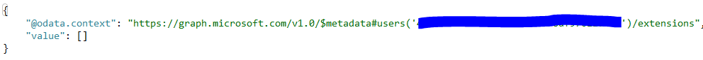

Este artículo lo vamos a dividir en dos partes. En la primera, aprovechando que recientemente hemos tenido el Build 2018, vamos a ver algunas de las novedades presentadas alrededor de Graph. En la segunda parte, hablaremos de cómo podemos extender Graph almacenando información que puede venir de cualquier otro origen.

**Novedades en Graph presentadas en el Build 2018**

Como os decía, el pasado 7-9 de mayo se celebró el Build, donde Microsoft ha presentado todas sus novedades para desarrolladores. MS Graph fue de los que más atención ha recibido por parte de MS, así que tenemos bastantes novedades que os resumo en las 2 siguientes imágenes:

Todas las sesiones del Build están disponibles en la web de Chnnel 9. En el siguiente link podéis ver todas las sesiones relacionadas con Graph:

[https://channel9.msdn.com/Events/Build/2018?sort=status&direction=desc&tag%5B0%5D=microsoft%2Bgraph](https&#58;//channel9.msdn.com/Events/Build/2018?sort=status&amp;direction=desc&amp;tag%5b0%5d=microsoft%2Bgraph)

**Microsoft Graph Extensions**

Graph Extensions en el mecanismo que nos proporciona Graph para extender la información almacenada en Graph, con datos provenientes de otros sistemas o escenarios. Por ejemplo, es bastante común tener un ID de empleado, que suele venir de algún sistema de RRHH, y queremos añadirlo a la información de perfil de Graph… o bien digamos que tenemos Grupos de Office 365, y queremos guardar Tags asociados a los grupos… para todo este tipo de escenarios, podemos usar Graph Extensions.

Existen dos tipos distintos de Extensions: *Open extensions* / *Schema extensions*

Antes de entrar en detalle, conviene saber que no todos los recursos de Graph soportan extensions. Por el momento, la siguiente tabla contiene los recursos que podemos extender:

**MS Graph Open Extensions**

Las extensiones de tipo *Open*, nos van a permitir añadir información a un recurso utilizando simplemente un listado de Key-Values. Por ejemplo, digamos que queremos añadir a mi perfil, el código de empleado, así como la fecha de la última revisión médica que hice a través de la empresa.

Para ello, hacemos un “POST” al endpoint:

[*https://graph.microsoft.com/v1.0/me/extensions*](https&#58;//graph.microsoft.com/v1.0/me/extensions)

En el cuerpo del mensaje, compondremos un JSON con la siguiente información

| **Name** | **Value** |
| --- | --- |
| @odata.type | Microsoft.Graph.OpenTypeExtension |
| extensionName | Cualquier cadena única. Como convenio se suele invertir el dominio de la tenant: *com.contoso.rrhhExtraData* |
| Key – Value list | Una lista con clave-valor (nombre de la propiedad: valor asignado) |

Para recuperar esa información, podemos hacer un GET al endpoint de Extensions, o expandir a Extensions:

Ten en cuenta que al ser Open extensions, solo tendrán un valor en el caso que hayan sido asignadas, es decir, que, si hacemos esa misma query a un usuario que previamente no hemos asignado la extensión, ésta simplemente devolverá vacía, no esperes encontrar un *EmployeId* y *LatestMedicalCheck* con valor *null*, si no vacío a nivel de Extension.

**MS Graph Schema extensions**

Schema extensions nos va a permitir ampliar la información asociada a un recurso, pero de una manera más “tipada”. Es decir, vamos a poder definir un tipo para nuestra Extensión. Por ejemplo, siguiendo con el ejemplo anterior, vamos a crear un tipo para extender nuestro perfil con algunos datos más que podemos tener en otros sistemas. Para ello necesitamos hacer un POST como el siguiente:

En esta URL puedes encontrar el detalle de las propiedades a establecer en el JSON

[https://developer.microsoft.com/en-us/graph/docs/api-reference/beta/api/schemaextension\_post\_schemaextensions](https&#58;//developer.microsoft.com/en-us/graph/docs/api-reference/beta/api/schemaextension_post_schemaextensions)

**Nota**: Fíjate bien en como componer el valor para la propiedad “*id*”, así como asegurarte de que proporcionas un valor válido para la propiedad “*owner*” (que debe ser el ID de una Azure AD App registrada en esa tenant). En el siguiente link tienes los diferentes tipos soportados en las properties (básicamente: Binary, Boolean, DateTime, Integer, String):

[https://developer.microsoft.com/en-us/graph/docs/api-reference/beta/resources/extensionschemaproperty](https&#58;//developer.microsoft.com/en-us/graph/docs/api-reference/beta/resources/extensionschemaproperty)

Una vez definido el Schema, podemos actualizar nuestro usuario con dicha información. Para ello haremos un PATCH:

Llegado este punto, ya sólo tenemos que recuperar esa información. Para ello, y a diferencia de las Open extensions, en este caso podemos hacer un ***$select*** de la extensión, igual que si fuera un campo más como *DisplayName*, etc:

Como hemos visto en el artículo, MS Graph nos ofrece un mecanismo muy potente para poder guardar información de otros sistemas en la propia Graph.

**Luis Mañez**

SharePoint / Cloud Solutions Architect en ClearPeople LTD

@luismanez
 [https://medium.com/inherits-cloud](https&#58;//medium.com/inherits-cloud)

