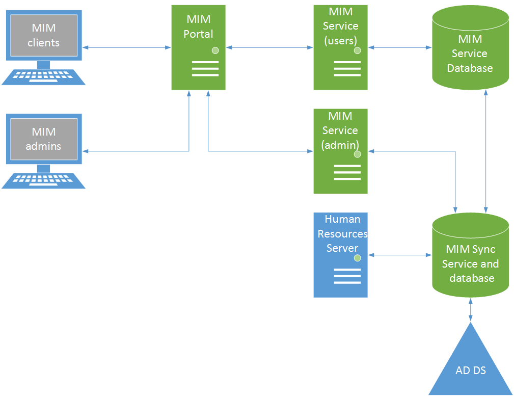
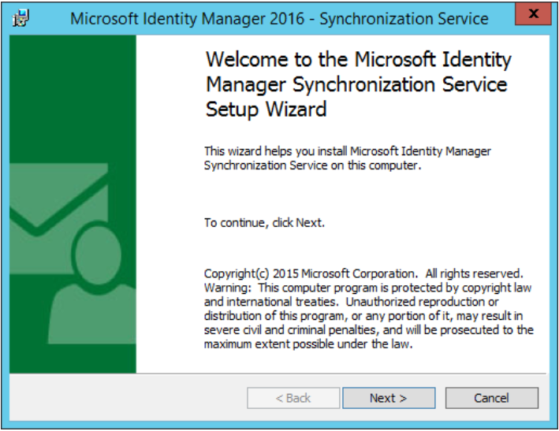
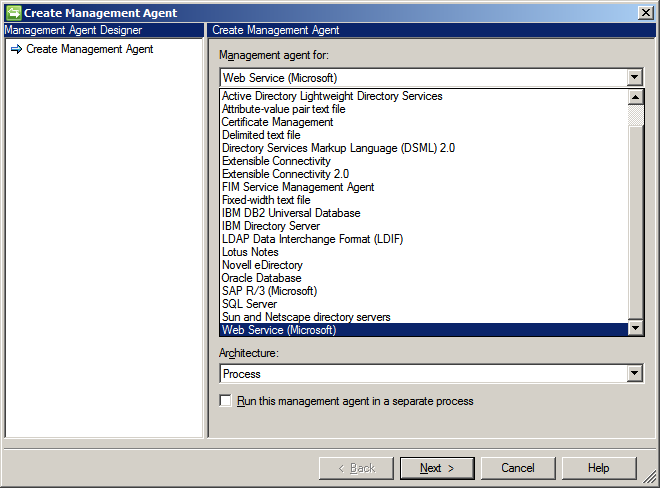
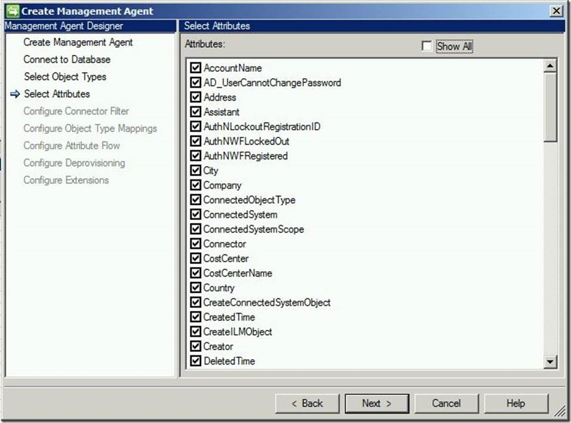
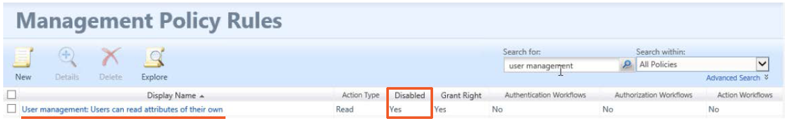

Sí, MIM 2016 es la evolución de FIM 2010, con el cual comparte no sólo la funcionalidad, sino que gran parte de la documentación escrita para FIM es válida también para MIM. Sobre todo en cuanto a planificación, requerimientos, e instalación, no hay que preocuparse si no encontramos mucha documentación de MIM 2016, pues la que existe de FIM 2010 es válida.

La documentación de MIM 2016 se queda corta y a veces es inexacta. No es caballo de batalla ni goza de la popularidad de otras soluciones, pero es una herramienta muy potente que se merece un poco de foco. Así que ¡vamos allá!

**¿Qués es MIM 2016?**

MIM 2016, al igual que FIM 2010, es una solución de sincronización de identidades y accesos, que ayuda a gestionar usuarios, grupos, credenciales, directivas, y accesos. Además de las funcionalidades ya existentes en FIM 2010, MIM 2016 agrega:

·       Informes híbridos en Azure, para visualizar datos cloud y locales en un único sitio.

·       Privileged Access Management (PAM): gestión de credenciales con privilegios.

·       Nuevas funcionalidades en la gestión de certificados.

·       El Autoservicio ahora incluye desbloqueo de cuentas y Azure MFA.

**Arquitectura**

Los principales componentes de una arquitectura MIM 2016 son el Portal, el Servicio MIM, el Servicio de Sincronización, y SQL Server.

·       MIM Portal: interfaz web de usuario para gestión de grupos, exploración de usuarios, reseteo de contraseñas, y tareas administrativas. Va montado sobre SharePoint.

·       MIM Service: servicio web que permite implementar la funcionalidad de MIM 2016.

·       MIM Sync Service: servicio de sincronización de cuentas y atributos, que se conecta con otras fuentes de identidades como Directorio Activo o el propio servicio MIM.

Todos los componentes pueden desplegarse en el mismo servidor, aunque lógicamente este escenario no contempla escalados ni balanceos, y sería más idóneo para pilotos o pruebas de concepto. Lo más común es separar los diferentes servicios por máquinas, y así obtener más flexibilidad, ya que esta arquitectura permite escalar los diferentes componentes. Por ejemplo, podemos agregar un nuevo servidor SharePoint con un balanceador para escalar el portal y servicio MIM, y además aportar alta disponibilidad. Lo mismo ocurre con las bases de datos. Podemos escalar el servidor SQL, e incluso desplegar grupos de disponibilidad Always On, dependiendo de la versión instalada.

[https://blogs.technet.microsoft.com/iamsupport/2017/03/28/support-info-microsoft-identity-manager-2016-sp1-hotfix-4-4-1459-0-released/](https&#58;//blogs.technet.microsoft.com/iamsupport/2017/03/28/support-info-microsoft-identity-manager-2016-sp1-hotfix-4-4-1459-0-released/)

También podemos separar las instancias de Servicio MIM de usuario y administrador, y de esta forma no penalizar la experiencia de usuario por culpa de los flujos de sincronización a nivel administrador.

Sea cual sea la topología elegida, podemos desplegar todos los componentes de MIM en máquinas físicas, virtuales, o en Azure.

Características especiales

Además de las características de gestión y sincronización de identidades que MIM 2016 ofrece con una instalación Standard, existen otras características opcionales que extienden su funcionalidad.

·       MIM 2016 Certificate Manage (CM): gestión de smartcards, certificados de usuario, tokens de hardware.

·       Privileged Access Management (PAM): control y gestión de credenciales y accesos de administradores.

·       Self-service password reset (SSPR): permite a los usuarios resetear sus contraseñas y desbloquear sus cuentas en el portal de MIM.

·       Password change notification service: sincronización de contraseñas de AD hacia otros sistemas de identidades sincronizados con MIM.

·       Hybrid reporting: permite presentar informes de actividad de MIM en los cuadros de actividad de Azure.

**Instalación**

Para la sincronización de identidades necesitamos instalar MIM Sync Service y un servidor SQL para alojar sus BBDD. Si no vamos a crear flujos o reglas de sincronización, no necesitamos nada más. Crearíamos los conectores (los Management Agents de FIM 2010), los perfiles de ejecución en la consola de sincronización, y listo. ¡A sincronizar identidades!

Para cualquier otra funcionalidad necesitaremos por lo menos el Servicio MIM y el Portal MIM, cada uno de ellos con su correspondiente instancia de SQL Server. El Portal MIM va montado sobre SharePoint, así que los requerimientos mínimos de Hardware serán los de la versión de SharePoint Server que vayamos a instalar.

[https://docs.microsoft.com/en-us/microsoft-identity-manager/capacity-planning-guide](https&#58;//docs.microsoft.com/en-us/microsoft-identity-manager/capacity-planning-guide)

La documentación oficial de Microsoft describe el proceso de instalación sobre un único servidor, aunque aplicarlo a otra topología no será un problema.

MIM 2016 requiere SP1 para soportar SharePoint 2016, y además habrá que adaptar lo indicado en la documentación, que contempla SharePoint 2013 Foundation.

La principal modificación para desplegar MIM sobre SharePoint Server 2016 será cambiar el parámetro CompatibilityLevel de 14 a 15 al momento de crear la Colección de Sitios.

[https://docs.microsoft.com/en-us/microsoft-identity-manager/microsoft-identity-manager-deploy](https&#58;//docs.microsoft.com/en-us/microsoft-identity-manager/microsoft-identity-manager-deploy)

**Conectando directorios**

Los conectores enlazan diferentes fuentes de identidades, a través del servicio de sincronización de MIM.

El servicio MIM Sync ejecuta los trabajos de sincronización y Export para mover datos entre las diferentes fuentes, y actualizar atributos de identidades. Para que todo esto sea posible, necesitamos instalar y configurar el conector adecuado para cada origen de datos, incluso para el servicio MIM, pues desde el punto de vista de la sincronización, el servicio de MIM es una fuente de identidades más.

Hay una gran cantidad de conectores incluidos en MIM 2016:

[https://docs.microsoft.com/en-us/microsoft-identity-manager/supported-management-agents](https&#58;//docs.microsoft.com/en-us/microsoft-identity-manager/supported-management-agents)

Además, el conector Extensible Connectivity 2.0 permite crear más conexiones, como los creados por algunos Partners:

[http://social.technet.microsoft.com/wiki/contents/articles/1589.fim-2010-management-agents-from-partners.aspx](http&#58;//social.technet.microsoft.com/wiki/contents/articles/1589.fim-2010-management-agents-from-partners.aspx)

**Use case: Azure AD**

Pregunta: ¿Es posible sincronizar identidades con Azure AD sin utilizar Azure AD Connect? ¿Y sin AD local? Pues, aunque suene raro la respuesta es sí.

[https://docs.microsoft.com/en-us/previous-versions/mim/dn511001(v=ws.10)](https&#58;//docs.microsoft.com/en-us/previous-versions/mim/dn511001%28v=ws.10%29)

Utilizando el conector de Azure AD para MIM 2016 podemos sincronizar identidades de cualquier fuente conectada, hacia Azure AD. En el siguiente enlace podemos ver una comparativa de las herramientas de sincronización con Azure AD:

[https://docs.microsoft.com/en-us/azure/active-directory/active-directory-hybrid-identity-design-considerations-tools-comparison](https&#58;//docs.microsoft.com/en-us/azure/active-directory/active-directory-hybrid-identity-design-considerations-tools-comparison)

**Reglas y Workflows**

Pero tal vez lo más interesante de la gestión de identidades, tanto en MIM 2016 como en sus antecesores, sean los workflows y las reglas de negocio que podemos configurar para asegurar, de manera automática, que los usuarios tienen los permisos que necesitan en los diferentes sistemas.

Management Policy Rules (MPR) son reglas que actúan como reglas de negocio y tienen dos funciones fundamentales: por un lado, definen lo que ocurre cuando llega una petición a MIM. Por ejemplo, mediante estas reglas podemos permitir que los usuarios lean y/o editen sus atributos, soliciten acceso a determinados grupos, o vean el perfil de otros usuarios.  Es decir, con las MPR se otorgan permisos para gestionar objetos.

Por otro lado, las MPR actúan como disparadores de Workflows que realizan determinadas acciones en MIM 2016. Podemos, por ejemplo, crear una MPR que dispare un Workflow para actualizar los grupos a los que pertenece un usuario según el valor del atributo "Departamento".

[https://docs.microsoft.com/en-us/previous-versions/mim/ff356871(v=ws.10)](https&#58;//docs.microsoft.com/en-us/previous-versions/mim/ff356871%28v=ws.10%29)

**Conclusión**

Si tienes las mismas identidades repartidas en diferentes sistemas, estarás usando algún tipo de validación, ya sea manual o automatizada. En cualquiera de los dos casos, Microsoft Identity Manager 2016 ayuda a ahorrar muchísimo tiempo, a través de la sincronización, la automatización de tareas, y el autoservicio que permite a los usuarios gestionar sus propios perfiles.

**Pablo Ortiz Baiardo**
 Infrastructure & Cloud Consultant
 ortiz.pablo@gmail.com
 @portiz2017

https://www.linkedin.com/in/portiz

